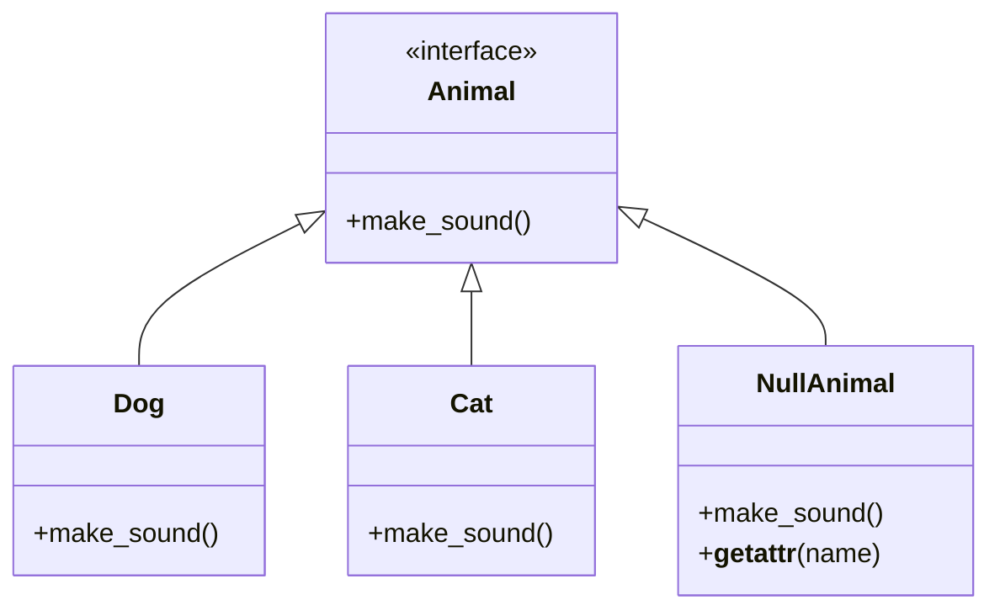

## 3.8.1 Implementing Null Object in Python

The Null Object pattern is a design pattern that provides a way to avoid null references by using an object that implements the expected interface but does nothing. This pattern is particularly useful in Python, where `None` is often used to signify the absence of a value. By replacing `None` with a Null Object, we can eliminate the need for null checks and prevent potential errors when calling methods on objects that might be `None`.

### Understanding the Null Object Pattern

The Null Object pattern involves creating a class that acts as a stand-in for `None`. This class implements the same interface as the real objects it replaces, but its methods have no effect. This allows us to use the Null Object in place of `None`, ensuring that method calls on this object do not result in errors.

#### Key Concepts

- **Neutral Behavior**: The Null Object should perform no action when its methods are called.
- **Interchangeability**: The Null Object should be usable in any context where a real object is expected.
- **Elimination of Null Checks**: By using a Null Object, we can remove conditional checks for `None`, simplifying the code.

### Step-by-Step Guide to Implementing the Null Object Pattern in Python

Let's walk through the process of implementing the Null Object pattern in Python, step by step.

#### Step 1: Define an Abstract Base Class

First, we define an abstract base class or interface that both the real objects and the Null Object will implement. This ensures that the Null Object can be used interchangeably with real objects.

```python
from abc import ABC, abstractmethod

class Animal(ABC):
    @abstractmethod
    def make_sound(self):
        pass
```

In this example, `Animal` is an abstract base class with a single method `make_sound`. Any class that inherits from `Animal` must implement this method.

#### Step 2: Create Real Object Classes

Next, we create classes for the real objects that implement the `Animal` interface.

```python
class Dog(Animal):
    def make_sound(self):
        print("Woof!")

class Cat(Animal):
    def make_sound(self):
        print("Meow!")
```

Here, `Dog` and `Cat` are concrete implementations of the `Animal` interface, each providing a specific behavior for the `make_sound` method.

#### Step 3: Implement the Null Object Class

Now, we create the Null Object class. This class implements the `Animal` interface but performs no action in its methods.

```python
class NullAnimal(Animal):
    def make_sound(self):
        # Do nothing
        pass
```

The `NullAnimal` class provides a no-op implementation of the `make_sound` method, fulfilling the contract of the `Animal` interface without performing any action.

### Using the Null Object Pattern

Let's see how we can use the Null Object pattern to replace `None` references and eliminate null checks.

#### Before: Using `None` with Null Checks

Consider the following code, which uses `None` to represent the absence of an animal:

```python
def play_with_animal(animal):
    if animal is not None:
        animal.make_sound()

dog = Dog()
cat = Cat()
none_animal = None

play_with_animal(dog)  # Output: Woof!
play_with_animal(cat)  # Output: Meow!
play_with_animal(none_animal)  # No output
```

In this code, we check if `animal` is `None` before calling `make_sound`. This adds unnecessary complexity and potential for errors.

#### After: Using the Null Object

Now, let's replace `None` with a `NullAnimal` instance:

```python
def play_with_animal(animal):
    animal.make_sound()

dog = Dog()
cat = Cat()
null_animal = NullAnimal()

play_with_animal(dog)  # Output: Woof!
play_with_animal(cat)  # Output: Meow!
play_with_animal(null_animal)  # No output
```

By using `NullAnimal`, we eliminate the need for null checks. The `play_with_animal` function can call `make_sound` on any `Animal` instance without worrying about `None`.

### Handling Attributes and Methods

The Null Object should respond to all expected method calls and attributes. This can be achieved using special methods like `__getattr__`.

#### Using `__getattr__` for Dynamic Attributes

If the real objects have dynamic attributes, we can use `__getattr__` in the Null Object to handle them gracefully.

```python
class NullAnimal(Animal):
    def make_sound(self):
        pass

    def __getattr__(self, name):
        # Return a no-op function for any attribute
        return lambda *args, **kwargs: None
```

With this implementation, any attribute access on a `NullAnimal` instance returns a no-op function, preventing attribute errors.

### Python-Specific Considerations

Python's dynamic typing and duck typing make the Null Object pattern particularly easy to implement. Here are some considerations:

- **Dynamic Typing**: Python's dynamic typing allows us to use the Null Object without explicit type declarations.
- **Duck Typing**: The Null Object can be used wherever a real object is expected, as long as it implements the same methods.
- **`abc` Module**: The `abc` module can be used to define abstract base classes, ensuring that the Null Object implements the required interface.

### Testing and Validation

It's important to test the Null Object to ensure it behaves as intended. Here are some strategies:

- **Unit Tests**: Write unit tests to verify that the Null Object implements all required methods and does not produce side effects.
- **Integration Tests**: Test the Null Object in the context of the application to ensure it can be used interchangeably with real objects.

#### Example Unit Test

```python
import unittest

class TestNullAnimal(unittest.TestCase):
    def test_make_sound(self):
        null_animal = NullAnimal()
        self.assertIsNone(null_animal.make_sound())

    def test_dynamic_attributes(self):
        null_animal = NullAnimal()
        self.assertIsNone(null_animal.some_method())
        self.assertIsNone(null_animal.some_attribute)

if __name__ == '__main__':
    unittest.main()
```

These tests verify that the `NullAnimal` class implements the `make_sound` method and handles dynamic attributes without errors.

### Try It Yourself

Experiment with the Null Object pattern by modifying the code examples:

- **Add New Methods**: Add new methods to the `Animal` interface and implement them in the `NullAnimal` class.
- **Dynamic Attributes**: Test the handling of dynamic attributes with different data types.
- **Integration**: Use the Null Object in a larger application to see how it simplifies code.

### Visualizing the Null Object Pattern

To better understand the Null Object pattern, let's visualize the relationship between the abstract base class, real objects, and the Null Object.



This diagram shows how the `Dog`, `Cat`, and `NullAnimal` classes all implement the `Animal` interface, allowing them to be used interchangeably.

### Conclusion

The Null Object pattern is a powerful tool for simplifying code and eliminating null checks in Python. By using a Null Object, we can ensure that method calls on potentially absent objects do not result in errors. This pattern leverages Python's dynamic typing and duck typing, making it easy to implement and use.

Remember, this is just the beginning. As you progress, you'll find more opportunities to apply the Null Object pattern and other design patterns to create robust, maintainable code. Keep experimenting, stay curious, and enjoy the journey!

## Quiz Time!



### What is the primary purpose of the Null Object pattern?

- [x] To replace `None` references with objects that exhibit neutral behavior.
- [ ] To enhance performance by reducing memory usage.
- [ ] To implement complex algorithms with minimal code.
- [ ] To provide a graphical user interface for applications.

> **Explanation:** The Null Object pattern is used to replace `None` references with objects that exhibit neutral behavior, ensuring method calls do not result in errors.

### Which method in Python can be used to handle unexpected attributes in a Null Object?

- [ ] `__init__`
- [x] `__getattr__`
- [ ] `__setattr__`
- [ ] `__delattr__`

> **Explanation:** The `__getattr__` method can be used to handle unexpected attributes in a Null Object, returning a no-op function to prevent errors.

### What is a key benefit of using the Null Object pattern?

- [x] It eliminates the need for null checks.
- [ ] It increases the complexity of the code.
- [ ] It reduces the number of classes needed.
- [ ] It improves the graphical user interface.

> **Explanation:** The Null Object pattern eliminates the need for null checks, simplifying the code and reducing potential errors.

### How does the Null Object pattern relate to Python's duck typing?

- [x] The Null Object can be used wherever a real object is expected, as long as it implements the same methods.
- [ ] The Null Object requires explicit type declarations.
- [ ] The Null Object cannot be used with duck typing.
- [ ] The Null Object pattern is unrelated to duck typing.

> **Explanation:** The Null Object can be used wherever a real object is expected, as long as it implements the same methods, leveraging Python's duck typing.

### What is the role of the `abc` module in implementing the Null Object pattern?

- [x] It helps define abstract base classes to ensure the Null Object implements the required interface.
- [ ] It provides built-in Null Object classes.
- [ ] It optimizes the performance of the Null Object.
- [ ] It enhances the graphical user interface of the Null Object.

> **Explanation:** The `abc` module helps define abstract base classes to ensure the Null Object implements the required interface.

### Which of the following is a correct implementation of a Null Object in Python?

- [x] A class that implements the expected interface but performs no action in its methods.
- [ ] A class that throws exceptions when methods are called.
- [ ] A class that logs method calls for debugging purposes.
- [ ] A class that provides complex algorithms for data processing.

> **Explanation:** A Null Object is a class that implements the expected interface but performs no action in its methods.

### What is the purpose of the `__getattr__` method in a Null Object?

- [x] To handle unexpected attributes by returning a no-op function.
- [ ] To initialize the object's attributes.
- [ ] To delete attributes from the object.
- [ ] To set new attributes on the object.

> **Explanation:** The `__getattr__` method in a Null Object handles unexpected attributes by returning a no-op function, preventing errors.

### How can the Null Object pattern improve code maintainability?

- [x] By eliminating null checks and reducing conditional logic.
- [ ] By increasing the number of classes and interfaces.
- [ ] By adding complex algorithms to the codebase.
- [ ] By requiring explicit type declarations.

> **Explanation:** The Null Object pattern improves code maintainability by eliminating null checks and reducing conditional logic.

### Which of the following is a valid use case for the Null Object pattern?

- [x] Replacing `None` references in a collection of objects.
- [ ] Implementing a complex sorting algorithm.
- [ ] Enhancing the graphical user interface of an application.
- [ ] Reducing the memory footprint of a large dataset.

> **Explanation:** The Null Object pattern is useful for replacing `None` references in a collection of objects, ensuring method calls do not result in errors.

### True or False: The Null Object pattern is only applicable in object-oriented programming languages.

- [x] True
- [ ] False

> **Explanation:** The Null Object pattern is primarily used in object-oriented programming languages, where it replaces `None` references with objects that exhibit neutral behavior.


