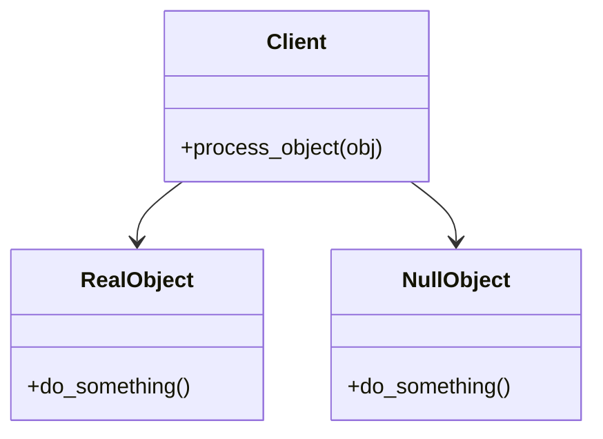

## 3.8.2 Avoiding Null Reference Exceptions

In the world of software development, handling `None` values gracefully is crucial for building robust applications. Python, like many other programming languages, uses `None` to represent the absence of a value. However, this can lead to `AttributeError` exceptions when methods are called on `None`. In this section, we will explore how the Null Object Pattern can be employed to avoid these pitfalls, leading to cleaner and more maintainable code.

### Understanding the Problem with `None` Values

Python's `None` is a singleton object that signifies "nothing" or "no value here." While it is a powerful concept, it can also be a source of errors if not handled properly. Let's delve into the common issues associated with `None` values.

#### Common Issues with `None` Values

1. **AttributeError Exceptions**: Attempting to call a method on `None` results in an `AttributeError`. This is a frequent source of runtime errors in Python applications.

   ```python
   my_object = None
   my_object.do_something()  # Raises AttributeError: 'NoneType' object has no attribute 'do_something'
   ```

2. **Frequent Null Checks**: To prevent such errors, developers often resort to using `if` statements to check for `None` before calling methods. This can lead to cluttered and less readable code.

   ```python
   if my_object is not None:
       my_object.do_something()
   ```

3. **Code Complexity**: As applications grow, the number of null checks can increase, making the codebase harder to maintain and understand.

### The Null Object Pattern: A Solution

The Null Object Pattern provides an elegant solution to the problems posed by `None` values. Instead of using `None`, we use a special Null Object that implements the expected interface but performs no operation.

#### How the Null Object Pattern Works

The Null Object Pattern involves creating a class that represents a "do nothing" behavior. This class implements the same interface as the objects it replaces, allowing it to be used interchangeably without additional checks.

Here's a simple example:

```python
class NullObject:
    def do_something(self):
        # Do nothing
        pass

class RealObject:
    def do_something(self):
        print("Doing something!")

def process_object(obj):
    obj.do_something()

real_obj = RealObject()
null_obj = NullObject()

process_object(real_obj)  # Output: Doing something!
process_object(null_obj)  # No output, but no error either
```

In this example, `NullObject` provides a safe alternative to `None`, allowing us to call `do_something()` without worrying about exceptions.

### Benefits of Using the Null Object Pattern

1. **Eliminates Null Checks**: By using a Null Object, we can avoid the need for explicit null checks, leading to cleaner code.

2. **Improves Readability**: The code becomes more readable as it focuses on the business logic rather than defensive programming.

3. **Enhances Maintainability**: With fewer conditional statements, the code is easier to maintain and extend.

4. **Consistent Behavior**: The Null Object ensures consistent behavior across the application, reducing the likelihood of errors.

### Code Example: Simplifying Flow Control

Let's consider a more complex example where the Null Object Pattern simplifies flow control in an application.

```python
class Logger:
    def log(self, message):
        print(message)

class NullLogger:
    def log(self, message):
        # Do nothing
        pass

def perform_operation(logger=None):
    if logger is None:
        logger = NullLogger()
    logger.log("Operation started")
    # Perform the operation
    logger.log("Operation completed")

perform_operation(Logger())  # Logs messages
perform_operation()          # No logs, but no errors
```

In this example, `NullLogger` acts as a placeholder when no logger is provided, allowing the `perform_operation` function to proceed without additional checks.

### Potential Drawbacks of the Null Object Pattern

While the Null Object Pattern offers numerous benefits, it is not without its drawbacks.

1. **Hiding Logical Errors**: The absence of `None` may hide logical errors. For instance, if a `None` value indicates a missing configuration, using a Null Object might mask this issue.

2. **Inappropriate Behavior**: The Null Object must be designed carefully to ensure its behavior is appropriate for the context. An improperly implemented Null Object can lead to unexpected results.

### Guidelines for Using the Null Object Pattern

1. **Balance with Explicit Error Handling**: Use the Null Object Pattern judiciously. In some cases, explicit error handling may be more appropriate to catch and address issues early.

2. **Thorough Testing**: Ensure thorough testing to catch unintended consequences. Test both the Null Object and the real objects it replaces to verify consistent behavior.

3. **Contextual Appropriateness**: Ensure that the Null Object's behavior aligns with the application's requirements. It should provide a sensible default behavior without introducing side effects.

### Try It Yourself

To better understand the Null Object Pattern, try modifying the code examples provided. Experiment with adding new methods to the `RealObject` and `NullObject` classes, and observe how the pattern affects flow control and error handling.

### Visualizing the Null Object Pattern

To further illustrate the concept, let's visualize the interaction between objects using the Null Object Pattern.



In this diagram, the `Client` interacts with both `RealObject` and `NullObject`, demonstrating how the Null Object Pattern allows seamless integration without additional checks.

### Conclusion

The Null Object Pattern is a powerful tool for avoiding null reference exceptions in Python. By substituting `None` with a Null Object, we can eliminate the need for null checks, leading to cleaner and more maintainable code. However, it is essential to use this pattern judiciously and ensure that the Null Object's behavior is appropriate for the context.

### Key Takeaways

- **Avoid `None` pitfalls**: Use the Null Object Pattern to prevent `AttributeError` exceptions.
- **Simplify code**: Eliminate null checks for improved readability and maintainability.
- **Be cautious**: Ensure the Null Object's behavior aligns with the application's needs.

### Further Reading

For more information on design patterns in Python, consider exploring the following resources:

- [Design Patterns in Python](https://www.python.org/doc/essays/ppt/)
- [Python Design Patterns: An Overview](https://realpython.com/tutorials/design-patterns/)

## Quiz Time!



### What is the primary purpose of the Null Object Pattern?

- [x] To prevent `AttributeError` exceptions by substituting `None` with a Null Object.
- [ ] To enhance performance by reducing memory usage.
- [ ] To simplify user interface design.
- [ ] To improve database connectivity.

> **Explanation:** The Null Object Pattern is primarily used to avoid `AttributeError` exceptions by providing a safe alternative to `None`.

### How does the Null Object Pattern improve code readability?

- [x] By eliminating the need for null checks.
- [ ] By reducing the number of classes in the codebase.
- [ ] By increasing the number of comments in the code.
- [ ] By using shorter variable names.

> **Explanation:** The Null Object Pattern improves readability by removing the need for explicit null checks, allowing the code to focus on business logic.

### What is a potential drawback of using the Null Object Pattern?

- [x] It may hide logical errors that should be addressed.
- [ ] It increases the complexity of the code.
- [ ] It requires more memory than using `None`.
- [ ] It makes the code harder to read.

> **Explanation:** A potential drawback is that the absence of `None` may hide logical errors that need attention.

### In the provided code example, what does the `NullLogger` class do?

- [x] It implements a `log` method that does nothing.
- [ ] It raises an exception when `log` is called.
- [ ] It logs messages to a file.
- [ ] It sends log messages over the network.

> **Explanation:** The `NullLogger` class implements a `log` method that performs no operation, serving as a placeholder.

### Why is it important to ensure the Null Object's behavior is appropriate for the context?

- [x] To prevent unexpected results and ensure consistent application behavior.
- [ ] To reduce the number of lines of code.
- [ ] To improve the application's user interface.
- [ ] To enhance database performance.

> **Explanation:** Ensuring the Null Object's behavior is appropriate prevents unexpected results and maintains consistent application behavior.

### What should developers do to catch unintended consequences when using the Null Object Pattern?

- [x] Conduct thorough testing of both Null and real objects.
- [ ] Avoid using the Null Object Pattern altogether.
- [ ] Use more `if` statements to check for errors.
- [ ] Increase the number of comments in the code.

> **Explanation:** Thorough testing of both Null and real objects helps catch unintended consequences and ensure consistent behavior.

### How can the Null Object Pattern affect maintainability?

- [x] By reducing the number of conditional statements, making the code easier to maintain.
- [ ] By increasing the number of classes, complicating maintenance.
- [ ] By requiring more frequent updates to the codebase.
- [ ] By making the code less readable.

> **Explanation:** The Null Object Pattern reduces conditional statements, simplifying maintenance and enhancing code clarity.

### What is a common issue with using `None` in Python?

- [x] It can lead to `AttributeError` exceptions when methods are called on it.
- [ ] It increases the application's memory usage.
- [ ] It slows down the execution of the program.
- [ ] It makes the code harder to read.

> **Explanation:** Using `None` can lead to `AttributeError` exceptions if methods are called on it without checks.

### What is the role of the `NullObject` class in the provided example?

- [x] To provide a safe alternative to `None` that does nothing.
- [ ] To perform complex calculations.
- [ ] To log messages to a database.
- [ ] To handle user input validation.

> **Explanation:** The `NullObject` class provides a safe alternative to `None`, implementing methods that do nothing.

### True or False: The Null Object Pattern can completely replace the need for error handling in an application.

- [ ] True
- [x] False

> **Explanation:** False. While the Null Object Pattern can reduce the need for null checks, it does not replace the need for comprehensive error handling.


