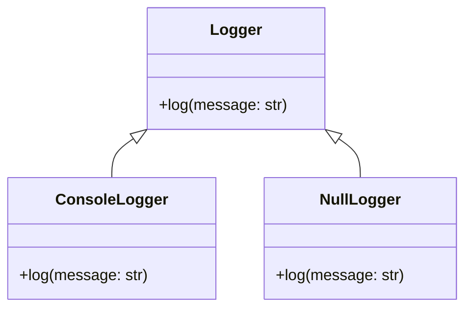

## 3.8.3 Use Cases and Examples

The Null Object Pattern is a design pattern that provides a default behavior for a class when a "null" or "no-op" behavior is required. This pattern is particularly useful in simplifying code by eliminating the need for null checks, thus making the code more robust and easier to maintain. In this section, we will explore various real-world scenarios where the Null Object Pattern can be beneficial, provide practical code snippets, and discuss its impact on code structure.

### Real-World Examples of the Null Object Pattern

#### Logging Systems

In logging systems, it's common to have different logging levels (e.g., DEBUG, INFO, WARNING, ERROR). Sometimes, you might want to disable logging entirely without altering the code that uses the logger. The Null Object Pattern can be used to implement a `NullLogger` that adheres to the logging interface but performs no operations.

```python
class Logger:
    def log(self, message: str):
        raise NotImplementedError("Subclasses should implement this!")

class ConsoleLogger(Logger):
    def log(self, message: str):
        print(message)

class NullLogger(Logger):
    def log(self, message: str):
        pass  # Do nothing

def process_data(logger: Logger):
    logger.log("Processing data...")
    # Data processing logic here
    logger.log("Data processed successfully.")

logger = ConsoleLogger()
process_data(logger)

null_logger = NullLogger()
process_data(null_logger)
```

In this example, the `NullLogger` provides a way to disable logging by simply passing it to the `process_data` function. This eliminates the need for conditional checks to see if a logger is present.

#### UI Components

In user interface (UI) design, commands are often used to encapsulate actions that can be executed. A `NullCommand` can be used in scenarios where no action is required, thus avoiding the need for null checks.

```python
class Command:
    def execute(self):
        raise NotImplementedError("Subclasses should implement this!")

class SaveCommand(Command):
    def execute(self):
        print("Saving document...")

class NullCommand(Command):
    def execute(self):
        pass  # Do nothing

def handle_user_action(command: Command):
    command.execute()

save_command = SaveCommand()
handle_user_action(save_command)

null_command = NullCommand()
handle_user_action(null_command)
```

Here, the `NullCommand` acts as a placeholder for actions that do not need to perform any operation, simplifying the logic in `handle_user_action`.

#### Event Handling

Event-driven programming often involves handling various events. Instead of checking if an event handler is `None`, you can use a Null Object to represent an absent event handler.

```python
class EventHandler:
    def handle_event(self, event):
        raise NotImplementedError("Subclasses should implement this!")

class PrintEventHandler(EventHandler):
    def handle_event(self, event):
        print(f"Handling event: {event}")

class NullEventHandler(EventHandler):
    def handle_event(self, event):
        pass  # Do nothing

def trigger_event(handler: EventHandler, event):
    handler.handle_event(event)

event_handler = PrintEventHandler()
trigger_event(event_handler, "UserLoggedIn")

null_event_handler = NullEventHandler()
trigger_event(null_event_handler, "UserLoggedOut")
```

The `NullEventHandler` ensures that the `trigger_event` function can be called without worrying about whether an event handler is present.

### Impact on Code Structure

Using the Null Object Pattern leads to a more robust and fault-tolerant system. By providing a default behavior, the pattern eliminates the need for null checks, reducing the risk of null reference errors. This results in cleaner and more maintainable code.

#### Considerations

While the Null Object Pattern simplifies code by removing null checks, it can also make debugging and error tracking more challenging. Since the Null Object performs no operations, it might be harder to identify when and where an operation should have occurred but didn't. Therefore, it's essential to use this pattern judiciously and ensure that the use of Null Objects is well-documented.

### Encouraging Critical Thinking

We encourage you to analyze your codebases for opportunities to apply the Null Object Pattern. Consider scenarios where null checks are prevalent and evaluate whether a Null Object could simplify the logic. As an exercise, try refactoring code to incorporate Null Objects and observe the impact on code readability and maintainability.

### Alternative Approaches

While the Null Object Pattern is a powerful tool, it's not the only strategy for handling null references. Other approaches include:

- **Exceptions**: Throwing exceptions when a null reference is encountered can be useful for error handling but may lead to more complex code.
- **Default Parameters**: Providing default values for parameters can eliminate the need for null checks but may not always be applicable.

### Try It Yourself

To deepen your understanding of the Null Object Pattern, try modifying the provided code examples:

- Implement additional loggers (e.g., `FileLogger`) and commands (e.g., `OpenCommand`) to see how they interact with the Null Object.
- Experiment with different event handlers and observe how the Null Object simplifies event handling logic.

### Visualizing the Null Object Pattern

To better understand how the Null Object Pattern works, let's visualize the interaction between objects using a class diagram.



In this diagram, `ConsoleLogger` and `NullLogger` both inherit from the `Logger` interface, demonstrating how the Null Object Pattern provides a consistent interface for different logging behaviors.

### References and Links

For further reading on the Null Object Pattern and its applications, consider the following resources:

- [Design Patterns: Elements of Reusable Object-Oriented Software](https://en.wikipedia.org/wiki/Design_Patterns) by Erich Gamma et al.
- [Python Design Patterns](https://www.tutorialspoint.com/python_design_patterns/index.htm) on Tutorialspoint
- [Refactoring Guru: Null Object Pattern](https://refactoring.guru/design-patterns/null-object)

### Knowledge Check

To reinforce your understanding of the Null Object Pattern, consider the following questions:

- What are the benefits of using the Null Object Pattern in logging systems?
- How does the Null Object Pattern simplify UI component logic?
- What are the potential drawbacks of using the Null Object Pattern?

### Embrace the Journey

Remember, this is just the beginning. As you progress, you'll discover more ways to apply design patterns to create robust and maintainable software. Keep experimenting, stay curious, and enjoy the journey!

## Quiz Time!



### What is the primary benefit of using the Null Object Pattern?

- [x] Eliminating null checks
- [ ] Increasing code complexity
- [ ] Enhancing performance
- [ ] Reducing memory usage

> **Explanation:** The Null Object Pattern eliminates the need for null checks by providing a default behavior.

### In a logging system, what does a Null Logger do?

- [x] Adheres to the logging interface but performs no operations
- [ ] Logs messages to a file
- [ ] Sends logs to a remote server
- [ ] Raises an exception for every log message

> **Explanation:** A Null Logger adheres to the logging interface but performs no operations, effectively disabling logging.

### How does the Null Object Pattern affect debugging?

- [ ] Makes debugging easier
- [x] Can make debugging more challenging
- [ ] Has no effect on debugging
- [ ] Automatically logs errors

> **Explanation:** Since Null Objects perform no operations, it can be harder to identify when and where an operation should have occurred but didn't.

### Which of the following is NOT an alternative to the Null Object Pattern?

- [ ] Exceptions
- [ ] Default Parameters
- [x] Singleton Pattern
- [ ] Conditional Statements

> **Explanation:** The Singleton Pattern is not an alternative to handling null references.

### What is a potential drawback of the Null Object Pattern?

- [x] It can make debugging more challenging
- [ ] It increases code complexity
- [ ] It requires more memory
- [ ] It reduces code readability

> **Explanation:** The Null Object Pattern can make debugging more challenging because it performs no operations.

### In UI components, what role does a Null Command play?

- [x] Represents a non-action
- [ ] Executes a default action
- [ ] Logs user interactions
- [ ] Raises an error for unhandled actions

> **Explanation:** A Null Command represents a non-action, simplifying logic by avoiding null checks.

### How can the Null Object Pattern improve event handling?

- [x] By substituting absent event handlers with Null Objects
- [ ] By logging all events
- [ ] By raising exceptions for unhandled events
- [ ] By reducing the number of event handlers

> **Explanation:** The Null Object Pattern substitutes absent event handlers with Null Objects, avoiding the need for null checks.

### What is a common use case for the Null Object Pattern?

- [x] Logging systems
- [ ] Data encryption
- [ ] Network communication
- [ ] Image processing

> **Explanation:** Logging systems are a common use case for the Null Object Pattern to disable logging without altering code.

### Which design pattern provides a default behavior for a class when a "null" behavior is required?

- [x] Null Object Pattern
- [ ] Factory Pattern
- [ ] Observer Pattern
- [ ] Strategy Pattern

> **Explanation:** The Null Object Pattern provides a default behavior for a class when a "null" behavior is required.

### True or False: The Null Object Pattern can be used to simplify code by eliminating null checks.

- [x] True
- [ ] False

> **Explanation:** The Null Object Pattern simplifies code by eliminating the need for null checks, providing a default behavior instead.


