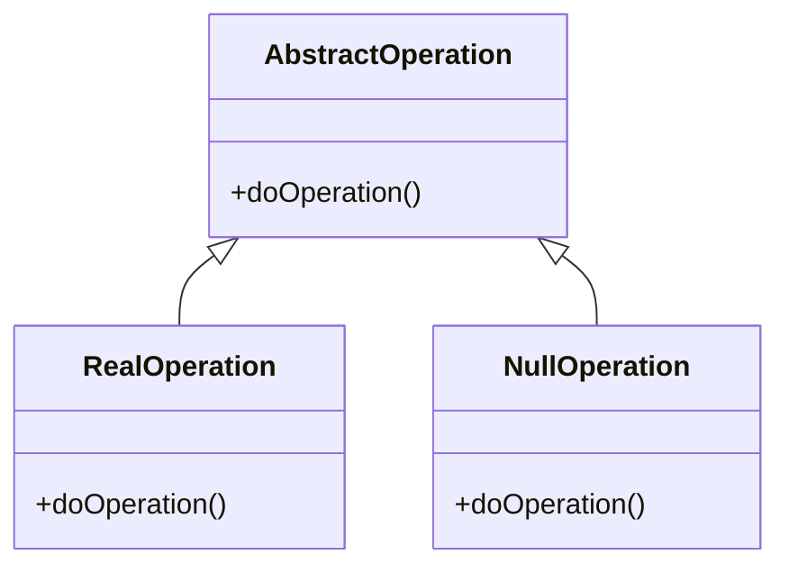
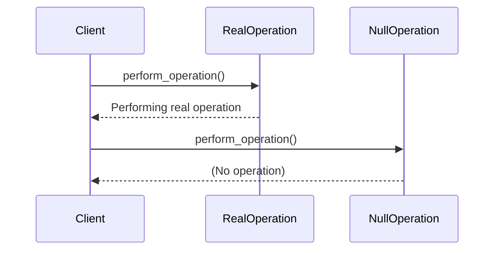

## 3.8 Null Object Pattern

In the realm of software design, handling null references is a common challenge that can lead to verbose and error-prone code. The Null Object Pattern offers a solution by providing a default behavior that represents a "no operation" or "do nothing" scenario. This pattern is particularly useful in eliminating the need for repetitive null checks, thereby simplifying code and enhancing readability.

### Purpose and Intent of the Null Object Pattern

The Null Object Pattern is a behavioral design pattern that provides an object with default behavior to represent a null or "no operation" scenario. It is designed to eliminate the need for null reference checks and reduce the complexity of code that deals with optional or absent objects.

#### Key Benefits

- **Elimination of Null Checks**: By using a Null Object, you can avoid repetitive `if` statements that check for null values, leading to cleaner and more maintainable code.
- **Default Behavior**: The Null Object provides a default behavior that is non-operative, ensuring that the system continues to function smoothly even when certain objects are absent.
- **Seamless Integration**: The Null Object implements the same interface or abstract class as real objects, allowing it to be used interchangeably without modifying existing code.

### Structure of the Null Object Pattern

The Null Object Pattern involves creating a class that implements the same interface or abstract class as the real objects it replaces. This class provides default, non-operative implementations of the methods defined in the interface.

#### UML Class Diagram

Below is a UML class diagram illustrating the structure of the Null Object Pattern:



- **AbstractOperation**: An interface or abstract class defining the contract for operations.
- **RealOperation**: A concrete class implementing the operations.
- **NullOperation**: A concrete class implementing the same interface with non-operative behavior.

### Implementing the Null Object Pattern in Python

Let's explore how to implement the Null Object Pattern in Python. We'll create a simple example where we have an operation that can either be performed by a real object or a null object.

#### Step 1: Define the Interface

First, define an interface or abstract class that outlines the expected behavior.

```python
from abc import ABC, abstractmethod

class Operation(ABC):
    @abstractmethod
    def do_operation(self):
        pass
```

#### Step 2: Implement the Real Object

Next, implement a real object that performs the actual operation.

```python
class RealOperation(Operation):
    def do_operation(self):
        print("Performing real operation.")
```

#### Step 3: Implement the Null Object

Now, implement the Null Object that provides a default, non-operative behavior.

```python
class NullOperation(Operation):
    def do_operation(self):
        # Do nothing
        pass
```

#### Step 4: Use the Null Object

Finally, use the Null Object in place of `None` to avoid null checks.

```python
def perform_operation(operation: Operation):
    operation.do_operation()

real_op = RealOperation()
null_op = NullOperation()

perform_operation(real_op)  # Output: Performing real operation.
perform_operation(null_op)  # No output, as NullOperation does nothing.
```

### Benefits and Trade-offs

#### Benefits

- **Reduction of `if` Statements**: The Null Object Pattern reduces the need for conditional checks, leading to cleaner and more readable code.
- **Improved Code Readability**: By providing a default behavior, the pattern simplifies the flow of the program, making it easier to understand and maintain.

#### Trade-offs

- **Masking Errors**: There is a risk of masking errors or unexpected behavior if the Null Object is used inappropriately, as it silently does nothing.
- **Overuse**: Overusing the Null Object Pattern can lead to a proliferation of classes that may complicate the codebase.

### Practical Applications

The Null Object Pattern is particularly useful in scenarios where you want to provide a default behavior for absent objects. Here are some practical applications:

- **UI Components**: In graphical user interfaces, you can use Null Objects to represent optional components that may not always be present.
- **Logging**: When implementing logging, a Null Logger can be used to disable logging without changing the code that performs logging.
- **Configuration**: In systems with optional configuration settings, Null Objects can represent default configurations.

### Best Practices

- **Use Judiciously**: Apply the Null Object Pattern judiciously, ensuring that its use enhances the design rather than complicating it.
- **Avoid Overuse**: Be cautious of overusing the pattern, as it can lead to a proliferation of classes that may be unnecessary.
- **Ensure Consistency**: Ensure that the Null Object provides a consistent and predictable default behavior.

### Try It Yourself

Experiment with the Null Object Pattern by modifying the code examples provided. Try creating different operations and using the Null Object to handle scenarios where an operation might not be necessary.

### Visualizing the Null Object Pattern

To better understand the Null Object Pattern, let's visualize its interaction with other components in a system.



This sequence diagram illustrates how the client interacts with both the RealOperation and NullOperation, highlighting the non-operative behavior of the Null Object.

### Knowledge Check

Before we conclude, let's reinforce the key concepts covered in this section:

- The Null Object Pattern provides a default behavior to avoid null reference checks.
- It implements the same interface as real objects, allowing seamless integration.
- The pattern reduces the need for conditional checks, improving code readability.
- Be cautious of overuse and ensure the Null Object provides consistent behavior.

### Embrace the Journey

Remember, the Null Object Pattern is just one of many design patterns that can enhance your code. As you continue your journey in software development, keep exploring and experimenting with different patterns to find the best solutions for your projects. Stay curious and enjoy the process!

## Quiz Time!



### What is the primary purpose of the Null Object Pattern?

- [x] To provide a default behavior that represents a "no operation" scenario.
- [ ] To add additional functionality to existing objects.
- [ ] To replace all objects with null references.
- [ ] To create complex object hierarchies.

> **Explanation:** The Null Object Pattern provides a default behavior that represents a "no operation" scenario, eliminating the need for null reference checks.

### How does the Null Object Pattern improve code readability?

- [x] By reducing the need for conditional checks.
- [ ] By adding more classes to the codebase.
- [ ] By increasing the number of interfaces.
- [ ] By complicating the logic flow.

> **Explanation:** The Null Object Pattern improves code readability by reducing the need for conditional checks, leading to cleaner and more maintainable code.

### What is a potential trade-off of using the Null Object Pattern?

- [x] Masking errors or unexpected behavior.
- [ ] Increasing the number of null checks.
- [ ] Reducing code readability.
- [ ] Complicating the logic flow.

> **Explanation:** A potential trade-off of using the Null Object Pattern is masking errors or unexpected behavior, as the Null Object silently does nothing.

### In which scenario is the Null Object Pattern particularly useful?

- [x] When implementing logging to disable logging without changing the code.
- [ ] When creating complex algorithms.
- [ ] When designing database schemas.
- [ ] When optimizing performance.

> **Explanation:** The Null Object Pattern is useful in scenarios like logging, where a Null Logger can disable logging without changing the code that performs logging.

### What should be avoided when using the Null Object Pattern?

- [x] Overusing the pattern, leading to unnecessary classes.
- [ ] Implementing interfaces.
- [ ] Using abstract classes.
- [ ] Creating real objects.

> **Explanation:** Overusing the Null Object Pattern can lead to a proliferation of unnecessary classes, complicating the codebase.

### How does the Null Object Pattern fit into the class hierarchy?

- [x] It implements the same interface or abstract class as real objects.
- [ ] It creates a separate hierarchy.
- [ ] It replaces all interfaces.
- [ ] It does not interact with other classes.

> **Explanation:** The Null Object Pattern fits into the class hierarchy by implementing the same interface or abstract class as real objects, allowing seamless integration.

### What is a key benefit of the Null Object Pattern?

- [x] Elimination of null checks.
- [ ] Increased complexity.
- [ ] Reduced code readability.
- [ ] More conditional statements.

> **Explanation:** A key benefit of the Null Object Pattern is the elimination of null checks, leading to cleaner and more maintainable code.

### How can the Null Object Pattern enhance design in UI components?

- [x] By representing optional components that may not always be present.
- [ ] By adding more complexity to the UI.
- [ ] By increasing the number of interfaces.
- [ ] By complicating the logic flow.

> **Explanation:** The Null Object Pattern can enhance design in UI components by representing optional components that may not always be present, providing a default behavior.

### What is a practical application of the Null Object Pattern?

- [x] Representing default configurations in systems with optional settings.
- [ ] Creating complex algorithms.
- [ ] Designing database schemas.
- [ ] Optimizing performance.

> **Explanation:** A practical application of the Null Object Pattern is representing default configurations in systems with optional settings, providing a consistent behavior.

### True or False: The Null Object Pattern can be used to replace all objects with null references.

- [ ] True
- [x] False

> **Explanation:** False. The Null Object Pattern is not used to replace all objects with null references; it provides a default behavior for absent objects.


