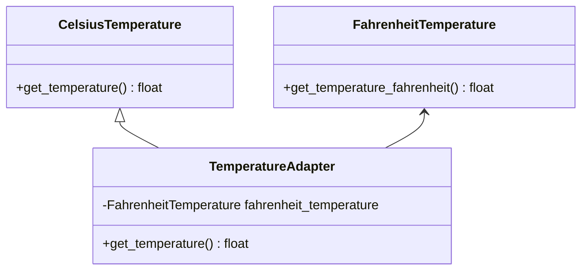

## 4.1.1 Implementing Adapter in Python

In the world of software development, we often encounter situations where we need to integrate existing components with new systems. However, these components might not always be compatible due to differing interfaces. This is where the Adapter Pattern comes into play. The Adapter Pattern allows us to wrap an existing class with a new interface, enabling otherwise incompatible interfaces to work together seamlessly.

### Understanding the Adapter Pattern

The Adapter Pattern is a structural design pattern that acts as a bridge between two incompatible interfaces. It allows objects with incompatible interfaces to collaborate by converting the interface of a class into another interface that a client expects. This pattern is particularly useful when integrating third-party libraries or legacy systems into new applications.

### Key Concepts

- **Target Interface**: The interface that the client expects.
- **Adaptee**: The existing class that needs adapting.
- **Adapter**: The class that implements the target interface and holds an instance of the adaptee, translating the interface into the expected one.

### Step-by-Step Guide to Implementing an Adapter in Python

Let's walk through the process of implementing the Adapter Pattern in Python using a practical example. Suppose we have a legacy system that provides temperature readings in Fahrenheit, but our new system requires temperatures in Celsius.

#### Step 1: Define the Target Interface

First, we define the target interface that the client expects. In our example, this is an interface that provides temperature in Celsius.

```python
class CelsiusTemperature:
    def get_temperature(self):
        """Return the temperature in Celsius."""
        pass
```

#### Step 2: Define the Adaptee

Next, we define the adaptee, which is the existing class that provides temperature in Fahrenheit.

```python
class FahrenheitTemperature:
    def get_temperature_fahrenheit(self):
        """Return the temperature in Fahrenheit."""
        return 98.6  # Example temperature
```

#### Step 3: Implement the Adapter

Now, we create the adapter class that implements the target interface and holds an instance of the adaptee. The adapter will convert the Fahrenheit temperature to Celsius.

```python
class TemperatureAdapter(CelsiusTemperature):
    def __init__(self, fahrenheit_temperature):
        self.fahrenheit_temperature = fahrenheit_temperature

    def get_temperature(self):
        # Convert Fahrenheit to Celsius
        fahrenheit = self.fahrenheit_temperature.get_temperature_fahrenheit()
        celsius = (fahrenheit - 32) * 5.0 / 9.0
        return celsius
```

#### Step 4: Use the Adapter

Finally, we use the adapter to integrate the legacy system with the new system.

```python
fahrenheit_temp = FahrenheitTemperature()

adapter = TemperatureAdapter(fahrenheit_temp)

print(f"The temperature in Celsius is: {adapter.get_temperature():.2f}")
```

### Handling Method Name Differences and Parameter Mismatches

In real-world scenarios, you might encounter method name differences or parameter mismatches between the target interface and the adaptee. The adapter pattern can handle these discrepancies by translating the method calls and adapting the parameters as needed.

For example, if the adaptee method requires additional parameters, the adapter can provide default values or calculate the necessary parameters based on the context.

```python
class AdvancedFahrenheitTemperature:
    def get_temperature_fahrenheit(self, location):
        """Return the temperature in Fahrenheit for a specific location."""
        # Simulate different temperatures for different locations
        temperatures = {'New York': 77.0, 'Los Angeles': 85.0}
        return temperatures.get(location, 98.6)

class AdvancedTemperatureAdapter(CelsiusTemperature):
    def __init__(self, fahrenheit_temperature, location='New York'):
        self.fahrenheit_temperature = fahrenheit_temperature
        self.location = location

    def get_temperature(self):
        fahrenheit = self.fahrenheit_temperature.get_temperature_fahrenheit(self.location)
        celsius = (fahrenheit - 32) * 5.0 / 9.0
        return celsius

advanced_fahrenheit_temp = AdvancedFahrenheitTemperature()
advanced_adapter = AdvancedTemperatureAdapter(advanced_fahrenheit_temp, location='Los Angeles')
print(f"The temperature in Los Angeles in Celsius is: {advanced_adapter.get_temperature():.2f}")
```

### Leveraging Python's Duck Typing

Python's dynamic nature and duck typing make it an ideal language for implementing the Adapter Pattern. Duck typing allows us to focus on the methods an object implements rather than its specific type. This flexibility simplifies the adapter implementation, as we can create adapters without needing to strictly adhere to a specific interface.

In Python, as long as an object implements the required methods, it can be used as a substitute for the target interface. This means we can create adapters that are lightweight and focused solely on translating the necessary methods.

### Visualizing the Adapter Pattern

To better understand the Adapter Pattern, let's visualize the relationships between the target interface, adaptee, and adapter using a class diagram.



In this diagram, `CelsiusTemperature` represents the target interface, `FahrenheitTemperature` is the adaptee, and `TemperatureAdapter` is the adapter that bridges the gap between the two.

### Try It Yourself

Now that we've covered the basics of implementing the Adapter Pattern in Python, it's time to experiment with the code. Here are a few suggestions to try on your own:

1. **Modify the Adaptee**: Add more methods to the `FahrenheitTemperature` class and update the adapter to handle them.
2. **Add Error Handling**: Implement error handling in the adapter to manage invalid temperature values or unsupported locations.
3. **Create a Bi-Directional Adapter**: Extend the adapter to convert temperatures from Celsius to Fahrenheit as well.

### References and Further Reading

For more information on the Adapter Pattern and its applications, consider exploring the following resources:

- [Design Patterns: Elements of Reusable Object-Oriented Software](https://en.wikipedia.org/wiki/Design_Patterns) by Erich Gamma, Richard Helm, Ralph Johnson, and John Vlissides
- [Python's Official Documentation](https://docs.python.org/3/)
- [Real Python's Guide to Design Patterns](https://realpython.com/tutorials/design-patterns/)

### Knowledge Check

Before we wrap up, let's reinforce what we've learned with a few questions:

- What is the primary purpose of the Adapter Pattern?
- How does the Adapter Pattern help in integrating legacy systems?
- What role does Python's duck typing play in simplifying adapter implementation?

### Conclusion

The Adapter Pattern is a powerful tool for integrating incompatible interfaces in software development. By wrapping an existing class with a new interface, we can enable seamless collaboration between different components. Python's dynamic nature and duck typing make it particularly well-suited for implementing this pattern, allowing for flexible and efficient solutions.

Remember, this is just the beginning. As you progress, you'll encounter more complex scenarios where the Adapter Pattern can be applied. Keep experimenting, stay curious, and enjoy the journey!

## Quiz Time!



### What is the primary purpose of the Adapter Pattern?

- [x] To enable incompatible interfaces to work together.
- [ ] To improve the performance of a system.
- [ ] To simplify the user interface of an application.
- [ ] To enhance the security of a software system.

> **Explanation:** The Adapter Pattern is used to allow incompatible interfaces to work together by converting the interface of a class into another interface that a client expects.

### How does the Adapter Pattern help in integrating legacy systems?

- [x] By providing a new interface that the client expects.
- [ ] By rewriting the legacy system from scratch.
- [ ] By removing all dependencies on the legacy system.
- [ ] By directly modifying the legacy system's code.

> **Explanation:** The Adapter Pattern provides a new interface that the client expects, allowing the legacy system to be used without modification.

### What role does Python's duck typing play in adapter implementation?

- [x] It allows focusing on the methods an object implements rather than its specific type.
- [ ] It enforces strict type checking at compile time.
- [ ] It requires explicit interface definitions.
- [ ] It prevents the use of adapters in Python.

> **Explanation:** Python's duck typing allows developers to focus on the methods an object implements, making it easier to create adapters without strict type constraints.

### Which component of the Adapter Pattern holds an instance of the adaptee?

- [x] Adapter
- [ ] Target Interface
- [ ] Client
- [ ] Adaptee

> **Explanation:** The Adapter holds an instance of the adaptee and translates its interface into the one expected by the client.

### What is a common use case for the Adapter Pattern?

- [x] Integrating third-party libraries into new applications.
- [ ] Optimizing database queries.
- [ ] Enhancing the graphical user interface.
- [ ] Securing network communications.

> **Explanation:** The Adapter Pattern is commonly used to integrate third-party libraries or legacy systems into new applications by adapting their interfaces.

### How can method name differences be handled in the Adapter Pattern?

- [x] By translating method calls in the adapter.
- [ ] By renaming methods in the adaptee.
- [ ] By ignoring the differences.
- [ ] By modifying the client code.

> **Explanation:** The adapter can translate method calls to handle differences in method names between the target interface and the adaptee.

### What is an advantage of using the Adapter Pattern in Python?

- [x] It leverages Python's dynamic typing for flexible solutions.
- [ ] It enforces strict type checking at runtime.
- [ ] It requires less memory usage.
- [ ] It simplifies the graphical user interface.

> **Explanation:** Python's dynamic typing allows for flexible and efficient adapter implementations without strict type constraints.

### Which of the following best describes the Adapter Pattern?

- [x] A structural pattern that allows incompatible interfaces to work together.
- [ ] A behavioral pattern that defines how objects interact.
- [ ] A creational pattern that manages object creation.
- [ ] A concurrency pattern that handles multi-threading.

> **Explanation:** The Adapter Pattern is a structural pattern that enables incompatible interfaces to collaborate by adapting one interface to another.

### True or False: The Adapter Pattern can only be used with object-oriented programming languages.

- [ ] True
- [x] False

> **Explanation:** While the Adapter Pattern is commonly used in object-oriented programming, it can be adapted for use in other programming paradigms as well.

### What is the role of the target interface in the Adapter Pattern?

- [x] It defines the interface that the client expects.
- [ ] It holds an instance of the adaptee.
- [ ] It implements the adaptee's methods.
- [ ] It directly interacts with the client.

> **Explanation:** The target interface defines the interface that the client expects, which the adapter implements to enable compatibility.


