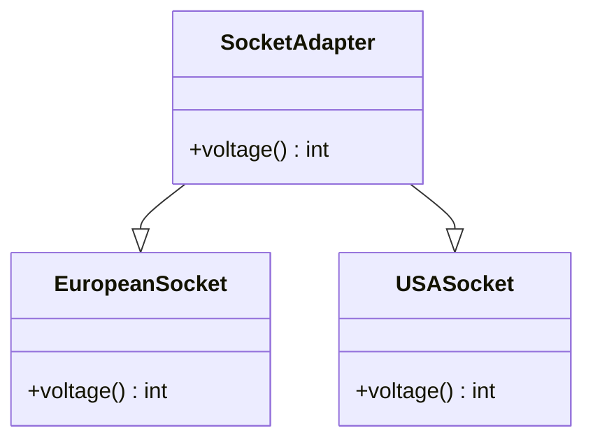
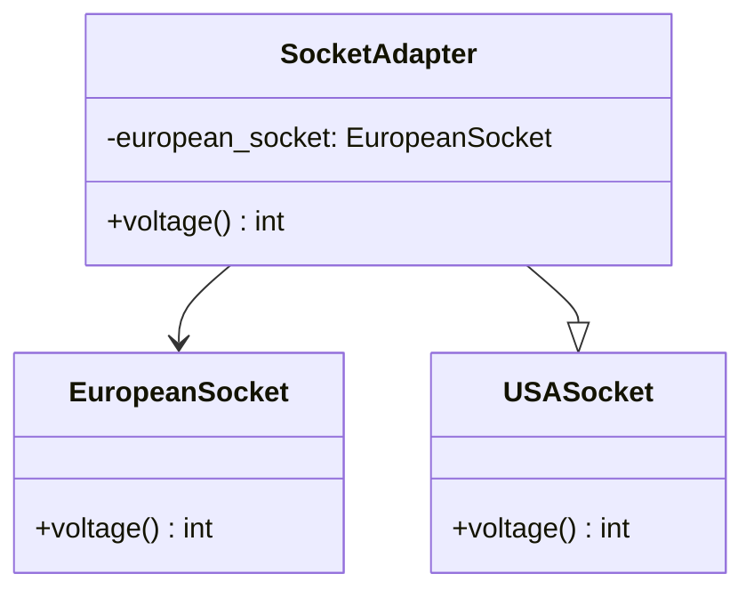

## 4.1.2 Class vs. Object Adapters

In the realm of software design patterns, the Adapter Pattern plays a crucial role in enabling incompatible interfaces to work together. This is particularly useful when integrating third-party libraries or legacy code with new systems. In Python, adapters can be implemented using two primary approaches: class adapters and object adapters. Each approach has its own set of advantages and disadvantages, and understanding these can help you choose the right one for your specific needs.

### Understanding Class Adapters

Class adapters leverage inheritance to adapt one interface to another. By subclassing the target class and the adaptee, a class adapter can override methods and provide the desired interface to the client.

#### Implementing Class Adapters in Python

Let's consider a scenario where we have a `EuropeanSocket` class that provides electricity in volts, and we need to adapt it to a `USASocket` interface that expects electricity in a different voltage.

```python
class EuropeanSocket:
    def voltage(self):
        return 230

class USASocket:
    def voltage(self):
        pass

class SocketAdapter(EuropeanSocket, USASocket):
    def voltage(self):
        # Convert the voltage from European to USA standard
        return 110

def power_device(socket: USASocket):
    print(f"Device powered with {socket.voltage()} volts")

european_socket = SocketAdapter()
power_device(european_socket)
```

In this example, `SocketAdapter` inherits from both `EuropeanSocket` and `USASocket`, allowing it to override the `voltage` method to provide the correct voltage for a `USASocket`.

#### Advantages of Class Adapters

1. **Simplicity**: Class adapters are straightforward to implement when the target and adaptee interfaces are similar.
2. **Performance**: Since class adapters use inheritance, they can be more efficient than object adapters, which rely on composition.
3. **Direct Access**: Class adapters have direct access to the adaptee's protected members, which can be useful in certain scenarios.

#### Disadvantages of Class Adapters

1. **Single Inheritance Limitation**: Python's single inheritance model can limit the use of class adapters, especially when the adaptee is already part of another inheritance hierarchy.
2. **Tight Coupling**: Class adapters create a tight coupling between the adapter and the adaptee, making it harder to change the adaptee without affecting the adapter.
3. **Lack of Flexibility**: Class adapters are less flexible than object adapters, as they cannot adapt multiple adaptees at runtime.

### Understanding Object Adapters

Object adapters use composition to adapt one interface to another. Instead of inheriting from the adaptee, an object adapter holds a reference to an instance of the adaptee and delegates calls to it.

#### Implementing Object Adapters in Python

Let's revisit the socket example, but this time using an object adapter.

```python
class EuropeanSocket:
    def voltage(self):
        return 230

class USASocket:
    def voltage(self):
        pass

class SocketAdapter(USASocket):
    def __init__(self, european_socket: EuropeanSocket):
        self.european_socket = european_socket

    def voltage(self):
        # Convert the voltage from European to USA standard
        return 110

def power_device(socket: USASocket):
    print(f"Device powered with {socket.voltage()} volts")

european_socket = EuropeanSocket()
adapter = SocketAdapter(european_socket)
power_device(adapter)
```

In this example, `SocketAdapter` holds a reference to an instance of `EuropeanSocket` and delegates the `voltage` method call to it, converting the voltage as needed.

#### Advantages of Object Adapters

1. **Flexibility**: Object adapters can adapt multiple adaptees at runtime, providing greater flexibility.
2. **Loose Coupling**: By using composition, object adapters maintain a loose coupling between the adapter and the adaptee, making it easier to change the adaptee without affecting the adapter.
3. **Multiple Adaptees**: Object adapters can work with multiple adaptees simultaneously, which is not possible with class adapters.

#### Disadvantages of Object Adapters

1. **Complexity**: Object adapters can be more complex to implement than class adapters, especially when dealing with multiple adaptees.
2. **Performance Overhead**: The use of composition can introduce a slight performance overhead compared to inheritance.

### Comparing Class and Object Adapters

To better understand the differences between class and object adapters, let's compare them side by side:

| Feature                | Class Adapter                          | Object Adapter                          |
|------------------------|----------------------------------------|-----------------------------------------|
| **Implementation**     | Inheritance                            | Composition                             |
| **Flexibility**        | Less flexible                          | More flexible                           |
| **Coupling**           | Tight coupling                         | Loose coupling                          |
| **Multiple Adaptees**  | Not supported                          | Supported                               |
| **Performance**        | Generally faster                       | Slight overhead due to composition      |
| **Complexity**         | Simpler implementation                 | More complex implementation             |

### When to Choose Class vs. Object Adapters

The choice between class and object adapters depends on the specific requirements of your application:

- **Use Class Adapters** when:
  - You need a simple and efficient solution.
  - The adaptee and target interfaces are similar.
  - You are not constrained by Python's single inheritance limitation.

- **Use Object Adapters** when:
  - You need flexibility to adapt multiple adaptees.
  - You want to maintain loose coupling between the adapter and the adaptee.
  - You need to adapt an existing class hierarchy without modifying it.

### Guidelines for Implementing Adapters in Python

1. **Identify the Target Interface**: Clearly define the interface that the client expects to interact with.
2. **Analyze the Adaptee**: Understand the existing interface that needs to be adapted.
3. **Choose the Adapter Type**: Decide whether a class or object adapter is more suitable based on the requirements.
4. **Implement the Adapter**: Write the adapter class, ensuring it implements the target interface and delegates calls to the adaptee.
5. **Test the Adapter**: Verify that the adapter correctly translates calls between the client and the adaptee.

### Try It Yourself

To deepen your understanding of class and object adapters, try modifying the code examples provided:

- **Experiment with Class Adapters**: Change the `SocketAdapter` class to adapt additional methods from `EuropeanSocket`.
- **Explore Object Adapters**: Modify the `SocketAdapter` to handle multiple `EuropeanSocket` instances simultaneously.
- **Performance Testing**: Compare the performance of class and object adapters in a scenario with high-frequency method calls.

### Visualizing Class vs. Object Adapters

To further illustrate the differences between class and object adapters, let's visualize their structures using Mermaid.js diagrams.

#### Class Adapter Diagram



*This diagram shows how `SocketAdapter` inherits from both `EuropeanSocket` and `USASocket`, allowing it to override methods and provide the desired interface.*

#### Object Adapter Diagram



*This diagram illustrates how `SocketAdapter` holds a reference to an instance of `EuropeanSocket` and delegates method calls to it.*

### Knowledge Check

Before moving on, let's reinforce what we've learned:

- **Question**: What is the primary difference between class and object adapters?
  - **Answer**: Class adapters use inheritance, while object adapters use composition.

- **Question**: When should you prefer using an object adapter over a class adapter?
  - **Answer**: When you need flexibility to adapt multiple adaptees or maintain loose coupling.

### Conclusion

Understanding the differences between class and object adapters is crucial for effectively using the Adapter Pattern in Python. By choosing the right approach, you can create flexible, maintainable, and efficient software systems. Remember, this is just the beginning. As you progress, you'll build more complex and interactive systems. Keep experimenting, stay curious, and enjoy the journey!

## Quiz Time!



### What is the primary difference between class and object adapters?

- [x] Class adapters use inheritance, while object adapters use composition.
- [ ] Class adapters use composition, while object adapters use inheritance.
- [ ] Both use inheritance.
- [ ] Both use composition.

> **Explanation:** Class adapters rely on inheritance to adapt interfaces, whereas object adapters use composition to hold references to adaptees.

### When should you prefer using an object adapter over a class adapter?

- [x] When you need flexibility to adapt multiple adaptees.
- [ ] When you need a simple and efficient solution.
- [ ] When the adaptee and target interfaces are similar.
- [ ] When you are not constrained by Python's single inheritance limitation.

> **Explanation:** Object adapters are more flexible and can adapt multiple adaptees, making them suitable for scenarios requiring such flexibility.

### Which of the following is an advantage of class adapters?

- [x] Simplicity and direct access to protected members.
- [ ] Flexibility to adapt multiple adaptees.
- [ ] Loose coupling between adapter and adaptee.
- [ ] Ability to work with multiple adaptees simultaneously.

> **Explanation:** Class adapters are simpler and have direct access to protected members due to inheritance.

### What is a disadvantage of object adapters?

- [x] Complexity and potential performance overhead.
- [ ] Tight coupling between adapter and adaptee.
- [ ] Single inheritance limitation.
- [ ] Lack of flexibility.

> **Explanation:** Object adapters can be more complex and may introduce a slight performance overhead due to composition.

### Which adapter type maintains loose coupling between the adapter and the adaptee?

- [x] Object Adapter
- [ ] Class Adapter
- [ ] Both
- [ ] Neither

> **Explanation:** Object adapters maintain loose coupling by using composition, allowing changes to the adaptee without affecting the adapter.

### In which scenario is a class adapter more suitable?

- [x] When the adaptee and target interfaces are similar.
- [ ] When you need to adapt multiple adaptees.
- [ ] When you want to maintain loose coupling.
- [ ] When dealing with existing class hierarchies.

> **Explanation:** Class adapters are more suitable when the adaptee and target interfaces are similar, allowing for straightforward inheritance.

### What is the main limitation of class adapters in Python?

- [x] Python's single inheritance model.
- [ ] Complexity in implementation.
- [ ] Performance overhead.
- [ ] Lack of direct access to protected members.

> **Explanation:** Python's single inheritance model limits the use of class adapters, especially when the adaptee is already part of another inheritance hierarchy.

### How do object adapters provide flexibility?

- [x] By using composition to hold references to multiple adaptees.
- [ ] By using inheritance to override methods.
- [ ] By directly accessing protected members.
- [ ] By simplifying implementation.

> **Explanation:** Object adapters use composition to hold references to multiple adaptees, providing flexibility in adapting different interfaces.

### Which adapter type is generally faster in terms of performance?

- [x] Class Adapter
- [ ] Object Adapter
- [ ] Both are equally fast.
- [ ] Neither is fast.

> **Explanation:** Class adapters are generally faster because they use inheritance, which is more efficient than the composition used by object adapters.

### True or False: Object adapters can adapt multiple adaptees simultaneously.

- [x] True
- [ ] False

> **Explanation:** Object adapters can adapt multiple adaptees simultaneously by holding references to different adaptee instances.


