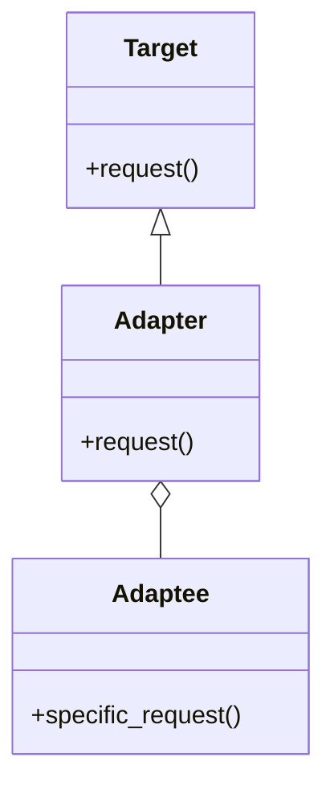

## 4.1.3 Use Cases and Examples

The Adapter Pattern is a powerful structural design pattern that allows incompatible interfaces to work together. It acts as a bridge between two incompatible interfaces, enabling them to communicate effectively. This pattern is particularly useful in scenarios where you need to integrate third-party code or refactor legacy systems. In this section, we will explore various use cases and examples of the Adapter Pattern in Python, highlighting its practical applications and best practices.

### Understanding the Adapter Pattern

Before diving into use cases, let's briefly revisit the Adapter Pattern's core concept. The Adapter Pattern involves creating an adapter class that translates the interface of a class into another interface that clients expect. This allows classes with incompatible interfaces to work together without modifying their source code.

```python
class Target:
    def request(self):
        return "Target: The default target's behavior."

class Adaptee:
    def specific_request(self):
        return "Adaptee: Specific behavior."

class Adapter(Target):
    def __init__(self, adaptee: Adaptee):
        self.adaptee = adaptee

    def request(self):
        return f"Adapter: (TRANSLATED) {self.adaptee.specific_request()}"

def client_code(target: Target):
    print(target.request())

adaptee = Adaptee()
adapter = Adapter(adaptee)
client_code(adapter)
```

In this example, the `Adapter` class allows the `Adaptee` class to be used where a `Target` is expected, translating the `specific_request` method to the `request` method.

### Use Cases of the Adapter Pattern

#### 1. Integrating Third-Party Libraries

One of the most common use cases for the Adapter Pattern is integrating third-party libraries into your existing codebase. Often, third-party libraries come with their own interfaces, which may not align with the interfaces used in your application. The Adapter Pattern can help bridge this gap.

**Example: Integrating a JSON Library**

Suppose you have an application that uses a custom data format, but you want to integrate a third-party JSON library to handle JSON data. The Adapter Pattern can help you create an adapter that translates your custom data format into JSON.

```python
class CustomData:
    def get_data(self):
        return {"name": "John", "age": 30}

class JSONLibrary:
    def to_json(self, data):
        import json
        return json.dumps(data)

class JSONAdapter:
    def __init__(self, custom_data: CustomData, json_library: JSONLibrary):
        self.custom_data = custom_data
        self.json_library = json_library

    def get_json(self):
        data = self.custom_data.get_data()
        return self.json_library.to_json(data)

custom_data = CustomData()
json_library = JSONLibrary()
adapter = JSONAdapter(custom_data, json_library)
print(adapter.get_json())
```

In this example, the `JSONAdapter` class adapts the `CustomData` class to work with the `JSONLibrary`, allowing you to convert custom data to JSON format seamlessly.

#### 2. Refactoring Legacy Code

Legacy systems often contain outdated code that may not be compatible with modern interfaces or libraries. The Adapter Pattern can be used to refactor legacy code, making it compatible with new systems without extensive modifications.

**Example: Adapting a Legacy Payment System**

Imagine you have a legacy payment system with a specific interface, but you want to integrate it with a modern e-commerce platform that expects a different interface. The Adapter Pattern can help you create an adapter that translates the legacy interface to the new one.

```python
class LegacyPaymentSystem:
    def process_legacy_payment(self, amount):
        print(f"Processing payment of {amount} using legacy system.")

class ModernPaymentInterface:
    def process_payment(self, amount):
        pass

class PaymentAdapter(ModernPaymentInterface):
    def __init__(self, legacy_system: LegacyPaymentSystem):
        self.legacy_system = legacy_system

    def process_payment(self, amount):
        self.legacy_system.process_legacy_payment(amount)

legacy_system = LegacyPaymentSystem()
adapter = PaymentAdapter(legacy_system)
adapter.process_payment(100)
```

In this example, the `PaymentAdapter` class adapts the `LegacyPaymentSystem` to the `ModernPaymentInterface`, allowing it to be used in a modern e-commerce platform.

#### 3. Adapting Different Data Sources

In applications that need to handle multiple data sources with different interfaces, the Adapter Pattern can be used to create a uniform interface for accessing these data sources.

**Example: Adapting Multiple Database Interfaces**

Suppose you have an application that needs to work with both SQL and NoSQL databases, each with its own interface. The Adapter Pattern can help you create adapters for each database type, providing a consistent interface for your application.

```python
class SQLDatabase:
    def query_sql(self, query):
        return f"Executing SQL query: {query}"

class NoSQLDatabase:
    def query_nosql(self, query):
        return f"Executing NoSQL query: {query}"

class DatabaseAdapter:
    def __init__(self, database):
        self.database = database

    def execute_query(self, query):
        if isinstance(self.database, SQLDatabase):
            return self.database.query_sql(query)
        elif isinstance(self.database, NoSQLDatabase):
            return self.database.query_nosql(query)

sql_db = SQLDatabase()
nosql_db = NoSQLDatabase()

sql_adapter = DatabaseAdapter(sql_db)
nosql_adapter = DatabaseAdapter(nosql_db)

print(sql_adapter.execute_query("SELECT * FROM users"))
print(nosql_adapter.execute_query("{ find: 'users' }"))
```

In this example, the `DatabaseAdapter` class provides a consistent interface for executing queries on both SQL and NoSQL databases.

### Best Practices for Using the Adapter Pattern

- **Identify Incompatibilities Early**: Before implementing the Adapter Pattern, identify the specific incompatibilities between interfaces. This will help you design an effective adapter.
- **Keep Adapters Simple**: Adapters should be simple and focused on translating interfaces. Avoid adding complex logic to adapters.
- **Use Composition Over Inheritance**: Prefer composition over inheritance when designing adapters. This allows for more flexibility and reusability.
- **Document Adapter Usage**: Clearly document the purpose and usage of adapters in your codebase to ensure maintainability.

### Potential Pitfalls of the Adapter Pattern

- **Overuse of Adapters**: Overusing adapters can lead to increased complexity and maintenance challenges. Use adapters judiciously and only when necessary.
- **Performance Overhead**: Adapters can introduce performance overhead due to the additional layer of abstraction. Consider the performance implications when designing adapters.
- **Complexity in Debugging**: Debugging can become more complex when multiple adapters are involved. Ensure thorough testing and logging to aid in debugging.

### Encouraging Adapter Opportunities in Your Projects

As you work on your projects, consider the following questions to identify potential adapter opportunities:

- Are there third-party libraries or APIs that you want to integrate but have incompatible interfaces?
- Do you have legacy code that needs to be refactored to work with modern systems?
- Are you dealing with multiple data sources or services with different interfaces?
- Can you simplify your codebase by creating a uniform interface for similar components?

By identifying these opportunities, you can leverage the Adapter Pattern to create more flexible and maintainable systems.

### Try It Yourself

To deepen your understanding of the Adapter Pattern, try modifying the code examples provided in this section. Here are some suggestions:

- **Modify the JSON Adapter**: Add a method to the `JSONAdapter` class that converts JSON data back to the custom data format.
- **Extend the Payment Adapter**: Implement additional methods in the `PaymentAdapter` class to handle different payment scenarios, such as refunds or partial payments.
- **Create a New Database Adapter**: Implement an adapter for a new type of database, such as a graph database, and integrate it with the existing `DatabaseAdapter` class.

### Visualizing the Adapter Pattern

To better understand the Adapter Pattern, let's visualize how it works using a class diagram.



In this diagram, the `Adapter` class inherits from the `Target` class and holds a reference to the `Adaptee` class. This illustrates how the adapter translates the `Adaptee`'s interface to the `Target`'s interface.

### Conclusion

The Adapter Pattern is a versatile and valuable tool in a developer's toolkit, enabling seamless integration of third-party libraries, refactoring of legacy code, and adaptation of different data sources. By understanding its use cases and best practices, you can effectively apply the Adapter Pattern to create more flexible and maintainable software systems.

Remember, this is just the beginning. As you progress, you'll discover more opportunities to apply the Adapter Pattern in your projects. Keep experimenting, stay curious, and enjoy the journey!

## Quiz Time!



### What is the primary purpose of the Adapter Pattern?

- [x] To allow incompatible interfaces to work together
- [ ] To enhance the performance of a system
- [ ] To simplify the user interface
- [ ] To add new features to an existing class

> **Explanation:** The Adapter Pattern is used to allow incompatible interfaces to work together by translating one interface into another.

### Which of the following is a common use case for the Adapter Pattern?

- [x] Integrating third-party libraries
- [ ] Improving algorithm efficiency
- [ ] Enhancing security features
- [ ] Simplifying user input validation

> **Explanation:** The Adapter Pattern is commonly used to integrate third-party libraries that have incompatible interfaces with existing code.

### In the provided JSON Adapter example, what is the role of the `JSONLibrary` class?

- [x] To provide functionality for converting data to JSON format
- [ ] To store custom data in a database
- [ ] To handle user authentication
- [ ] To manage network connections

> **Explanation:** The `JSONLibrary` class provides functionality for converting data to JSON format, which is used by the `JSONAdapter` class.

### What is a potential pitfall of overusing the Adapter Pattern?

- [x] Increased complexity and maintenance challenges
- [ ] Improved code readability
- [ ] Enhanced system performance
- [ ] Simplified debugging process

> **Explanation:** Overusing the Adapter Pattern can lead to increased complexity and maintenance challenges due to the additional layer of abstraction.

### How can you identify potential adapter opportunities in your projects?

- [x] By identifying third-party libraries with incompatible interfaces
- [ ] By focusing on optimizing algorithms
- [ ] By reducing the number of classes in the codebase
- [ ] By minimizing the use of design patterns

> **Explanation:** Identifying third-party libraries or APIs with incompatible interfaces can help you find potential adapter opportunities.

### What is a best practice when designing adapters?

- [x] Keep adapters simple and focused on translating interfaces
- [ ] Add complex logic to adapters for flexibility
- [ ] Use inheritance over composition
- [ ] Avoid documenting adapter usage

> **Explanation:** Adapters should be simple and focused on translating interfaces, avoiding complex logic to maintain clarity and reusability.

### In the class diagram, what does the relationship between `Adapter` and `Adaptee` represent?

- [x] The `Adapter` holds a reference to the `Adaptee`
- [ ] The `Adaptee` inherits from the `Adapter`
- [ ] The `Adapter` is a subclass of the `Adaptee`
- [ ] The `Adaptee` and `Adapter` are unrelated

> **Explanation:** The relationship in the class diagram indicates that the `Adapter` holds a reference to the `Adaptee`, allowing it to translate its interface.

### Which of the following is NOT a use case for the Adapter Pattern?

- [x] Enhancing system security
- [ ] Integrating third-party code
- [ ] Refactoring legacy systems
- [ ] Adapting different data sources

> **Explanation:** The Adapter Pattern is not typically used for enhancing system security; it focuses on integrating incompatible interfaces.

### What is the main benefit of using composition over inheritance in adapters?

- [x] More flexibility and reusability
- [ ] Improved performance
- [ ] Simplified debugging
- [ ] Reduced code complexity

> **Explanation:** Using composition over inheritance in adapters provides more flexibility and reusability, allowing for easier adaptation of interfaces.

### True or False: The Adapter Pattern can introduce performance overhead.

- [x] True
- [ ] False

> **Explanation:** The Adapter Pattern can introduce performance overhead due to the additional layer of abstraction required to translate interfaces.


