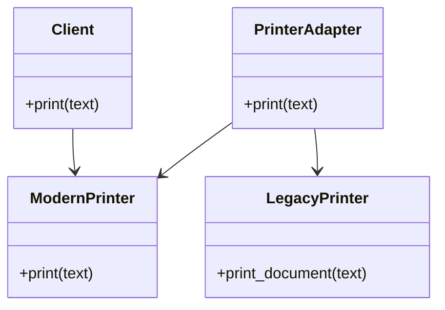

## 4.1 Adapter Pattern

In the world of software development, we often encounter situations where we need to integrate systems or components that were not originally designed to work together. The Adapter Pattern is a structural design pattern that allows incompatible interfaces to work together by introducing a mediator. This pattern is akin to a translator who enables two people speaking different languages to communicate effectively.

### Understanding the Problem

Imagine you have a set of legacy systems that need to interact with modern applications. These systems have different interfaces, making direct communication impossible. The Adapter Pattern solves this problem by providing a way to wrap these incompatible interfaces with a new interface that the modern application can understand.

#### Real-World Analogy

Consider a power adapter that allows you to plug a device with a European plug into an American socket. The adapter doesn't change the device or the socket; it simply provides a way for them to connect and function together. Similarly, in software, an adapter allows two incompatible interfaces to interact without altering their existing code.

### Class Adapters vs. Object Adapters

The Adapter Pattern can be implemented in two primary ways: class adapters and object adapters. Each approach has its own advantages and use cases.

#### Class Adapters

Class adapters use inheritance to adapt one interface to another. This approach involves creating a new class that inherits from both the interface you want to adapt and the target interface. By doing so, the adapter class can override methods to provide the necessary translation between interfaces.

**Advantages:**
- Direct access to the adapted class's methods and properties.
- Can override behavior of the adapted class.

**Disadvantages:**
- Limited by single inheritance in languages like Python.
- Tight coupling between the adapter and the adapted class.

#### Object Adapters

Object adapters use composition to achieve the same goal. Instead of inheriting from the adapted class, the adapter holds a reference to an instance of the adapted class and delegates calls to it.

**Advantages:**
- More flexible than class adapters.
- Can adapt multiple classes that share a common interface.
- Looser coupling between the adapter and the adapted class.

**Disadvantages:**
- Slightly more complex due to delegation.

### Implementing Class Adapters in Python

Let's start by implementing a class adapter in Python. Suppose we have a legacy system with a `LegacyPrinter` class that we want to integrate with a new system expecting a `ModernPrinter` interface.

```python
class LegacyPrinter:
    def print_document(self, text):
        print(f"Printing document: {text}")

class ModernPrinter:
    def print(self, text):
        pass

class PrinterAdapter(LegacyPrinter, ModernPrinter):
    def print(self, text):
        # Translate the modern interface to the legacy one
        self.print_document(text)

def client_code(printer: ModernPrinter):
    printer.print("Hello, World!")

legacy_printer = PrinterAdapter()
client_code(legacy_printer)
```

In this example, `PrinterAdapter` inherits from both `LegacyPrinter` and `ModernPrinter`, allowing it to translate calls from the modern interface to the legacy one.

### Implementing Object Adapters in Python

Now, let's implement an object adapter. We'll use the same `LegacyPrinter` and `ModernPrinter` classes but adapt them using composition.

```python
class LegacyPrinter:
    def print_document(self, text):
        print(f"Printing document: {text}")

class ModernPrinter:
    def print(self, text):
        pass

class PrinterAdapter(ModernPrinter):
    def __init__(self, legacy_printer: LegacyPrinter):
        self.legacy_printer = legacy_printer

    def print(self, text):
        # Delegate the call to the legacy printer
        self.legacy_printer.print_document(text)

def client_code(printer: ModernPrinter):
    printer.print("Hello, World!")

legacy_printer = LegacyPrinter()
adapter = PrinterAdapter(legacy_printer)
client_code(adapter)
```

Here, `PrinterAdapter` holds a reference to a `LegacyPrinter` instance and delegates the `print` call to `print_document`.

### Promoting Reusability and Flexibility

The Adapter Pattern promotes reusability by allowing existing code to be used in new contexts without modification. By creating an adapter, you can integrate legacy systems or third-party libraries into your application seamlessly.

**Flexibility:** Object adapters, in particular, offer flexibility by allowing you to adapt multiple classes that implement a common interface. This makes it easier to switch out implementations without affecting the rest of the system.

### Performance and Complexity Considerations

While adapters are powerful tools, they can introduce additional layers of abstraction, which may impact performance. However, in most cases, the performance overhead is negligible compared to the benefits of increased flexibility and reusability.

**Complexity:** Adapters can add complexity to your codebase, especially when used extensively. It's essential to balance the need for adapters with the potential increase in complexity.

### Common Use Cases for Adapters

Adapters are commonly used in scenarios where you need to integrate third-party libraries or legacy systems. Here are some typical use cases:

1. **Integrating Third-Party Libraries:** When a third-party library doesn't match your application's interface, an adapter can bridge the gap.
2. **Legacy System Integration:** Adapters allow you to integrate legacy systems with modern applications without modifying the legacy code.
3. **Cross-Platform Development:** Adapters can help standardize interfaces across different platforms, making it easier to maintain and extend your application.

### Visualizing the Adapter Pattern

To better understand the Adapter Pattern, let's visualize the relationship between the client, adapter, and adapted class.



In this diagram, the `Client` interacts with the `ModernPrinter` interface. The `PrinterAdapter` implements the `ModernPrinter` interface and delegates calls to the `LegacyPrinter`.

### Try It Yourself

To deepen your understanding of the Adapter Pattern, try modifying the examples above:

- **Experiment with Different Interfaces:** Create a new interface and adapt it using both class and object adapters.
- **Add Additional Methods:** Extend the adapter to support more methods from the adapted class.
- **Test Performance:** Measure the performance impact of using adapters in a high-load scenario.

### References and Further Reading

For more information on the Adapter Pattern and its applications, consider exploring the following resources:

- [Design Patterns: Elements of Reusable Object-Oriented Software](https://www.amazon.com/Design-Patterns-Elements-Reusable-Object-Oriented/dp/0201633612) by Erich Gamma, Richard Helm, Ralph Johnson, and John Vlissides
- [Refactoring Guru: Adapter Pattern](https://refactoring.guru/design-patterns/adapter)
- [Python Design Patterns: Adapter](https://python-patterns.guide/gang-of-four/adapter/)

### Knowledge Check

Before we conclude, let's reinforce what we've learned with a few questions:

- What is the primary purpose of the Adapter Pattern?
- How do class adapters differ from object adapters?
- What are some common scenarios where adapters are used?
- What are the trade-offs of using adapters in terms of performance and complexity?

### Embrace the Journey

Remember, mastering design patterns is a journey. As you continue to explore and apply these patterns, you'll gain a deeper understanding of how to create flexible, maintainable, and scalable software. Keep experimenting, stay curious, and enjoy the process!

## Quiz Time!



### What is the primary purpose of the Adapter Pattern?

- [x] To allow incompatible interfaces to work together
- [ ] To create a single instance of a class
- [ ] To provide a simplified interface to a complex subsystem
- [ ] To define a family of algorithms

> **Explanation:** The Adapter Pattern allows incompatible interfaces to work together by providing a way to translate one interface to another.

### How do class adapters differ from object adapters?

- [x] Class adapters use inheritance, while object adapters use composition
- [ ] Class adapters use composition, while object adapters use inheritance
- [ ] Class adapters are more flexible than object adapters
- [ ] Object adapters are limited by single inheritance

> **Explanation:** Class adapters use inheritance to adapt interfaces, while object adapters use composition, making them more flexible.

### What is a common use case for the Adapter Pattern?

- [x] Integrating third-party libraries
- [ ] Implementing a singleton pattern
- [ ] Simplifying complex subsystems
- [ ] Defining a family of algorithms

> **Explanation:** The Adapter Pattern is commonly used to integrate third-party libraries with different interfaces.

### What is a potential downside of using adapters?

- [x] They can introduce additional complexity
- [ ] They make code less reusable
- [ ] They reduce flexibility
- [ ] They limit the number of classes you can use

> **Explanation:** Adapters can add complexity to the codebase, especially when used extensively.

### Which of the following is an advantage of object adapters?

- [x] They offer more flexibility than class adapters
- [ ] They have direct access to the adapted class's methods
- [ ] They are limited by single inheritance
- [ ] They tightly couple the adapter and adapted class

> **Explanation:** Object adapters use composition, allowing them to adapt multiple classes and offering more flexibility.

### In the Adapter Pattern, what role does the adapter play?

- [x] It acts as a mediator between incompatible interfaces
- [ ] It simplifies a complex subsystem
- [ ] It encapsulates a request as an object
- [ ] It defines a family of algorithms

> **Explanation:** The adapter acts as a mediator, allowing incompatible interfaces to work together.

### Which pattern is often used to integrate legacy systems?

- [x] Adapter Pattern
- [ ] Singleton Pattern
- [ ] Factory Pattern
- [ ] Observer Pattern

> **Explanation:** The Adapter Pattern is commonly used to integrate legacy systems with modern applications.

### What is a key benefit of using the Adapter Pattern?

- [x] It promotes code reusability
- [ ] It simplifies complex subsystems
- [ ] It reduces the number of classes
- [ ] It limits the number of interfaces

> **Explanation:** The Adapter Pattern promotes code reusability by allowing existing code to be used in new contexts.

### Which of the following best describes the Adapter Pattern?

- [x] A structural pattern that allows incompatible interfaces to work together
- [ ] A creational pattern that ensures a class has only one instance
- [ ] A behavioral pattern that defines a family of algorithms
- [ ] A pattern that provides a simplified interface to a complex subsystem

> **Explanation:** The Adapter Pattern is a structural pattern that allows incompatible interfaces to work together.

### True or False: The Adapter Pattern can only be implemented using inheritance.

- [ ] True
- [x] False

> **Explanation:** The Adapter Pattern can be implemented using both inheritance (class adapters) and composition (object adapters).


