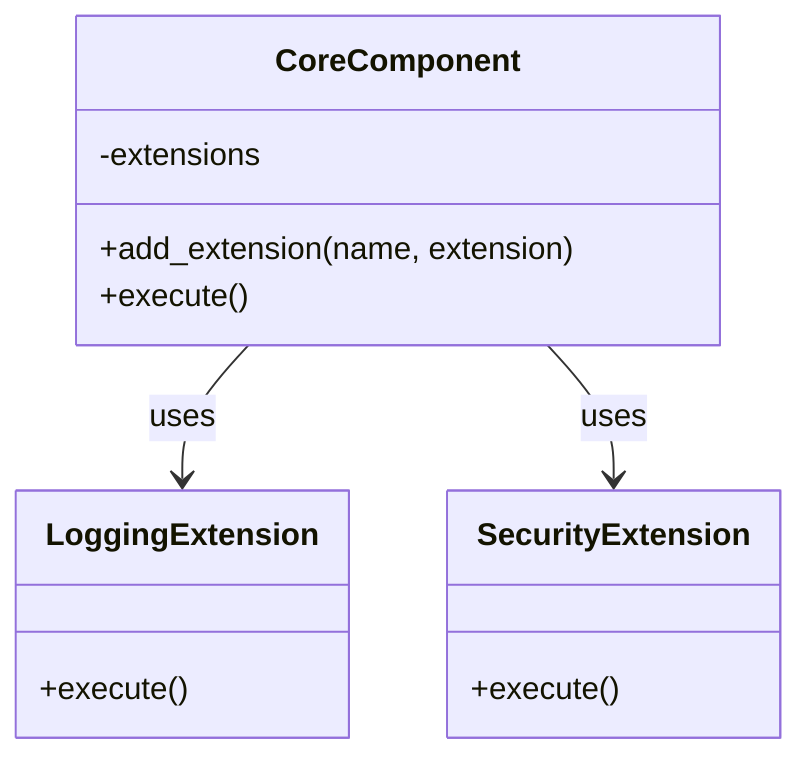

## 4.10.1 Implementing Extension Object in Python

The Extension Object Pattern is a powerful design pattern that allows developers to add new functionality to objects dynamically at runtime. This pattern is particularly useful in scenarios where the system needs to be flexible and adaptable to changing requirements without altering existing code. Python, with its dynamic typing and flexible nature, is an ideal language for implementing this pattern. In this section, we will explore the detailed steps to implement the Extension Object Pattern in Python, complete with code examples, strategies for handling conflicts, and an emphasis on Python's dynamic features.

### Understanding the Extension Object Pattern

The Extension Object Pattern provides a mechanism to add new behavior to objects without modifying their existing structure. This is achieved by defining a core class with extension hooks and creating extension classes that encapsulate additional functionality. The core class remains unaware of the extensions, allowing for a clean separation of concerns and promoting modularity.

### Key Concepts

- **Core Class**: The primary class that provides extension hooks for additional functionality.
- **Extension Hook**: A mechanism within the core class that allows extensions to be attached.
- **Extension Class**: A class that encapsulates additional behavior or attributes, which can be dynamically added to the core class.
- **Dynamic Typing**: Python's ability to add or modify attributes and methods at runtime, facilitating the implementation of the Extension Object Pattern.

### Implementing the Extension Object Pattern in Python

#### Step 1: Define a Core Class with Extension Hooks

The first step in implementing the Extension Object Pattern is to define a core class that includes extension hooks. These hooks are typically methods or attributes that can be overridden or extended by additional functionality.

```python
class CoreComponent:
    def __init__(self):
        self.extensions = {}

    def add_extension(self, name, extension):
        """Add an extension to the core component."""
        self.extensions[name] = extension

    def execute(self):
        """Execute the core functionality."""
        print("Executing core functionality.")
        for extension in self.extensions.values():
            extension.execute()
```

In this example, the `CoreComponent` class maintains a dictionary of extensions. The `add_extension` method allows new extensions to be added, while the `execute` method iterates over all extensions and invokes their `execute` method.

#### Step 2: Create Extension Classes

Next, we create extension classes that encapsulate additional behavior. These classes should implement a common interface or method that the core class expects.

```python
class LoggingExtension:
    def execute(self):
        print("Logging extension executed.")

class SecurityExtension:
    def execute(self):
        print("Security checks performed.")
```

Here, `LoggingExtension` and `SecurityExtension` are two extension classes that implement an `execute` method. These extensions can be added to the core component to enhance its functionality.

#### Step 3: Dynamically Add Extensions to the Core Class

With the core class and extension classes defined, we can now dynamically add extensions to the core class at runtime.

```python
core = CoreComponent()
core.add_extension('logging', LoggingExtension())
core.add_extension('security', SecurityExtension())

core.execute()
```

When the `execute` method is called on the `core` object, it will execute both the core functionality and the additional behavior provided by the extensions.

### Utilizing Python's Dynamic Features

Python's dynamic typing and reflection capabilities make it particularly well-suited for implementing the Extension Object Pattern. Here are some techniques that leverage Python's dynamic features:

#### Using `setattr` to Add Methods or Attributes

The `setattr` function can be used to add new methods or attributes to an object at runtime.

```python
def new_method(self):
    print("New method added dynamically.")

setattr(CoreComponent, 'dynamic_method', new_method)

core.dynamic_method()
```

In this example, a new method `dynamic_method` is added to the `CoreComponent` class using `setattr`. This method can then be invoked on any instance of `CoreComponent`.

#### Using Decorators for Dynamic Behavior

Decorators provide a way to modify the behavior of functions or methods dynamically. They can be used to add extensions to methods in a clean and reusable manner.

```python
def extension_decorator(func):
    def wrapper(*args, **kwargs):
        print("Extension behavior added.")
        return func(*args, **kwargs)
    return wrapper

@extension_decorator
def core_function():
    print("Core function executed.")

core_function()
```

In this code snippet, the `extension_decorator` adds additional behavior to the `core_function`. When `core_function` is called, both the extension behavior and the core functionality are executed.

#### Using Metaclasses for Advanced Extensions

Metaclasses allow for more advanced manipulation of class creation and can be used to automatically add extensions to classes.

```python
class ExtensionMeta(type):
    def __new__(cls, name, bases, dct):
        dct['auto_extension'] = lambda self: print("Auto extension added by metaclass.")
        return super().__new__(cls, name, bases, dct)

class AdvancedComponent(metaclass=ExtensionMeta):
    def execute(self):
        print("Advanced component executed.")

advanced = AdvancedComponent()
advanced.auto_extension()
```

In this example, the `ExtensionMeta` metaclass automatically adds an `auto_extension` method to any class that uses it as a metaclass. This allows for consistent application of extensions across multiple classes.

### Handling Conflicts in Extensions

When multiple extensions are added to a core class, conflicts may arise, particularly if extensions define methods with the same name. Here are some strategies for resolving such conflicts:

#### Strategy 1: Namespace Separation

One approach to avoid conflicts is to use namespaces or prefixes for extension methods. This ensures that method names do not clash.

```python
class NamespaceExtension:
    def logging_execute(self):
        print("Logging extension executed with namespace.")

core.add_extension('namespace_logging', NamespaceExtension())
core.extensions['namespace_logging'].logging_execute()
```

By using a prefix like `logging_`, we can distinguish between different extensions and avoid name clashes.

#### Strategy 2: Prioritization and Overriding

Another strategy is to establish a priority system for extensions, allowing certain extensions to override others.

```python
class PriorityExtension:
    def execute(self):
        print("Priority extension executed, overriding others.")

core.add_extension('priority', PriorityExtension())

core.execute = lambda: [ext.execute() for ext in sorted(core.extensions.values(), key=lambda x: isinstance(x, PriorityExtension))]
core.execute()
```

In this example, the `PriorityExtension` is designed to override other extensions by ensuring it is executed last.

#### Strategy 3: Conflict Resolution Mechanisms

Implement a conflict resolution mechanism that detects and resolves conflicts between extensions.

```python
def resolve_conflicts(extensions):
    resolved = {}
    for name, extension in extensions.items():
        if name in resolved:
            print(f"Conflict detected for {name}. Resolving...")
            # Custom conflict resolution logic
        resolved[name] = extension
    return resolved

core.extensions = resolve_conflicts(core.extensions)
```

This approach involves checking for conflicts and applying custom logic to resolve them, ensuring that the system remains stable and predictable.

### Visualizing the Extension Object Pattern

To better understand the structure and interactions within the Extension Object Pattern, let's visualize it using a class diagram.



**Diagram Description**: This class diagram illustrates the relationship between the `CoreComponent` and its extensions, `LoggingExtension` and `SecurityExtension`. The `CoreComponent` class uses these extensions to enhance its functionality.

### Try It Yourself

To solidify your understanding of the Extension Object Pattern, try modifying the code examples provided:

1. **Add a New Extension**: Create a new extension class that performs a different task, such as caching or data validation, and add it to the `CoreComponent`.
2. **Experiment with `setattr`**: Use `setattr` to dynamically add a new attribute to the `CoreComponent` and access it in the `execute` method.
3. **Implement a Custom Decorator**: Write a decorator that logs the execution time of the `execute` method in the `CoreComponent`.

### Knowledge Check

Before moving on, let's review some key takeaways:

- The Extension Object Pattern allows for dynamic addition of functionality to objects without modifying their existing structure.
- Python's dynamic typing and reflection capabilities make it an ideal language for implementing this pattern.
- Strategies such as namespace separation, prioritization, and conflict resolution mechanisms can help manage conflicts between extensions.

### Embrace the Journey

Remember, this is just the beginning. As you progress, you'll discover more ways to leverage Python's dynamic features to create flexible and adaptable systems. Keep experimenting, stay curious, and enjoy the journey!

## Quiz Time!



### What is the primary purpose of the Extension Object Pattern?

- [x] To add new functionality to objects dynamically at runtime.
- [ ] To create a static structure for objects.
- [ ] To remove existing functionality from objects.
- [ ] To enforce strict type checking.

> **Explanation:** The Extension Object Pattern is designed to add new functionality to objects dynamically at runtime, allowing for flexible and adaptable systems.

### Which Python feature is particularly useful for implementing the Extension Object Pattern?

- [x] Dynamic typing
- [ ] Static typing
- [ ] Strong typing
- [ ] Weak typing

> **Explanation:** Python's dynamic typing allows for the modification of objects at runtime, making it particularly useful for implementing the Extension Object Pattern.

### What is the role of the `add_extension` method in the core class?

- [x] To add new extensions to the core component.
- [ ] To remove extensions from the core component.
- [ ] To execute the core component's functionality.
- [ ] To initialize the core component.

> **Explanation:** The `add_extension` method is used to add new extensions to the core component, allowing it to enhance its functionality.

### How can conflicts between extensions be resolved?

- [x] Using namespace separation, prioritization, and conflict resolution mechanisms.
- [ ] By removing all conflicting extensions.
- [ ] By ignoring the conflicts.
- [ ] By adding more extensions.

> **Explanation:** Conflicts between extensions can be resolved using strategies such as namespace separation, prioritization, and conflict resolution mechanisms.

### What does the `setattr` function do in Python?

- [x] It adds or modifies attributes and methods at runtime.
- [ ] It deletes attributes from an object.
- [ ] It checks the type of an attribute.
- [ ] It initializes an object's attributes.

> **Explanation:** The `setattr` function is used to add or modify attributes and methods of an object at runtime, enabling dynamic behavior.

### Which of the following is a benefit of using decorators in the Extension Object Pattern?

- [x] They allow for clean and reusable modification of methods.
- [ ] They enforce strict type checking.
- [ ] They prevent method execution.
- [ ] They simplify attribute deletion.

> **Explanation:** Decorators allow for clean and reusable modification of methods, making them beneficial for implementing dynamic behavior in the Extension Object Pattern.

### What is a potential downside of using dynamic typing in Python?

- [x] It can lead to runtime errors if not managed carefully.
- [ ] It enforces strict type checking.
- [ ] It prevents code execution.
- [ ] It simplifies debugging.

> **Explanation:** Dynamic typing can lead to runtime errors if not managed carefully, as it allows for modifications that may not be type-checked at compile time.

### What is the purpose of using a metaclass in the Extension Object Pattern?

- [x] To manipulate class creation and automatically add extensions.
- [ ] To enforce strict type checking.
- [ ] To simplify attribute deletion.
- [ ] To prevent method execution.

> **Explanation:** Metaclasses allow for manipulation of class creation, enabling automatic addition of extensions and consistent application of behavior across classes.

### Which strategy can help avoid method name clashes in extensions?

- [x] Namespace separation
- [ ] Removing all extensions
- [ ] Ignoring the clashes
- [ ] Adding more extensions

> **Explanation:** Namespace separation helps avoid method name clashes by using prefixes or namespaces to distinguish between different extensions.

### True or False: The Extension Object Pattern requires modifying the core class to add new functionality.

- [ ] True
- [x] False

> **Explanation:** The Extension Object Pattern allows for adding new functionality without modifying the core class, maintaining a clean separation of concerns.


