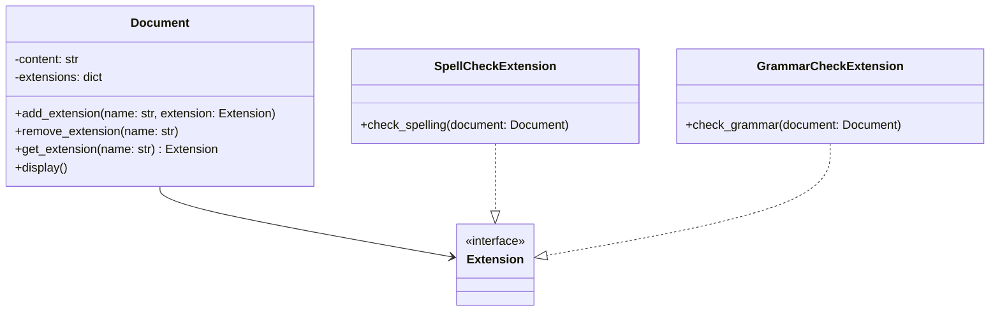

## 4.10.2 Adding Functionality at Runtime

In the ever-evolving landscape of software development, the ability to adapt to changing requirements or user preferences is paramount. The Extension Object Pattern offers a powerful mechanism to enhance objects at runtime without altering their class definitions. This section delves into the importance of runtime flexibility, provides practical examples, discusses design implications, and offers best practices for managing runtime extensions.

### Understanding Runtime Flexibility

Runtime flexibility refers to the capability of a software system to modify its behavior during execution. This adaptability is crucial in scenarios where requirements are dynamic or user preferences need to be accommodated without redeploying the entire application. By leveraging runtime flexibility, developers can create more responsive and user-centric applications.

#### Importance of Runtime Flexibility

1. **Adapting to Changing Requirements**: In agile development environments, requirements can evolve rapidly. Runtime flexibility allows developers to implement changes without altering the core structure of the application.

2. **User-Centric Design**: Applications that can adapt to user preferences in real-time offer a more personalized experience, leading to higher user satisfaction and engagement.

3. **Cost Efficiency**: Reducing the need for frequent redeployments saves time and resources, making the development process more cost-effective.

4. **Improved Maintainability**: By decoupling extensions from the core application logic, maintenance becomes more manageable, as changes can be isolated to specific extensions.

### Examples of Runtime Flexibility

Let's explore some scenarios where runtime flexibility is crucial:

- **Modifiable User Interfaces**: In applications where user interfaces need to be customizable based on user roles or preferences, runtime flexibility enables dynamic UI adjustments without hardcoding every possible configuration.

- **Adaptable AI Behaviors**: In AI-driven applications, the ability to modify algorithms or behaviors at runtime allows for more intelligent and context-aware responses.

- **Plugin Systems**: Many applications, such as IDEs or content management systems, rely on plugins to extend functionality. These plugins can be added or removed at runtime, providing a flexible and extensible architecture.

### Implementing the Extension Object Pattern

The Extension Object Pattern allows objects to be extended with new functionality at runtime. This is achieved by attaching extension objects to the core object, enabling new behaviors without modifying the object's class.

#### Key Concepts

- **Core Object**: The primary object that can be extended with additional functionality.
- **Extension Object**: An object that encapsulates additional behavior or data, which can be attached to the core object.
- **Extension Manager**: A component responsible for managing the lifecycle of extension objects, including their creation, attachment, and detachment.

#### Code Example: Implementing the Extension Object Pattern in Python

Let's implement a simple example of the Extension Object Pattern in Python. We'll create a `Document` class that can be extended with various `Extension` objects to add new features.

```python
class Document:
    def __init__(self, content):
        self.content = content
        self.extensions = {}

    def add_extension(self, name, extension):
        """Attach an extension to the document."""
        self.extensions[name] = extension

    def remove_extension(self, name):
        """Detach an extension from the document."""
        if name in self.extensions:
            del self.extensions[name]

    def get_extension(self, name):
        """Retrieve an extension by name."""
        return self.extensions.get(name, None)

    def display(self):
        """Display the document content."""
        print(self.content)

class SpellCheckExtension:
    def check_spelling(self, document):
        """Perform spell check on the document."""
        # Placeholder for spell checking logic
        print(f"Checking spelling for: {document.content}")

class GrammarCheckExtension:
    def check_grammar(self, document):
        """Perform grammar check on the document."""
        # Placeholder for grammar checking logic
        print(f"Checking grammar for: {document.content}")

doc = Document("This is a sample document.")
spell_checker = SpellCheckExtension()
grammar_checker = GrammarCheckExtension()

doc.add_extension("spell_check", spell_checker)
doc.add_extension("grammar_check", grammar_checker)

spell_extension = doc.get_extension("spell_check")
if spell_extension:
    spell_extension.check_spelling(doc)

grammar_extension = doc.get_extension("grammar_check")
if grammar_extension:
    grammar_extension.check_grammar(doc)
```

In this example, the `Document` class serves as the core object, while `SpellCheckExtension` and `GrammarCheckExtension` are extension objects that add new functionality to the document. The `add_extension` and `remove_extension` methods allow for dynamic attachment and detachment of extensions.

### Implications on Design

The use of runtime extensions has several implications on software design:

1. **Testing**: Testing becomes more complex as the number of possible configurations increases. Each extension needs to be tested independently and in combination with others.

2. **Maintenance**: While runtime extensions improve flexibility, they can also lead to increased maintenance efforts if not managed properly. Clear documentation and a well-defined extension interface are crucial.

3. **Code Comprehension**: The dynamic nature of extensions can make code comprehension more challenging. Developers need to understand the interactions between core objects and their extensions.

### Best Practices for Managing Runtime Extensions

To effectively manage runtime extensions, consider the following best practices:

1. **Define Clear Interfaces**: Establish clear interfaces for extensions to ensure consistent behavior and interaction with core objects.

2. **Use Dependency Injection**: Leverage dependency injection to manage the lifecycle of extensions, allowing for easier testing and configuration.

3. **Implement Extension Discovery**: Use reflection or configuration files to discover and load extensions at runtime, enabling a more modular architecture.

4. **Provide Configuration Options**: Allow users to configure which extensions are active, providing flexibility and control over application behavior.

5. **Document Extension Points**: Clearly document the extension points and the expected behavior of extensions to aid developers in creating compatible extensions.

6. **Monitor Performance**: Keep an eye on the performance impact of extensions, as adding too many at runtime can degrade application performance.

### Visualizing the Extension Object Pattern

To better understand the Extension Object Pattern, let's visualize the relationship between the core object and its extensions using a class diagram.



In this diagram, the `Document` class is associated with the `Extension` interface, which is implemented by `SpellCheckExtension` and `GrammarCheckExtension`. This structure allows for flexible attachment of extensions to the document.

### Try It Yourself

To deepen your understanding, try modifying the code example:

- **Add a New Extension**: Implement a `WordCountExtension` that counts the number of words in the document.
- **Modify Existing Extensions**: Enhance the `SpellCheckExtension` to highlight misspelled words.
- **Experiment with Extension Management**: Implement a method in the `Document` class to list all active extensions.

### References and Further Reading

- [Design Patterns: Elements of Reusable Object-Oriented Software](https://en.wikipedia.org/wiki/Design_Patterns) - The foundational book on design patterns.
- [Python's Dynamic Features](https://docs.python.org/3/tutorial/classes.html#class-and-instance-variables) - Official Python documentation on dynamic class features.
- [Dependency Injection in Python](https://realpython.com/python-dependency-injection/) - A guide to implementing dependency injection in Python.

### Knowledge Check

- What are the benefits of runtime flexibility in software development?
- How does the Extension Object Pattern facilitate runtime flexibility?
- What are some challenges associated with testing runtime extensions?

### Embrace the Journey

Remember, mastering the Extension Object Pattern is just one step in your journey to becoming a more versatile and adaptive developer. As you continue to explore design patterns, you'll gain the skills needed to create more dynamic and responsive applications. Keep experimenting, stay curious, and enjoy the journey!

## Quiz Time!



### What is runtime flexibility?

- [x] The ability to modify software behavior during execution
- [ ] The ability to modify software behavior at compile time
- [ ] The ability to modify software behavior during deployment
- [ ] The ability to modify software behavior during testing

> **Explanation:** Runtime flexibility refers to the capability of a software system to modify its behavior during execution, allowing for dynamic adaptation to changing requirements or user preferences.


### Which of the following is NOT a benefit of runtime flexibility?

- [ ] Adapting to changing requirements
- [ ] User-centric design
- [x] Increased compile-time errors
- [ ] Cost efficiency

> **Explanation:** Increased compile-time errors are not a benefit of runtime flexibility. Runtime flexibility aims to reduce the need for frequent redeployments and allows for real-time adaptation.


### What is the role of an Extension Manager in the Extension Object Pattern?

- [x] Managing the lifecycle of extension objects
- [ ] Creating core objects
- [ ] Compiling extensions at runtime
- [ ] Testing extensions

> **Explanation:** The Extension Manager is responsible for managing the lifecycle of extension objects, including their creation, attachment, and detachment.


### In the provided code example, what does the `add_extension` method do?

- [x] Attaches an extension to the document
- [ ] Removes an extension from the document
- [ ] Retrieves an extension by name
- [ ] Displays the document content

> **Explanation:** The `add_extension` method attaches an extension to the document by adding it to the `extensions` dictionary.


### What is a potential challenge of using runtime extensions?

- [x] Increased complexity in testing
- [ ] Reduced flexibility
- [ ] Increased compile-time errors
- [ ] Decreased user satisfaction

> **Explanation:** Testing becomes more complex as the number of possible configurations increases, making it a potential challenge of using runtime extensions.


### Which of the following best practices involves using reflection or configuration files?

- [ ] Define Clear Interfaces
- [x] Implement Extension Discovery
- [ ] Use Dependency Injection
- [ ] Monitor Performance

> **Explanation:** Implementing Extension Discovery involves using reflection or configuration files to discover and load extensions at runtime, enabling a more modular architecture.


### How can dependency injection benefit runtime extensions?

- [x] By managing the lifecycle of extensions
- [ ] By increasing compile-time errors
- [ ] By reducing user satisfaction
- [ ] By decreasing flexibility

> **Explanation:** Dependency injection can manage the lifecycle of extensions, allowing for easier testing and configuration, which benefits runtime extensions.


### What does the `get_extension` method return if an extension is not found?

- [x] None
- [ ] An empty string
- [ ] An error message
- [ ] The core object

> **Explanation:** The `get_extension` method returns `None` if an extension is not found in the `extensions` dictionary.


### What is the purpose of the `SpellCheckExtension` in the code example?

- [x] To perform spell check on the document
- [ ] To perform grammar check on the document
- [ ] To count the number of words in the document
- [ ] To display the document content

> **Explanation:** The `SpellCheckExtension` is designed to perform spell check on the document, as indicated by the `check_spelling` method.


### True or False: The Extension Object Pattern requires modifying the core object's class definition to add new functionality.

- [ ] True
- [x] False

> **Explanation:** False. The Extension Object Pattern allows for adding new functionality without modifying the core object's class definition, by attaching extension objects at runtime.


