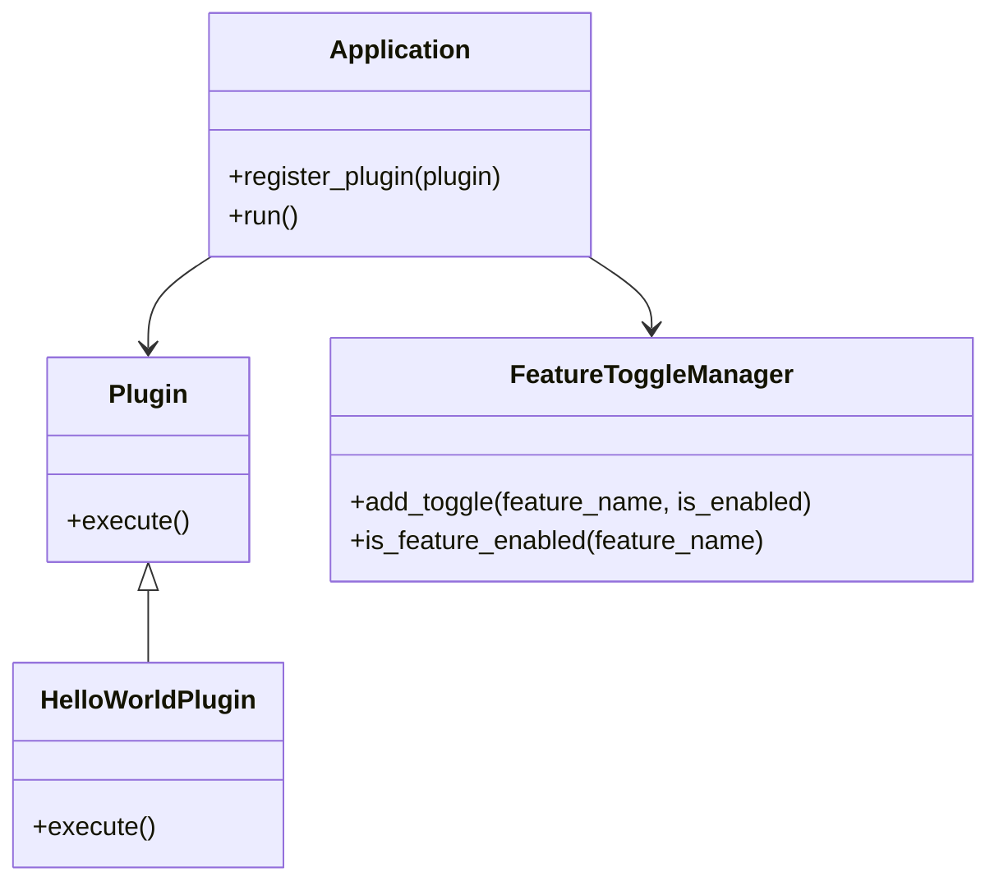

## 4.10.3 Use Cases and Examples

The Extension Object Pattern is a powerful structural design pattern that allows developers to add new functionality to objects dynamically without altering their structure. This flexibility is particularly useful in scenarios where software needs to be extensible and adaptable, such as in plugin systems and feature toggles. In this section, we will explore these use cases in detail, providing comprehensive code examples and discussing the challenges and solutions associated with implementing this pattern in Python.

### Plugin Systems

A plugin system is a software architecture that enables the addition of new features or functionalities to an application without modifying its core structure. This is achieved by allowing external modules, or plugins, to be loaded and executed at runtime. The Extension Object Pattern is ideal for implementing plugin systems because it supports dynamic feature extension.

#### Implementing a Plugin System

Let's start by implementing a simple plugin system in Python. We'll create a basic application that can load and execute plugins dynamically.

```python
class Plugin:
    def execute(self):
        raise NotImplementedError("Plugins must implement the execute method.")

class Application:
    def __init__(self):
        self.plugins = []

    def register_plugin(self, plugin):
        if isinstance(plugin, Plugin):
            self.plugins.append(plugin)
        else:
            raise TypeError("Only instances of Plugin can be registered.")

    def run(self):
        for plugin in self.plugins:
            plugin.execute()

class HelloWorldPlugin(Plugin):
    def execute(self):
        print("Hello, World!")

app = Application()
hello_plugin = HelloWorldPlugin()
app.register_plugin(hello_plugin)
app.run()
```

In this example, we define a `Plugin` base class with an `execute` method that must be implemented by all plugins. The `Application` class manages a list of plugins and provides methods to register and execute them. The `HelloWorldPlugin` class is a simple implementation of a plugin that prints a message.

#### Steps to Register, Load, and Unload Extensions

1. **Registering Plugins**: Use the `register_plugin` method to add a plugin to the application. This method checks if the plugin is an instance of the `Plugin` class to ensure type safety.

2. **Loading Plugins**: Plugins can be loaded dynamically from external sources, such as files or network locations. This can be achieved by importing modules at runtime using Python's `importlib` module.

3. **Unloading Plugins**: To unload a plugin, simply remove it from the `plugins` list. This can be done using the `remove` method or by reinitializing the list.

```python
app.plugins.remove(hello_plugin)
```

#### Challenges and Solutions

- **Dependency Management**: Plugins may have dependencies that need to be managed. This can be addressed by using a dependency injection framework or by specifying dependencies in a configuration file.

- **Security Considerations**: Loading plugins from external sources can introduce security risks. It's important to validate and sandbox plugins to prevent malicious code execution.

### Feature Toggles

Feature toggles, also known as feature flags, are a technique used to enable or disable features in an application without deploying new code. This allows for greater flexibility in managing features and can be particularly useful for A/B testing and gradual rollouts.

#### Implementing Feature Toggles

Let's implement a simple feature toggle system in Python. We'll create a configuration-based toggle system that allows features to be switched on or off.

```python
class FeatureToggleManager:
    def __init__(self):
        self.toggles = {}

    def add_toggle(self, feature_name, is_enabled):
        self.toggles[feature_name] = is_enabled

    def is_feature_enabled(self, feature_name):
        return self.toggles.get(feature_name, False)

feature_manager = FeatureToggleManager()
feature_manager.add_toggle("new_feature", True)

if feature_manager.is_feature_enabled("new_feature"):
    print("New feature is enabled!")
else:
    print("New feature is disabled.")
```

In this example, the `FeatureToggleManager` class manages a dictionary of feature toggles. The `add_toggle` method is used to add a new feature toggle, and the `is_feature_enabled` method checks if a feature is enabled.

#### Using Feature Toggles to Switch Functionality

Feature toggles can be used to control various aspects of an application, such as enabling new features, switching between different implementations, or managing user access.

```python
if feature_manager.is_feature_enabled("dark_mode"):
    enable_dark_mode()
else:
    enable_light_mode()
```

#### Challenges and Solutions

- **Toggle Management**: Managing a large number of feature toggles can become complex. It's important to have a clear naming convention and documentation for each toggle.

- **Performance Impact**: Checking feature toggles can introduce performance overhead. This can be mitigated by caching toggle states or using a centralized toggle service.

### Encouraging Experimentation

The Extension Object Pattern provides a flexible foundation for building extensible systems. Here are some ways you can experiment with this pattern in your own projects:

- **Build a Modular Application**: Use the pattern to create a modular application where different components can be added or removed as needed.

- **Create a Dynamic Configuration System**: Implement a system where configuration changes can be applied at runtime without restarting the application.

- **Develop a Custom Plugin Framework**: Design a framework that allows third-party developers to create plugins for your application.

### Visualizing the Extension Object Pattern

To better understand how the Extension Object Pattern works, let's visualize the relationships between the application, plugins, and feature toggles.



**Diagram Description**: This class diagram illustrates the relationships between the `Application`, `Plugin`, `HelloWorldPlugin`, and `FeatureToggleManager` classes. The `Application` class depends on the `Plugin` interface and interacts with the `FeatureToggleManager` to manage feature states.

### References and Links

For further reading on the Extension Object Pattern and its applications, consider the following resources:

- [Design Patterns: Elements of Reusable Object-Oriented Software](https://en.wikipedia.org/wiki/Design_Patterns) - A foundational book on design patterns.
- [Python's `importlib` Module](https://docs.python.org/3/library/importlib.html) - Official documentation for dynamic imports in Python.
- [Feature Toggles in Continuous Delivery](https://martinfowler.com/articles/feature-toggles.html) - An article by Martin Fowler on the use of feature toggles.

### Knowledge Check

- **What is the primary purpose of the Extension Object Pattern?**
  - To add new functionality to objects dynamically without altering their structure.

- **How can plugins be loaded dynamically in Python?**
  - By using the `importlib` module to import modules at runtime.

- **What are some challenges associated with feature toggles?**
  - Managing a large number of toggles and mitigating performance impacts.

### Embrace the Journey

Remember, this is just the beginning. As you progress, you'll build more complex and interactive systems using the Extension Object Pattern. Keep experimenting, stay curious, and enjoy the journey!

### Quiz Time!



### What is the primary benefit of using the Extension Object Pattern in plugin systems?

- [x] It allows dynamic addition of features without altering the core structure.
- [ ] It simplifies the codebase by removing all dependencies.
- [ ] It guarantees better performance in all scenarios.
- [ ] It eliminates the need for testing plugins.

> **Explanation:** The Extension Object Pattern allows for dynamic addition of features, making it ideal for plugin systems where new functionalities can be added without changing the core application structure.

### How can feature toggles be managed effectively?

- [x] By using a clear naming convention and documentation.
- [ ] By hardcoding toggle states in the application.
- [ ] By avoiding the use of any toggle management system.
- [ ] By using random toggle names for better security.

> **Explanation:** Effective management of feature toggles involves using a clear naming convention and proper documentation to ensure that toggles are understandable and maintainable.

### Which Python module is commonly used for dynamic imports?

- [x] importlib
- [ ] os
- [ ] sys
- [ ] collections

> **Explanation:** The `importlib` module in Python is used for dynamic imports, allowing modules to be imported at runtime.

### What is a potential security risk when using plugin systems?

- [x] Loading untrusted plugins can introduce malicious code.
- [ ] Plugins can only be loaded from secure sources.
- [ ] Plugins automatically validate themselves.
- [ ] There are no security risks with plugins.

> **Explanation:** Loading plugins from untrusted sources can introduce security risks, such as executing malicious code. It's important to validate and sandbox plugins.

### What is a feature toggle?

- [x] A mechanism to enable or disable features without deploying new code.
- [ ] A permanent switch that cannot be changed once set.
- [ ] A tool for optimizing application performance.
- [ ] A method for debugging code.

> **Explanation:** A feature toggle is a mechanism that allows features to be enabled or disabled without deploying new code, providing flexibility in feature management.

### How can performance impacts of feature toggles be mitigated?

- [x] By caching toggle states or using a centralized toggle service.
- [ ] By avoiding the use of feature toggles altogether.
- [ ] By hardcoding all feature states.
- [ ] By using feature toggles only in development environments.

> **Explanation:** Performance impacts of feature toggles can be mitigated by caching toggle states or using a centralized toggle service to reduce overhead.

### What is a common use case for the Extension Object Pattern?

- [x] Building modular applications with dynamic components.
- [ ] Writing monolithic applications with fixed features.
- [ ] Creating static websites with no interactivity.
- [ ] Developing single-use scripts.

> **Explanation:** The Extension Object Pattern is commonly used to build modular applications where components can be dynamically added or removed.

### What is the role of the `FeatureToggleManager` class in the example?

- [x] To manage and check the state of feature toggles.
- [ ] To execute plugins directly.
- [ ] To handle user authentication.
- [ ] To manage database connections.

> **Explanation:** The `FeatureToggleManager` class is responsible for managing and checking the state of feature toggles in the application.

### How can plugins be unloaded in the example system?

- [x] By removing them from the `plugins` list.
- [ ] By restarting the application.
- [ ] By deleting the plugin files.
- [ ] By using a special unload method.

> **Explanation:** Plugins can be unloaded by removing them from the `plugins` list, effectively stopping their execution in the application.

### True or False: The Extension Object Pattern can only be used in plugin systems.

- [x] False
- [ ] True

> **Explanation:** False. The Extension Object Pattern can be used in various scenarios beyond plugin systems, such as feature toggles and dynamic configuration systems.


