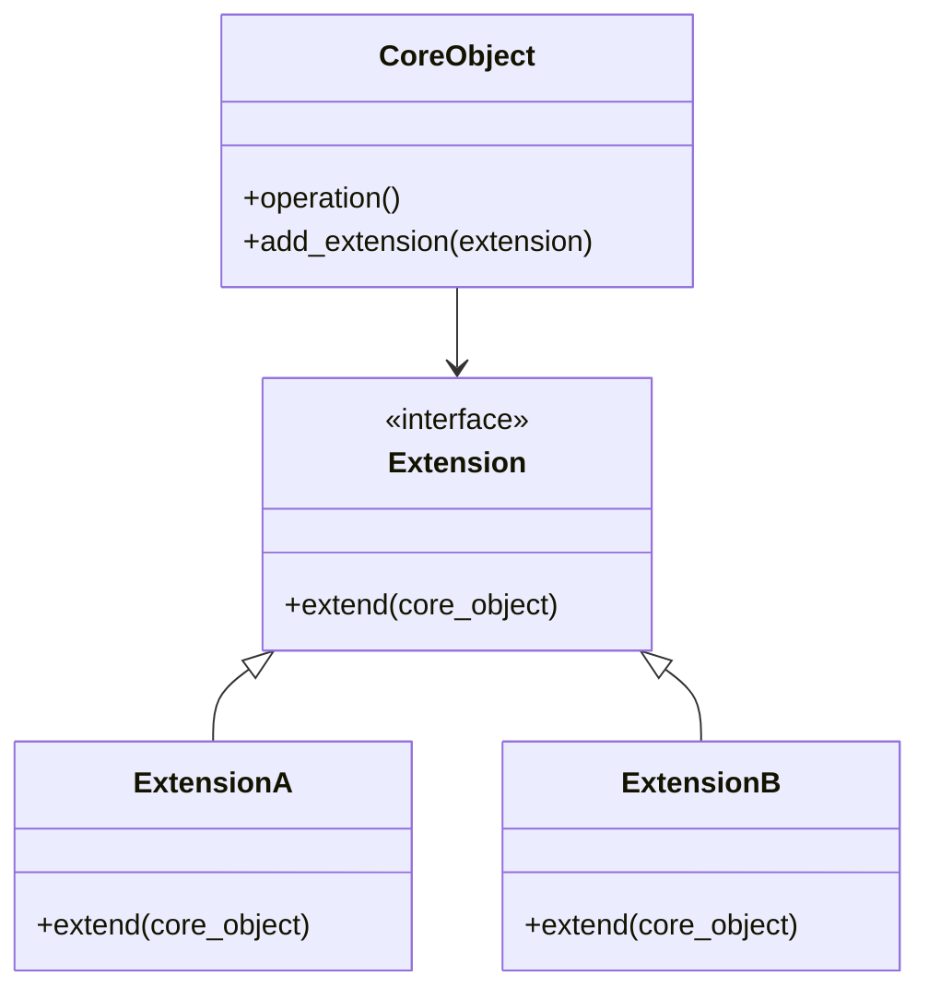

## 4.10 Extension Object Pattern

In the ever-evolving landscape of software development, the ability to adapt and extend functionality without disrupting existing systems is crucial. The Extension Object Pattern is a powerful design pattern that enables developers to dynamically add new behaviors to objects by attaching extension objects. This pattern is particularly useful in scenarios where flexibility and modularity are paramount, such as plugin architectures and feature flags.

### Introduction to the Extension Object Pattern

The Extension Object Pattern allows for the dynamic addition of new functionalities to objects without modifying their existing code. This is achieved by attaching extension objects that encapsulate the new behavior. This approach provides a flexible mechanism for extending the capabilities of objects at runtime, making it an ideal choice for applications that require frequent updates or customization.

#### Key Characteristics

- **Dynamic Behavior Addition**: New functionalities can be added to objects at runtime without altering their existing code.
- **Modularity**: Each extension is encapsulated in its own object, promoting separation of concerns.
- **Reusability**: Extensions can be reused across different objects, reducing code duplication.
- **Decoupling**: The core object remains unaware of the extensions, promoting loose coupling.

### Differentiating from Similar Patterns

While the Extension Object Pattern shares similarities with other design patterns like the Decorator Pattern, it offers distinct advantages, particularly in its ability to add multiple, independent extensions.

#### Extension Object vs. Decorator Pattern

- **Decorator Pattern**: Primarily used to add responsibilities to objects dynamically. It wraps an object to provide additional behavior.
- **Extension Object Pattern**: Focuses on adding multiple, independent extensions. Each extension is an object that can be attached or detached dynamically.

The key difference lies in the independence of extensions. While decorators typically form a chain, extensions in the Extension Object Pattern can be managed independently, allowing for greater flexibility.

### Role of Interfaces or Abstract Base Classes

Interfaces or abstract base classes play a crucial role in the Extension Object Pattern by defining extension points. These extension points serve as contracts that extensions must adhere to, ensuring consistency and compatibility.

#### Defining Extension Points

- **Interfaces**: Define the methods that extensions must implement. This ensures that all extensions provide the expected functionality.
- **Abstract Base Classes**: Serve as templates for extensions, providing default implementations that can be overridden.

By using interfaces or abstract base classes, developers can create a robust framework for extensions, allowing them to be easily integrated and managed.

### Real-World Use Cases

The Extension Object Pattern is widely used in various real-world scenarios, particularly in systems that require high levels of customization and flexibility.

#### Plugin Architectures

In plugin architectures, the Extension Object Pattern allows for the seamless integration of new plugins without altering the core application. Each plugin acts as an extension, providing additional functionality that can be enabled or disabled as needed.

#### Feature Flags

Feature flags are used to toggle features on or off in an application. By implementing feature flags as extensions, developers can dynamically control the availability of features, enabling rapid experimentation and deployment.

### Implementing the Extension Object Pattern in Python

Let's explore how to implement the Extension Object Pattern in Python, leveraging its dynamic typing and object-oriented capabilities.

#### Step-by-Step Implementation

1. **Define the Core Object**: Create the main object that will be extended.

```python
class CoreObject:
    def operation(self):
        print("Core operation")
```

2. **Create an Extension Interface**: Define an interface or abstract base class for extensions.

```python
from abc import ABC, abstractmethod

class Extension(ABC):
    @abstractmethod
    def extend(self, core_object):
        pass
```

3. **Implement Extensions**: Create concrete extension classes that implement the extension interface.

```python
class ExtensionA(Extension):
    def extend(self, core_object):
        print("Extension A functionality")

class ExtensionB(Extension):
    def extend(self, core_object):
        print("Extension B functionality")
```

4. **Attach Extensions to the Core Object**: Allow the core object to manage its extensions.

```python
class CoreObject:
    def __init__(self):
        self.extensions = []

    def add_extension(self, extension):
        self.extensions.append(extension)

    def operation(self):
        print("Core operation")
        for extension in self.extensions:
            extension.extend(self)
```

5. **Use the Extended Core Object**: Demonstrate how to use the core object with extensions.

```python
core = CoreObject()
core.add_extension(ExtensionA())
core.add_extension(ExtensionB())
core.operation()
```

### Visualizing the Extension Object Pattern

To better understand the Extension Object Pattern, let's visualize the relationship between the core object and its extensions using a class diagram.



**Diagram Description**: The diagram illustrates the core object (`CoreObject`) and its relationship with the extension interface (`Extension`). Concrete extensions (`ExtensionA` and `ExtensionB`) implement the extension interface and can be attached to the core object.

### Managing Dependencies Among Extensions

While the Extension Object Pattern offers significant flexibility, it also introduces potential complexities, particularly in managing dependencies among extensions.

#### Strategies for Managing Dependencies

- **Dependency Injection**: Use dependency injection to manage dependencies among extensions. This allows for greater control and flexibility.
- **Extension Registry**: Implement a registry to manage extensions and their dependencies. This can help ensure that extensions are loaded and initialized in the correct order.
- **Event-Driven Architecture**: Use an event-driven approach to manage interactions between extensions. This can help decouple extensions and reduce dependencies.

### Try It Yourself

To deepen your understanding of the Extension Object Pattern, try modifying the code examples provided. Here are a few suggestions:

- **Add New Extensions**: Create additional extension classes and attach them to the core object.
- **Implement Conditional Extensions**: Modify the core object to conditionally execute extensions based on certain criteria.
- **Experiment with Dependency Management**: Implement a simple dependency management system to control the order in which extensions are executed.

### Potential Challenges and Considerations

While the Extension Object Pattern offers numerous benefits, it also presents certain challenges that developers must consider.

#### Complexity Management

As the number of extensions grows, managing them can become complex. It's important to establish clear guidelines and practices for extension development and integration.

#### Performance Overhead

Each extension introduces additional processing overhead. Developers should carefully evaluate the performance impact of extensions, particularly in performance-sensitive applications.

#### Testing and Maintenance

Testing and maintaining a system with numerous extensions can be challenging. Automated testing and continuous integration practices can help ensure that extensions work as expected and do not introduce regressions.

### Conclusion

The Extension Object Pattern is a versatile and powerful design pattern that enables developers to dynamically add functionality to objects. By encapsulating new behaviors in extension objects, this pattern promotes flexibility, modularity, and reusability. While it introduces certain complexities, careful planning and management can help mitigate these challenges, making the Extension Object Pattern an invaluable tool in the developer's toolkit.

### Key Takeaways

- The Extension Object Pattern allows for dynamic behavior addition without modifying existing code.
- It differs from the Decorator Pattern by allowing multiple, independent extensions.
- Interfaces or abstract base classes define extension points, ensuring consistency.
- Real-world use cases include plugin architectures and feature flags.
- Managing dependencies among extensions is crucial for maintaining system integrity.

### Embrace the Journey

Remember, this is just the beginning. As you explore the Extension Object Pattern, you'll discover new ways to enhance the flexibility and modularity of your applications. Keep experimenting, stay curious, and enjoy the journey!

## Quiz Time!



### What is the primary purpose of the Extension Object Pattern?

- [x] To dynamically add new behaviors to objects without modifying existing code.
- [ ] To wrap objects to provide additional behavior.
- [ ] To create a chain of objects that handle requests.
- [ ] To define a family of algorithms and make them interchangeable.

> **Explanation:** The Extension Object Pattern allows for the dynamic addition of new functionalities to objects without altering their existing code.

### How does the Extension Object Pattern differ from the Decorator Pattern?

- [x] It allows for multiple, independent extensions.
- [ ] It wraps objects to provide additional behavior.
- [ ] It forms a chain of decorators.
- [ ] It uses inheritance to add behavior.

> **Explanation:** The Extension Object Pattern focuses on adding multiple, independent extensions, unlike the Decorator Pattern, which typically forms a chain.

### What role do interfaces or abstract base classes play in the Extension Object Pattern?

- [x] They define extension points for consistency and compatibility.
- [ ] They provide default implementations for extensions.
- [ ] They encapsulate new behaviors in extension objects.
- [ ] They manage dependencies among extensions.

> **Explanation:** Interfaces or abstract base classes define extension points, ensuring that all extensions provide the expected functionality.

### Which of the following is a real-world use case for the Extension Object Pattern?

- [x] Plugin architectures
- [ ] Data validation
- [ ] Logging systems
- [ ] Transactional operations

> **Explanation:** The Extension Object Pattern is widely used in plugin architectures to integrate new plugins without altering the core application.

### What is a potential challenge when using the Extension Object Pattern?

- [x] Managing dependencies among extensions.
- [ ] Ensuring thread safety.
- [ ] Implementing undo and redo mechanisms.
- [ ] Handling service requests efficiently.

> **Explanation:** Managing dependencies among extensions is a potential challenge, as it can introduce complexity.

### Which strategy can help manage dependencies among extensions?

- [x] Dependency Injection
- [ ] Lazy Initialization
- [ ] Double-Checked Locking
- [ ] Event Loop Patterns

> **Explanation:** Dependency Injection can help manage dependencies among extensions, allowing for greater control and flexibility.

### What is a benefit of using the Extension Object Pattern?

- [x] It promotes modularity and reusability.
- [ ] It reduces memory usage.
- [ ] It simplifies object communication.
- [ ] It encapsulates requests as objects.

> **Explanation:** The Extension Object Pattern promotes modularity and reusability by encapsulating new behaviors in extension objects.

### How can performance overhead be addressed when using the Extension Object Pattern?

- [x] By carefully evaluating the performance impact of extensions.
- [ ] By using caching strategies.
- [ ] By implementing thread management.
- [ ] By using event-driven architecture.

> **Explanation:** Developers should carefully evaluate the performance impact of extensions, particularly in performance-sensitive applications.

### True or False: The Extension Object Pattern can be used to implement feature flags.

- [x] True
- [ ] False

> **Explanation:** The Extension Object Pattern can be used to implement feature flags, allowing developers to dynamically control the availability of features.

### What is a key takeaway of the Extension Object Pattern?

- [x] It allows for dynamic behavior addition without modifying existing code.
- [ ] It uses inheritance to add behavior.
- [ ] It forms a chain of decorators.
- [ ] It encapsulates requests as objects.

> **Explanation:** The Extension Object Pattern allows for dynamic behavior addition without modifying existing code, promoting flexibility and modularity.




