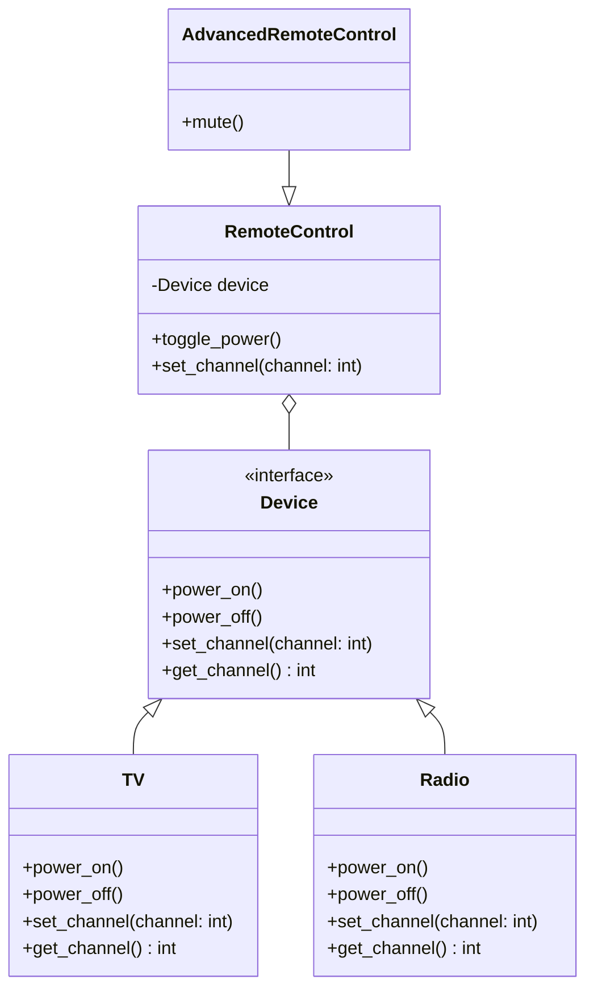

## 4.2.1 Implementing Bridge in Python

In this section, we delve into the Bridge Pattern, a structural design pattern that decouples an abstraction from its implementation, allowing the two to vary independently. This pattern is particularly useful in scenarios where you need to switch between different implementations dynamically or when you want to extend a class in multiple orthogonal dimensions. Let's explore how we can implement the Bridge Pattern in Python, understand its advantages, and examine Python-specific considerations.

### Understanding the Bridge Pattern

The Bridge Pattern is designed to "bridge" the gap between an abstraction and its implementation. By doing so, it allows you to change the implementation without affecting the abstraction and vice versa. This separation is achieved through the use of interfaces or abstract classes.

#### Key Components of the Bridge Pattern

1. **Abstraction**: The high-level control layer for some entity. This defines the abstraction's interface and maintains a reference to an object of type Implementor.

2. **Refined Abstraction**: Extends the interface defined by Abstraction.

3. **Implementor**: Defines the interface for implementation classes. This interface does not need to correspond directly to Abstraction's interface; in fact, the two interfaces can be quite different. Typically, the Implementor interface provides only primitive operations, and Abstraction defines higher-level operations based on these primitives.

4. **Concrete Implementor**: Implements the Implementor interface and defines its concrete implementation.

### Code Example: Implementing the Bridge Pattern in Python

Let's consider a scenario where we have different types of devices (like TVs and Radios) that can be controlled through different remote controls. We'll use the Bridge Pattern to decouple the remote control from the device it controls.

#### Step 1: Define the Implementor Interface

First, we define the `Device` interface, which acts as the Implementor. This interface will declare methods that all concrete devices must implement.

```python
class Device:
    def power_on(self):
        raise NotImplementedError("This method should be overridden.")

    def power_off(self):
        raise NotImplementedError("This method should be overridden.")

    def set_channel(self, channel: int):
        raise NotImplementedError("This method should be overridden.")

    def get_channel(self) -> int:
        raise NotImplementedError("This method should be overridden.")
```

#### Step 2: Create Concrete Implementors

Next, we create concrete classes that implement the `Device` interface. Let's create a `TV` and a `Radio`.

```python
class TV(Device):
    def __init__(self):
        self._is_on = False
        self._channel = 1

    def power_on(self):
        self._is_on = True
        print("TV is now ON.")

    def power_off(self):
        self._is_on = False
        print("TV is now OFF.")

    def set_channel(self, channel: int):
        self._channel = channel
        print(f"TV channel set to {self._channel}.")

    def get_channel(self) -> int:
        return self._channel


class Radio(Device):
    def __init__(self):
        self._is_on = False
        self._channel = 1

    def power_on(self):
        self._is_on = True
        print("Radio is now ON.")

    def power_off(self):
        self._is_on = False
        print("Radio is now OFF.")

    def set_channel(self, channel: int):
        self._channel = channel
        print(f"Radio channel set to {self._channel}.")

    def get_channel(self) -> int:
        return self._channel
```

#### Step 3: Define the Abstraction

Now, let's define the `RemoteControl` class, which acts as the Abstraction. This class will maintain a reference to a `Device` object and delegate the operations to it.

```python
class RemoteControl:
    def __init__(self, device: Device):
        self._device = device

    def toggle_power(self):
        if self._device.get_channel() == 0:
            self._device.power_on()
        else:
            self._device.power_off()

    def set_channel(self, channel: int):
        self._device.set_channel(channel)
```

#### Step 4: Create Refined Abstractions

We can extend the `RemoteControl` class to add more functionality or to control specific types of devices.

```python
class AdvancedRemoteControl(RemoteControl):
    def mute(self):
        print("Device is muted.")
```

### Connecting the Abstraction to the Implementor

To connect the abstraction to the implementor, we instantiate a `RemoteControl` (or its subclass) with a `Device` object.

```python
tv = TV()
remote = RemoteControl(tv)
remote.toggle_power()
remote.set_channel(5)

radio = Radio()
advanced_remote = AdvancedRemoteControl(radio)
advanced_remote.toggle_power()
advanced_remote.mute()
```

### Benefits of the Bridge Pattern

The Bridge Pattern offers several advantages:

- **Decoupling Abstraction from Implementation**: By separating the abstraction from its implementation, you can change either independently. This is particularly useful when the abstraction and implementation need to evolve separately.

- **Increased Extensibility**: New abstractions and implementations can be added without affecting existing code. This makes the system more flexible and easier to maintain.

- **Improved Code Organization**: The pattern encourages a cleaner separation of concerns, leading to more organized and manageable code.

### Python-Specific Considerations

Python's dynamic typing and support for duck typing make it particularly well-suited for implementing the Bridge Pattern. You can easily create interfaces and concrete classes without the need for explicit interface declarations, as seen in statically typed languages like Java.

#### Use of `abc` Module

While Python does not enforce interfaces, you can use the `abc` module to create abstract base classes, which can help ensure that concrete classes implement required methods.

```python
from abc import ABC, abstractmethod

class Device(ABC):
    @abstractmethod
    def power_on(self):
        pass

    @abstractmethod
    def power_off(self):
        pass

    @abstractmethod
    def set_channel(self, channel: int):
        pass

    @abstractmethod
    def get_channel(self) -> int:
        pass
```

### Visualizing the Bridge Pattern

To better understand the Bridge Pattern, let's visualize the relationship between the abstraction and the implementor using a class diagram.



### Try It Yourself

To solidify your understanding of the Bridge Pattern, try modifying the code examples:

- **Add a New Device**: Implement a new device, such as a `SmartSpeaker`, and integrate it with the existing remote control classes.
- **Extend Functionality**: Add new methods to the `AdvancedRemoteControl` class, such as `volume_up` and `volume_down`.
- **Experiment with Interfaces**: Use the `abc` module to enforce method implementation in your device classes.

### Knowledge Check

Before we wrap up, let's reinforce what we've learned:

- **What is the primary purpose of the Bridge Pattern?**
- **How does the Bridge Pattern improve code extensibility?**
- **What are the key components of the Bridge Pattern?**

### Conclusion

The Bridge Pattern is a powerful tool in your design pattern toolkit, enabling you to separate abstraction from implementation and enhance the flexibility and maintainability of your code. By leveraging Python's dynamic nature, you can implement this pattern effectively and efficiently. Remember, the journey of mastering design patterns is ongoing, so keep experimenting and exploring new ways to apply these concepts in your projects.

## Quiz Time!



### What is the primary purpose of the Bridge Pattern?

- [x] To decouple an abstraction from its implementation.
- [ ] To combine multiple interfaces into one.
- [ ] To simplify complex interfaces.
- [ ] To create a single point of access to a subsystem.

> **Explanation:** The Bridge Pattern is designed to decouple an abstraction from its implementation, allowing the two to vary independently.

### Which of the following is a key component of the Bridge Pattern?

- [x] Implementor
- [ ] Adapter
- [ ] Proxy
- [ ] Facade

> **Explanation:** The Implementor is a key component of the Bridge Pattern, defining the interface for implementation classes.

### How does the Bridge Pattern improve code extensibility?

- [x] By allowing new abstractions and implementations to be added without affecting existing code.
- [ ] By reducing the number of classes needed.
- [ ] By enforcing strict type checking.
- [ ] By simplifying the code structure.

> **Explanation:** The Bridge Pattern improves extensibility by allowing new abstractions and implementations to be added independently, without affecting existing code.

### In the Bridge Pattern, what role does the `RemoteControl` class play?

- [x] It acts as the Abstraction.
- [ ] It acts as the Implementor.
- [ ] It acts as the Concrete Implementor.
- [ ] It acts as the Refined Abstraction.

> **Explanation:** The `RemoteControl` class acts as the Abstraction, maintaining a reference to a `Device` object and delegating operations to it.

### What Python module can be used to create abstract base classes?

- [x] abc
- [ ] functools
- [ ] itertools
- [ ] collections

> **Explanation:** The `abc` module in Python is used to create abstract base classes, which can help ensure that concrete classes implement required methods.

### Which of the following is a benefit of using the Bridge Pattern?

- [x] Improved code organization
- [ ] Increased memory usage
- [ ] Reduced code readability
- [ ] Decreased flexibility

> **Explanation:** The Bridge Pattern improves code organization by encouraging a cleaner separation of concerns.

### What is the relationship between `RemoteControl` and `Device` in the Bridge Pattern?

- [x] RemoteControl maintains a reference to a Device object.
- [ ] RemoteControl inherits from Device.
- [ ] Device inherits from RemoteControl.
- [ ] RemoteControl and Device are unrelated.

> **Explanation:** In the Bridge Pattern, `RemoteControl` maintains a reference to a `Device` object, allowing it to delegate operations to the device.

### How can you enforce method implementation in Python device classes?

- [x] By using the `abc` module to create abstract base classes.
- [ ] By using the `functools` module.
- [ ] By using the `itertools` module.
- [ ] By using the `collections` module.

> **Explanation:** You can enforce method implementation in Python device classes by using the `abc` module to create abstract base classes.

### What is the role of `AdvancedRemoteControl` in the Bridge Pattern?

- [x] It acts as the Refined Abstraction.
- [ ] It acts as the Implementor.
- [ ] It acts as the Concrete Implementor.
- [ ] It acts as the Abstraction.

> **Explanation:** `AdvancedRemoteControl` acts as the Refined Abstraction, extending the functionality of the `RemoteControl` class.

### True or False: The Bridge Pattern allows the abstraction and implementation to evolve independently.

- [x] True
- [ ] False

> **Explanation:** True. The Bridge Pattern allows the abstraction and implementation to evolve independently, which is one of its main advantages.




