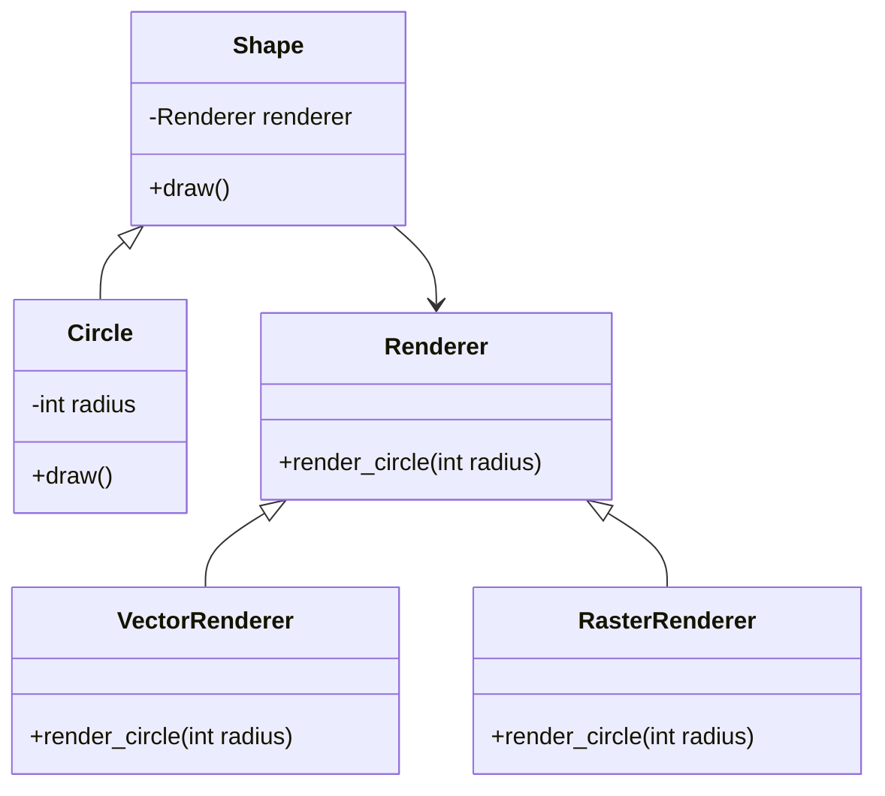

## 4.2.2 Decoupling Abstraction and Implementation

In software design, the ability to change one part of a system without affecting others is crucial for maintainability and scalability. The Bridge Pattern is a structural design pattern that facilitates this by decoupling abstraction from its implementation, allowing both to vary independently. This section will delve into how the Bridge Pattern achieves this decoupling, scenarios where it is beneficial, and the trade-offs involved.

### Understanding the Bridge Pattern

The Bridge Pattern is about creating two separate hierarchies: one for the abstraction and one for the implementation. This separation allows us to change the implementation without altering the abstraction and vice versa. The abstraction contains a reference to the implementation, and the two communicate through a well-defined interface.

#### Key Concepts

- **Abstraction**: The high-level control layer for some entity. It defines the control interface and maintains a reference to the implementation.
- **Implementation**: The low-level operations that the abstraction relies on. It provides the concrete functionality that the abstraction calls upon.

### How the Bridge Pattern Facilitates Independent Development

By separating the abstraction from the implementation, the Bridge Pattern allows developers to work on different parts of a system independently. This is particularly useful in large systems where different teams might be responsible for different layers of functionality.

#### Example Scenario

Consider a graphics application that needs to render shapes in different formats (e.g., vector and raster). Using the Bridge Pattern, we can create an abstraction for shapes and separate implementations for each rendering format. This allows us to add new shapes or rendering formats without modifying existing code.

```python
class Shape:
    def __init__(self, renderer):
        self.renderer = renderer

    def draw(self):
        raise NotImplementedError("You should implement this method.")

class Circle(Shape):
    def __init__(self, renderer, radius):
        super().__init__(renderer)
        self.radius = radius

    def draw(self):
        self.renderer.render_circle(self.radius)

class Renderer:
    def render_circle(self, radius):
        raise NotImplementedError("You should implement this method.")

class VectorRenderer(Renderer):
    def render_circle(self, radius):
        print(f"Drawing a circle with radius {radius} using vector rendering.")

class RasterRenderer(Renderer):
    def render_circle(self, radius):
        print(f"Drawing a circle with radius {radius} using raster rendering.")

vector_renderer = VectorRenderer()
raster_renderer = RasterRenderer()

circle1 = Circle(vector_renderer, 5)
circle2 = Circle(raster_renderer, 10)

circle1.draw()
circle2.draw()
```

In this example, `Shape` is the abstraction, and `Renderer` is the implementation. We can add new shapes or renderers without affecting the other hierarchy.

### Scenarios Where the Bridge Pattern Reduces Coupling

The Bridge Pattern is particularly useful in scenarios where:

- **Multiple Abstractions and Implementations**: When you have multiple abstractions that need to work with multiple implementations, the Bridge Pattern helps manage the complexity.
- **Platform Independence**: In systems that need to run on multiple platforms, the Bridge Pattern can separate platform-specific code from the abstraction.
- **Changing Requirements**: When requirements are likely to change, the Bridge Pattern allows for flexibility in updating the implementation without affecting the abstraction.

#### Real-World Example

Consider a remote control system for various devices. The abstraction could be a `RemoteControl` class, and the implementations could be different types of devices like `TV`, `Radio`, etc. The Bridge Pattern allows us to add new devices or remote control functionalities without altering the existing codebase.

```python
class RemoteControl:
    def __init__(self, device):
        self.device = device

    def turn_on(self):
        self.device.turn_on()

    def turn_off(self):
        self.device.turn_off()

class Device:
    def turn_on(self):
        raise NotImplementedError("You should implement this method.")

    def turn_off(self):
        raise NotImplementedError("You should implement this method.")

class TV(Device):
    def turn_on(self):
        print("Turning on the TV.")

    def turn_off(self):
        print("Turning off the TV.")

class Radio(Device):
    def turn_on(self):
        print("Turning on the Radio.")

    def turn_off(self):
        print("Turning off the Radio.")

tv = TV()
radio = Radio()

remote_tv = RemoteControl(tv)
remote_radio = RemoteControl(radio)

remote_tv.turn_on()
remote_radio.turn_off()
```

### Potential Trade-offs

While the Bridge Pattern offers significant advantages in terms of flexibility and decoupling, it also introduces some trade-offs:

- **Increased Complexity**: The initial setup of the Bridge Pattern can be more complex than a straightforward implementation. This complexity can be justified if the system requires the flexibility provided by the pattern.
- **Overhead**: The additional layers of abstraction can introduce a slight performance overhead, although this is usually negligible compared to the benefits of maintainability and scalability.

### Try It Yourself

To get a better grasp of the Bridge Pattern, try modifying the examples provided:

- Add a new shape, such as a `Square`, and implement it using the existing renderers.
- Introduce a new renderer, such as `3DRenderer`, and see how easily it integrates with the existing shapes.
- Extend the remote control example by adding a new device, such as `AirConditioner`, and implement the necessary methods.

### Visualizing the Bridge Pattern

Let's visualize the Bridge Pattern to better understand the separation between abstraction and implementation.



**Diagram Description**: This class diagram illustrates the Bridge Pattern with `Shape` as the abstraction and `Renderer` as the implementation. `Circle` extends `Shape`, while `VectorRenderer` and `RasterRenderer` are concrete implementations of `Renderer`. The `Shape` class maintains a reference to a `Renderer`, allowing for flexible rendering strategies.

### References and Further Reading

For more information on the Bridge Pattern and its applications, consider the following resources:

- [Design Patterns: Elements of Reusable Object-Oriented Software](https://en.wikipedia.org/wiki/Design_Patterns) by Erich Gamma, Richard Helm, Ralph Johnson, and John Vlissides.
- [Refactoring Guru: Bridge Pattern](https://refactoring.guru/design-patterns/bridge)
- [Python Design Patterns](https://python-patterns.guide/) - A guide to various design patterns in Python.

### Knowledge Check

Before moving on, let's review some key points:

- The Bridge Pattern separates abstraction from implementation, allowing them to vary independently.
- It is useful in scenarios with multiple abstractions and implementations, platform independence, and changing requirements.
- While it introduces some complexity, the benefits in flexibility and maintainability often outweigh the costs.

### Embrace the Journey

Remember, mastering design patterns is a journey. The Bridge Pattern is just one tool in your toolkit. As you continue to explore and apply design patterns, you'll find new ways to make your code more flexible, maintainable, and scalable. Keep experimenting, stay curious, and enjoy the journey!

## Quiz Time!



### What is the primary goal of the Bridge Pattern?

- [x] To decouple abstraction from implementation
- [ ] To increase performance by reducing overhead
- [ ] To simplify code by removing all abstractions
- [ ] To ensure all classes have only one responsibility

> **Explanation:** The Bridge Pattern aims to decouple abstraction from implementation, allowing both to vary independently.

### Which of the following scenarios is the Bridge Pattern most suitable for?

- [x] When you have multiple abstractions and implementations
- [ ] When you need to optimize a single algorithm
- [ ] When you want to remove all interfaces from your code
- [ ] When you need to implement a simple utility function

> **Explanation:** The Bridge Pattern is ideal for scenarios with multiple abstractions and implementations, as it helps manage complexity and allows for independent development.

### What is a potential trade-off of using the Bridge Pattern?

- [x] Increased initial complexity
- [ ] Decreased code maintainability
- [ ] Reduced flexibility in code
- [ ] Limited to only one platform

> **Explanation:** The Bridge Pattern can introduce increased initial complexity due to the separation of abstraction and implementation.

### In the provided graphics application example, what role does the `Renderer` class play?

- [x] It acts as the implementation in the Bridge Pattern
- [ ] It acts as the abstraction in the Bridge Pattern
- [ ] It is unrelated to the Bridge Pattern
- [ ] It is a utility class for drawing shapes

> **Explanation:** The `Renderer` class acts as the implementation in the Bridge Pattern, providing concrete functionality for rendering shapes.

### How does the Bridge Pattern affect platform independence?

- [x] It separates platform-specific code from the abstraction
- [ ] It ties the abstraction to a specific platform
- [ ] It removes the need for platform-specific code
- [ ] It makes the code platform-dependent

> **Explanation:** The Bridge Pattern separates platform-specific code from the abstraction, enhancing platform independence.

### Which of the following is NOT a benefit of the Bridge Pattern?

- [ ] Flexibility in changing implementations
- [x] Simplification of all code structures
- [ ] Independent development of abstraction and implementation
- [ ] Enhanced maintainability

> **Explanation:** While the Bridge Pattern offers flexibility, independent development, and enhanced maintainability, it does not necessarily simplify all code structures.

### What does the `Shape` class represent in the Bridge Pattern example?

- [x] The abstraction layer
- [ ] The implementation layer
- [ ] A utility class
- [ ] A data storage class

> **Explanation:** The `Shape` class represents the abstraction layer in the Bridge Pattern example, defining the control interface.

### What is a common use case for the Bridge Pattern?

- [x] Remote control systems for various devices
- [ ] Implementing a basic calculator
- [ ] Creating a simple text editor
- [ ] Writing a command-line utility

> **Explanation:** A common use case for the Bridge Pattern is remote control systems for various devices, where different devices can be controlled through a unified interface.

### True or False: The Bridge Pattern can be used to add new functionality to a system without modifying existing code.

- [x] True
- [ ] False

> **Explanation:** True. The Bridge Pattern allows for adding new functionality by extending the abstraction or implementation hierarchies without modifying existing code.

### True or False: The Bridge Pattern is only useful in object-oriented programming languages.

- [ ] True
- [x] False

> **Explanation:** False. While the Bridge Pattern is often used in object-oriented languages, its principles of decoupling abstraction from implementation can be applied in other paradigms as well.


