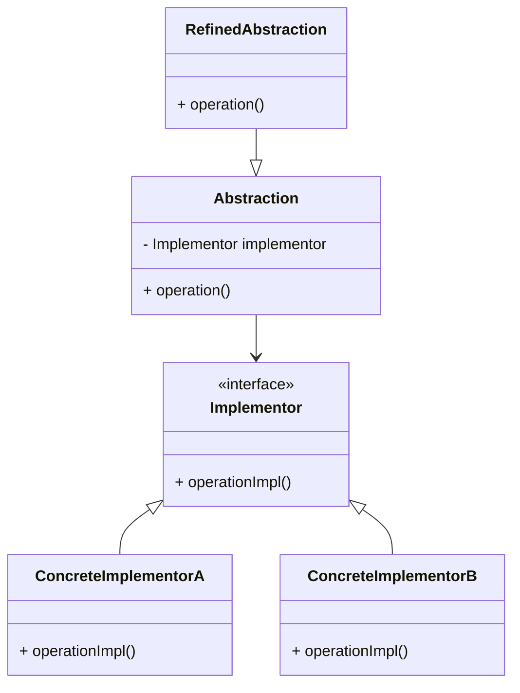

## 4.2.3 Use Cases and Examples

The Bridge Pattern is a structural design pattern that decouples an abstraction from its implementation, allowing both to vary independently. This pattern is particularly useful in scenarios where you need to support multiple platforms or devices, as it provides a flexible architecture that can easily adapt to changes in requirements or technology. In this section, we will explore practical use cases and examples of the Bridge Pattern in Python, demonstrating its power and versatility in real-world applications.

### Understanding the Bridge Pattern

Before diving into use cases and examples, let's briefly recap the Bridge Pattern's core concept. The pattern involves two main components: the **Abstraction** and the **Implementation**. The Abstraction defines the high-level control logic, while the Implementation contains the low-level details. By separating these two components, the Bridge Pattern allows you to extend either side without affecting the other.

#### Key Components of the Bridge Pattern

1. **Abstraction**: This is the interface that clients interact with. It maintains a reference to the Implementor and delegates work to it.
2. **Refined Abstraction**: This is a variant of the Abstraction that extends its functionality.
3. **Implementor**: This defines the interface for implementation classes. It doesn't have to match the Abstraction interface exactly.
4. **Concrete Implementor**: These are the classes that implement the Implementor interface, providing specific functionality.

### Practical Use Cases

The Bridge Pattern is particularly beneficial in large-scale applications where you need to support multiple platforms or devices. Let's explore some practical use cases where this pattern can be effectively applied.

#### 1. Graphics Rendering Engines

In graphics applications, you often need to support different rendering APIs, such as OpenGL, DirectX, or Vulkan. The Bridge Pattern allows you to create a flexible architecture that can easily switch between these APIs without modifying the core graphics logic.

**Example**: Consider a graphics engine that needs to render shapes using different APIs. The Abstraction could be a `Shape` class, and the Implementor could be a `Renderer` interface. Concrete Implementors like `OpenGLRenderer` and `DirectXRenderer` would handle the specifics of each API.

```python
class Renderer:
    def render_circle(self, x, y, radius):
        pass

class OpenGLRenderer(Renderer):
    def render_circle(self, x, y, radius):
        print(f"OpenGL rendering a circle at ({x}, {y}) with radius {radius}")

class DirectXRenderer(Renderer):
    def render_circle(self, x, y, radius):
        print(f"DirectX rendering a circle at ({x}, {y}) with radius {radius}")

class Shape:
    def __init__(self, renderer):
        self.renderer = renderer

    def draw(self):
        pass

class Circle(Shape):
    def __init__(self, x, y, radius, renderer):
        super().__init__(renderer)
        self.x = x
        self.y = y
        self.radius = radius

    def draw(self):
        self.renderer.render_circle(self.x, self.y, self.radius)

opengl_renderer = OpenGLRenderer()
directx_renderer = DirectXRenderer()

circle1 = Circle(10, 20, 5, opengl_renderer)
circle2 = Circle(15, 25, 10, directx_renderer)

circle1.draw()
circle2.draw()
```

In this example, the `Circle` class acts as the Abstraction, while the `Renderer` interface and its concrete implementations (`OpenGLRenderer` and `DirectXRenderer`) represent the Implementor. This setup allows you to add new rendering APIs without modifying the `Circle` class.

#### 2. Cross-Platform UI Libraries

User interface libraries often need to support multiple platforms, such as Windows, macOS, and Linux. The Bridge Pattern enables you to create a unified UI library that can adapt to different platform-specific implementations.

**Example**: Imagine a UI library that needs to display buttons on various platforms. The Abstraction could be a `Button` class, and the Implementor could be a `PlatformRenderer` interface. Concrete Implementors like `WindowsRenderer` and `LinuxRenderer` would handle platform-specific details.

```python
class PlatformRenderer:
    def render_button(self, label):
        pass

class WindowsRenderer(PlatformRenderer):
    def render_button(self, label):
        print(f"Rendering button '{label}' on Windows")

class LinuxRenderer(PlatformRenderer):
    def render_button(self, label):
        print(f"Rendering button '{label}' on Linux")

class Button:
    def __init__(self, label, renderer):
        self.label = label
        self.renderer = renderer

    def draw(self):
        self.renderer.render_button(self.label)

windows_renderer = WindowsRenderer()
linux_renderer = LinuxRenderer()

button1 = Button("Submit", windows_renderer)
button2 = Button("Cancel", linux_renderer)

button1.draw()
button2.draw()
```

Here, the `Button` class serves as the Abstraction, while the `PlatformRenderer` interface and its concrete implementations (`WindowsRenderer` and `LinuxRenderer`) represent the Implementor. This design allows you to add new platforms without altering the `Button` class.

#### 3. Device Drivers

Device drivers often need to support different hardware components, such as printers or network cards. The Bridge Pattern allows you to create a flexible driver architecture that can accommodate various hardware implementations.

**Example**: Consider a printer driver that needs to support different printer models. The Abstraction could be a `Printer` class, and the Implementor could be a `PrinterDriver` interface. Concrete Implementors like `LaserPrinterDriver` and `InkjetPrinterDriver` would handle model-specific details.

```python
class PrinterDriver:
    def print_document(self, document):
        pass

class LaserPrinterDriver(PrinterDriver):
    def print_document(self, document):
        print(f"Printing document on Laser Printer: {document}")

class InkjetPrinterDriver(PrinterDriver):
    def print_document(self, document):
        print(f"Printing document on Inkjet Printer: {document}")

class Printer:
    def __init__(self, driver):
        self.driver = driver

    def print(self, document):
        self.driver.print_document(document)

laser_driver = LaserPrinterDriver()
inkjet_driver = InkjetPrinterDriver()

printer1 = Printer(laser_driver)
printer2 = Printer(inkjet_driver)

printer1.print("Annual Report")
printer2.print("Photo Album")
```

In this example, the `Printer` class acts as the Abstraction, while the `PrinterDriver` interface and its concrete implementations (`LaserPrinterDriver` and `InkjetPrinterDriver`) represent the Implementor. This setup allows you to add new printer models without modifying the `Printer` class.

### Adding New Abstractions and Implementations

One of the key advantages of the Bridge Pattern is its ability to add new abstractions and implementations without affecting existing code. This flexibility is crucial in large or scalable applications where requirements may change over time.

#### Adding New Abstractions

To add a new abstraction, simply create a new class that extends the existing Abstraction. This new class can introduce additional functionality or modify existing behavior without altering the underlying implementation.

**Example**: Extending the `Shape` class to include a `Rectangle` class.

```python
class Rectangle(Shape):
    def __init__(self, x, y, width, height, renderer):
        super().__init__(renderer)
        self.x = x
        self.y = y
        self.width = width
        self.height = height

    def draw(self):
        self.renderer.render_rectangle(self.x, self.y, self.width, self.height)

class Renderer:
    def render_circle(self, x, y, radius):
        pass

    def render_rectangle(self, x, y, width, height):
        pass

class OpenGLRenderer(Renderer):
    def render_circle(self, x, y, radius):
        print(f"OpenGL rendering a circle at ({x}, {y}) with radius {radius}")

    def render_rectangle(self, x, y, width, height):
        print(f"OpenGL rendering a rectangle at ({x}, {y}) with width {width} and height {height}")

class DirectXRenderer(Renderer):
    def render_circle(self, x, y, radius):
        print(f"DirectX rendering a circle at ({x}, {y}) with radius {radius}")

    def render_rectangle(self, x, y, width, height):
        print(f"DirectX rendering a rectangle at ({x}, {y}) with width {width} and height {height}")

rectangle1 = Rectangle(5, 10, 15, 20, opengl_renderer)
rectangle2 = Rectangle(10, 15, 25, 30, directx_renderer)

rectangle1.draw()
rectangle2.draw()
```

By adding the `Rectangle` class, we extend the functionality of the graphics engine without modifying the existing `Circle` class or the `Renderer` interface.

#### Adding New Implementations

To add a new implementation, create a new class that implements the existing Implementor interface. This new class can provide a different way of handling the implementation details without affecting the Abstraction.

**Example**: Adding a `VulkanRenderer` to the graphics engine.

```python
class VulkanRenderer(Renderer):
    def render_circle(self, x, y, radius):
        print(f"Vulkan rendering a circle at ({x}, {y}) with radius {radius}")

    def render_rectangle(self, x, y, width, height):
        print(f"Vulkan rendering a rectangle at ({x}, {y}) with width {width} and height {height}")

vulkan_renderer = VulkanRenderer()

circle3 = Circle(20, 30, 15, vulkan_renderer)
rectangle3 = Rectangle(15, 25, 35, 40, vulkan_renderer)

circle3.draw()
rectangle3.draw()
```

By adding the `VulkanRenderer`, we introduce a new rendering API without altering the existing `Shape` classes or the `Renderer` interface.

### Considerations for Large or Scalable Applications

The Bridge Pattern is particularly useful in large or scalable applications where you need to manage complexity and support multiple variations of abstractions and implementations. Here are some considerations to keep in mind when applying the Bridge Pattern in such scenarios:

1. **Decoupling**: The Bridge Pattern effectively decouples the abstraction from the implementation, allowing both to evolve independently. This is crucial in large applications where changes in one part of the system should not impact other parts.

2. **Flexibility**: By separating the abstraction and implementation, the Bridge Pattern provides flexibility to add new features or support new platforms without modifying existing code. This is particularly important in scalable applications where requirements may change over time.

3. **Maintainability**: The Bridge Pattern promotes a clean separation of concerns, making the codebase easier to maintain and understand. This is essential in large applications where multiple developers may be working on different parts of the system.

4. **Performance**: While the Bridge Pattern introduces an additional layer of abstraction, it can improve performance by allowing you to optimize specific implementations without affecting the overall architecture.

5. **Complexity**: The Bridge Pattern can introduce complexity due to the additional abstraction layer. It's important to weigh the benefits of flexibility and maintainability against the potential increase in complexity.

### Visualizing the Bridge Pattern

To better understand the Bridge Pattern, let's visualize its structure using a class diagram. This diagram illustrates the relationships between the Abstraction, Refined Abstraction, Implementor, and Concrete Implementors.



In this diagram, the `Abstraction` class maintains a reference to the `Implementor` interface, allowing it to delegate work to the concrete implementations (`ConcreteImplementorA` and `ConcreteImplementorB`). The `RefinedAbstraction` extends the `Abstraction` to provide additional functionality.

### Try It Yourself

Now that we've explored the Bridge Pattern and its use cases, it's time to experiment with the code examples. Here are some suggestions for modifications you can try:

1. **Add a New Shape**: Extend the graphics engine by adding a new shape, such as a `Triangle`. Implement the necessary methods in the `Renderer` interface and its concrete implementations.

2. **Introduce a New Platform**: In the UI library example, add a new platform, such as macOS, by creating a `MacOSRenderer` class. Implement the platform-specific details for rendering buttons.

3. **Create a New Printer Model**: In the printer driver example, add a new printer model, such as a `DotMatrixPrinterDriver`. Implement the model-specific details for printing documents.

4. **Experiment with Different Renderers**: Swap out different renderers in the graphics engine or UI library to see how the Bridge Pattern allows you to easily switch between implementations.

### Knowledge Check

Before we conclude, let's reinforce our understanding of the Bridge Pattern with a few questions:

- What are the main components of the Bridge Pattern?
- How does the Bridge Pattern promote flexibility and maintainability in large applications?
- What are some practical use cases where the Bridge Pattern can be effectively applied?
- How can you add new abstractions and implementations using the Bridge Pattern?

### Conclusion

The Bridge Pattern is a powerful tool for managing complexity and supporting multiple platforms or devices in large or scalable applications. By decoupling the abstraction from the implementation, it provides flexibility, maintainability, and performance benefits. As you continue your journey in software design, consider the Bridge Pattern as a valuable addition to your toolkit.

Remember, this is just the beginning. As you progress, you'll discover more ways to apply the Bridge Pattern and other design patterns to create robust and scalable software solutions. Keep experimenting, stay curious, and enjoy the journey!

## Quiz Time!



### What is the primary purpose of the Bridge Pattern?

- [x] To decouple an abstraction from its implementation.
- [ ] To encapsulate a request as an object.
- [ ] To provide a simplified interface to a complex subsystem.
- [ ] To compose objects into tree structures.

> **Explanation:** The Bridge Pattern's primary purpose is to decouple an abstraction from its implementation, allowing both to vary independently.

### Which component of the Bridge Pattern defines the interface for implementation classes?

- [ ] Abstraction
- [ ] Refined Abstraction
- [x] Implementor
- [ ] Concrete Implementor

> **Explanation:** The Implementor defines the interface for implementation classes in the Bridge Pattern.

### In the graphics engine example, what role does the `Circle` class play?

- [x] Abstraction
- [ ] Implementor
- [ ] Concrete Implementor
- [ ] Refined Abstraction

> **Explanation:** The `Circle` class acts as the Abstraction in the graphics engine example.

### How does the Bridge Pattern enhance flexibility in software design?

- [x] By allowing new abstractions and implementations to be added without affecting existing code.
- [ ] By providing a way to access elements of a collection sequentially.
- [ ] By defining a representation of a grammar and an interpreter to work with it.
- [ ] By encapsulating a request as an object.

> **Explanation:** The Bridge Pattern enhances flexibility by allowing new abstractions and implementations to be added without affecting existing code.

### What is a potential downside of using the Bridge Pattern?

- [ ] Improved performance
- [x] Increased complexity
- [ ] Better maintainability
- [ ] Enhanced flexibility

> **Explanation:** A potential downside of using the Bridge Pattern is increased complexity due to the additional abstraction layer.

### Which of the following is a practical use case for the Bridge Pattern?

- [x] Cross-platform UI libraries
- [ ] Logging systems
- [ ] Undo and redo mechanisms
- [ ] Validation and filtering

> **Explanation:** Cross-platform UI libraries are a practical use case for the Bridge Pattern, as it allows for platform-specific implementations.

### How can you add a new implementation in the Bridge Pattern?

- [x] By creating a new class that implements the existing Implementor interface.
- [ ] By modifying the existing Abstraction class.
- [ ] By creating a new class that extends the existing Abstraction.
- [ ] By altering the existing Concrete Implementor classes.

> **Explanation:** To add a new implementation in the Bridge Pattern, create a new class that implements the existing Implementor interface.

### What is the role of the `Refined Abstraction` in the Bridge Pattern?

- [x] To extend the functionality of the Abstraction.
- [ ] To define the interface for implementation classes.
- [ ] To provide specific functionality for the Implementor.
- [ ] To encapsulate the request as an object.

> **Explanation:** The `Refined Abstraction` extends the functionality of the Abstraction in the Bridge Pattern.

### Which of the following best describes the Bridge Pattern?

- [x] A structural pattern that decouples an abstraction from its implementation.
- [ ] A behavioral pattern that encapsulates a request as an object.
- [ ] A creational pattern that provides an interface for creating families of related objects.
- [ ] A structural pattern that provides a simplified interface to a complex subsystem.

> **Explanation:** The Bridge Pattern is a structural pattern that decouples an abstraction from its implementation.

### True or False: The Bridge Pattern can improve performance by allowing specific implementations to be optimized.

- [x] True
- [ ] False

> **Explanation:** True. The Bridge Pattern can improve performance by allowing specific implementations to be optimized without affecting the overall architecture.


