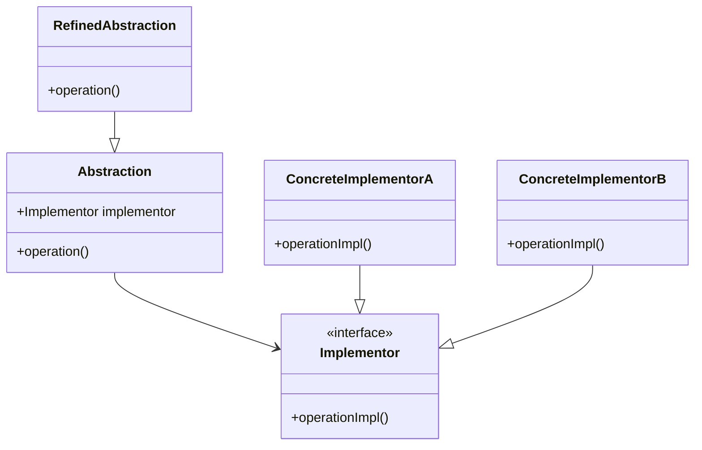
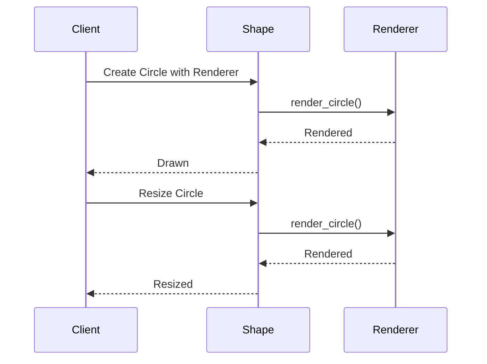

## 4.2 Bridge Pattern

### Introduction

The Bridge Pattern is a structural design pattern that aims to decouple an abstraction from its implementation, allowing the two to evolve independently. This separation is particularly useful when dealing with complex class hierarchies, where changes in one part of the hierarchy should not necessitate changes in another. By using the Bridge Pattern, we can achieve flexibility and scalability in our codebase, making it easier to extend and maintain.

### Intent of the Bridge Pattern

The primary intent of the Bridge Pattern is to separate the abstraction from its implementation, enabling both to vary independently. This pattern is particularly beneficial when:

- You want to avoid a permanent binding between an abstraction and its implementation.
- You anticipate that both the abstraction and implementation will frequently change.
- You want to share an implementation among multiple objects.

### Problem Addressed by the Bridge Pattern

In traditional object-oriented design, a class hierarchy often tightly couples abstraction and implementation. This coupling can lead to a rigid structure that is difficult to extend or modify. For example, consider a scenario where you have a `Shape` class with subclasses like `Circle` and `Square`, each having different rendering methods like `OpenGL` and `DirectX`. Without the Bridge Pattern, you might end up with a complex hierarchy like `OpenGLCircle`, `DirectXCircle`, `OpenGLSquare`, `DirectXSquare`, etc.

The Bridge Pattern addresses this issue by separating the abstraction (`Shape`) from its implementation (`Renderer`), allowing them to vary independently. This separation reduces the complexity of the class hierarchy and enhances flexibility.

### Structure of the Bridge Pattern

The Bridge Pattern involves four main components:

1. **Abstraction**: Defines the abstraction's interface and maintains a reference to an object of type `Implementor`.
2. **Refined Abstraction**: Extends the interface defined by `Abstraction`.
3. **Implementor**: Defines the interface for implementation classes.
4. **Concrete Implementor**: Implements the `Implementor` interface.

#### Diagram: Bridge Pattern Structure



### Implementing the Bridge Pattern in Python

Let's implement the Bridge Pattern in Python using the example of `Shape` and `Renderer`.

#### Step 1: Define the Implementor Interface

```python
from abc import ABC, abstractmethod

class Renderer(ABC):
    @abstractmethod
    def render_circle(self, radius):
        pass

    @abstractmethod
    def render_square(self, side):
        pass
```

#### Step 2: Create Concrete Implementors

```python
class OpenGLRenderer(Renderer):
    def render_circle(self, radius):
        print(f"OpenGL rendering circle with radius {radius}")

    def render_square(self, side):
        print(f"OpenGL rendering square with side {side}")

class DirectXRenderer(Renderer):
    def render_circle(self, radius):
        print(f"DirectX rendering circle with radius {radius}")

    def render_square(self, side):
        print(f"DirectX rendering square with side {side}")
```

#### Step 3: Define the Abstraction

```python
class Shape(ABC):
    def __init__(self, renderer):
        self.renderer = renderer

    @abstractmethod
    def draw(self):
        pass

    @abstractmethod
    def resize(self, factor):
        pass
```

#### Step 4: Create Refined Abstractions

```python
class Circle(Shape):
    def __init__(self, renderer, radius):
        super().__init__(renderer)
        self.radius = radius

    def draw(self):
        self.renderer.render_circle(self.radius)

    def resize(self, factor):
        self.radius *= factor

class Square(Shape):
    def __init__(self, renderer, side):
        super().__init__(renderer)
        self.side = side

    def draw(self):
        self.renderer.render_square(self.side)

    def resize(self, factor):
        self.side *= factor
```

#### Step 5: Use the Bridge Pattern

```python
opengl_renderer = OpenGLRenderer()

directx_renderer = DirectXRenderer()

circle = Circle(opengl_renderer, 5)
circle.draw()
circle.resize(2)
circle.draw()

square = Square(directx_renderer, 4)
square.draw()
square.resize(3)
square.draw()
```

### How the Bridge Pattern Adds Flexibility

The Bridge Pattern allows us to add new shapes or renderers without modifying existing code. For example, if we want to add a new `Triangle` shape or a new `VulkanRenderer`, we can do so without affecting the existing `Circle`, `Square`, `OpenGLRenderer`, or `DirectXRenderer` classes. This flexibility makes the Bridge Pattern an excellent choice for applications that require frequent updates or extensions.

### Comparing Bridge Pattern with Other Structural Patterns

#### Bridge vs. Adapter

- **Bridge Pattern**: Used to separate abstraction from implementation, allowing both to vary independently. It is designed upfront to enable flexibility.
- **Adapter Pattern**: Used to make two incompatible interfaces work together. It is typically used to integrate existing components.

#### Bridge vs. Decorator

- **Bridge Pattern**: Focuses on decoupling abstraction from implementation, allowing independent variation.
- **Decorator Pattern**: Adds responsibilities to objects dynamically without changing their structure. It is used to extend functionality.

### Complexity of the Bridge Pattern

While the Bridge Pattern adds flexibility, it also introduces complexity by adding an extra layer of abstraction. This complexity can make the code harder to understand and maintain, especially for developers unfamiliar with the pattern. However, the benefits of flexibility and scalability often outweigh the added complexity, particularly in large or evolving systems.

### Try It Yourself

Experiment with the Bridge Pattern by adding a new `Triangle` shape or a new `VulkanRenderer`. Observe how easily you can extend the system without modifying existing code.

### Visualizing the Bridge Pattern

Let's visualize the interaction between the `Shape` and `Renderer` components.

#### Diagram: Bridge Pattern Interaction



### Knowledge Check

- **What is the primary intent of the Bridge Pattern?**
- **How does the Bridge Pattern enhance flexibility in class hierarchies?**
- **What are the key differences between the Bridge Pattern and the Adapter Pattern?**

### Summary

In this section, we explored the Bridge Pattern, a powerful structural design pattern that decouples abstraction from implementation, allowing both to vary independently. We discussed its intent, structure, and implementation in Python, and compared it with other structural patterns like Adapter and Decorator. By understanding and applying the Bridge Pattern, we can create flexible, scalable, and maintainable software systems.

Remember, this is just the beginning. As you progress, you'll build more complex and interactive systems. Keep experimenting, stay curious, and enjoy the journey!

## Quiz Time!



### What is the primary intent of the Bridge Pattern?

- [x] To decouple an abstraction from its implementation so that the two can vary independently.
- [ ] To make two incompatible interfaces work together.
- [ ] To add responsibilities to objects dynamically.
- [ ] To provide a simplified interface to a complex subsystem.

> **Explanation:** The Bridge Pattern is designed to decouple abstraction from implementation, allowing them to vary independently.

### Which component in the Bridge Pattern defines the interface for implementation classes?

- [ ] Abstraction
- [ ] Refined Abstraction
- [x] Implementor
- [ ] Concrete Implementor

> **Explanation:** The Implementor defines the interface for implementation classes in the Bridge Pattern.

### How does the Bridge Pattern enhance flexibility in class hierarchies?

- [x] By allowing new abstractions and implementations to be added independently.
- [ ] By making incompatible interfaces work together.
- [ ] By adding responsibilities to objects dynamically.
- [ ] By providing a simplified interface to a complex subsystem.

> **Explanation:** The Bridge Pattern allows new abstractions and implementations to be added independently, enhancing flexibility.

### What is the key difference between the Bridge Pattern and the Adapter Pattern?

- [x] The Bridge Pattern is designed upfront to separate abstraction from implementation, while the Adapter Pattern is used to integrate existing components.
- [ ] The Bridge Pattern adds responsibilities to objects dynamically, while the Adapter Pattern decouples abstraction from implementation.
- [ ] The Bridge Pattern provides a simplified interface to a complex subsystem, while the Adapter Pattern is used to integrate existing components.
- [ ] The Bridge Pattern is used to integrate existing components, while the Adapter Pattern is designed upfront to separate abstraction from implementation.

> **Explanation:** The Bridge Pattern is designed upfront to separate abstraction from implementation, while the Adapter Pattern is used to integrate existing components.

### Which of the following is a benefit of using the Bridge Pattern?

- [x] It allows both abstraction and implementation to vary independently.
- [ ] It simplifies the interface to a complex subsystem.
- [ ] It adds responsibilities to objects dynamically.
- [ ] It makes two incompatible interfaces work together.

> **Explanation:** The Bridge Pattern allows both abstraction and implementation to vary independently, enhancing flexibility.

### In the Bridge Pattern, what role does the Refined Abstraction play?

- [x] It extends the interface defined by Abstraction.
- [ ] It defines the interface for implementation classes.
- [ ] It implements the interface defined by Implementor.
- [ ] It provides a simplified interface to a complex subsystem.

> **Explanation:** The Refined Abstraction extends the interface defined by Abstraction in the Bridge Pattern.

### What is a potential downside of using the Bridge Pattern?

- [x] It introduces complexity by adding an extra layer of abstraction.
- [ ] It makes two incompatible interfaces work together.
- [ ] It adds responsibilities to objects dynamically.
- [ ] It simplifies the interface to a complex subsystem.

> **Explanation:** The Bridge Pattern introduces complexity by adding an extra layer of abstraction, which can make the code harder to understand.

### How can the Bridge Pattern be extended?

- [x] By adding new shapes or renderers without modifying existing code.
- [ ] By making two incompatible interfaces work together.
- [ ] By adding responsibilities to objects dynamically.
- [ ] By providing a simplified interface to a complex subsystem.

> **Explanation:** The Bridge Pattern can be extended by adding new shapes or renderers without modifying existing code, enhancing flexibility.

### True or False: The Bridge Pattern is used to add responsibilities to objects dynamically.

- [ ] True
- [x] False

> **Explanation:** False. The Bridge Pattern is used to decouple abstraction from implementation, not to add responsibilities to objects dynamically.

### Which of the following is NOT a component of the Bridge Pattern?

- [ ] Abstraction
- [ ] Implementor
- [ ] Refined Abstraction
- [x] Adapter

> **Explanation:** Adapter is not a component of the Bridge Pattern; it is a separate design pattern.




