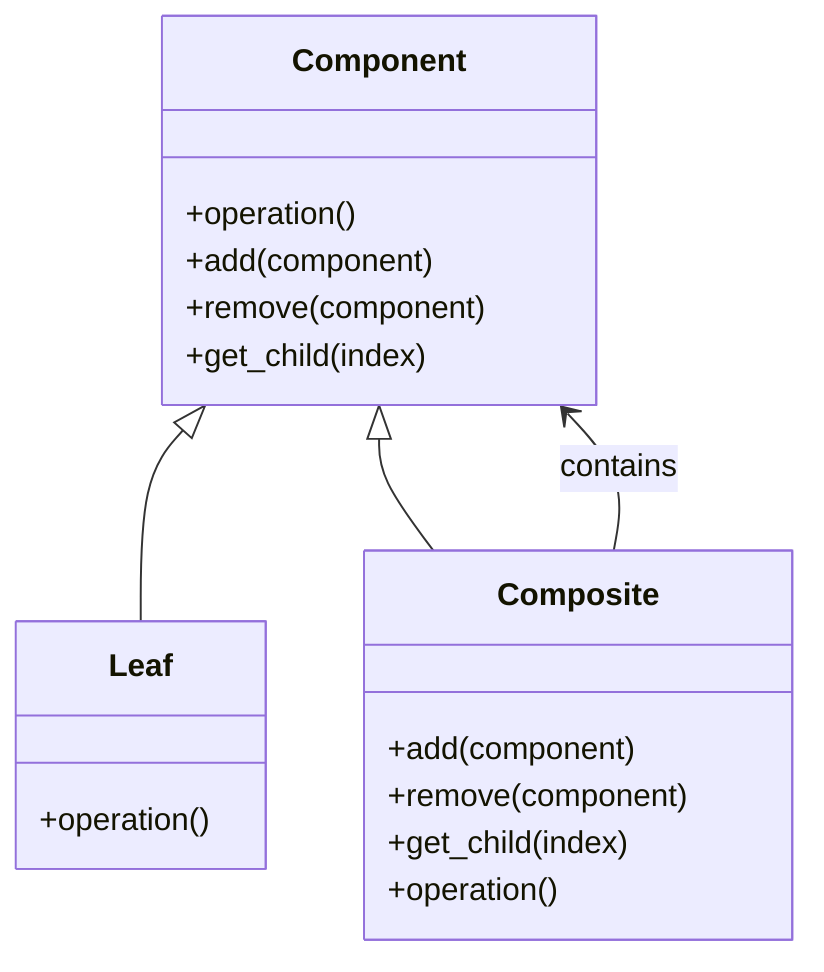

## 4.3.1 Implementing Composite in Python

The Composite Pattern is a structural design pattern that allows you to compose objects into tree structures to represent part-whole hierarchies. It enables clients to treat individual objects and compositions of objects uniformly. This pattern is particularly useful when you need to work with tree-like structures, such as file systems, organization hierarchies, or graphical user interfaces.

In this guide, we will explore how to implement the Composite Pattern in Python, providing detailed code examples and best practices. We will cover the essential components of the pattern, including the Component, Leaf, and Composite classes, and demonstrate how to add, remove, and access child components. Additionally, we will discuss the use of recursion in operations over the composite structure and highlight best practices in designing the component interface.

### Understanding the Composite Pattern

Before diving into the implementation, let's briefly discuss the core concepts of the Composite Pattern:

- **Component**: This is the base interface or abstract class for all objects in the composition. It declares the interface for objects in the composition and implements default behavior for the interface common to all classes, as appropriate.

- **Leaf**: A Leaf is a basic element of the composition that does not have any children. It implements the Component interface and defines behavior for primitive objects in the composition.

- **Composite**: A Composite is an element that has children. It implements the Component interface and defines behavior for components having children. It stores child components and implements child-related operations in the Component interface.

### Implementing the Composite Pattern in Python

Let's start by defining the Component interface. In Python, we can use an abstract base class to define this interface.

```python
from abc import ABC, abstractmethod

class Component(ABC):
    @abstractmethod
    def operation(self):
        pass

    def add(self, component):
        raise NotImplementedError("This method is not implemented.")

    def remove(self, component):
        raise NotImplementedError("This method is not implemented.")

    def get_child(self, index):
        raise NotImplementedError("This method is not implemented.")
```

In this code, we define an abstract class `Component` with an abstract method `operation`. We also provide default implementations for `add`, `remove`, and `get_child` methods, which raise `NotImplementedError`. This indicates that these methods are optional and should be implemented by subclasses if needed.

#### Implementing the Leaf Class

The Leaf class represents the end objects of a composition. A leaf can't have any children.

```python
class Leaf(Component):
    def __init__(self, name):
        self.name = name

    def operation(self):
        return f"Leaf {self.name} operation performed."
```

The `Leaf` class implements the `operation` method, which performs an operation specific to the leaf. In this example, it simply returns a string indicating the operation performed.

#### Implementing the Composite Class

The Composite class represents a complex component that may have children. It implements child-related operations.

```python
class Composite(Component):
    def __init__(self, name):
        self.name = name
        self.children = []

    def add(self, component):
        self.children.append(component)

    def remove(self, component):
        self.children.remove(component)

    def get_child(self, index):
        return self.children[index]

    def operation(self):
        results = [f"Composite {self.name} operation:"]
        for child in self.children:
            results.append(child.operation())
        return "\n".join(results)
```

In the `Composite` class, we maintain a list of children and implement the `add`, `remove`, and `get_child` methods to manage these children. The `operation` method iterates over the children and performs their operations, demonstrating the use of recursion in the Composite Pattern.

### Using the Composite Pattern

Let's see how we can use the Composite Pattern to create a tree structure and perform operations on it.

```python
def main():
    # Create leaves
    leaf1 = Leaf("A")
    leaf2 = Leaf("B")
    leaf3 = Leaf("C")

    # Create composite
    composite1 = Composite("X")
    composite1.add(leaf1)
    composite1.add(leaf2)

    # Create another composite
    composite2 = Composite("Y")
    composite2.add(leaf3)
    composite2.add(composite1)

    # Perform operations
    print("Composite structure operations:")
    print(composite2.operation())

if __name__ == "__main__":
    main()
```

In this example, we create three `Leaf` objects and two `Composite` objects. We add the leaves to the composites and then perform operations on the composite structure. The output demonstrates how the Composite Pattern allows us to treat individual objects and compositions uniformly.

### Recursion in Composite Pattern

One of the key aspects of the Composite Pattern is the use of recursion to perform operations over the composite structure. In the `Composite` class, the `operation` method calls the `operation` method on each child, allowing us to traverse the entire tree structure recursively. This is a powerful technique that simplifies the implementation of operations on complex structures.

### Best Practices for Designing the Component Interface

When designing the Component interface, consider the following best practices:

1. **Define a Clear Interface**: Ensure that the Component interface defines all the necessary methods for both Leaf and Composite classes. This includes methods for performing operations and managing children.

2. **Use Abstract Base Classes**: In Python, use abstract base classes to define the Component interface. This provides a clear contract for subclasses and ensures that they implement the required methods.

3. **Provide Default Implementations**: For methods that are optional or only relevant to certain subclasses, provide default implementations that raise `NotImplementedError`. This makes it clear which methods need to be overridden.

4. **Keep the Interface Minimal**: Avoid adding unnecessary methods to the Component interface. A minimal interface makes it easier to implement and maintain the pattern.

5. **Consider Performance**: Be mindful of the performance implications of recursion, especially for large composite structures. Optimize the implementation to minimize overhead.

### Visualizing the Composite Pattern

To better understand the structure of the Composite Pattern, let's visualize it using a class diagram.



This diagram shows the relationships between the Component, Leaf, and Composite classes. The Composite class contains references to Component objects, allowing it to manage its children.

### Try It Yourself

To deepen your understanding of the Composite Pattern, try modifying the code examples:

- **Add More Leaves and Composites**: Extend the tree structure by adding more leaves and composites. Observe how the operations are performed on the entire structure.

- **Implement Additional Operations**: Add new methods to the Component interface and implement them in the Leaf and Composite classes. For example, you could implement a method to count the number of leaves in the structure.

- **Optimize the Implementation**: Experiment with different ways to optimize the performance of the Composite Pattern, especially for large structures.

### References and Further Reading

For more information on the Composite Pattern and its applications, consider the following resources:

- [Design Patterns: Elements of Reusable Object-Oriented Software](https://en.wikipedia.org/wiki/Design_Patterns) by Erich Gamma, Richard Helm, Ralph Johnson, and John Vlissides.
- [Python Design Patterns](https://refactoring.guru/design-patterns/python) on Refactoring.Guru.
- [Composite Pattern in Python](https://sourcemaking.com/design_patterns/composite/python) on SourceMaking.

### Knowledge Check

Before we conclude, let's reinforce your understanding with a few questions:

1. What is the primary purpose of the Composite Pattern?
2. How does the Composite Pattern enable uniform treatment of individual objects and compositions?
3. What role does recursion play in the Composite Pattern?
4. Why is it important to define a clear Component interface?
5. How can you optimize the performance of the Composite Pattern for large structures?

### Embrace the Journey

Remember, mastering design patterns is a journey. As you continue to explore and implement different patterns, you'll gain deeper insights into software design and architecture. Keep experimenting, stay curious, and enjoy the process!

## Quiz Time!



### What is the primary purpose of the Composite Pattern?

- [x] To treat individual objects and compositions uniformly.
- [ ] To enhance performance in large systems.
- [ ] To simplify the user interface.
- [ ] To provide a mechanism for object serialization.

> **Explanation:** The Composite Pattern allows you to treat individual objects and compositions of objects uniformly, enabling you to work with complex tree structures seamlessly.

### Which class in the Composite Pattern represents the end objects of a composition?

- [ ] Component
- [x] Leaf
- [ ] Composite
- [ ] Node

> **Explanation:** The Leaf class represents the end objects of a composition. It implements the Component interface and defines behavior for primitive objects in the composition.

### What method is typically used to add a child component in the Composite class?

- [ ] insert()
- [x] add()
- [ ] append()
- [ ] attach()

> **Explanation:** The `add()` method is typically used in the Composite class to add a child component to the list of children.

### How does the Composite Pattern handle operations on complex structures?

- [x] Through recursion
- [ ] Through iteration
- [ ] Through parallel processing
- [ ] Through serialization

> **Explanation:** The Composite Pattern uses recursion to perform operations on complex structures, allowing you to traverse and operate on the entire tree structure.

### What is a best practice when designing the Component interface?

- [x] Define a clear and minimal interface.
- [ ] Include as many methods as possible.
- [ ] Avoid using abstract base classes.
- [ ] Implement all methods in the interface.

> **Explanation:** A best practice is to define a clear and minimal interface, ensuring that it includes only the necessary methods for both Leaf and Composite classes.

### In the Composite Pattern, which class contains references to Component objects?

- [ ] Leaf
- [x] Composite
- [ ] Component
- [ ] Node

> **Explanation:** The Composite class contains references to Component objects, allowing it to manage its children and perform operations on them.

### What is a potential performance consideration when using the Composite Pattern?

- [ ] Memory usage
- [x] Recursion overhead
- [ ] Serialization speed
- [ ] Network latency

> **Explanation:** Recursion overhead is a potential performance consideration when using the Composite Pattern, especially for large composite structures.

### Which of the following is NOT a method typically found in the Component interface?

- [ ] operation()
- [ ] add()
- [x] execute()
- [ ] remove()

> **Explanation:** The `execute()` method is not typically found in the Component interface. Common methods include `operation()`, `add()`, and `remove()`.

### What is the relationship between the Composite and Component classes?

- [x] Composite contains Component
- [ ] Component contains Composite
- [ ] They are unrelated
- [ ] They are identical

> **Explanation:** The Composite class contains references to Component objects, allowing it to manage its children and perform operations on them.

### True or False: The Composite Pattern is only applicable to graphical user interfaces.

- [ ] True
- [x] False

> **Explanation:** False. The Composite Pattern is applicable to any scenario where you need to work with tree-like structures, such as file systems, organization hierarchies, or graphical user interfaces.


