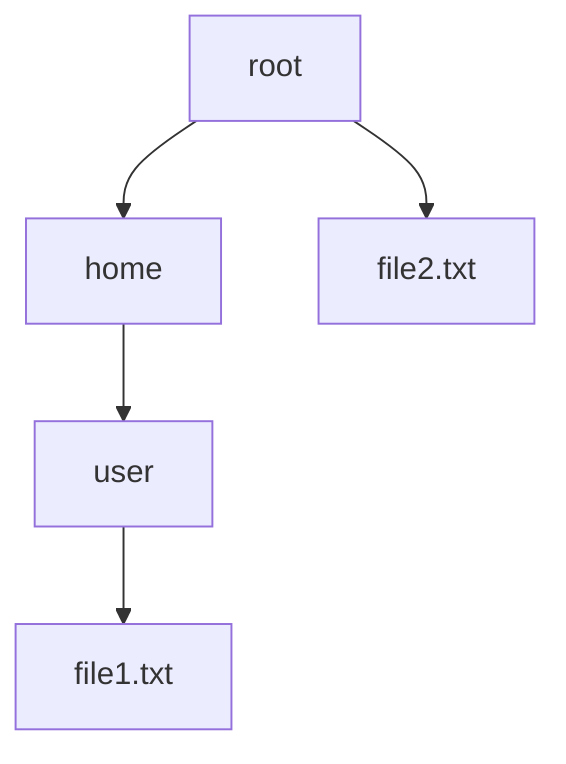

## 4.3.2 Handling Hierarchies

In the realm of software design, dealing with hierarchical data structures is a common challenge. Whether you're working with file systems, organizational charts, or UI components, the need to manage and manipulate hierarchical data efficiently is crucial. The Composite Pattern offers a robust solution to this challenge by allowing you to treat individual objects and compositions of objects uniformly. In this section, we'll delve into how the Composite Pattern simplifies handling hierarchies, provides uniform operations on components, and optimizes performance in large hierarchies.

### Understanding the Composite Pattern

The Composite Pattern is a structural design pattern that enables you to compose objects into tree structures to represent part-whole hierarchies. This pattern allows clients to treat individual objects and compositions of objects uniformly. It abstracts the complexity of tree traversal and manipulation, making it easier to work with complex hierarchical data.

#### Key Concepts of the Composite Pattern

1. **Component**: This is the base interface for all objects in the composition. It defines the common operations that can be performed on both individual objects and compositions.

2. **Leaf**: A leaf is a basic element of the composition that does not have any children. It implements the operations defined in the Component interface.

3. **Composite**: A composite is a complex element that can have children. It implements the operations defined in the Component interface and manages its children.

4. **Client**: The client interacts with the objects through the Component interface. It is unaware of whether it is dealing with a leaf or a composite.

### Implementing the Composite Pattern in Python

Let's explore how to implement the Composite Pattern in Python with a practical example. We'll create a simple file system hierarchy where files and directories are treated uniformly.

```python
from abc import ABC, abstractmethod

class FileSystemComponent(ABC):
    @abstractmethod
    def show_details(self, indent=0):
        pass

class File(FileSystemComponent):
    def __init__(self, name):
        self.name = name

    def show_details(self, indent=0):
        print(' ' * indent + self.name)

class Directory(FileSystemComponent):
    def __init__(self, name):
        self.name = name
        self.children = []

    def add(self, component):
        self.children.append(component)

    def remove(self, component):
        self.children.remove(component)

    def show_details(self, indent=0):
        print(' ' * indent + self.name)
        for child in self.children:
            child.show_details(indent + 2)

root = Directory("root")
home = Directory("home")
user = Directory("user")
file1 = File("file1.txt")
file2 = File("file2.txt")

user.add(file1)
home.add(user)
root.add(home)
root.add(file2)

root.show_details()
```

### Explanation of the Code

- **Component Interface**: The `FileSystemComponent` class is an abstract base class that defines the `show_details` method. This method is implemented by both the `File` and `Directory` classes.

- **Leaf Class**: The `File` class represents a leaf node in the hierarchy. It implements the `show_details` method to display the file's name.

- **Composite Class**: The `Directory` class represents a composite node. It can contain other `FileSystemComponent` objects, including both `File` and `Directory` objects. It implements the `add`, `remove`, and `show_details` methods to manage its children and display their details.

- **Client Code**: The client code creates a hierarchy of directories and files and calls the `show_details` method on the root directory. The method is called recursively on all children, displaying the entire hierarchy.

### Operations on Hierarchical Data

The Composite Pattern allows you to perform operations uniformly on all components of the hierarchy. Here are some common operations:

1. **Traversal**: Traverse the hierarchy to perform operations on each component. This is useful for tasks like searching, updating, or displaying components.

2. **Aggregation**: Aggregate data from multiple components. For example, calculate the total size of files in a directory.

3. **Modification**: Modify components in the hierarchy. This could involve adding, removing, or updating components.

4. **Filtering**: Filter components based on certain criteria. For example, find all files with a specific extension.

### Optimizing Performance in Large Hierarchies

When dealing with large hierarchies, performance optimization becomes crucial. Here are some techniques to optimize performance:

1. **Lazy Loading**: Load components only when needed. This reduces memory usage and improves performance.

2. **Caching**: Cache results of expensive operations to avoid redundant calculations.

3. **Batch Processing**: Process multiple components in a single operation to reduce overhead.

4. **Parallel Processing**: Use parallel processing to perform operations on multiple components simultaneously.

### Trade-offs: Transparency vs. Safety

The Composite Pattern offers a trade-off between transparency and safety. Transparency refers to the ability to treat all components uniformly, while safety refers to the ability to enforce constraints on the hierarchy.

- **Transparency**: The Composite Pattern provides transparency by allowing clients to treat individual objects and compositions uniformly. This simplifies client code and makes it easier to work with complex hierarchies.

- **Safety**: The Composite Pattern may sacrifice safety by allowing invalid operations on components. For example, adding a child to a leaf node is invalid, but the pattern does not enforce this constraint.

To balance transparency and safety, you can implement additional checks in the Composite class to enforce constraints. For example, you can raise an exception if a client attempts to add a child to a leaf node.

### Visualizing Hierarchical Structures

To better understand hierarchical structures, let's visualize the file system hierarchy we created earlier using a tree diagram.



This diagram illustrates the hierarchical structure of the file system, with directories and files represented as nodes.

### Try It Yourself

To deepen your understanding of the Composite Pattern, try modifying the code example to add new features:

1. **Add a new method** to calculate the total size of all files in a directory.

2. **Implement a search feature** to find files by name or extension.

3. **Enhance the visualization** by adding more directories and files to the hierarchy.

### Knowledge Check

Before moving on, let's review some key concepts:

- **What is the Composite Pattern** and how does it simplify handling hierarchies?
- **How can you perform operations** uniformly on all components of a hierarchy?
- **What techniques can you use** to optimize performance in large hierarchies?
- **What are the trade-offs** between transparency and safety in the Composite Pattern?

### Conclusion

The Composite Pattern is a powerful tool for handling hierarchical data structures in Python. By abstracting the complexity of tree traversal and manipulation, it simplifies client code and enables uniform operations on components. While there are trade-offs between transparency and safety, the pattern provides a flexible framework for managing complex hierarchies. As you continue to explore design patterns, remember that the Composite Pattern is just one of many tools available to help you build scalable and maintainable software.

## Quiz Time!



### What is the primary benefit of using the Composite Pattern?

- [x] It allows clients to treat individual objects and compositions uniformly.
- [ ] It enforces strict type checking at compile time.
- [ ] It simplifies the implementation of singleton objects.
- [ ] It provides a mechanism for object serialization.

> **Explanation:** The Composite Pattern allows clients to treat individual objects and compositions uniformly, simplifying the handling of hierarchical data structures.

### Which of the following is a key component of the Composite Pattern?

- [x] Leaf
- [ ] Singleton
- [ ] Proxy
- [ ] Adapter

> **Explanation:** The Leaf is a key component of the Composite Pattern, representing basic elements in the hierarchy.

### What is a common operation that can be performed on all components in a hierarchy?

- [x] Traversal
- [ ] Serialization
- [ ] Compilation
- [ ] Encryption

> **Explanation:** Traversal is a common operation that can be performed on all components in a hierarchy, allowing you to visit each component.

### How can performance be optimized in large hierarchies?

- [x] Lazy Loading
- [ ] Hard Coding
- [ ] Manual Memory Management
- [ ] Direct File Access

> **Explanation:** Lazy Loading optimizes performance by loading components only when needed, reducing memory usage.

### What is the trade-off between transparency and safety in the Composite Pattern?

- [x] Transparency allows uniform treatment, but may sacrifice safety by allowing invalid operations.
- [ ] Safety ensures type checking, but sacrifices transparency by complicating client code.
- [ ] Transparency enforces strict constraints, but safety allows flexibility.
- [ ] Safety provides error handling, but transparency reduces code readability.

> **Explanation:** The trade-off involves transparency allowing uniform treatment of components, while potentially sacrificing safety by not enforcing constraints.

### In the Composite Pattern, what does the Composite class represent?

- [x] A complex element that can have children.
- [ ] A basic element without children.
- [ ] A singleton instance.
- [ ] An interface for object serialization.

> **Explanation:** The Composite class represents a complex element that can have children, managing its components.

### What is a technique for optimizing performance in large hierarchies?

- [x] Caching
- [ ] Hard Coding
- [ ] Direct Memory Access
- [ ] Manual Thread Management

> **Explanation:** Caching optimizes performance by storing results of expensive operations, avoiding redundant calculations.

### How does the Composite Pattern handle tree traversal?

- [x] It abstracts the complexity, allowing uniform operations on components.
- [ ] It requires manual traversal by the client.
- [ ] It enforces a strict traversal order.
- [ ] It serializes the tree for traversal.

> **Explanation:** The Composite Pattern abstracts the complexity of tree traversal, allowing uniform operations on components.

### What is the role of the Client in the Composite Pattern?

- [x] It interacts with objects through the Component interface.
- [ ] It manages the lifecycle of singleton objects.
- [ ] It provides a mechanism for object serialization.
- [ ] It enforces type checking at compile time.

> **Explanation:** The Client interacts with objects through the Component interface, treating individual objects and compositions uniformly.

### True or False: The Composite Pattern can only be used for file system hierarchies.

- [ ] True
- [x] False

> **Explanation:** False. The Composite Pattern can be used for various hierarchical data structures, not just file system hierarchies.


