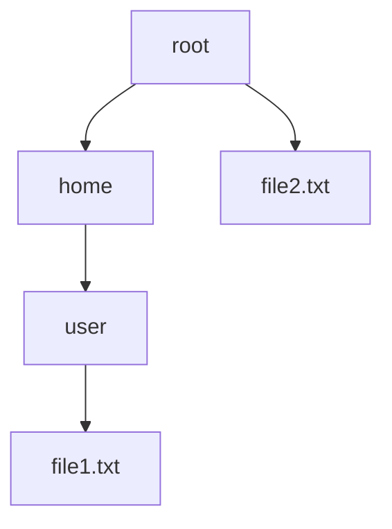
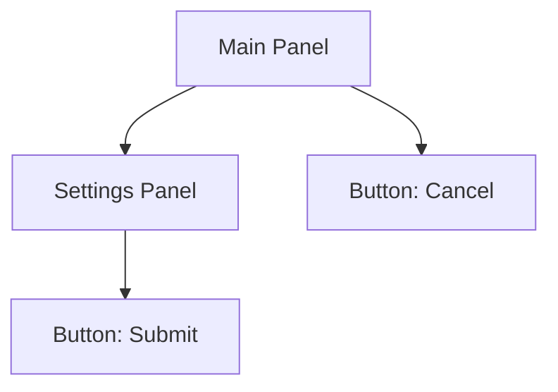
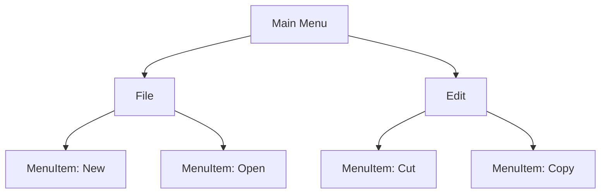
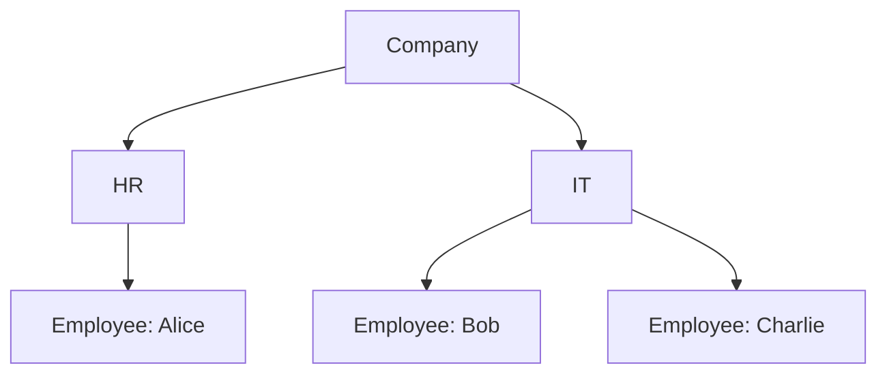

## 4.3.3 Use Cases and Examples

The Composite Pattern is a structural design pattern that allows you to compose objects into tree structures to represent part-whole hierarchies. This pattern treats individual objects and compositions of objects uniformly, simplifying client interactions with complex structures. In this section, we will explore various use cases and examples of the Composite Pattern in Python, including file systems, UI components, menu systems, and organizational charts. We will also encourage you to identify composite structures in your own applications.

### Understanding the Composite Pattern

Before diving into the examples, let's briefly recap the Composite Pattern's core concepts:

- **Component**: An interface or abstract class for all objects in the composition, both composite and leaf nodes.
- **Leaf**: Represents leaf objects in the composition. A leaf has no children.
- **Composite**: Represents a composite node that can have children. It implements child-related operations.

The Composite Pattern is particularly useful when you need to work with tree structures or hierarchies, where you want to treat individual objects and compositions of objects uniformly.

### Use Case 1: File System Hierarchy

One of the most common examples of the Composite Pattern is a file system hierarchy, where directories can contain files or other directories. Let's implement a simple file system hierarchy using the Composite Pattern in Python.

```python
from abc import ABC, abstractmethod

class FileSystemComponent(ABC):
    @abstractmethod
    def display(self, indent=0):
        pass

class File(FileSystemComponent):
    def __init__(self, name):
        self.name = name

    def display(self, indent=0):
        print(' ' * indent + self.name)

class Directory(FileSystemComponent):
    def __init__(self, name):
        self.name = name
        self.children = []

    def add(self, component):
        self.children.append(component)

    def remove(self, component):
        self.children.remove(component)

    def display(self, indent=0):
        print(' ' * indent + self.name)
        for child in self.children:
            child.display(indent + 2)

root = Directory("root")
home = Directory("home")
user = Directory("user")
file1 = File("file1.txt")
file2 = File("file2.txt")

user.add(file1)
home.add(user)
root.add(home)
root.add(file2)

root.display()
```

In this example, we define a `FileSystemComponent` interface with a `display` method. The `File` class represents a leaf node, while the `Directory` class represents a composite node that can contain other `FileSystemComponent` objects. The `display` method is used to print the structure of the file system hierarchy.

#### Visualizing the File System Hierarchy

Let's visualize the file system hierarchy using a tree diagram:



This diagram represents the hierarchy of directories and files, where `root` contains `home` and `file2.txt`, and `home` contains `user`, which in turn contains `file1.txt`.

### Use Case 2: UI Components

Another common use case for the Composite Pattern is in graphical user interfaces (GUIs), where you can have complex components composed of simpler components. Let's implement a simple UI component hierarchy using the Composite Pattern in Python.

```python
class UIComponent(ABC):
    @abstractmethod
    def render(self, indent=0):
        pass

class Button(UIComponent):
    def __init__(self, name):
        self.name = name

    def render(self, indent=0):
        print(' ' * indent + f"Button: {self.name}")

class Panel(UIComponent):
    def __init__(self, name):
        self.name = name
        self.children = []

    def add(self, component):
        self.children.append(component)

    def remove(self, component):
        self.children.remove(component)

    def render(self, indent=0):
        print(' ' * indent + f"Panel: {self.name}")
        for child in self.children:
            child.render(indent + 2)

main_panel = Panel("Main Panel")
settings_panel = Panel("Settings Panel")
button1 = Button("Submit")
button2 = Button("Cancel")

settings_panel.add(button1)
main_panel.add(settings_panel)
main_panel.add(button2)

main_panel.render()
```

In this example, we define a `UIComponent` interface with a `render` method. The `Button` class represents a leaf node, while the `Panel` class represents a composite node that can contain other `UIComponent` objects. The `render` method is used to print the structure of the UI component hierarchy.

#### Visualizing the UI Component Hierarchy

Let's visualize the UI component hierarchy using a tree diagram:



This diagram represents the hierarchy of UI components, where `Main Panel` contains `Settings Panel` and `Button: Cancel`, and `Settings Panel` contains `Button: Submit`.

### Use Case 3: Menu Systems

Menu systems are another excellent example of the Composite Pattern, where menus can contain menu items or other menus. Let's implement a simple menu system using the Composite Pattern in Python.

```python
class MenuComponent(ABC):
    @abstractmethod
    def display(self, indent=0):
        pass

class MenuItem(MenuComponent):
    def __init__(self, name):
        self.name = name

    def display(self, indent=0):
        print(' ' * indent + f"MenuItem: {self.name}")

class Menu(MenuComponent):
    def __init__(self, name):
        self.name = name
        self.children = []

    def add(self, component):
        self.children.append(component)

    def remove(self, component):
        self.children.remove(component)

    def display(self, indent=0):
        print(' ' * indent + f"Menu: {self.name}")
        for child in self.children:
            child.display(indent + 2)

main_menu = Menu("Main Menu")
file_menu = Menu("File")
edit_menu = Menu("Edit")
new_item = MenuItem("New")
open_item = MenuItem("Open")
cut_item = MenuItem("Cut")
copy_item = MenuItem("Copy")

file_menu.add(new_item)
file_menu.add(open_item)
edit_menu.add(cut_item)
edit_menu.add(copy_item)
main_menu.add(file_menu)
main_menu.add(edit_menu)

main_menu.display()
```

In this example, we define a `MenuComponent` interface with a `display` method. The `MenuItem` class represents a leaf node, while the `Menu` class represents a composite node that can contain other `MenuComponent` objects. The `display` method is used to print the structure of the menu system.

#### Visualizing the Menu System

Let's visualize the menu system using a tree diagram:



This diagram represents the hierarchy of menus and menu items, where `Main Menu` contains `File` and `Edit`, `File` contains `New` and `Open`, and `Edit` contains `Cut` and `Copy`.

### Use Case 4: Organizational Charts

Organizational charts are another practical application of the Composite Pattern, where organizations can have departments, teams, and employees. Let's implement a simple organizational chart using the Composite Pattern in Python.

```python
class OrganizationComponent(ABC):
    @abstractmethod
    def show(self, indent=0):
        pass

class Employee(OrganizationComponent):
    def __init__(self, name):
        self.name = name

    def show(self, indent=0):
        print(' ' * indent + f"Employee: {self.name}")

class Department(OrganizationComponent):
    def __init__(self, name):
        self.name = name
        self.members = []

    def add(self, component):
        self.members.append(component)

    def remove(self, component):
        self.members.remove(component)

    def show(self, indent=0):
        print(' ' * indent + f"Department: {self.name}")
        for member in self.members:
            member.show(indent + 2)

company = Department("Company")
hr_department = Department("HR")
it_department = Department("IT")
alice = Employee("Alice")
bob = Employee("Bob")
charlie = Employee("Charlie")

hr_department.add(alice)
it_department.add(bob)
it_department.add(charlie)
company.add(hr_department)
company.add(it_department)

company.show()
```

In this example, we define an `OrganizationComponent` interface with a `show` method. The `Employee` class represents a leaf node, while the `Department` class represents a composite node that can contain other `OrganizationComponent` objects. The `show` method is used to print the structure of the organizational chart.

#### Visualizing the Organizational Chart

Let's visualize the organizational chart using a tree diagram:



This diagram represents the hierarchy of departments and employees, where `Company` contains `HR` and `IT`, `HR` contains `Alice`, and `IT` contains `Bob` and `Charlie`.

### Identifying Composite Structures in Your Applications

Now that we've explored several examples of the Composite Pattern, let's discuss how you can identify composite structures in your own applications. Look for scenarios where you have hierarchies or tree structures, such as:

- **Document Structures**: Documents with sections, subsections, and paragraphs.
- **Graphics and Shapes**: Complex graphics composed of simpler shapes.
- **Project Management**: Projects with tasks, sub-tasks, and milestones.

By recognizing these structures, you can apply the Composite Pattern to simplify your code and improve maintainability.

### Try It Yourself

To deepen your understanding of the Composite Pattern, try modifying the examples provided:

- **Add New Components**: Extend the examples by adding new types of components, such as `Image` in the UI components example.
- **Implement Additional Methods**: Implement additional methods for the components, such as `remove` in the file system example.
- **Create Your Own Example**: Identify a composite structure in your own application and implement it using the Composite Pattern.

### Key Takeaways

- The Composite Pattern allows you to treat individual objects and compositions of objects uniformly, simplifying client interactions with complex structures.
- It is particularly useful for representing tree structures or hierarchies, such as file systems, UI components, menu systems, and organizational charts.
- By identifying composite structures in your applications, you can apply the Composite Pattern to improve code maintainability and readability.

### References and Further Reading

- [Design Patterns: Elements of Reusable Object-Oriented Software](https://en.wikipedia.org/wiki/Design_Patterns) by Erich Gamma, Richard Helm, Ralph Johnson, and John Vlissides
- [Python Design Patterns](https://python-patterns.guide/) - A comprehensive guide to design patterns in Python
- [Real Python: Design Patterns in Python](https://realpython.com/tutorials/design-patterns/) - Tutorials and articles on design patterns in Python

## Quiz Time!



### What is the main purpose of the Composite Pattern?

- [x] To treat individual objects and compositions of objects uniformly
- [ ] To separate the interface from the implementation
- [ ] To provide a simplified interface to a complex subsystem
- [ ] To encapsulate a request as an object

> **Explanation:** The Composite Pattern allows you to treat individual objects and compositions of objects uniformly, which simplifies client interactions with complex structures.

### Which of the following is a typical use case for the Composite Pattern?

- [x] File system hierarchy
- [ ] Singleton pattern implementation
- [ ] Factory method pattern
- [ ] Observer pattern

> **Explanation:** The Composite Pattern is commonly used in file system hierarchies, where directories can contain files or other directories.

### In the Composite Pattern, what does a "Leaf" represent?

- [x] A leaf represents a single object with no children
- [ ] A leaf represents a composite object with children
- [ ] A leaf represents the root of the hierarchy
- [ ] A leaf represents the interface for all objects

> **Explanation:** In the Composite Pattern, a leaf represents a single object with no children, such as a file in a file system.

### How does the Composite Pattern simplify client interactions with complex structures?

- [x] By allowing clients to treat individual objects and compositions uniformly
- [ ] By providing a single point of access to a subsystem
- [ ] By encapsulating object creation
- [ ] By defining a family of algorithms

> **Explanation:** The Composite Pattern simplifies client interactions by allowing clients to treat individual objects and compositions uniformly, making it easier to work with complex structures.

### Which method is commonly used in the Composite Pattern to display the structure of a hierarchy?

- [x] display()
- [ ] render()
- [ ] show()
- [ ] execute()

> **Explanation:** The `display()` method is commonly used in the Composite Pattern to display the structure of a hierarchy, such as a file system or menu system.

### What is the role of a "Composite" in the Composite Pattern?

- [x] A composite represents a node that can have children
- [ ] A composite represents a single object with no children
- [ ] A composite represents the root of the hierarchy
- [ ] A composite represents the interface for all objects

> **Explanation:** In the Composite Pattern, a composite represents a node that can have children, such as a directory in a file system.

### Which of the following is NOT a component of the Composite Pattern?

- [ ] Component
- [ ] Leaf
- [ ] Composite
- [x] Adapter

> **Explanation:** The Adapter is not a component of the Composite Pattern. The main components are Component, Leaf, and Composite.

### How can you identify composite structures in your own applications?

- [x] Look for scenarios with hierarchies or tree structures
- [ ] Look for scenarios with single objects
- [ ] Look for scenarios with unrelated objects
- [ ] Look for scenarios with simple data structures

> **Explanation:** To identify composite structures, look for scenarios with hierarchies or tree structures, such as document structures or organizational charts.

### What is a benefit of using the Composite Pattern in UI components?

- [x] It allows complex components to be composed of simpler components
- [ ] It provides a single point of access to the UI
- [ ] It encapsulates UI creation
- [ ] It defines a family of UI algorithms

> **Explanation:** The Composite Pattern allows complex UI components to be composed of simpler components, making it easier to manage and render the UI hierarchy.

### True or False: The Composite Pattern can be used to represent organizational charts.

- [x] True
- [ ] False

> **Explanation:** True. The Composite Pattern is well-suited for representing organizational charts, where organizations can have departments, teams, and employees.



Remember, this is just the beginning. As you progress, you'll build more complex and interactive applications using the Composite Pattern. Keep experimenting, stay curious, and enjoy the journey!
