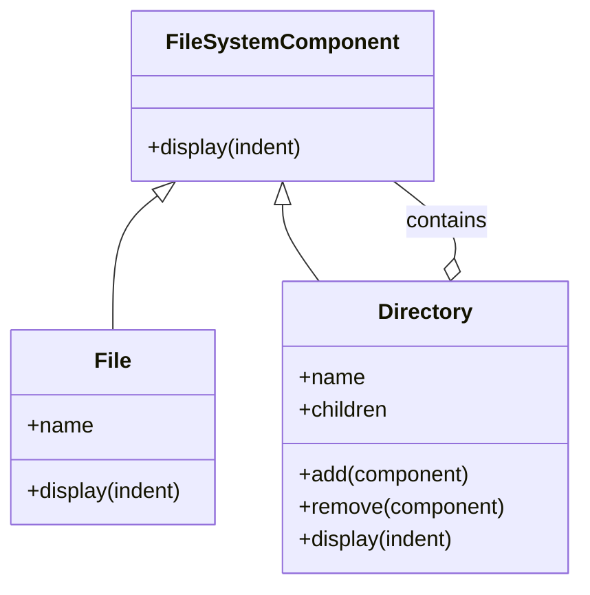

## 4.3 Composite Pattern

The Composite Pattern is a structural design pattern that enables you to compose objects into tree structures to represent part-whole hierarchies. This pattern allows clients to treat individual objects and compositions of objects uniformly, making it easier to work with complex structures. In this section, we'll delve into the Composite Pattern, its purpose, and how to implement it in Python. We'll also explore its benefits and potential challenges.

### Understanding the Composite Pattern

#### Real-World Analogy: The File System

To understand the Composite Pattern, let's consider a real-world analogy: a file system. A file system is a hierarchical structure composed of files and directories. Directories can contain both files and other directories, forming a tree-like structure. In this analogy:

- **Files** are the leaf nodes of the tree. They cannot contain other objects.
- **Directories** are composite nodes. They can contain both files and other directories.

The Composite Pattern allows us to treat both files and directories uniformly. For example, you can perform operations like opening, closing, or renaming on both files and directories without worrying about their specific types.

#### Purpose of the Composite Pattern

The primary purpose of the Composite Pattern is to allow clients to treat individual objects and compositions of objects uniformly. This uniformity simplifies the client code, as it doesn't need to distinguish between simple and complex elements of the hierarchy.

### Implementing the Composite Pattern in Python

In Python, implementing the Composite Pattern involves creating a common interface for both leaf and composite objects. Let's break down the implementation into several steps:

#### Step 1: Define the Component Interface

The component interface declares common operations for both simple and complex objects. In our file system analogy, this interface might include operations like `add`, `remove`, and `display`.

```python
from abc import ABC, abstractmethod

class FileSystemComponent(ABC):
    @abstractmethod
    def display(self, indent=0):
        pass
```

#### Step 2: Implement Leaf Classes

Leaf classes represent the end objects of a composition. A leaf can't have any children. In our analogy, a `File` class would be a leaf.

```python
class File(FileSystemComponent):
    def __init__(self, name):
        self.name = name

    def display(self, indent=0):
        print(' ' * indent + self.name)
```

#### Step 3: Implement Composite Classes

Composite classes represent complex components that may have children. A composite object can add or remove other components (both leaf and composite). In our analogy, a `Directory` class would be a composite.

```python
class Directory(FileSystemComponent):
    def __init__(self, name):
        self.name = name
        self.children = []

    def add(self, component):
        self.children.append(component)

    def remove(self, component):
        self.children.remove(component)

    def display(self, indent=0):
        print(' ' * indent + self.name)
        for child in self.children:
            child.display(indent + 2)
```

#### Step 4: Construct and Traverse the Composite Structure

With the component, leaf, and composite classes in place, we can now construct and traverse a composite structure.

```python
file1 = File("file1.txt")
file2 = File("file2.txt")
file3 = File("file3.txt")

dir1 = Directory("dir1")
dir2 = Directory("dir2")

dir1.add(file1)
dir1.add(file2)
dir2.add(file3)
dir1.add(dir2)

dir1.display()
```

### Benefits of the Composite Pattern

#### Flexibility

The Composite Pattern provides flexibility by allowing you to build complex tree structures from simple components. You can easily add new types of components by extending the component interface.

#### Transparency

The pattern promotes transparency by allowing clients to treat individual objects and compositions uniformly. This uniformity simplifies the client code and reduces the need for type-checking logic.

### Potential Issues and Considerations

#### Managing Parent References

In some cases, you might need to manage parent references to navigate the tree structure. This can complicate the implementation and increase the risk of circular references.

#### Leaf-Specific Operations

Leaf-specific operations can be challenging to implement in a uniform interface. You might need to use type-checking or double-dispatch techniques to handle these operations.

### Visualizing the Composite Pattern

To better understand the Composite Pattern, let's visualize the file system analogy using a class diagram.



In this diagram, `FileSystemComponent` is the common interface for both `File` and `Directory`. The `Directory` class can contain multiple `FileSystemComponent` objects, representing both files and directories.

### Try It Yourself

Now that we've covered the basics of the Composite Pattern, try experimenting with the code examples. Here are a few ideas:

- Add a new `Shortcut` class that represents a shortcut to a file or directory.
- Implement a method to count the total number of files in a directory.
- Modify the `display` method to show the size of each file and directory.

### References and Further Reading

- [Design Patterns: Elements of Reusable Object-Oriented Software](https://en.wikipedia.org/wiki/Design_Patterns) - The classic book by Erich Gamma, Richard Helm, Ralph Johnson, and John Vlissides.
- [Python Design Patterns](https://python-patterns.guide/) - A comprehensive guide to design patterns in Python.

### Knowledge Check

Before we wrap up, let's reinforce what we've learned with a few questions:

- What is the primary purpose of the Composite Pattern?
- How does the Composite Pattern simplify client code?
- What are the main components of the Composite Pattern?
- How can you manage parent references in a composite structure?
- What are some potential challenges when implementing the Composite Pattern?

### Embrace the Journey

Remember, mastering design patterns is an ongoing journey. As you continue to explore and apply these patterns, you'll gain a deeper understanding of how to build flexible and maintainable software systems. Keep experimenting, stay curious, and enjoy the journey!

## Quiz Time!



### What is the primary purpose of the Composite Pattern?

- [x] To allow clients to treat individual objects and compositions uniformly
- [ ] To optimize memory usage in large applications
- [ ] To enhance the performance of complex algorithms
- [ ] To simplify the user interface design

> **Explanation:** The Composite Pattern allows clients to treat individual objects and compositions of objects uniformly, simplifying client code.

### In the Composite Pattern, what role does the `FileSystemComponent` class play?

- [x] It serves as the common interface for both leaf and composite objects
- [ ] It is responsible for managing the parent-child relationships
- [ ] It provides specific implementations for leaf operations
- [ ] It handles the rendering of the user interface

> **Explanation:** `FileSystemComponent` is the common interface that declares operations for both simple and complex objects in the Composite Pattern.

### Which of the following is a benefit of using the Composite Pattern?

- [x] Flexibility in building complex tree structures
- [ ] Improved memory efficiency
- [ ] Faster execution of algorithms
- [ ] Simplified database management

> **Explanation:** The Composite Pattern provides flexibility by allowing the construction of complex tree structures from simple components.

### What is a potential challenge when implementing the Composite Pattern?

- [x] Managing parent references
- [ ] Ensuring data consistency
- [ ] Optimizing network communication
- [ ] Securing user authentication

> **Explanation:** Managing parent references can be challenging in a composite structure, as it may lead to circular references.

### How does the Composite Pattern promote transparency?

- [x] By allowing clients to treat individual objects and compositions uniformly
- [ ] By reducing the number of classes in the system
- [ ] By optimizing the performance of complex algorithms
- [ ] By simplifying the user interface design

> **Explanation:** The Composite Pattern promotes transparency by allowing clients to treat individual objects and compositions uniformly, simplifying client code.

### In the file system analogy, what role does a `File` class play?

- [x] It represents a leaf node in the composite structure
- [ ] It acts as a composite node that can contain other files
- [ ] It manages the entire file system hierarchy
- [ ] It provides a user interface for file operations

> **Explanation:** In the file system analogy, a `File` class represents a leaf node that cannot contain other objects.

### What is a potential solution for handling leaf-specific operations in the Composite Pattern?

- [x] Using type-checking or double-dispatch techniques
- [ ] Implementing a separate interface for each leaf class
- [ ] Creating a global registry of leaf operations
- [ ] Storing leaf operations in a database

> **Explanation:** Leaf-specific operations can be handled using type-checking or double-dispatch techniques to differentiate between leaf and composite objects.

### How can you extend the Composite Pattern to include new types of components?

- [x] By extending the component interface
- [ ] By modifying the existing composite class
- [ ] By creating a new global registry
- [ ] By altering the client code

> **Explanation:** New types of components can be added by extending the component interface, allowing for greater flexibility.

### In the Composite Pattern, what is a `Directory` class typically responsible for?

- [x] Managing child components and performing operations on them
- [ ] Rendering the user interface for file operations
- [ ] Optimizing memory usage in the system
- [ ] Securing access to the file system

> **Explanation:** A `Directory` class in the Composite Pattern is responsible for managing child components and performing operations on them.

### True or False: The Composite Pattern is only useful for file system implementations.

- [ ] True
- [x] False

> **Explanation:** False. The Composite Pattern is applicable to any scenario where you need to represent part-whole hierarchies, not just file systems.




