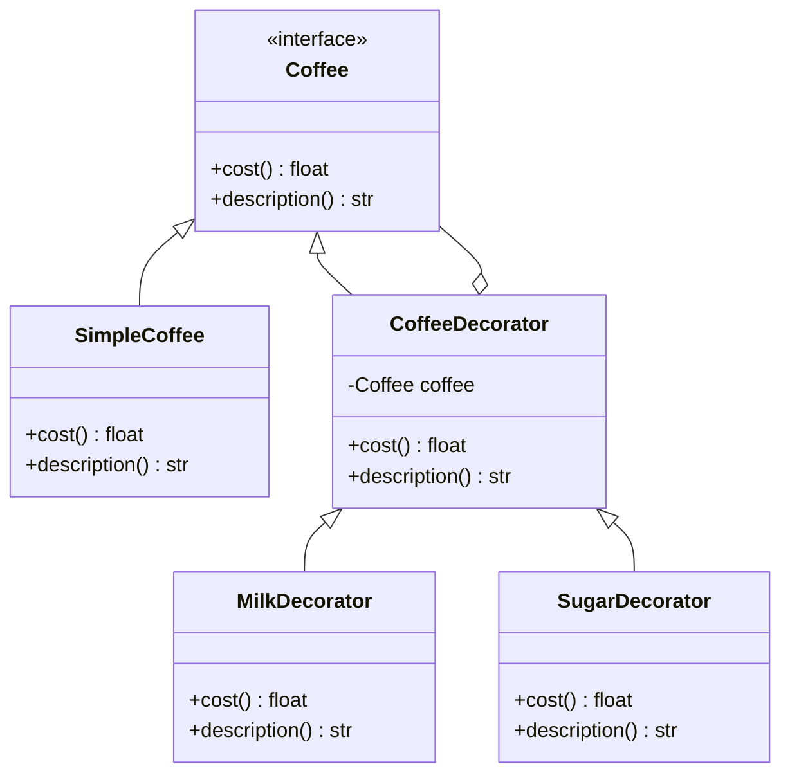

## 4.4.1 Implementing Decorator in Python

The Decorator Pattern is a structural design pattern that allows behavior to be added to individual objects, either statically or dynamically, without affecting the behavior of other objects from the same class. In Python, decorators are a powerful tool that can be used to modify the behavior of functions or classes. This guide will walk you through implementing the Decorator Pattern in Python, providing you with a step-by-step approach, complete with code examples and best practices.

### Understanding the Decorator Pattern

The Decorator Pattern is used to extend the functionality of objects by wrapping them in a series of decorator classes. Each decorator class adds its own behavior to the object it wraps. This pattern is particularly useful when you want to add responsibilities to objects without modifying their code.

**Key Concepts:**

- **Component Interface**: Defines the interface for objects that can have responsibilities added to them dynamically.
- **Concrete Component**: The original object to which additional responsibilities can be attached.
- **Decorator**: Maintains a reference to a component object and defines an interface that conforms to the component's interface.
- **Concrete Decorator**: Adds responsibilities to the component.

### Step-by-Step Guide to Implementing the Decorator Pattern in Python

#### Step 1: Define a Base Component Interface or Abstract Class

Start by defining an interface or an abstract class that will be used by both the concrete components and the decorators.

```python
from abc import ABC, abstractmethod

class Coffee(ABC):
    @abstractmethod
    def cost(self) -> float:
        pass

    @abstractmethod
    def description(self) -> str:
        pass
```

#### Step 2: Create Concrete Components with Core Functionality

Next, implement the concrete component that will be decorated. This class should implement the component interface.

```python
class SimpleCoffee(Coffee):
    def cost(self) -> float:
        return 2.0

    def description(self) -> str:
        return "Simple Coffee"
```

#### Step 3: Create Decorator Classes that Wrap the Component

Now, create a base decorator class that implements the component interface and holds a reference to a component object.

```python
class CoffeeDecorator(Coffee):
    def __init__(self, coffee: Coffee):
        self._coffee = coffee

    def cost(self) -> float:
        return self._coffee.cost()

    def description(self) -> str:
        return self._coffee.description()
```

#### Step 4: Implement Concrete Decorators

Implement concrete decorators that extend the functionality of the component.

```python
class MilkDecorator(CoffeeDecorator):
    def cost(self) -> float:
        return self._coffee.cost() + 0.5

    def description(self) -> str:
        return self._coffee.description() + ", Milk"

class SugarDecorator(CoffeeDecorator):
    def cost(self) -> float:
        return self._coffee.cost() + 0.2

    def description(self) -> str:
        return self._coffee.description() + ", Sugar"
```

#### Step 5: Demonstrate Adding Multiple Decorators

Decorators can be stacked to add multiple behaviors to a single component.

```python
coffee = SimpleCoffee()
print(f"{coffee.description()}: ${coffee.cost()}")

coffee_with_milk = MilkDecorator(coffee)
print(f"{coffee_with_milk.description()}: ${coffee_with_milk.cost()}")

coffee_with_milk_and_sugar = SugarDecorator(coffee_with_milk)
print(f"{coffee_with_milk_and_sugar.description()}: ${coffee_with_milk_and_sugar.cost()}")
```

**Output:**

```
Simple Coffee: $2.0
Simple Coffee, Milk: $2.5
Simple Coffee, Milk, Sugar: $2.7
```

#### Step 6: Explain How to Unwrap Decorators

In some cases, you may need to access the original component from a decorated object. This can be done by traversing the decorator chain.

```python
def unwrap_decorator(coffee: Coffee) -> Coffee:
    while isinstance(coffee, CoffeeDecorator):
        coffee = coffee._coffee
    return coffee

original_coffee = unwrap_decorator(coffee_with_milk_and_sugar)
print(f"Original: {original_coffee.description()}: ${original_coffee.cost()}")
```

### Best Practices for Implementing Decorators

1. **Keep Decorators Lightweight**: Ensure that decorators add minimal overhead to the component's operations.
2. **Use Decorators Judiciously**: Avoid overusing decorators, as they can make the codebase complex and difficult to understand.
3. **Maintain Consistent Interfaces**: Ensure that decorators maintain the interface of the component they are decorating.
4. **Document Decorator Chains**: Clearly document the order and purpose of decorators when stacking multiple decorators.

### Common Pitfalls and How to Avoid Them

- **Circular References**: Avoid creating circular references between decorators and components, as this can lead to memory leaks.
- **Over-Decorating**: Be cautious not to over-decorate components, which can lead to performance issues and increased complexity.
- **Breaking Encapsulation**: Ensure that decorators do not expose or modify the internal state of the components they wrap.

### Try It Yourself

Experiment with the provided code examples by adding new decorators or modifying existing ones. For instance, try creating a `WhippedCreamDecorator` that adds whipped cream to the coffee. Consider how you might implement a decorator that applies a discount to the coffee's cost.

### Visualizing the Decorator Pattern

Below is a class diagram illustrating the relationships between the component, concrete component, decorator, and concrete decorators.



### References and Further Reading

- [Python's Decorator Library](https://docs.python.org/3/library/functools.html#module-functools)
- [Design Patterns: Elements of Reusable Object-Oriented Software](https://en.wikipedia.org/wiki/Design_Patterns) by Erich Gamma et al.
- [Python Decorators: A Complete Guide](https://realpython.com/primer-on-python-decorators/)

### Knowledge Check

- What is the primary purpose of the Decorator Pattern?
- How can you ensure that decorators maintain the interface of the component they wrap?
- What are some common pitfalls when using decorators, and how can they be avoided?

### Embrace the Journey

Remember, mastering design patterns like the Decorator Pattern is a journey. As you continue to explore and apply these patterns, you'll find new ways to enhance the flexibility and maintainability of your code. Keep experimenting, stay curious, and enjoy the process!

## Quiz Time!



### What is the primary purpose of the Decorator Pattern?

- [x] To add behavior to individual objects dynamically
- [ ] To inherit behavior from a superclass
- [ ] To encapsulate a group of individual factories
- [ ] To provide a simplified interface to a complex subsystem

> **Explanation:** The Decorator Pattern allows for the dynamic addition of behavior to individual objects without affecting other objects from the same class.

### What is a key benefit of using decorators in Python?

- [x] They allow for the extension of functionality without modifying existing code.
- [ ] They make code execution faster.
- [ ] They simplify the inheritance hierarchy.
- [ ] They eliminate the need for interfaces.

> **Explanation:** Decorators enable the extension of functionality by wrapping objects, which avoids modifying existing code and promotes code reusability.

### Which of the following is a common pitfall when using decorators?

- [x] Over-decorating leading to complex code
- [ ] Using decorators to simplify code
- [ ] Implementing decorators in a single line
- [ ] Using decorators to improve performance

> **Explanation:** Over-decorating can lead to complex and hard-to-maintain code, which is a common pitfall when using decorators.

### How can you access the original component from a decorated object?

- [x] By traversing the decorator chain
- [ ] By using a special Python function
- [ ] By directly accessing the component's attributes
- [ ] By removing all decorators

> **Explanation:** To access the original component, you can traverse the decorator chain to unwrap the decorators.

### What is a best practice when implementing decorators?

- [x] Keep decorators lightweight and maintain consistent interfaces.
- [ ] Use decorators to replace all functions.
- [ ] Decorate every function in a module.
- [ ] Avoid using decorators for simple tasks.

> **Explanation:** Keeping decorators lightweight and ensuring they maintain consistent interfaces are best practices to ensure they are effective and maintainable.

### What should you avoid to prevent memory leaks when using decorators?

- [x] Circular references
- [ ] Using too many decorators
- [ ] Implementing decorators in separate modules
- [ ] Using decorators with built-in functions

> **Explanation:** Circular references between decorators and components can lead to memory leaks, so they should be avoided.

### How can decorators be stacked in Python?

- [x] By applying multiple decorators in sequence
- [ ] By using a single decorator for all functions
- [ ] By nesting decorators inside each other
- [ ] By using a special Python syntax

> **Explanation:** Decorators can be stacked by applying them in sequence, each adding its own behavior to the component.

### What is the role of a concrete decorator in the Decorator Pattern?

- [x] To add specific responsibilities to the component
- [ ] To define the interface for decorators
- [ ] To implement the core functionality
- [ ] To simplify the component's interface

> **Explanation:** Concrete decorators add specific responsibilities to the component they wrap, extending its functionality.

### Which of the following is NOT a component of the Decorator Pattern?

- [ ] Component Interface
- [ ] Concrete Component
- [x] Abstract Factory
- [ ] Concrete Decorator

> **Explanation:** The Abstract Factory is not a component of the Decorator Pattern; it is a separate design pattern.

### True or False: Decorators in Python can only be applied to functions.

- [ ] True
- [x] False

> **Explanation:** In Python, decorators can be applied to functions, methods, and classes, providing a flexible way to extend functionality.




