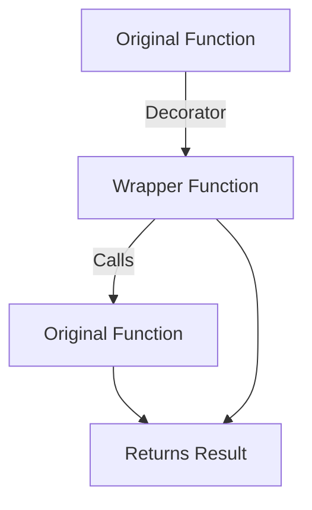

## 4.4.2 Using Python Decorators

In this section, we delve into the fascinating world of Python decorators, a powerful feature that allows you to modify the behavior of functions or methods. We'll explore how decorators work, differentiate them from the structural Decorator design pattern, and provide practical examples to demonstrate their utility. By the end of this section, you'll have a solid understanding of how to leverage decorators to enhance your Python code.

### Introduction to Python's Decorator Syntax

Python decorators are a syntactic feature that allows you to wrap a function or method with another function, thereby modifying or extending its behavior without altering its code. The syntax for decorators is simple and elegant, using the `@decorator` notation.

#### Basic Decorator Syntax

Let's start with a basic example to illustrate how decorators work:

```python
def my_decorator(func):
    def wrapper():
        print("Something is happening before the function is called.")
        func()
        print("Something is happening after the function is called.")
    return wrapper

@my_decorator
def say_hello():
    print("Hello!")

say_hello()
```

**Explanation:**

- **Decorator Function**: `my_decorator` is a function that takes another function (`func`) as an argument and returns a new function (`wrapper`) that adds additional behavior.
- **Wrapper Function**: The `wrapper` function adds behavior before and after calling the original function (`func`).
- **Decorator Syntax**: The `@my_decorator` syntax is a shorthand for `say_hello = my_decorator(say_hello)`. It applies the decorator to `say_hello`.

### Differentiating Python's Decorators from the Structural Decorator Pattern

It's important to distinguish between Python's decorators and the structural Decorator design pattern. While they share a name and concept of wrapping functionality, they serve different purposes:

- **Python's Decorators**: A language feature used to wrap functions or methods to modify their behavior. They are syntactic sugar for higher-order functions.
- **Structural Decorator Pattern**: A design pattern used to add responsibilities to objects dynamically. It involves creating a set of decorator classes that are used to wrap concrete components.

### Function and Class Decorators

Decorators can be applied to both functions and classes. Let's explore examples of each.

#### Function Decorators

Function decorators are the most common use case. They can be used for a variety of purposes, such as logging, timing, and caching.

**Example: Logging Decorator**

```python
def log_decorator(func):
    def wrapper(*args, **kwargs):
        print(f"Calling {func.__name__} with args: {args}, kwargs: {kwargs}")
        result = func(*args, **kwargs)
        print(f"{func.__name__} returned: {result}")
        return result
    return wrapper

@log_decorator
def add(a, b):
    return a + b

add(3, 5)
```

**Explanation:**

- **Logging**: The `log_decorator` logs the function call details and its return value.
- **Arguments**: The `wrapper` function uses `*args` and `**kwargs` to handle any number of positional and keyword arguments.

#### Class Decorators

Class decorators work similarly to function decorators but are applied to classes.

**Example: Class Decorator**

```python
def singleton(cls):
    instances = {}
    def get_instance(*args, **kwargs):
        if cls not in instances:
            instances[cls] = cls(*args, **kwargs)
        return instances[cls]
    return get_instance

@singleton
class DatabaseConnection:
    def __init__(self):
        print("Creating a new database connection.")

db1 = DatabaseConnection()
db2 = DatabaseConnection()
print(db1 is db2)  # True
```

**Explanation:**

- **Singleton Pattern**: The `singleton` decorator ensures that only one instance of `DatabaseConnection` is created.
- **Instance Management**: The `get_instance` function manages the creation and retrieval of the class instance.

### Using `functools.wraps` to Preserve Metadata

When you use decorators, the original function's metadata (such as its name and docstring) is lost because the wrapper function replaces it. The `functools.wraps` decorator is used to preserve this metadata.

**Example: Preserving Metadata with `functools.wraps`**

```python
import functools

def log_decorator(func):
    @functools.wraps(func)
    def wrapper(*args, **kwargs):
        print(f"Calling {func.__name__} with args: {args}, kwargs: {kwargs}")
        result = func(*args, **kwargs)
        print(f"{func.__name__} returned: {result}")
        return result
    return wrapper

@log_decorator
def multiply(a, b):
    """Multiply two numbers."""
    return a * b

print(multiply.__name__)  # multiply
print(multiply.__doc__)   # Multiply two numbers.
```

**Explanation:**

- **`functools.wraps`**: This decorator copies the metadata from the original function to the wrapper function, preserving the function's name and docstring.

### Advanced Concepts: Parameterized Decorators

Parameterized decorators are decorators that take arguments. They add an additional layer of flexibility by allowing you to customize the decorator's behavior.

**Example: Parameterized Decorator**

```python
def repeat(num_times):
    def decorator_repeat(func):
        @functools.wraps(func)
        def wrapper(*args, **kwargs):
            for _ in range(num_times):
                result = func(*args, **kwargs)
            return result
        return wrapper
    return decorator_repeat

@repeat(num_times=3)
def greet(name):
    print(f"Hello, {name}!")

greet("Alice")
```

**Explanation:**

- **Decorator Factory**: `repeat` is a factory function that returns a decorator (`decorator_repeat`).
- **Customization**: The `num_times` parameter allows you to specify how many times the function should be repeated.

### Benefits and Limitations of Using Python Decorators

#### Benefits

- **Code Reusability**: Decorators promote code reuse by allowing you to apply the same behavior to multiple functions or methods.
- **Separation of Concerns**: They help separate cross-cutting concerns (e.g., logging, authentication) from business logic.
- **Readability**: The `@decorator` syntax makes it easy to see which functions are being decorated.

#### Limitations

- **Complexity**: Overuse of decorators can lead to complex and hard-to-debug code.
- **Performance**: Decorators add an additional layer of function calls, which can impact performance in performance-critical applications.
- **State Management**: Managing state within decorators can be challenging, especially with parameterized decorators.

### Try It Yourself

Experiment with the examples provided by modifying the decorators or creating your own. Here are some ideas to try:

- Create a decorator that measures the execution time of a function.
- Implement a decorator that caches the results of expensive function calls.
- Write a parameterized decorator that logs only if a certain verbosity level is set.

### Visualizing Decorator Flow

To better understand how decorators work, let's visualize the flow of function calls when a decorator is applied.



**Description**: This diagram illustrates the flow of function calls when a decorator is applied. The original function is wrapped by the decorator, which calls the original function and returns the result.

### References and Links

- [Python Decorators](https://docs.python.org/3/glossary.html#term-decorator) - Python's official documentation on decorators.
- [functools.wraps](https://docs.python.org/3/library/functools.html#functools.wraps) - Documentation on `functools.wraps`.

### Knowledge Check

- What is the purpose of a decorator in Python?
- How does the `@decorator` syntax work?
- What is the difference between a function decorator and a class decorator?
- How can `functools.wraps` be used to preserve function metadata?
- What are the benefits and limitations of using decorators?

### Embrace the Journey

Remember, decorators are a powerful tool in your Python toolkit. As you continue to explore and experiment with decorators, you'll discover new ways to enhance your code and improve its readability and maintainability. Keep experimenting, stay curious, and enjoy the journey!

---

## Quiz Time!



### What is the primary purpose of a Python decorator?

- [x] To modify or extend the behavior of functions or methods without altering their code.
- [ ] To create new classes from existing ones.
- [ ] To compile Python code into machine language.
- [ ] To manage memory allocation in Python.

> **Explanation:** Python decorators are used to modify or extend the behavior of functions or methods without changing their code, providing a way to add functionality dynamically.

### What does the `@decorator` syntax represent in Python?

- [x] It is syntactic sugar for applying a decorator function to another function.
- [ ] It is used to declare a new class.
- [ ] It is a way to define a new module.
- [ ] It is a method for importing external libraries.

> **Explanation:** The `@decorator` syntax is a shorthand for applying a decorator function to another function, equivalent to `function = decorator(function)`.

### How does `functools.wraps` help when using decorators?

- [x] It preserves the original function's metadata, such as its name and docstring.
- [ ] It optimizes the decorator for faster execution.
- [ ] It automatically applies the decorator to all functions in a module.
- [ ] It converts the decorator into a class.

> **Explanation:** `functools.wraps` is used to preserve the original function's metadata, ensuring that the decorated function retains its original name and docstring.

### What is a parameterized decorator?

- [x] A decorator that takes arguments to customize its behavior.
- [ ] A decorator that can only be applied to class methods.
- [ ] A decorator that automatically logs function execution time.
- [ ] A decorator that is used for memory management.

> **Explanation:** A parameterized decorator is a decorator that takes arguments, allowing you to customize its behavior based on the parameters provided.

### Which of the following is a benefit of using decorators in Python?

- [x] They promote code reusability by applying the same behavior to multiple functions.
- [ ] They automatically optimize code for better performance.
- [ ] They eliminate the need for unit testing.
- [ ] They make Python code compatible with other programming languages.

> **Explanation:** Decorators promote code reusability by allowing you to apply the same behavior to multiple functions, enhancing modularity and maintainability.

### What is a potential limitation of using decorators?

- [x] They can lead to complex and hard-to-debug code if overused.
- [ ] They prevent the use of global variables in Python.
- [ ] They require the use of third-party libraries.
- [ ] They are not supported in Python 3.

> **Explanation:** Overuse of decorators can lead to complex and hard-to-debug code, as they add layers of abstraction that can obscure the original function logic.

### How can decorators be applied to classes in Python?

- [x] By defining a class decorator that takes a class as an argument and returns a modified class.
- [ ] By using the `class` keyword within the decorator function.
- [ ] By importing the `class_decorator` module from Python's standard library.
- [ ] By defining the decorator within the class body.

> **Explanation:** Class decorators are applied by defining a decorator function that takes a class as an argument and returns a modified class, similar to function decorators.

### What is the role of the wrapper function in a decorator?

- [x] To add additional behavior before and after the original function is called.
- [ ] To compile the original function into machine code.
- [ ] To replace the original function with a new one.
- [ ] To manage memory allocation for the original function.

> **Explanation:** The wrapper function in a decorator is responsible for adding additional behavior before and after the original function is called, effectively wrapping the original function.

### What is the difference between a function decorator and a class decorator?

- [x] A function decorator is applied to functions, while a class decorator is applied to classes.
- [ ] A function decorator is used for memory management, while a class decorator is used for logging.
- [ ] A function decorator is only available in Python 2, while a class decorator is available in Python 3.
- [ ] A function decorator requires the use of `functools.wraps`, while a class decorator does not.

> **Explanation:** A function decorator is applied to functions to modify their behavior, while a class decorator is applied to classes to modify their behavior.

### True or False: Decorators can be used to implement the structural Decorator design pattern in Python.

- [x] True
- [ ] False

> **Explanation:** True. While Python's decorators are a language feature, they can be used to implement the structural Decorator design pattern by dynamically adding responsibilities to objects.


