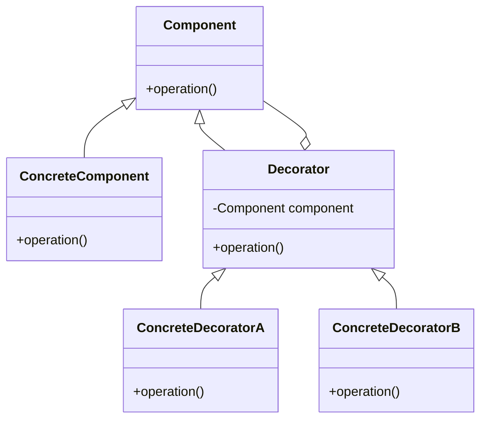

## 4.4.3 Enhancing Object Functionality with Decorator Pattern in Python

In the realm of software design, enhancing object functionality without altering existing code is a vital skill. The Decorator Pattern is a structural design pattern that allows us to add new behaviors to objects dynamically. This pattern is particularly useful when we want to extend the functionality of classes in a flexible and reusable manner. In this section, we will delve into the intricacies of the Decorator Pattern, explore its implementation in Python, and understand its advantages over traditional subclassing.

### Understanding Dynamic Behavior Addition

Dynamic behavior addition refers to the ability to modify or extend the behavior of objects at runtime. This capability is crucial in scenarios where the behavior of an object needs to be altered temporarily or conditionally. For instance, consider a logging system where we want to add timestamps to logs only during debugging sessions. Instead of modifying the existing logging class, we can use a decorator to add this functionality dynamically.

#### Importance of Extending Object Functionality at Runtime

1. **Flexibility**: By extending functionality at runtime, we can tailor object behavior to specific contexts without altering the core logic.
2. **Maintainability**: It reduces the need for extensive subclass hierarchies, making the codebase easier to maintain.
3. **Reusability**: Decorators can be reused across different classes, promoting code reuse and reducing duplication.

### Implementing the Decorator Pattern in Python

The Decorator Pattern involves creating a set of decorator classes that are used to wrap concrete components. These decorators are interchangeable and can be combined to provide various enhancements to the object.

#### Basic Structure of a Decorator

```python
class Component:
    """Define the interface for objects that can have responsibilities added to them dynamically."""
    def operation(self):
        pass

class ConcreteComponent(Component):
    """Define an object to which additional responsibilities can be attached."""
    def operation(self):
        return "ConcreteComponent"

class Decorator(Component):
    """Maintain a reference to a Component object and define an interface that conforms to Component's interface."""
    def __init__(self, component):
        self._component = component

    def operation(self):
        return self._component.operation()

class ConcreteDecoratorA(Decorator):
    """Add responsibilities to the component."""
    def operation(self):
        return f"ConcreteDecoratorA({self._component.operation()})"

class ConcreteDecoratorB(Decorator):
    """Add responsibilities to the component."""
    def operation(self):
        return f"ConcreteDecoratorB({self._component.operation()})"

component = ConcreteComponent()
decorated_component = ConcreteDecoratorA(ConcreteDecoratorB(component))
print(decorated_component.operation())
```

In this example, `ConcreteDecoratorA` and `ConcreteDecoratorB` add new behaviors to the `ConcreteComponent`. The decorators can be combined in various ways to achieve the desired functionality.

### Scenarios for Enhancing Objects Using Decorators

Decorators are particularly useful in scenarios where objects need additional responsibilities temporarily. Here are a few examples:

1. **User Interface Components**: Adding scrollbars, borders, or shadows to UI components.
2. **Logging**: Adding different logging levels or formats without altering the core logging logic.
3. **Security**: Adding authentication or authorization checks to existing services.

### Comparison with Subclassing

Subclassing is a traditional approach to extending functionality, but it comes with its limitations. Let's compare it with the Decorator Pattern:

#### Subclassing

- **Pros**:
  - Straightforward to implement for simple extensions.
  - Leverages inheritance, a core OOP principle.

- **Cons**:
  - Leads to a proliferation of subclasses for each combination of behaviors.
  - Inflexible as changes require modifying the class hierarchy.
  - Can result in tightly coupled code.

#### Decorator Pattern

- **Pros**:
  - Provides a flexible alternative to subclassing.
  - Allows behaviors to be mixed and matched at runtime.
  - Promotes code reuse and separation of concerns.

- **Cons**:
  - Can introduce complexity with multiple layers of decorators.
  - Debugging can be challenging due to the dynamic nature of decorators.

### Promoting Code Reuse with Decorators

The Decorator Pattern promotes code reuse by allowing us to create small, reusable components that can be combined to achieve complex behaviors. This modular approach makes it easier to maintain and extend the codebase.

#### Example: Enhancing a Notification System

Consider a notification system where we want to send notifications via email, SMS, and push notifications. Instead of creating a subclass for each combination, we can use decorators:

```python
class Notifier:
    """Base notifier interface."""
    def send(self, message):
        pass

class EmailNotifier(Notifier):
    """Concrete notifier for email."""
    def send(self, message):
        print(f"Sending email: {message}")

class SMSNotifier(Notifier):
    """Decorator for SMS notifications."""
    def __init__(self, notifier):
        self._notifier = notifier

    def send(self, message):
        self._notifier.send(message)
        print(f"Sending SMS: {message}")

class PushNotifier(Notifier):
    """Decorator for push notifications."""
    def __init__(self, notifier):
        self._notifier = notifier

    def send(self, message):
        self._notifier.send(message)
        print(f"Sending push notification: {message}")

notifier = EmailNotifier()
sms_notifier = SMSNotifier(notifier)
push_notifier = PushNotifier(sms_notifier)
push_notifier.send("Hello, World!")
```

In this example, we can dynamically add SMS and push notification capabilities to the email notifier without altering the existing classes.

### Potential Downsides of the Decorator Pattern

While the Decorator Pattern offers numerous advantages, it also has potential downsides:

1. **Complexity**: The use of multiple decorators can lead to complex and hard-to-follow code.
2. **Debugging**: Debugging can be challenging due to the dynamic nature of decorators and the multiple layers involved.
3. **Performance**: Each decorator adds a layer of abstraction, which can impact performance if not managed carefully.

### Visualizing the Decorator Pattern

To better understand the Decorator Pattern, let's visualize its structure using a class diagram:



This diagram illustrates how decorators extend the functionality of components by maintaining a reference to the component and adding new behaviors.

### Try It Yourself

To solidify your understanding of the Decorator Pattern, try modifying the examples provided:

1. **Add a new decorator**: Create a new decorator that adds a timestamp to messages in the notification system.
2. **Combine decorators**: Experiment with different combinations of decorators to see how they interact.
3. **Measure performance**: Use Python's `timeit` module to measure the performance impact of adding multiple decorators.

### Knowledge Check

1. What are the main advantages of using the Decorator Pattern over subclassing?
2. How does the Decorator Pattern promote code reuse?
3. What are some potential downsides of using the Decorator Pattern?
4. How can decorators be combined to achieve complex behaviors?

### Conclusion

The Decorator Pattern is a powerful tool for enhancing object functionality in a flexible and reusable manner. By understanding its structure and implementation in Python, we can create dynamic and maintainable software systems. Remember, this is just the beginning. As you progress, you'll discover more ways to leverage design patterns to build robust and scalable applications. Keep experimenting, stay curious, and enjoy the journey!

## Quiz Time!



### What is the primary advantage of using the Decorator Pattern over subclassing?

- [x] Flexibility in adding behaviors at runtime
- [ ] Easier to implement
- [ ] Better performance
- [ ] Simpler code structure

> **Explanation:** The Decorator Pattern provides flexibility by allowing behaviors to be added at runtime without altering the existing class hierarchy.

### How does the Decorator Pattern promote code reuse?

- [x] By allowing small, reusable components to be combined
- [ ] By simplifying the class hierarchy
- [ ] By eliminating the need for interfaces
- [ ] By reducing the number of classes

> **Explanation:** The Decorator Pattern promotes code reuse by allowing small, reusable components (decorators) to be combined in various ways to achieve different behaviors.

### What is a potential downside of using the Decorator Pattern?

- [x] Increased complexity due to multiple layers
- [ ] Lack of flexibility
- [ ] Reduced code reuse
- [ ] Inability to add new behaviors

> **Explanation:** A potential downside of the Decorator Pattern is increased complexity due to the multiple layers of decorators, which can make the code harder to follow and debug.

### In the Decorator Pattern, what role does the Decorator class play?

- [x] It maintains a reference to a Component object and adds new behavior
- [ ] It defines the interface for objects that can have responsibilities added
- [ ] It is the base class for all concrete components
- [ ] It handles the core logic of the application

> **Explanation:** The Decorator class maintains a reference to a Component object and adds new behavior, conforming to the Component's interface.

### Which of the following is NOT a benefit of using the Decorator Pattern?

- [ ] Flexibility in adding behaviors
- [ ] Promoting code reuse
- [x] Simplifying debugging
- [ ] Reducing subclass proliferation

> **Explanation:** While the Decorator Pattern offers flexibility and promotes code reuse, it can complicate debugging due to the multiple layers involved.

### How can decorators be combined to achieve complex behaviors?

- [x] By wrapping one decorator around another
- [ ] By subclassing multiple decorators
- [ ] By using interfaces
- [ ] By creating a single, large decorator

> **Explanation:** Decorators can be combined by wrapping one decorator around another, allowing complex behaviors to be built from simple, reusable components.

### What is a common use case for the Decorator Pattern?

- [x] Adding logging functionality
- [ ] Implementing a database connection
- [ ] Creating a user interface
- [ ] Managing memory allocation

> **Explanation:** A common use case for the Decorator Pattern is adding logging functionality, where different logging behaviors can be added dynamically.

### What is the role of the ConcreteComponent class in the Decorator Pattern?

- [x] It defines an object to which additional responsibilities can be attached
- [ ] It maintains a reference to a Component object
- [ ] It adds new behaviors to the component
- [ ] It is the base class for all decorators

> **Explanation:** The ConcreteComponent class defines an object to which additional responsibilities can be attached through decorators.

### How does the Decorator Pattern affect performance?

- [x] It can impact performance due to added layers
- [ ] It always improves performance
- [ ] It has no effect on performance
- [ ] It reduces memory usage

> **Explanation:** The Decorator Pattern can impact performance due to the added layers of abstraction, which may introduce overhead.

### True or False: The Decorator Pattern can only be used with classes that implement a specific interface.

- [ ] True
- [x] False

> **Explanation:** The Decorator Pattern can be used with any class, not just those that implement a specific interface, as long as the decorators conform to the same interface as the component.


