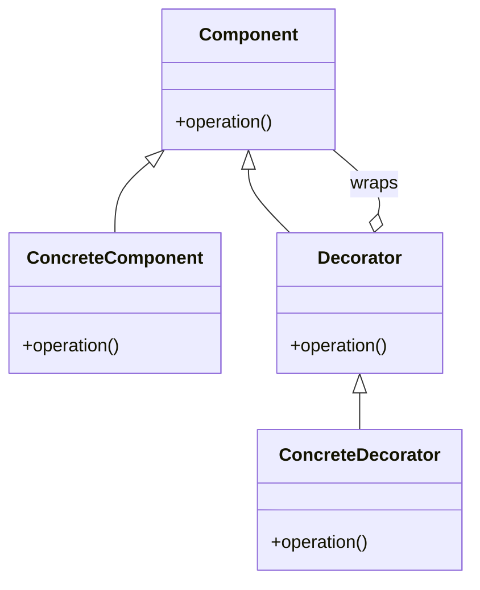

## 4.4.4 Use Cases and Examples

The Decorator Pattern is a structural design pattern that allows behavior to be added to individual objects, dynamically, without affecting the behavior of other objects from the same class. This pattern is particularly useful in scenarios where you need to add responsibilities to objects without modifying their code. In Python, decorators are a powerful feature that can be used to implement this pattern effectively.

### Real-World Applications of the Decorator Pattern

Let's delve into some practical applications of the Decorator Pattern in Python, focusing on logging, authentication, and input validation. These examples will illustrate how decorators can be used to extend the functionality of functions and methods in a clean and maintainable way.

#### Logging Decorator

Logging is an essential aspect of software development, providing insights into application behavior and aiding in debugging. A logging decorator can be used to automatically log function calls, including their input arguments and return values.

**Why Use a Decorator for Logging?**

- **Separation of Concerns**: The logging logic is separated from the business logic of the function.
- **Reusability**: The same logging functionality can be applied to multiple functions without code duplication.
- **Transparency**: The original function remains unchanged, and the logging is added transparently.

**Implementing a Logging Decorator**

```python
import functools
import logging

logging.basicConfig(level=logging.INFO)

def log_function_call(func):
    """A decorator that logs the function call details."""
    @functools.wraps(func)
    def wrapper(*args, **kwargs):
        logging.info(f"Calling {func.__name__} with args: {args}, kwargs: {kwargs}")
        result = func(*args, **kwargs)
        logging.info(f"{func.__name__} returned {result}")
        return result
    return wrapper

@log_function_call
def add(a, b):
    """Adds two numbers."""
    return a + b

result = add(5, 3)
```

**Explanation**: In this example, the `log_function_call` decorator logs the name of the function being called, along with its arguments and return value. By using `functools.wraps`, we ensure that the metadata of the original function is preserved.

#### Authentication Decorator

Authentication is a critical component of secure applications. A decorator can be used to enforce authentication checks before executing a function, ensuring that only authorized users can access certain functionalities.

**Why Use a Decorator for Authentication?**

- **Centralized Security**: Authentication logic is centralized, making it easier to manage and update.
- **Reusability**: The same authentication checks can be applied to multiple functions.
- **Flexibility**: Authentication can be added or removed without modifying the core logic of the function.

**Implementing an Authentication Decorator**

```python
import functools

def authenticate(user_role):
    """A decorator to check if the user has the required role."""
    def decorator(func):
        @functools.wraps(func)
        def wrapper(*args, **kwargs):
            user = kwargs.get('user')
            if user and user.get('role') == user_role:
                return func(*args, **kwargs)
            else:
                raise PermissionError("User does not have the required role.")
        return wrapper
    return decorator

@authenticate('admin')
def delete_user(user, user_id):
    """Deletes a user by ID."""
    # Logic to delete the user
    return f"User {user_id} deleted."

try:
    admin_user = {'username': 'admin', 'role': 'admin'}
    result = delete_user(user=admin_user, user_id=123)
    print(result)
except PermissionError as e:
    print(e)
```

**Explanation**: The `authenticate` decorator checks if the user has the required role before allowing the function to execute. If the user does not have the necessary permissions, a `PermissionError` is raised.

#### Input Validation Decorator

Input validation is crucial for ensuring that functions receive valid data, preventing errors and potential security vulnerabilities. A decorator can be used to validate inputs before a function is executed.

**Why Use a Decorator for Input Validation?**

- **Consistency**: Ensures consistent validation logic across multiple functions.
- **Maintainability**: Validation logic is separated from business logic, making it easier to maintain.
- **Error Handling**: Provides a centralized mechanism for handling validation errors.

**Implementing an Input Validation Decorator**

```python
import functools

def validate_inputs(validation_func):
    """A decorator to validate function inputs."""
    def decorator(func):
        @functools.wraps(func)
        def wrapper(*args, **kwargs):
            if not validation_func(*args, **kwargs):
                raise ValueError("Invalid input arguments.")
            return func(*args, **kwargs)
        return wrapper
    return decorator

def is_positive_numbers(*args, **kwargs):
    """Validation function to check if all arguments are positive numbers."""
    return all(isinstance(arg, (int, float)) and arg > 0 for arg in args)

@validate_inputs(is_positive_numbers)
def multiply(a, b):
    """Multiplies two positive numbers."""
    return a * b

try:
    result = multiply(3, 4)
    print(result)
except ValueError as e:
    print(e)
```

**Explanation**: The `validate_inputs` decorator uses a validation function to check if the inputs are valid. In this example, the `is_positive_numbers` function ensures that all arguments are positive numbers.

### Exploring Other Use Cases

The Decorator Pattern is versatile and can be applied to a wide range of scenarios beyond the examples provided. Here are some additional use cases to consider:

- **Caching**: Implement a caching decorator to store the results of expensive function calls and return the cached result when the same inputs occur again.
- **Rate Limiting**: Create a decorator to limit the number of times a function can be called within a certain period, useful for APIs.
- **Retry Logic**: Develop a decorator that automatically retries a function call if it fails, with a configurable number of retries and delay between attempts.
- **Performance Monitoring**: Use a decorator to measure and log the execution time of functions, helping to identify performance bottlenecks.

### Try It Yourself

Let's encourage you to experiment with the examples provided. Here are some suggestions:

- Modify the logging decorator to log additional information, such as the timestamp of the function call.
- Extend the authentication decorator to support multiple roles and permissions.
- Create a new validation decorator that checks for specific data types or value ranges.

### Visualizing the Decorator Pattern

To better understand how the Decorator Pattern works, let's visualize the process using a class diagram:



**Diagram Description**: This class diagram illustrates the structure of the Decorator Pattern. The `Component` interface defines the `operation` method. The `ConcreteComponent` class implements this interface. The `Decorator` class also implements the `Component` interface and maintains a reference to a `Component` object. The `ConcreteDecorator` class extends the `Decorator` class and adds additional behavior.

### Summary

The Decorator Pattern is a powerful tool in Python that allows you to extend the functionality of functions and methods in a clean and maintainable way. By using decorators, you can add responsibilities such as logging, authentication, and input validation transparently, without modifying the original function code. This pattern promotes separation of concerns, reusability, and flexibility, making it an essential tool in a Python developer's toolkit.

Remember, this is just the beginning. As you progress, you'll discover even more creative ways to apply the Decorator Pattern to solve complex problems in your projects. Keep experimenting, stay curious, and enjoy the journey!

## Quiz Time!



### What is the primary benefit of using the Decorator Pattern for logging?

- [x] Separation of concerns
- [ ] Increased performance
- [ ] Reduced code size
- [ ] Enhanced security

> **Explanation:** The Decorator Pattern allows logging logic to be separated from the business logic, promoting separation of concerns.

### How does the `functools.wraps` function benefit decorators?

- [x] It preserves the original function's metadata.
- [ ] It improves the performance of the decorator.
- [ ] It automatically logs function calls.
- [ ] It adds security checks to the function.

> **Explanation:** `functools.wraps` is used to preserve the original function's metadata, such as its name and docstring, when creating a decorator.

### Which of the following is a suitable use case for an authentication decorator?

- [x] Checking user roles before executing a function
- [ ] Logging function execution time
- [ ] Validating input data types
- [ ] Caching function results

> **Explanation:** An authentication decorator is used to check user roles and permissions before allowing a function to execute.

### What is the purpose of an input validation decorator?

- [x] To ensure function inputs are valid before execution
- [ ] To log function inputs and outputs
- [ ] To measure function execution time
- [ ] To cache function results

> **Explanation:** An input validation decorator checks the validity of function inputs before the function is executed.

### Which of the following scenarios is NOT a typical use case for the Decorator Pattern?

- [ ] Logging
- [ ] Authentication
- [x] Data storage
- [ ] Input validation

> **Explanation:** The Decorator Pattern is typically used for adding responsibilities like logging, authentication, and input validation, not for data storage.

### What does the `@authenticate('admin')` decorator do in the provided example?

- [x] Checks if the user has the 'admin' role before executing the function
- [ ] Logs the function call details
- [ ] Validates the input arguments
- [ ] Caches the function result

> **Explanation:** The `@authenticate('admin')` decorator checks if the user has the 'admin' role before allowing the function to execute.

### How can decorators improve code maintainability?

- [x] By separating additional responsibilities from core logic
- [ ] By reducing the number of functions
- [ ] By increasing execution speed
- [ ] By simplifying data structures

> **Explanation:** Decorators separate additional responsibilities, such as logging or validation, from the core logic, making the code more maintainable.

### What is the role of the `wrapper` function in a decorator?

- [x] To execute additional logic before and after the original function
- [ ] To replace the original function entirely
- [ ] To improve the function's performance
- [ ] To handle exceptions raised by the function

> **Explanation:** The `wrapper` function in a decorator is used to execute additional logic before and after the original function.

### True or False: The Decorator Pattern can only be applied to functions, not classes.

- [ ] True
- [x] False

> **Explanation:** The Decorator Pattern can be applied to both functions and classes in Python, allowing for flexible extension of behavior.

### Which of the following is a potential benefit of using decorators for caching?

- [x] Reduced computation time for repeated calls
- [ ] Increased security of the function
- [ ] Improved readability of the code
- [ ] Simplified error handling

> **Explanation:** Using decorators for caching can reduce computation time by storing and reusing results of expensive function calls.


