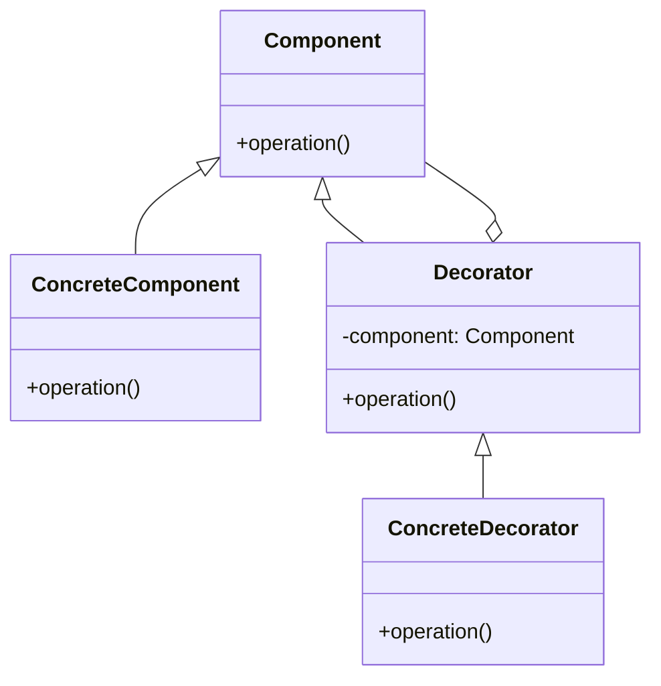
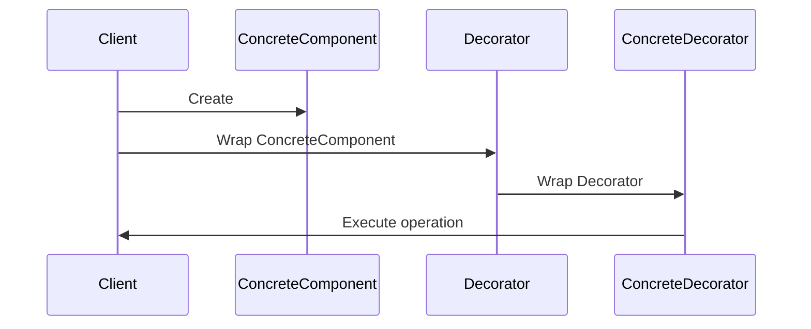

## 4.4 Decorator Pattern

The Decorator Pattern is a structural design pattern that allows behavior to be added to individual objects, either statically or dynamically, without affecting the behavior of other objects from the same class. This pattern is particularly useful when you want to extend the functionality of classes in a flexible and reusable way.

### Purpose and Benefits of the Decorator Pattern

The primary purpose of the Decorator Pattern is to provide a flexible alternative to subclassing for extending functionality. By using decorators, we can add new responsibilities to objects without altering their structure. This is achieved by wrapping the original object with a new object that adds the desired behavior.

#### Key Benefits

1. **Flexibility**: Decorators provide a flexible mechanism for extending functionality without modifying existing code. This allows for behavior to be added at runtime, which is not possible with static inheritance.

2. **Adherence to the Open/Closed Principle**: The Decorator Pattern supports the Open/Closed Principle by allowing objects to be open for extension but closed for modification.

3. **Avoidance of Class Explosion**: Instead of creating a multitude of subclasses to cover all combinations of behaviors, decorators allow for the combination of behaviors at runtime.

4. **Separation of Concerns**: Decorators can be used to separate cross-cutting concerns such as logging, security, or data validation from the core business logic.

### Structure of the Decorator Pattern

The Decorator Pattern is composed of several key components:

- **Component**: An interface or abstract class defining the operations that can be altered by decorators.
- **ConcreteComponent**: A class implementing the Component interface. This is the object to which additional responsibilities can be attached.
- **Decorator**: An abstract class that implements the Component interface and contains a reference to a Component object. It delegates all operations to the Component object.
- **ConcreteDecorator**: A class that extends the Decorator class and adds responsibilities to the Component.

Below is a UML diagram adapted for Python to illustrate the relationships between these components:



### Differentiating Between Decorator Pattern and Inheritance

While both the Decorator Pattern and inheritance can be used to extend the functionality of classes, they have distinct differences:

- **Inheritance** is static and defines the behavior of classes at compile time. It can lead to a class explosion problem where a large number of subclasses are needed to cover all combinations of behaviors.

- **Decorator Pattern** is dynamic and allows behavior to be added at runtime. It avoids the class explosion problem by enabling the combination of behaviors through composition rather than inheritance.

#### When to Use Decorator Pattern Over Inheritance

- When you need to add responsibilities to individual objects, not to an entire class.
- When subclassing would result in an impractical number of classes.
- When you need to add functionality that can be withdrawn.

### Implementing the Decorator Pattern in Python

Python's dynamic nature and support for first-class functions make it particularly well-suited for implementing the Decorator Pattern. Let's explore how to implement this pattern in Python.

#### Basic Implementation

Below is a simple example demonstrating the Decorator Pattern in Python:

```python
class Coffee:
    def cost(self):
        return 5

class MilkDecorator:
    def __init__(self, coffee):
        self._coffee = coffee

    def cost(self):
        return self._coffee.cost() + 1

class SugarDecorator:
    def __init__(self, coffee):
        self._coffee = coffee

    def cost(self):
        return self._coffee.cost() + 0.5

simple_coffee = Coffee()
print(f"Cost of simple coffee: {simple_coffee.cost()}")

milk_coffee = MilkDecorator(simple_coffee)
print(f"Cost of coffee with milk: {milk_coffee.cost()}")

sugar_milk_coffee = SugarDecorator(milk_coffee)
print(f"Cost of coffee with milk and sugar: {sugar_milk_coffee.cost()}")
```

**Explanation**: In this example, `Coffee` is the `ConcreteComponent`, `MilkDecorator` and `SugarDecorator` are `ConcreteDecorators` that add additional costs to the base coffee.

#### Using Python's First-Class Functions

Python's first-class functions and decorators provide a syntactic sugar for implementing the Decorator Pattern. Here's how you can use Python's built-in decorators to achieve similar functionality:

```python
def milk_decorator(coffee_func):
    def wrapper():
        return coffee_func() + 1
    return wrapper

def sugar_decorator(coffee_func):
    def wrapper():
        return coffee_func() + 0.5
    return wrapper

@milk_decorator
@sugar_decorator
def simple_coffee():
    return 5

print(f"Cost of coffee with milk and sugar: {simple_coffee()}")
```

**Explanation**: In this example, `milk_decorator` and `sugar_decorator` are functions that take another function as an argument and extend its behavior. The `@` syntax is used to apply these decorators to the `simple_coffee` function.

### Use Cases for the Decorator Pattern

The Decorator Pattern is particularly useful in scenarios involving cross-cutting concerns. Here are some common use cases:

- **Logging**: Adding logging functionality to methods without modifying their code.
- **Security**: Implementing access control checks.
- **Data Validation**: Validating input data before processing.
- **Caching**: Storing results of expensive function calls and returning the cached result when the same inputs occur again.

### Advantages and Potential Drawbacks

#### Advantages

- **Increased Flexibility**: Decorators allow for dynamic composition of behaviors.
- **Adherence to the Open/Closed Principle**: New functionality can be added without modifying existing code.
- **Reusability**: Decorators can be reused across different components.

#### Potential Drawbacks

- **Complexity**: Multiple layers of decorators can make the code difficult to understand and debug.
- **Performance Overhead**: Each layer of decoration adds a function call, which can impact performance.

### Leveraging Python's Features

Python's support for first-class functions and decorators simplifies the implementation of the Decorator Pattern. By using Python's built-in decorators, we can achieve the same functionality with less boilerplate code.

### Try It Yourself

To deepen your understanding of the Decorator Pattern, try modifying the code examples provided:

- **Add More Decorators**: Create additional decorators for different coffee flavors or ingredients.
- **Combine Decorators**: Experiment with different combinations of decorators to see how they affect the final result.
- **Implement a Real-World Scenario**: Apply the Decorator Pattern to a real-world problem, such as adding authentication to a web application.

### Visualizing the Decorator Pattern

To better understand the flow of the Decorator Pattern, consider the following sequence diagram that illustrates the interaction between components:



**Description**: This diagram shows how a client creates a `ConcreteComponent`, wraps it with a `Decorator`, and then further wraps it with a `ConcreteDecorator`. The client then executes an operation on the `ConcreteDecorator`, which delegates to the `Decorator` and ultimately to the `ConcreteComponent`.

### Knowledge Check

- What are the key components of the Decorator Pattern?
- How does the Decorator Pattern adhere to the Open/Closed Principle?
- What are some common use cases for the Decorator Pattern?
- How can Python's first-class functions simplify the implementation of the Decorator Pattern?

### Embrace the Journey

Remember, mastering design patterns like the Decorator Pattern is a journey. As you continue to explore and experiment with these patterns, you'll gain a deeper understanding of how to write more flexible and maintainable code. Keep experimenting, stay curious, and enjoy the journey!

## Quiz Time!



### What is the primary purpose of the Decorator Pattern?

- [x] To add responsibilities to objects dynamically without modifying their structure.
- [ ] To create a hierarchy of classes to extend functionality.
- [ ] To replace the need for interfaces in object-oriented design.
- [ ] To provide a mechanism for object serialization.

> **Explanation:** The Decorator Pattern allows for dynamic addition of responsibilities to objects without altering their structure, providing a flexible alternative to subclassing.

### Which of the following is NOT a component of the Decorator Pattern?

- [ ] Component
- [ ] ConcreteComponent
- [ ] Decorator
- [x] AbstractFactory

> **Explanation:** The AbstractFactory is not a part of the Decorator Pattern. The key components are Component, ConcreteComponent, Decorator, and ConcreteDecorator.

### How does the Decorator Pattern adhere to the Open/Closed Principle?

- [x] By allowing objects to be open for extension but closed for modification.
- [ ] By enabling direct modification of object internals.
- [ ] By eliminating the need for subclassing.
- [ ] By providing a single point of modification for all objects.

> **Explanation:** The Decorator Pattern adheres to the Open/Closed Principle by allowing new functionality to be added without modifying existing code.

### What is a potential drawback of using the Decorator Pattern?

- [x] Increased complexity due to multiple layers of wrapping.
- [ ] Inability to extend functionality at runtime.
- [ ] Lack of support for dynamic behavior.
- [ ] Difficulty in adhering to the Open/Closed Principle.

> **Explanation:** The Decorator Pattern can lead to increased complexity due to multiple layers of wrapping, making the code harder to understand and debug.

### In Python, how can first-class functions simplify the implementation of the Decorator Pattern?

- [x] By allowing functions to be passed as arguments and returned from other functions.
- [ ] By eliminating the need for classes and objects.
- [ ] By enforcing strict type checking.
- [ ] By providing built-in support for serialization.

> **Explanation:** Python's first-class functions allow functions to be passed as arguments and returned from other functions, simplifying the implementation of the Decorator Pattern.

### Which of the following is a common use case for the Decorator Pattern?

- [x] Logging
- [ ] Serialization
- [ ] Object cloning
- [ ] Memory management

> **Explanation:** Logging is a common use case for the Decorator Pattern, as it allows for the addition of logging functionality without modifying existing code.

### What is the difference between the Decorator Pattern and inheritance?

- [x] Decorator Pattern allows for dynamic behavior addition, while inheritance is static.
- [ ] Inheritance allows for dynamic behavior addition, while Decorator Pattern is static.
- [ ] Both are static methods of extending functionality.
- [ ] Both are dynamic methods of extending functionality.

> **Explanation:** The Decorator Pattern allows for dynamic addition of behavior at runtime, whereas inheritance is static and defines behavior at compile time.

### Which Python feature is particularly useful for implementing the Decorator Pattern?

- [x] First-class functions
- [ ] Static typing
- [ ] Multiple inheritance
- [ ] Metaclasses

> **Explanation:** Python's first-class functions are particularly useful for implementing the Decorator Pattern, as they allow functions to be passed and returned, enabling dynamic behavior extension.

### What does the `@` symbol in Python denote when used with functions?

- [x] It denotes a decorator.
- [ ] It denotes a lambda function.
- [ ] It denotes a class method.
- [ ] It denotes a static method.

> **Explanation:** The `@` symbol in Python is used to denote a decorator, which is a function that extends the behavior of another function.

### True or False: The Decorator Pattern can be used to implement cross-cutting concerns like security and data validation.

- [x] True
- [ ] False

> **Explanation:** True. The Decorator Pattern is often used to implement cross-cutting concerns such as security and data validation, allowing these functionalities to be added dynamically.


