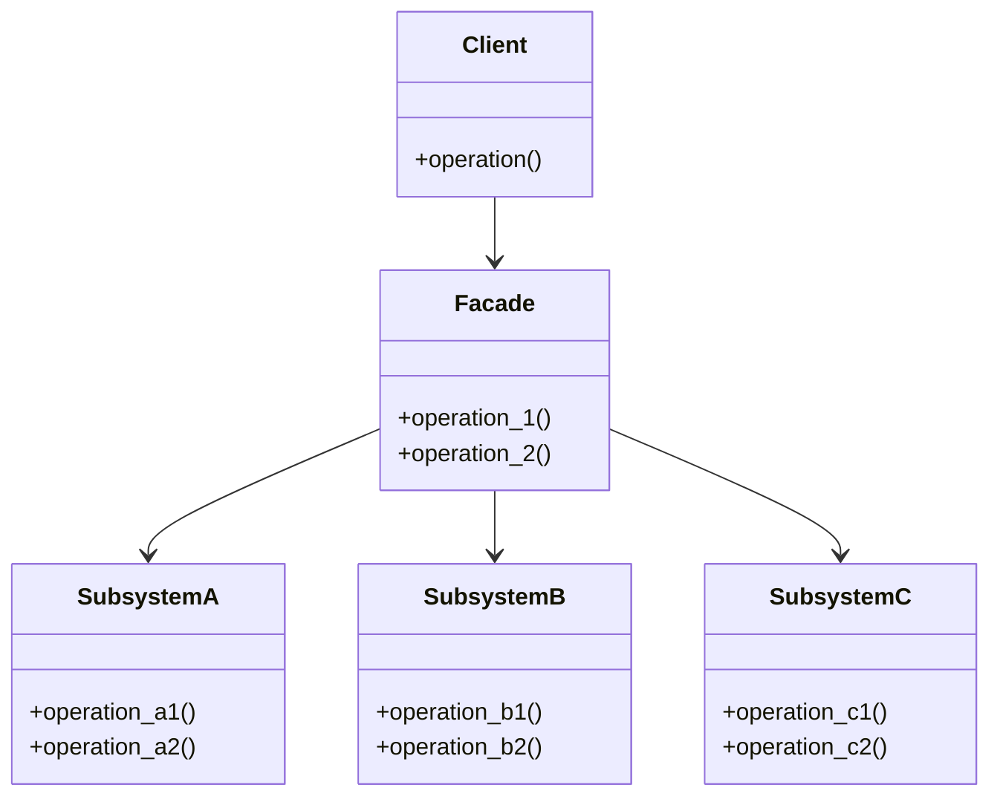

## 4.5.1 Implementing Facade in Python

In software development, complexity often arises from the interaction of multiple subsystems. The Facade design pattern provides a way to manage this complexity by offering a simplified interface to these subsystems. By implementing a Facade, we can hide the intricate details of subsystem interactions, making it easier for clients to use the system without needing to understand its inner workings.

### Understanding the Facade Pattern

The Facade pattern is a structural design pattern that provides a simplified interface to a complex subsystem. It acts as a wrapper that delegates client requests to the appropriate subsystem objects. This pattern is particularly useful when dealing with systems that have multiple interdependent classes, as it reduces the number of objects that clients need to interact with directly.

**Key Benefits of the Facade Pattern:**

- **Simplification**: Provides a simple interface to a complex system.
- **Decoupling**: Reduces dependencies between clients and subsystems.
- **Flexibility**: Allows for changes in the subsystem without affecting clients.
- **Ease of Use**: Makes the system easier to use by hiding complex interactions.

### Step-by-Step Implementation Guide

Let's walk through the process of implementing the Facade pattern in Python. We'll start by defining the subsystem classes, then create a Facade class to simplify interactions with these subsystems.

#### Step 1: Define Subsystem Classes

Subsystems are the complex components that the Facade will interact with. Each subsystem class has its own interface and functionality.

```python
class SubsystemA:
    def operation_a1(self):
        print("SubsystemA: Operation A1")

    def operation_a2(self):
        print("SubsystemA: Operation A2")


class SubsystemB:
    def operation_b1(self):
        print("SubsystemB: Operation B1")

    def operation_b2(self):
        print("SubsystemB: Operation B2")


class SubsystemC:
    def operation_c1(self):
        print("SubsystemC: Operation C1")

    def operation_c2(self):
        print("SubsystemC: Operation C2")
```

In this example, we have three subsystems (`SubsystemA`, `SubsystemB`, and `SubsystemC`), each with its own set of operations.

#### Step 2: Create the Facade Class

The Facade class provides a simplified interface to the subsystem classes. It delegates client requests to the appropriate subsystem methods.

```python
class Facade:
    def __init__(self):
        self._subsystem_a = SubsystemA()
        self._subsystem_b = SubsystemB()
        self._subsystem_c = SubsystemC()

    def operation_1(self):
        print("Facade: Coordinating operation 1")
        self._subsystem_a.operation_a1()
        self._subsystem_b.operation_b1()

    def operation_2(self):
        print("Facade: Coordinating operation 2")
        self._subsystem_b.operation_b2()
        self._subsystem_c.operation_c1()
```

In the `Facade` class, we initialize instances of the subsystem classes and define methods (`operation_1` and `operation_2`) that coordinate calls to the subsystem operations.

#### Step 3: Using the Facade

The client interacts with the Facade instead of directly accessing the subsystem classes. This reduces complexity and decouples the client from the subsystems.

```python
def client_code():
    facade = Facade()
    facade.operation_1()
    facade.operation_2()

client_code()
```

When the `client_code` function is executed, it interacts with the `Facade` class, which in turn coordinates the operations of the subsystems.

### How the Facade Delegates Calls

The Facade pattern delegates calls to the subsystem classes by encapsulating the interactions within its methods. This encapsulation allows the Facade to provide default configurations and manage the sequence of operations, thus simplifying the client's interaction with the system.

**Key Points:**

- **Encapsulation**: The Facade encapsulates the subsystem interactions, providing a single point of access.
- **Delegation**: The Facade delegates client requests to the appropriate subsystem methods.
- **Default Configurations**: The Facade can provide default configurations or sequences of operations, reducing the burden on the client.

### Handling Updates to Subsystems

One of the advantages of the Facade pattern is its ability to shield clients from changes in the subsystems. When a subsystem changes, only the Facade needs to be updated, as long as the Facade's interface remains consistent.

**Strategies for Handling Updates:**

1. **Encapsulation**: Keep subsystem details hidden within the Facade to minimize the impact of changes.
2. **Interface Consistency**: Ensure that the Facade's interface remains consistent even if the underlying subsystems change.
3. **Versioning**: Use versioning to manage changes in the Facade and subsystems, allowing clients to upgrade at their own pace.

### Visualizing the Facade Pattern

To better understand the Facade pattern, let's visualize the relationship between the client, the Facade, and the subsystems.



In this diagram, the `Client` interacts with the `Facade`, which in turn interacts with the `SubsystemA`, `SubsystemB`, and `SubsystemC`. This illustrates how the Facade simplifies the client's interaction with the subsystems.

### Try It Yourself

To deepen your understanding of the Facade pattern, try modifying the code examples:

1. **Add a New Subsystem**: Introduce a new subsystem class and update the Facade to include operations involving this subsystem.
2. **Extend Facade Functionality**: Add a new method to the Facade that coordinates a different set of subsystem operations.
3. **Change Subsystem Implementation**: Modify the implementation of a subsystem class and observe how the Facade shields the client from these changes.

### Knowledge Check

- **What is the primary purpose of the Facade pattern?**
- **How does the Facade pattern simplify client interactions?**
- **What are some strategies for handling updates to subsystems when using a Facade?**

### Conclusion

The Facade pattern is a powerful tool for managing complexity in software systems. By providing a simplified interface to complex subsystems, it reduces the cognitive load on clients and decouples them from the intricacies of subsystem interactions. As you continue to develop software, consider using the Facade pattern to enhance the usability and maintainability of your systems.

Remember, this is just the beginning. As you progress, you'll build more complex and interactive systems. Keep experimenting, stay curious, and enjoy the journey!

## Quiz Time!



### What is the primary role of the Facade pattern?

- [x] To provide a simplified interface to a complex subsystem.
- [ ] To increase the complexity of a system.
- [ ] To directly expose subsystem interfaces to clients.
- [ ] To replace all subsystem classes with a single class.

> **Explanation:** The Facade pattern's primary role is to provide a simplified interface to a complex subsystem, making it easier for clients to interact with the system.

### How does the Facade pattern benefit client code?

- [x] By reducing the number of objects the client needs to interact with.
- [ ] By increasing the number of subsystem classes the client must manage.
- [ ] By exposing all subsystem details to the client.
- [ ] By making the client responsible for subsystem interactions.

> **Explanation:** The Facade pattern benefits client code by reducing the number of objects the client needs to interact with, thereby simplifying the client's interaction with the system.

### What is a key strategy for handling updates to subsystems in the Facade pattern?

- [x] Keeping the Facade's interface consistent.
- [ ] Frequently changing the Facade's interface.
- [ ] Exposing all subsystem changes to the client.
- [ ] Removing the Facade entirely.

> **Explanation:** A key strategy for handling updates to subsystems in the Facade pattern is to keep the Facade's interface consistent, shielding clients from changes in the subsystems.

### Which of the following is NOT a benefit of the Facade pattern?

- [ ] Simplification of complex systems.
- [ ] Decoupling clients from subsystems.
- [ ] Providing a single point of access.
- [x] Increasing the complexity of client interactions.

> **Explanation:** The Facade pattern is designed to simplify complex systems, decouple clients from subsystems, and provide a single point of access, not to increase complexity.

### In the Facade pattern, what does the Facade class do?

- [x] Delegates client requests to subsystem classes.
- [ ] Directly implements all subsystem functionality.
- [ ] Replaces all subsystem classes.
- [ ] Exposes all subsystem interfaces to the client.

> **Explanation:** The Facade class delegates client requests to subsystem classes, simplifying the client's interaction with the system.

### What is the purpose of encapsulating subsystem interactions within the Facade?

- [x] To provide a single point of access and reduce complexity.
- [ ] To expose all subsystem details to the client.
- [ ] To increase the number of interactions the client must manage.
- [ ] To make the client responsible for subsystem coordination.

> **Explanation:** Encapsulating subsystem interactions within the Facade provides a single point of access and reduces complexity, making the system easier to use.

### How can the Facade pattern provide default configurations?

- [x] By encapsulating common sequences of subsystem operations.
- [ ] By exposing all configuration options to the client.
- [ ] By requiring the client to configure each subsystem individually.
- [ ] By eliminating all subsystem configurations.

> **Explanation:** The Facade pattern can provide default configurations by encapsulating common sequences of subsystem operations, simplifying the client's interaction with the system.

### What is a potential challenge when using the Facade pattern?

- [x] Keeping the Facade up-to-date with subsystem changes.
- [ ] Increasing the number of subsystem classes.
- [ ] Exposing all subsystem details to the client.
- [ ] Making the client responsible for subsystem interactions.

> **Explanation:** A potential challenge when using the Facade pattern is keeping the Facade up-to-date with subsystem changes, while maintaining a consistent interface for the client.

### Which of the following best describes the relationship between the Facade and subsystem classes?

- [x] The Facade delegates requests to subsystem classes.
- [ ] The Facade replaces subsystem classes.
- [ ] The Facade exposes all subsystem interfaces to the client.
- [ ] The Facade increases the complexity of subsystem interactions.

> **Explanation:** The Facade delegates requests to subsystem classes, simplifying the client's interaction with the system.

### True or False: The Facade pattern is used to increase the complexity of client interactions.

- [ ] True
- [x] False

> **Explanation:** False. The Facade pattern is used to simplify client interactions by providing a simplified interface to complex subsystems.


