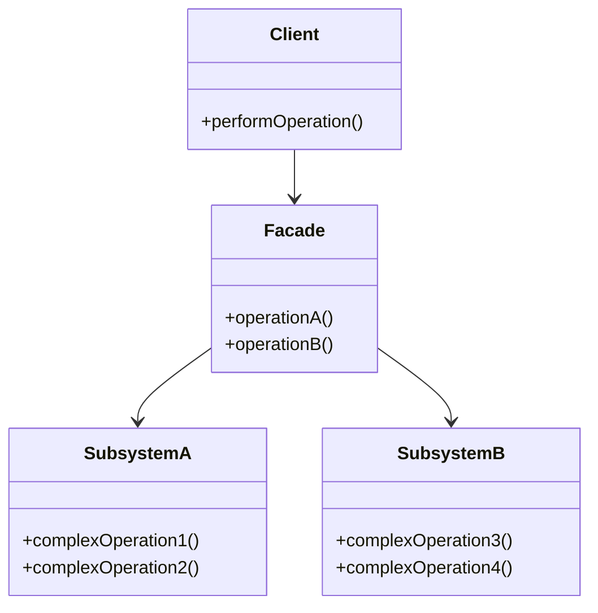

## 4.5.2 Simplifying Complex Subsystems

In the realm of software design, complexity is often an unavoidable aspect of creating robust and feature-rich applications. However, managing this complexity is crucial to ensure that systems remain maintainable, scalable, and understandable. The Facade Pattern is a structural design pattern that provides a simplified interface to a complex subsystem, making it easier for clients to interact with the system without needing to understand its intricacies.

### Understanding the Client's Perspective

From a client's perspective, interacting with a complex subsystem can be daunting. The learning curve can be steep, especially for new developers who need to familiarize themselves with the intricate details of the subsystem. The Facade Pattern addresses this challenge by offering a high-level interface that abstracts the complexities, allowing clients to perform operations without delving into the underlying details.

#### Reducing the Learning Curve

The Facade Pattern significantly reduces the learning curve for new developers. By providing a simplified interface, it allows developers to focus on what they need to accomplish rather than how the subsystem operates internally. This abstraction not only accelerates the onboarding process but also reduces the likelihood of errors that can occur when interacting directly with complex components.

### Examples of Complex Operations Simplified by a Facade

Let's explore some scenarios where the Facade Pattern can simplify complex operations such as file operations, network communication, and multimedia processing.

#### File Operations

File operations often involve multiple steps, including opening files, reading or writing data, and closing files. A Facade can encapsulate these operations into a single, cohesive interface.

```python
class FileFacade:
    def __init__(self, filename):
        self.filename = filename

    def read_file(self):
        with open(self.filename, 'r') as file:
            return file.read()

    def write_file(self, data):
        with open(self.filename, 'w') as file:
            file.write(data)

file_facade = FileFacade('example.txt')
file_facade.write_file('Hello, World!')
content = file_facade.read_file()
print(content)
```

In this example, the `FileFacade` class provides a simple interface for reading and writing files, hiding the complexity of file handling from the client.

#### Network Communication

Network communication can involve setting up connections, handling protocols, and managing data transmission. A Facade can streamline these processes.

```python
import socket

class NetworkFacade:
    def __init__(self, host, port):
        self.host = host
        self.port = port

    def send_message(self, message):
        with socket.socket(socket.AF_INET, socket.SOCK_STREAM) as s:
            s.connect((self.host, self.port))
            s.sendall(message.encode())
            response = s.recv(1024)
            return response.decode()

network_facade = NetworkFacade('localhost', 8080)
response = network_facade.send_message('Hello, Server!')
print(response)
```

Here, the `NetworkFacade` class abstracts the details of socket programming, allowing the client to send messages without worrying about the underlying network operations.

#### Multimedia Processing

Multimedia processing may involve handling various formats, codecs, and rendering techniques. A Facade can simplify these tasks by providing a unified interface.

```python
class MultimediaFacade:
    def play_audio(self, file_path):
        print(f"Playing audio file: {file_path}")

    def play_video(self, file_path):
        print(f"Playing video file: {file_path}")

multimedia_facade = MultimediaFacade()
multimedia_facade.play_audio('song.mp3')
multimedia_facade.play_video('movie.mp4')
```

In this case, the `MultimediaFacade` class offers a straightforward way to play audio and video files, abstracting the complexities of multimedia processing.

### Promoting Loose Coupling with the Facade Pattern

One of the key benefits of the Facade Pattern is that it promotes loose coupling between the client and the subsystem. By providing a high-level interface, the Facade decouples the client from the details of the subsystem, making it easier to test and swap out subsystems without affecting the client code.

#### Benefits in Testing

Loose coupling facilitated by the Facade Pattern enhances testability. Since the client interacts with the Facade rather than the subsystem directly, you can easily mock or stub the Facade in unit tests, isolating the client code from the complexities of the subsystem.

```python
class MockFileFacade:
    def read_file(self):
        return 'Mock data'

    def write_file(self, data):
        print(f"Mock write: {data}")

mock_facade = MockFileFacade()
mock_facade.write_file('Test data')
assert mock_facade.read_file() == 'Mock data'
```

In this example, the `MockFileFacade` class acts as a stand-in for the real `FileFacade`, allowing you to test the client code without relying on actual file operations.

#### Swapping Out Subsystems

The Facade Pattern also makes it easier to swap out subsystems. If you need to replace or upgrade a subsystem, you can do so without affecting the client code, as long as the Facade interface remains consistent.

```python
class AdvancedFileFacade:
    def read_file(self):
        # New implementation
        return 'Advanced read'

    def write_file(self, data):
        # New implementation
        print(f"Advanced write: {data}")

advanced_facade = AdvancedFileFacade()
advanced_facade.write_file('New data')
print(advanced_facade.read_file())
```

Here, the `AdvancedFileFacade` class provides a new implementation for file operations, but the client code remains unchanged, demonstrating the flexibility offered by the Facade Pattern.

### Considerations When Using the Facade Pattern

While the Facade Pattern offers numerous benefits, there are some considerations to keep in mind to ensure that the abstraction doesn't become a bottleneck or limit functionality.

#### Avoiding Bottlenecks

It's important to ensure that the Facade doesn't become a performance bottleneck. If the Facade introduces unnecessary overhead or delays, it can negate the benefits of simplifying the subsystem. To avoid this, ensure that the Facade is efficient and only performs necessary operations.

#### Maintaining Functionality

While the Facade simplifies the interface, it's crucial not to limit the functionality of the subsystem. The Facade should provide access to essential features while allowing advanced users to bypass the Facade if they need to access more complex functionality.

```python
class FileFacade:
    def __init__(self, filename):
        self.filename = filename

    def read_file(self):
        with open(self.filename, 'r') as file:
            return file.read()

    def write_file(self, data):
        with open(self.filename, 'w') as file:
            file.write(data)

    def get_file_object(self):
        return open(self.filename, 'r+')

file_facade = FileFacade('example.txt')
file_object = file_facade.get_file_object()
```

In this example, the `FileFacade` class provides a method to access the file object directly, allowing advanced users to perform operations not covered by the Facade.

### Visualizing the Facade Pattern

To better understand how the Facade Pattern simplifies complex subsystems, let's visualize the interaction between the client, the Facade, and the subsystem.



In this diagram, the `Client` interacts with the `Facade`, which in turn communicates with `SubsystemA` and `SubsystemB`. The Facade acts as an intermediary, simplifying the client's interaction with the subsystems.

### Try It Yourself

To deepen your understanding of the Facade Pattern, try modifying the examples provided. For instance, you can:

- Extend the `FileFacade` to include additional file operations such as appending data.
- Enhance the `NetworkFacade` to handle different network protocols.
- Add support for additional multimedia formats in the `MultimediaFacade`.

By experimenting with these modifications, you'll gain a better grasp of how the Facade Pattern can be applied to simplify complex subsystems in various contexts.

### Knowledge Check

Before we wrap up, let's reinforce the key concepts covered in this section:

- The Facade Pattern provides a simplified interface to a complex subsystem, reducing the learning curve for clients.
- It promotes loose coupling, enhancing testability and flexibility in swapping out subsystems.
- Considerations include avoiding performance bottlenecks and ensuring that the Facade doesn't limit functionality.

### Embrace the Journey

Remember, the Facade Pattern is just one of many tools in your software design toolkit. As you continue your journey in mastering design patterns, keep experimenting, stay curious, and enjoy the process of creating elegant and maintainable software solutions.

## Quiz Time!



### What is the primary purpose of the Facade Pattern?

- [x] To provide a simplified interface to a complex subsystem
- [ ] To increase the complexity of a system
- [ ] To replace the need for other design patterns
- [ ] To directly expose all subsystem functionalities

> **Explanation:** The Facade Pattern is used to provide a simplified interface to a complex subsystem, making it easier for clients to interact with the system.

### How does the Facade Pattern reduce the learning curve for new developers?

- [x] By abstracting the complexities of the subsystem
- [ ] By increasing the number of classes they need to learn
- [ ] By removing all subsystem functionalities
- [ ] By requiring developers to understand all subsystem details

> **Explanation:** The Facade Pattern abstracts the complexities of the subsystem, allowing new developers to focus on the high-level interface rather than the intricate details.

### Which of the following is a benefit of using the Facade Pattern?

- [x] Promotes loose coupling between the client and the subsystem
- [ ] Increases the dependency on subsystem details
- [ ] Makes testing more difficult
- [ ] Limits the flexibility of the system

> **Explanation:** The Facade Pattern promotes loose coupling, making it easier to test and swap out subsystems without affecting the client code.

### What should be avoided when implementing a Facade?

- [x] Introducing unnecessary performance bottlenecks
- [ ] Providing a simplified interface
- [ ] Allowing access to essential features
- [ ] Promoting loose coupling

> **Explanation:** When implementing a Facade, it's important to avoid introducing unnecessary performance bottlenecks that could negate the benefits of simplification.

### How can advanced users access more complex functionality when using a Facade?

- [x] By bypassing the Facade to access the subsystem directly
- [ ] By using only the Facade's simplified interface
- [ ] By modifying the Facade's internal implementation
- [ ] By adding more complexity to the Facade

> **Explanation:** Advanced users can bypass the Facade to access the subsystem directly if they need to perform operations not covered by the Facade.

### What is a potential drawback of using the Facade Pattern?

- [x] It might limit access to some advanced functionalities
- [ ] It always increases system complexity
- [ ] It makes the system harder to understand
- [ ] It requires understanding all subsystem details

> **Explanation:** A potential drawback of the Facade Pattern is that it might limit access to some advanced functionalities if not designed carefully.

### In the provided file operations example, what does the `FileFacade` class do?

- [x] Provides a simple interface for reading and writing files
- [ ] Directly exposes file handling complexities
- [ ] Increases the complexity of file operations
- [ ] Removes the need for file operations

> **Explanation:** The `FileFacade` class provides a simple interface for reading and writing files, hiding the complexity of file handling from the client.

### How does the Facade Pattern enhance testability?

- [x] By allowing the Facade to be mocked or stubbed in tests
- [ ] By increasing the complexity of the subsystem
- [ ] By requiring direct interaction with the subsystem
- [ ] By making it harder to isolate client code

> **Explanation:** The Facade Pattern enhances testability by allowing the Facade to be mocked or stubbed in tests, isolating the client code from the complexities of the subsystem.

### What is the role of the Facade in the provided diagram?

- [x] Acts as an intermediary between the client and the subsystems
- [ ] Directly exposes all subsystem functionalities to the client
- [ ] Increases the complexity of the subsystem
- [ ] Replaces the need for other design patterns

> **Explanation:** In the diagram, the Facade acts as an intermediary between the client and the subsystems, simplifying the client's interaction with the subsystems.

### True or False: The Facade Pattern can be used to swap out subsystems without affecting the client code.

- [x] True
- [ ] False

> **Explanation:** True. The Facade Pattern allows subsystems to be swapped out without affecting the client code, as long as the Facade interface remains consistent.


