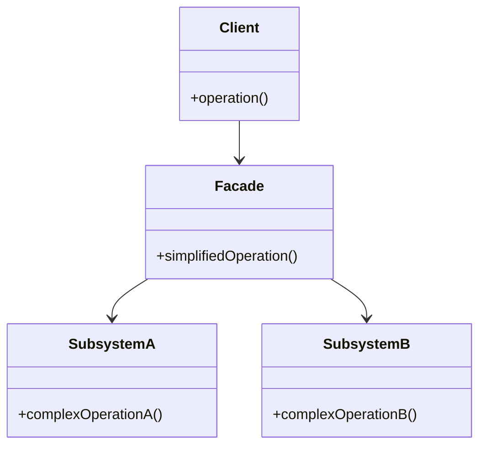

## 4.5.3 Use Cases and Examples

The Facade Pattern is a structural design pattern that provides a simplified interface to a complex subsystem. This pattern is particularly useful in software development where systems become intricate and challenging to manage. By introducing a Facade, developers can streamline interactions with complex libraries, APIs, or systems, making the codebase more maintainable and less error-prone.

### Understanding the Facade Pattern

Before diving into practical examples, let's briefly revisit the core concept of the Facade Pattern. The Facade Pattern involves creating a single class that provides a simplified interface to a set of interfaces in a subsystem. This pattern does not add new functionality but rather simplifies the usage of existing functionality.

### Practical Examples of the Facade Pattern

Let's explore some practical, domain-specific examples where the Facade Pattern can be applied effectively.

#### Example 1: Creating a Facade for a Complex Third-Party Library

Imagine you are working with a third-party library for image processing. This library is powerful but has a steep learning curve due to its complex API. You can create a Facade to simplify its usage.

```python
class ImageProcessor:
    def load_image(self, path):
        # Load image from path
        pass

    def apply_filter(self, filter_type):
        # Apply a filter to the image
        pass

    def save_image(self, path):
        # Save image to path
        pass

class ImageFacade:
    def __init__(self, path):
        self.processor = ImageProcessor()
        self.processor.load_image(path)

    def apply_sepia_filter(self):
        self.processor.apply_filter('sepia')

    def save(self, path):
        self.processor.save_image(path)

facade = ImageFacade('path/to/image.jpg')
facade.apply_sepia_filter()
facade.save('path/to/processed_image.jpg')
```

**Results and Benefits:**

- **Simplified Interface:** The `ImageFacade` class provides a straightforward interface for loading, processing, and saving images, abstracting away the complexity of the underlying library.
- **Improved Code Clarity:** By using the Facade, the client code becomes more readable and easier to maintain.
- **Reduced Errors:** With a simplified interface, the likelihood of errors due to misuse of the complex library is minimized.

#### Example 2: Simplifying Database Access Through a Facade

Database operations often involve multiple steps and configurations. A Facade can simplify these interactions, making database access more intuitive.

```python
class DatabaseConnection:
    def connect(self):
        # Connect to the database
        pass

    def execute_query(self, query):
        # Execute a database query
        pass

    def close(self):
        # Close the database connection
        pass

class DatabaseFacade:
    def __init__(self):
        self.connection = DatabaseConnection()

    def fetch_data(self, query):
        self.connection.connect()
        result = self.connection.execute_query(query)
        self.connection.close()
        return result

db_facade = DatabaseFacade()
data = db_facade.fetch_data('SELECT * FROM users')
```

**Results and Benefits:**

- **Streamlined Database Operations:** The `DatabaseFacade` class encapsulates the connection, query execution, and closing operations, providing a single method to fetch data.
- **Enhanced Maintainability:** Changes to the database operations can be made within the Facade without affecting client code.
- **Error Reduction:** By managing the connection lifecycle within the Facade, the risk of connection leaks is reduced.

### Identifying Potential Facades in Your Projects

Now that we've seen some examples, let's discuss how you can identify potential Facades in your projects.

#### Guidelines for Evaluating Where a Facade Would Be Beneficial

1. **Complex Subsystems:** Look for areas in your code where you interact with complex subsystems or libraries. If the API is difficult to use or understand, consider introducing a Facade.

2. **Repetitive Code:** If you notice repetitive patterns in your code when interacting with a subsystem, a Facade can encapsulate these patterns, reducing duplication.

3. **Frequent Errors:** If a subsystem is prone to misuse or errors, a Facade can provide a safer, more controlled interface.

4. **Changing Requirements:** In systems where requirements frequently change, a Facade can act as a buffer, allowing you to modify the underlying subsystem without impacting client code.

### Try It Yourself

To solidify your understanding of the Facade Pattern, try modifying the examples provided:

- **Experiment with Filters:** In the image processing example, add more filters to the `ImageFacade` class and see how it simplifies the application of multiple filters.
- **Extend Database Operations:** Enhance the `DatabaseFacade` to support additional operations like inserting or updating data, and observe how it streamlines database interactions.

### Visualizing the Facade Pattern

To better understand the structure of the Facade Pattern, let's visualize it using a class diagram.



**Diagram Description:**

- The **Client** interacts with the **Facade**, which provides a simplified interface.
- The **Facade** delegates calls to the **SubsystemA** and **SubsystemB**, handling the complexity internally.

### Conclusion

The Facade Pattern is a powerful tool for managing complexity in software systems. By providing a simplified interface to complex subsystems, it enhances code clarity, reduces errors, and improves maintainability. As you continue to develop software, keep an eye out for opportunities to introduce Facades, especially in areas where complexity and errors are prevalent.

### Further Reading

For more information on the Facade Pattern and other design patterns, consider exploring the following resources:

- [Design Patterns: Elements of Reusable Object-Oriented Software](https://en.wikipedia.org/wiki/Design_Patterns) - The seminal book on design patterns.
- [Python Design Patterns](https://python-patterns.guide/) - A guide to design patterns in Python.

### Knowledge Check

Before moving on, take a moment to reflect on what you've learned:

- Can you identify a subsystem in your current project that could benefit from a Facade?
- How would introducing a Facade improve the maintainability of your code?

Remember, this is just the beginning. As you progress, you'll discover more opportunities to apply the Facade Pattern and other design patterns in your projects. Keep experimenting, stay curious, and enjoy the journey!

## Quiz Time!



### What is the primary purpose of the Facade Pattern?

- [x] To provide a simplified interface to a complex subsystem.
- [ ] To add new functionality to a system.
- [ ] To improve the performance of a system.
- [ ] To replace existing subsystems.

> **Explanation:** The Facade Pattern is designed to provide a simplified interface to a complex subsystem, making it easier to use and understand.

### In the image processing example, what is the role of the `ImageFacade` class?

- [x] To simplify the interface for image processing operations.
- [ ] To add new image processing features.
- [ ] To replace the `ImageProcessor` class.
- [ ] To improve the performance of image processing.

> **Explanation:** The `ImageFacade` class simplifies the interface for image processing operations, making it easier to use the `ImageProcessor` class.

### How does the Facade Pattern improve code maintainability?

- [x] By encapsulating complex interactions within a single class.
- [ ] By adding new features to the codebase.
- [ ] By replacing existing classes with new ones.
- [ ] By optimizing the performance of the code.

> **Explanation:** The Facade Pattern improves maintainability by encapsulating complex interactions within a single class, making the code easier to understand and modify.

### What is a potential benefit of using a Facade for database operations?

- [x] It reduces the risk of connection leaks.
- [ ] It increases the speed of database queries.
- [ ] It adds new database features.
- [ ] It replaces the need for a database.

> **Explanation:** By managing the connection lifecycle within the Facade, the risk of connection leaks is reduced, improving the reliability of database operations.

### When should you consider introducing a Facade in your project?

- [x] When interacting with a complex subsystem.
- [x] When there is repetitive code related to a subsystem.
- [ ] When the system is already simple.
- [ ] When there are no errors in the system.

> **Explanation:** A Facade is beneficial when interacting with complex subsystems or when there is repetitive code, as it simplifies interactions and reduces duplication.

### What is a common characteristic of subsystems that benefit from a Facade?

- [x] They have complex APIs that are difficult to use.
- [ ] They are simple and easy to understand.
- [ ] They have no errors or issues.
- [ ] They are already well-documented.

> **Explanation:** Subsystems with complex APIs that are difficult to use benefit from a Facade, as it simplifies the interface and makes them easier to interact with.

### How can a Facade help with changing requirements?

- [x] It acts as a buffer, allowing modifications without affecting client code.
- [ ] It prevents any changes from being made.
- [ ] It automatically updates the system.
- [ ] It replaces the need for updates.

> **Explanation:** A Facade acts as a buffer, allowing modifications to the underlying subsystem without affecting client code, making it easier to adapt to changing requirements.

### What is a key feature of the Facade Pattern?

- [x] It provides a simplified interface to a complex system.
- [ ] It adds new functionality to a system.
- [ ] It replaces existing systems.
- [ ] It improves system performance.

> **Explanation:** The key feature of the Facade Pattern is providing a simplified interface to a complex system, making it easier to use and understand.

### How does the Facade Pattern reduce errors in a system?

- [x] By providing a controlled interface that minimizes misuse.
- [ ] By adding error-checking features.
- [ ] By replacing existing error-prone code.
- [ ] By optimizing system performance.

> **Explanation:** The Facade Pattern reduces errors by providing a controlled interface that minimizes misuse of complex subsystems, leading to fewer mistakes.

### True or False: The Facade Pattern adds new functionality to a system.

- [ ] True
- [x] False

> **Explanation:** False. The Facade Pattern does not add new functionality; it simplifies the usage of existing functionality by providing a simplified interface.


