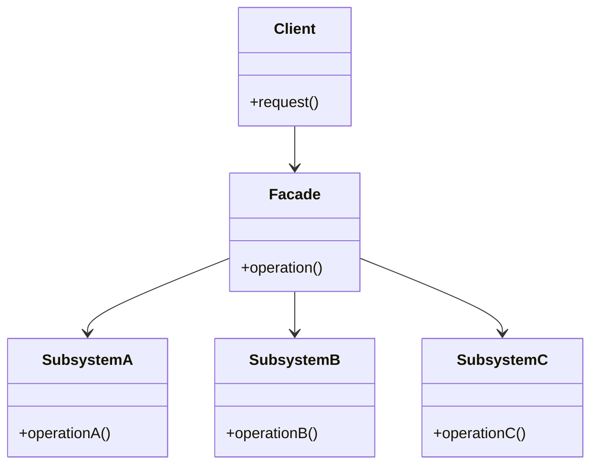
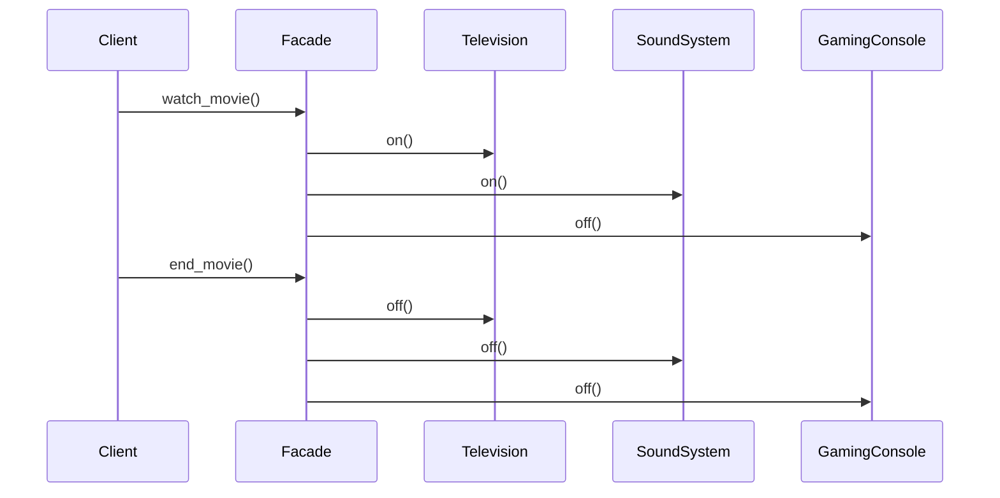

## 4.5 Facade Pattern

In the world of software development, complexity is often an unavoidable reality. As systems grow, they tend to become more intricate, with numerous components interacting in various ways. This complexity can make it challenging for developers to manage and maintain the codebase effectively. Enter the Facade Pattern—a design pattern that provides a simplified interface to a complex subsystem, making it easier to interact with and manage.

### Understanding the Facade Pattern

The Facade Pattern is a structural design pattern that aims to simplify interactions with complex systems by providing a unified interface. This pattern doesn't hide the subsystem interfaces; rather, it offers a more accessible way to use them. By doing so, it reduces the learning curve for developers and minimizes the risk of errors when interacting with the system.

#### Intent of the Facade Pattern

The primary intent of the Facade Pattern is to:

- Simplify the usage of complex systems by providing a single entry point.
- Reduce the coupling between clients and the subsystems.
- Enhance code readability and maintainability by abstracting complex interactions.

Imagine a scenario where you have a system with multiple interdependent classes, each with its own set of methods and interactions. Without a Facade, a client would need to understand and interact with each class individually, which can be cumbersome and error-prone. The Facade Pattern addresses this by encapsulating the complexity within a single class that exposes a simplified interface.

### Benefits of Using the Facade Pattern

The Facade Pattern offers several benefits, making it a valuable tool in a developer's arsenal:

1. **Reduced Coupling**: By providing a single point of interaction, the Facade Pattern decouples the client from the subsystem's internal workings. This makes it easier to modify the subsystem without affecting the client code.

2. **Improved Readability and Maintenance**: With a simplified interface, the code becomes more readable and easier to maintain. Developers can focus on the high-level operations without getting bogged down by the details.

3. **Ease of Use**: The Facade Pattern abstracts the complexity of the subsystem, making it easier for developers to use without needing to understand the intricate details.

4. **Flexibility**: While the Facade provides a simplified interface, it doesn't prevent direct access to the subsystem if needed. This flexibility allows developers to use advanced features when necessary.

### Structure of the Facade Pattern

To better understand the Facade Pattern, let's visualize its structure using a diagram. The diagram below illustrates how the Facade interacts with the subsystem classes:



In this diagram, the `Client` interacts with the `Facade`, which in turn communicates with the various subsystem classes (`SubsystemA`, `SubsystemB`, `SubsystemC`). The Facade acts as an intermediary, providing a simplified interface for the client.

### Implementing the Facade Pattern in Python

Let's dive into a practical example to see how the Facade Pattern can be implemented in Python. Consider a scenario where we have a complex system for managing a home entertainment setup, including a TV, a sound system, and a gaming console. Each component has its own set of operations, making it cumbersome for a user to manage them individually.

#### Step-by-Step Implementation

1. **Define the Subsystem Classes**

   First, we define the individual subsystem classes, each with its own operations:

   ```python
   class Television:
       def on(self):
           print("Turning on the TV")

       def off(self):
           print("Turning off the TV")

   class SoundSystem:
       def on(self):
           print("Turning on the sound system")

       def off(self):
           print("Turning off the sound system")

   class GamingConsole:
       def on(self):
           print("Turning on the gaming console")

       def off(self):
           print("Turning off the gaming console")
   ```

2. **Create the Facade Class**

   Next, we create the Facade class that provides a simplified interface to the subsystem:

   ```python
   class HomeTheaterFacade:
       def __init__(self, tv, sound_system, gaming_console):
           self.tv = tv
           self.sound_system = sound_system
           self.gaming_console = gaming_console

       def watch_movie(self):
           print("Setting up the home theater for movie night...")
           self.tv.on()
           self.sound_system.on()
           self.gaming_console.off()

       def end_movie(self):
           print("Shutting down the home theater...")
           self.tv.off()
           self.sound_system.off()
           self.gaming_console.off()
   ```

3. **Use the Facade in the Client Code**

   Finally, we use the Facade in the client code to interact with the subsystem:

   ```python
   if __name__ == "__main__":
       tv = Television()
       sound_system = SoundSystem()
       gaming_console = GamingConsole()

       home_theater = HomeTheaterFacade(tv, sound_system, gaming_console)

       home_theater.watch_movie()
       home_theater.end_movie()
   ```

   In this example, the `HomeTheaterFacade` class provides a simple interface for setting up and shutting down the home theater system. The client code interacts with the Facade, which manages the interactions with the individual components.

### Common Use Cases for the Facade Pattern

The Facade Pattern is particularly useful in scenarios where you need to simplify interactions with complex systems. Here are some common use cases:

- **Working with Libraries or APIs**: When using third-party libraries or APIs, the Facade Pattern can provide a simplified interface, making it easier to integrate and use the library's functionality.

- **Interacting with Legacy Code**: Legacy systems often have complex interfaces that can be challenging to work with. A Facade can wrap the legacy code, providing a more modern and user-friendly interface.

- **Managing Complex Subsystems**: In systems with multiple interdependent components, the Facade Pattern can help manage the complexity by providing a single point of interaction.

### Potential Drawbacks of the Facade Pattern

While the Facade Pattern offers numerous benefits, it's important to be aware of potential drawbacks:

- **Over-Simplification**: By abstracting the complexity, the Facade Pattern may limit access to advanced features of the subsystem. Developers may need to bypass the Facade for more granular control.

- **Increased Maintenance**: The Facade itself can become a point of maintenance, especially if the underlying subsystem changes frequently. Keeping the Facade in sync with the subsystem can require additional effort.

### Try It Yourself

To deepen your understanding of the Facade Pattern, try modifying the example code:

- **Add More Components**: Introduce additional components to the home theater system, such as a DVD player or a streaming device, and update the Facade to manage them.

- **Enhance Functionality**: Add more operations to the Facade, such as adjusting the volume or switching input sources, and see how it affects the client code.

- **Experiment with Direct Access**: Try accessing the subsystem classes directly from the client code to understand the difference in complexity.

### Visualizing the Facade Pattern in Action

To further illustrate the Facade Pattern, let's create a sequence diagram showing the interactions between the client, Facade, and subsystem classes:



This diagram visualizes the sequence of interactions when the client uses the Facade to watch and end a movie. The Facade coordinates the operations across the subsystem components, providing a seamless experience for the client.

### References and Links

For further reading on the Facade Pattern and its applications, consider exploring the following resources:

- [Design Patterns: Elements of Reusable Object-Oriented Software](https://en.wikipedia.org/wiki/Design_Patterns) - A foundational book on design patterns.
- [Refactoring Guru: Facade Pattern](https://refactoring.guru/design-patterns/facade) - An online resource with detailed explanations and examples.
- [Python Design Patterns](https://python-patterns.guide/) - A guide to implementing design patterns in Python.

### Knowledge Check

Before we wrap up, let's reinforce what we've learned with a few questions:

- What is the primary purpose of the Facade Pattern?
- How does the Facade Pattern improve code readability and maintenance?
- Can the Facade Pattern limit access to advanced features of a subsystem?

### Embrace the Journey

Remember, mastering design patterns is a journey. The Facade Pattern is just one of many tools available to help you manage complexity and improve your codebase. As you continue to explore and experiment with design patterns, you'll gain a deeper understanding of how to build robust and maintainable software systems. Keep experimenting, stay curious, and enjoy the journey!

## Quiz Time!



### What is the primary purpose of the Facade Pattern?

- [x] To provide a simplified interface to a complex subsystem
- [ ] To hide all subsystem interfaces from the client
- [ ] To increase coupling between clients and subsystems
- [ ] To replace the subsystem entirely

> **Explanation:** The Facade Pattern provides a simplified interface to a complex subsystem, making it easier to interact with without hiding the subsystem interfaces.

### How does the Facade Pattern improve code readability?

- [x] By providing a single point of interaction with the subsystem
- [ ] By exposing all subsystem details to the client
- [ ] By increasing the complexity of the client code
- [ ] By requiring the client to manage subsystem interactions

> **Explanation:** The Facade Pattern improves code readability by providing a single point of interaction, abstracting the complexity of the subsystem.

### What is a potential drawback of the Facade Pattern?

- [x] It may limit access to advanced features of the subsystem
- [ ] It always hides all subsystem interfaces
- [ ] It increases the complexity of the subsystem
- [ ] It requires the client to interact with each subsystem class individually

> **Explanation:** A potential drawback of the Facade Pattern is that it may limit access to advanced features of the subsystem by providing a simplified interface.

### In which scenario is the Facade Pattern particularly useful?

- [x] When working with complex libraries or APIs
- [ ] When the subsystem is already simple and easy to use
- [ ] When the client needs to manage each subsystem class individually
- [ ] When the subsystem has no interdependent components

> **Explanation:** The Facade Pattern is particularly useful when working with complex libraries or APIs, as it simplifies interactions.

### Can the Facade Pattern be used with legacy code?

- [x] Yes, it can wrap legacy code to provide a modern interface
- [ ] No, it is only applicable to new systems
- [ ] Yes, but it requires rewriting the entire subsystem
- [ ] No, it cannot interact with legacy systems

> **Explanation:** The Facade Pattern can be used with legacy code to provide a modern and user-friendly interface.

### What does the Facade Pattern reduce between clients and subsystems?

- [x] Coupling
- [ ] Complexity
- [ ] Functionality
- [ ] Performance

> **Explanation:** The Facade Pattern reduces coupling between clients and subsystems by providing a unified interface.

### How does the Facade Pattern affect subsystem interfaces?

- [x] It provides an easier way to use them without hiding them
- [ ] It hides them completely from the client
- [ ] It exposes all details to the client
- [ ] It replaces them with new interfaces

> **Explanation:** The Facade Pattern provides an easier way to use subsystem interfaces without hiding them.

### What is a benefit of using the Facade Pattern?

- [x] Improved code maintainability
- [ ] Increased complexity
- [ ] Direct access to all subsystem features
- [ ] More detailed client code

> **Explanation:** A benefit of using the Facade Pattern is improved code maintainability due to its simplified interface.

### True or False: The Facade Pattern prevents direct access to the subsystem.

- [ ] True
- [x] False

> **Explanation:** False. The Facade Pattern does not prevent direct access to the subsystem; it provides a simplified interface while allowing direct access if needed.

### Which of the following is NOT a use case for the Facade Pattern?

- [ ] Simplifying interactions with complex systems
- [ ] Providing a modern interface to legacy code
- [ ] Managing multiple interdependent components
- [x] Increasing the complexity of the client code

> **Explanation:** The Facade Pattern is not used to increase the complexity of the client code; it is used to simplify interactions with complex systems.


