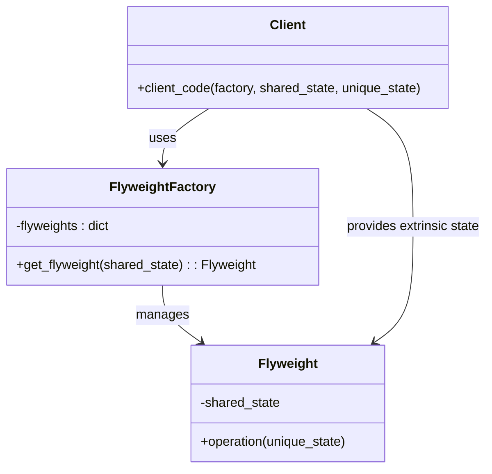

## 4.6.1 Implementing Flyweight in Python

In this section, we will explore the Flyweight pattern, a structural design pattern that helps optimize memory usage by sharing common state among multiple objects. This pattern is particularly useful when dealing with a large number of similar objects, as it reduces memory consumption by minimizing the duplication of shared data. Let's dive into the details of implementing the Flyweight pattern in Python.

### Understanding the Flyweight Pattern

The Flyweight pattern is designed to minimize memory usage by sharing as much data as possible with similar objects. It achieves this by separating the intrinsic state (shared data) from the extrinsic state (context-specific data). The intrinsic state is stored in a Flyweight object, while the extrinsic state is passed to the Flyweight methods as needed.

#### Key Concepts

- **Intrinsic State**: The shared, immutable data that can be reused across multiple objects.
- **Extrinsic State**: The context-specific data that varies from one object to another.
- **Flyweight Factory**: A component responsible for managing and reusing Flyweight instances.

### Step-by-Step Implementation

Let's walk through the process of implementing the Flyweight pattern in Python. We'll start by defining the Flyweight class, followed by the Flyweight factory, and finally demonstrate how clients can provide extrinsic state.

#### Step 1: Define the Flyweight Class

The Flyweight class encapsulates the intrinsic state. This state is shared among multiple objects, so it should be immutable to ensure consistency.

```python
class Flyweight:
    def __init__(self, shared_state):
        self._shared_state = shared_state

    def operation(self, unique_state):
        # Combine intrinsic and extrinsic state for operation
        print(f"Flyweight: Shared ({self._shared_state}) and Unique ({unique_state}) state.")
```

In this example, the `Flyweight` class has a constructor that initializes the shared state. The `operation` method takes a unique state as a parameter, allowing clients to provide context-specific information.

#### Step 2: Create a Flyweight Factory

The Flyweight factory is responsible for creating and managing Flyweight instances. It ensures that Flyweight objects are reused whenever possible.

```python
class FlyweightFactory:
    def __init__(self):
        self._flyweights = {}

    def get_flyweight(self, shared_state):
        # Use a dictionary to manage Flyweight instances
        if shared_state not in self._flyweights:
            self._flyweights[shared_state] = Flyweight(shared_state)
            print(f"Creating new Flyweight for shared state: {shared_state}")
        else:
            print(f"Reusing existing Flyweight for shared state: {shared_state}")
        return self._flyweights[shared_state]
```

The `FlyweightFactory` class uses a dictionary to store and manage Flyweight instances. When a client requests a Flyweight, the factory checks if an instance with the desired shared state already exists. If not, it creates a new Flyweight; otherwise, it reuses the existing one.

#### Step 3: Provide Extrinsic State

Clients provide the extrinsic state when invoking Flyweight methods. This allows the Flyweight to perform operations based on both shared and unique data.

```python
def client_code(factory, shared_state, unique_state):
    flyweight = factory.get_flyweight(shared_state)
    flyweight.operation(unique_state)

factory = FlyweightFactory()
client_code(factory, "shared1", "uniqueA")
client_code(factory, "shared1", "uniqueB")
client_code(factory, "shared2", "uniqueC")
```

In this example, the `client_code` function retrieves a Flyweight from the factory and invokes its `operation` method with a unique state. The Flyweight combines the shared and unique state to perform its operation.

### Memory Usage Improvements

The Flyweight pattern significantly reduces memory usage by minimizing the duplication of shared data. Let's compare memory usage before and after applying the Flyweight pattern.

#### Before Flyweight

Consider a scenario where we have 1,000 objects, each with a shared state of 100 bytes and a unique state of 10 bytes. Without the Flyweight pattern, the total memory usage would be:

 \text{Total Memory} = 1,000 \times (100 + 10) = 110,000 \text{ bytes} 

#### After Flyweight

With the Flyweight pattern, we only store one instance of the shared state, reducing memory usage to:

 \text{Total Memory} = 100 + (1,000 \times 10) = 10,100 \text{ bytes} 

This demonstrates a significant reduction in memory usage, especially when dealing with a large number of similar objects.

### Thread Safety Considerations

When implementing the Flyweight pattern in a multi-threaded environment, it's important to ensure thread safety. Concurrent access to Flyweight instances can lead to race conditions and data inconsistencies.

#### Handling Concurrent Access

To handle concurrent access, consider using synchronization mechanisms such as locks or thread-safe data structures. Here's an example of how to make the Flyweight factory thread-safe using Python's `threading` module:

```python
import threading

class ThreadSafeFlyweightFactory:
    def __init__(self):
        self._flyweights = {}
        self._lock = threading.Lock()

    def get_flyweight(self, shared_state):
        with self._lock:
            if shared_state not in self._flyweights:
                self._flyweights[shared_state] = Flyweight(shared_state)
                print(f"Creating new Flyweight for shared state: {shared_state}")
            else:
                print(f"Reusing existing Flyweight for shared state: {shared_state}")
            return self._flyweights[shared_state]
```

In this example, we use a lock to synchronize access to the Flyweight instances, ensuring that only one thread can modify the shared data at a time.

### Visualizing the Flyweight Pattern

To better understand the Flyweight pattern, let's visualize the relationship between the Flyweight, Flyweight Factory, and the client.



This diagram illustrates how the Flyweight Factory manages Flyweight instances, and how the client interacts with both the factory and the Flyweight by providing extrinsic state.

### Try It Yourself

Now that we've covered the Flyweight pattern in detail, it's time to experiment with the code. Try the following modifications to deepen your understanding:

1. **Add More Flyweights**: Extend the example by adding more Flyweight instances with different shared states. Observe how the factory manages these instances.

2. **Measure Memory Usage**: Use Python's `sys.getsizeof()` function to measure the memory usage of Flyweight instances compared to non-Flyweight objects.

3. **Implement Thread Safety**: Modify the example to simulate concurrent access to the Flyweight factory. Use threading to test the thread-safe implementation.

### Knowledge Check

Before we wrap up, let's reinforce what we've learned with a few questions:

- What is the primary purpose of the Flyweight pattern?
- How does the Flyweight pattern achieve memory optimization?
- What are the key components of the Flyweight pattern?
- How can thread safety be ensured when using the Flyweight pattern?

### Conclusion

The Flyweight pattern is a powerful tool for optimizing memory usage in applications with a large number of similar objects. By separating intrinsic and extrinsic state, and reusing shared data, the Flyweight pattern reduces memory consumption and improves performance. Remember to consider thread safety when implementing this pattern in concurrent environments.

### Further Reading

For more information on the Flyweight pattern and other design patterns, consider exploring the following resources:

- [Design Patterns: Elements of Reusable Object-Oriented Software](https://en.wikipedia.org/wiki/Design_Patterns)
- [Python Design Patterns](https://refactoring.guru/design-patterns/python)

## Quiz Time!



### What is the primary purpose of the Flyweight pattern?

- [x] To minimize memory usage by sharing common state among multiple objects.
- [ ] To increase the speed of object creation.
- [ ] To simplify the object creation process.
- [ ] To ensure thread safety in multi-threaded applications.

> **Explanation:** The Flyweight pattern is designed to minimize memory usage by sharing as much data as possible with similar objects.

### How does the Flyweight pattern achieve memory optimization?

- [x] By separating intrinsic and extrinsic state and reusing shared data.
- [ ] By creating new instances for each object.
- [ ] By using a complex caching mechanism.
- [ ] By reducing the number of method calls.

> **Explanation:** The Flyweight pattern separates intrinsic (shared) and extrinsic (unique) state, allowing shared data to be reused across multiple objects.

### What are the key components of the Flyweight pattern?

- [x] Flyweight, Flyweight Factory, and Client.
- [ ] Singleton, Factory, and Observer.
- [ ] Adapter, Decorator, and Proxy.
- [ ] Builder, Prototype, and Command.

> **Explanation:** The key components of the Flyweight pattern are the Flyweight, Flyweight Factory, and the Client.

### How can thread safety be ensured when using the Flyweight pattern?

- [x] By using synchronization mechanisms such as locks.
- [ ] By avoiding the use of shared data.
- [ ] By creating separate instances for each thread.
- [ ] By using a single-threaded environment.

> **Explanation:** Thread safety can be ensured by using synchronization mechanisms such as locks to control access to shared data.

### What is the role of the Flyweight Factory?

- [x] To manage and reuse Flyweight instances.
- [ ] To create new Flyweight instances for each request.
- [ ] To handle client requests directly.
- [ ] To store extrinsic state.

> **Explanation:** The Flyweight Factory is responsible for managing and reusing Flyweight instances, ensuring that shared data is not duplicated.

### Which of the following is an example of intrinsic state?

- [x] The shared, immutable data used by multiple objects.
- [ ] The unique, context-specific data for each object.
- [ ] The configuration settings for a specific client.
- [ ] The runtime environment variables.

> **Explanation:** Intrinsic state refers to the shared, immutable data that can be reused across multiple objects.

### What is the benefit of separating intrinsic and extrinsic state?

- [x] It allows for memory optimization by reusing shared data.
- [ ] It simplifies the object creation process.
- [ ] It increases the speed of method execution.
- [ ] It ensures thread safety in multi-threaded applications.

> **Explanation:** Separating intrinsic and extrinsic state allows for memory optimization by reusing shared data, reducing duplication.

### How does the Flyweight pattern improve performance?

- [x] By reducing memory consumption through shared data.
- [ ] By increasing the speed of object creation.
- [ ] By simplifying the object creation process.
- [ ] By ensuring thread safety in multi-threaded applications.

> **Explanation:** The Flyweight pattern improves performance by reducing memory consumption through the reuse of shared data.

### In which scenario is the Flyweight pattern most beneficial?

- [x] When dealing with a large number of similar objects.
- [ ] When creating a single instance of an object.
- [ ] When managing complex object hierarchies.
- [ ] When implementing real-time systems.

> **Explanation:** The Flyweight pattern is most beneficial when dealing with a large number of similar objects, as it reduces memory usage.

### True or False: The Flyweight pattern can be used to simplify the object creation process.

- [ ] True
- [x] False

> **Explanation:** The Flyweight pattern is primarily used to optimize memory usage, not to simplify the object creation process.



Remember, this is just the beginning. As you progress, you'll build more complex and efficient systems using design patterns. Keep experimenting, stay curious, and enjoy the journey!
