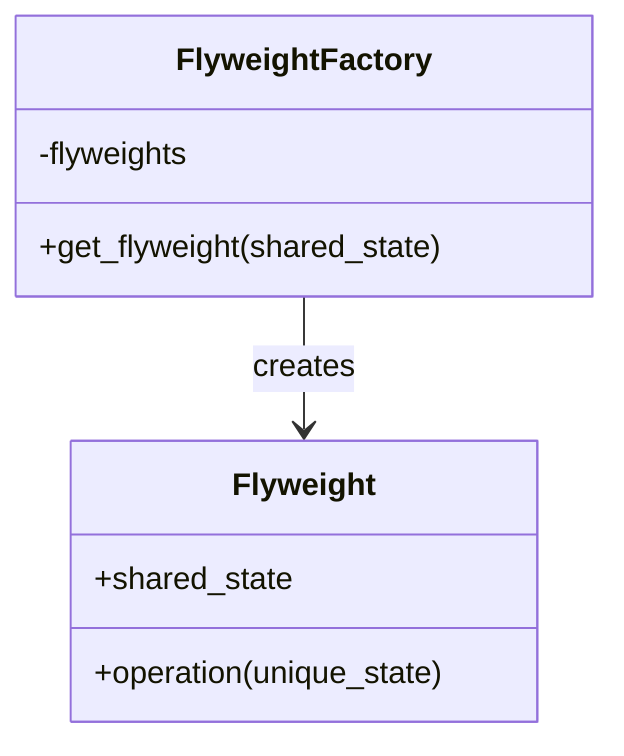

## 4.6.2 Memory Optimization

In the realm of software development, efficient memory management is crucial for building high-performance applications. Memory optimization not only enhances the speed and responsiveness of applications but also reduces operational costs, especially in environments with limited resources. In this section, we will delve into strategies for profiling memory usage in Python, explore the Flyweight pattern as a means of reducing memory consumption, and discuss best practices for achieving a balance between optimization and maintainability.

### Profiling Memory Usage in Python

Before embarking on memory optimization, it is essential to understand the current memory usage of your application. Profiling tools can help identify memory bottlenecks and provide insights into where optimizations are most needed.

#### Tools for Memory Profiling

1. **memory_profiler**: This is a Python module for monitoring memory usage of a program. It provides a line-by-line analysis of memory consumption, making it easier to pinpoint memory-intensive parts of the code.

   - **Installation**: You can install `memory_profiler` using pip:
     ```bash
     pip install memory_profiler
     ```

   - **Usage**: Decorate functions with `@profile` to analyze their memory usage.
     ```python
     from memory_profiler import profile

     @profile
     def my_function():
         a = [i for i in range(10000)]
         return a

     if __name__ == "__main__":
         my_function()
     ```

2. **tracemalloc**: This is a built-in Python module that tracks memory allocations. It provides detailed information about memory usage, including the traceback of each allocation, which can be invaluable for diagnosing memory leaks.

   - **Usage**: Start tracing memory allocations and display statistics.
     ```python
     import tracemalloc

     tracemalloc.start()

     # Your code here

     snapshot = tracemalloc.take_snapshot()
     top_stats = snapshot.statistics('lineno')

     print("[ Top 10 ]")
     for stat in top_stats[:10]:
         print(stat)
     ```

#### Visualizing Memory Usage

Visualizing memory usage can provide a clearer understanding of memory allocation patterns and help identify areas for optimization. Tools like `matplotlib` can be used to plot memory usage over time, providing a visual representation of how memory is consumed during program execution.

```python
import matplotlib.pyplot as plt
import tracemalloc

def plot_memory_usage():
    tracemalloc.start()
    # Simulate memory usage
    data = [i for i in range(100000)]
    snapshot = tracemalloc.take_snapshot()
    tracemalloc.stop()

    sizes = [stat.size for stat in snapshot.statistics('lineno')]
    plt.plot(sizes)
    plt.title('Memory Usage Over Time')
    plt.xlabel('Time')
    plt.ylabel('Memory (bytes)')
    plt.show()

plot_memory_usage()
```

### Memory Optimization Using Flyweight Pattern

The Flyweight pattern is a structural design pattern aimed at minimizing memory usage by sharing as much data as possible with similar objects. This pattern is particularly useful when dealing with a large number of objects that share common data.

#### Implementing Flyweight Pattern in Python

The Flyweight pattern involves creating a shared object (the flyweight) that can be used by multiple contexts. This reduces the number of objects created and thus the memory footprint.

```python
class Flyweight:
    def __init__(self, shared_state):
        self.shared_state = shared_state

    def operation(self, unique_state):
        print(f"Flyweight: Displaying shared ({self.shared_state}) and unique ({unique_state}) state.")

class FlyweightFactory:
    def __init__(self):
        self._flyweights = {}

    def get_flyweight(self, shared_state):
        if not shared_state in self._flyweights:
            self._flyweights[shared_state] = Flyweight(shared_state)
            print(f"FlyweightFactory: Creating new flyweight for {shared_state}")
        else:
            print(f"FlyweightFactory: Reusing existing flyweight for {shared_state}")
        return self._flyweights[shared_state]

factory = FlyweightFactory()
flyweight1 = factory.get_flyweight("SharedState1")
flyweight2 = factory.get_flyweight("SharedState1")
flyweight3 = factory.get_flyweight("SharedState2")

flyweight1.operation("UniqueStateA")
flyweight2.operation("UniqueStateB")
flyweight3.operation("UniqueStateC")
```

#### Quantifying Memory Savings

To quantify the memory savings achieved by the Flyweight pattern, consider a scenario where you have 10,000 objects, each with a shared state of 100 bytes and a unique state of 10 bytes. Without the Flyweight pattern, the total memory usage would be:

- Total memory = (shared state + unique state) * number of objects
- Total memory = (100 + 10) * 10,000 = 1,100,000 bytes

With the Flyweight pattern, the shared state is stored once, and only the unique state is stored for each object:

- Total memory = shared state + (unique state * number of objects)
- Total memory = 100 + (10 * 10,000) = 100,100 bytes

This results in a significant reduction in memory usage, demonstrating the effectiveness of the Flyweight pattern in optimizing memory.

### When is Optimization Necessary?

While memory optimization can lead to performance improvements, it is important to avoid premature optimization. Focus on areas with the greatest impact, such as:

- **Memory-intensive operations**: Identify parts of the code that consume the most memory and prioritize optimizing them.
- **Performance bottlenecks**: Use profiling tools to pinpoint bottlenecks and target optimizations where they will have the most effect.
- **Resource-constrained environments**: In environments with limited memory resources, optimization becomes critical to ensure smooth operation.

### Best Practices for Memory Optimization

1. **Profile Before Optimizing**: Always profile your application to understand memory usage patterns before attempting optimization. This ensures that efforts are focused on areas that will yield the greatest benefits.

2. **Balance Optimization with Maintainability**: While optimization is important, it should not come at the cost of code readability and maintainability. Strive for a balance that maintains the clarity and structure of your code.

3. **Use Built-in Data Structures**: Python's built-in data structures, such as lists, dictionaries, and sets, are optimized for performance and memory usage. Use them whenever possible.

4. **Leverage Generators**: Generators allow you to iterate over data without storing it in memory, reducing memory usage for large datasets.

```python
def large_data_generator():
    for i in range(1000000):
        yield i

for data in large_data_generator():
    print(data)
```

5. **Avoid Unnecessary Copies**: Be mindful of creating unnecessary copies of data, especially large datasets. Use references or views instead of copies when possible.

6. **Release Unused Memory**: Explicitly release memory that is no longer needed by deleting references to objects or using context managers to manage resources.

```python
def process_data():
    data = [i for i in range(1000000)]
    # Process data
    del data  # Release memory

process_data()
```

### Try It Yourself

Experiment with the Flyweight pattern and memory profiling tools to see the impact of memory optimization in action. Try modifying the code examples provided to:

- Create additional flyweight objects with different shared states.
- Profile the memory usage of a program before and after applying the Flyweight pattern.
- Use `memory_profiler` to analyze the memory usage of a function that processes large datasets.

### Visualizing Memory Optimization

To better understand the Flyweight pattern and its impact on memory usage, let's visualize the relationship between shared and unique states using a class diagram.



**Diagram Description**: The class diagram above illustrates the Flyweight pattern, where the `FlyweightFactory` creates and manages `Flyweight` objects. Each `Flyweight` object contains a `shared_state` and performs operations with a `unique_state`.

### Knowledge Check

- **What is the primary goal of the Flyweight pattern?**
- **How can `memory_profiler` be used to analyze memory usage in Python?**
- **Why is it important to avoid premature optimization?**

### Conclusion

Memory optimization is a critical aspect of software development that can lead to significant performance improvements. By profiling memory usage and applying patterns like Flyweight, developers can reduce memory consumption and enhance the efficiency of their applications. Remember, the key is to focus on areas with the greatest impact and maintain a balance between optimization and code maintainability.

## Quiz Time!



### What is the primary purpose of the Flyweight pattern?

- [x] To minimize memory usage by sharing data among similar objects.
- [ ] To enhance the speed of data processing.
- [ ] To simplify code readability.
- [ ] To improve network communication.

> **Explanation:** The Flyweight pattern is designed to minimize memory usage by sharing as much data as possible with similar objects.

### Which tool provides a line-by-line analysis of memory consumption in Python?

- [x] memory_profiler
- [ ] tracemalloc
- [ ] cProfile
- [ ] PyCharm

> **Explanation:** `memory_profiler` is a Python module that provides a line-by-line analysis of memory consumption, making it easier to identify memory-intensive parts of the code.

### What is the main advantage of using tracemalloc over memory_profiler?

- [x] It tracks memory allocations and provides traceback information.
- [ ] It is faster in execution.
- [ ] It requires less setup.
- [ ] It is more accurate in CPU profiling.

> **Explanation:** `tracemalloc` tracks memory allocations and provides detailed traceback information, which is invaluable for diagnosing memory leaks.

### When should memory optimization be prioritized?

- [x] In memory-intensive operations and resource-constrained environments.
- [ ] During the initial stages of development.
- [ ] Only when performance issues arise.
- [ ] After the application has been deployed.

> **Explanation:** Memory optimization should be prioritized in memory-intensive operations and resource-constrained environments to ensure smooth operation.

### What is a key benefit of using generators in Python?

- [x] They reduce memory usage by not storing data in memory.
- [ ] They increase the speed of data processing.
- [ ] They simplify code structure.
- [ ] They enhance data security.

> **Explanation:** Generators allow you to iterate over data without storing it in memory, reducing memory usage for large datasets.

### Which of the following is a best practice for memory optimization?

- [x] Profile before optimizing.
- [ ] Optimize all parts of the code equally.
- [ ] Avoid using built-in data structures.
- [ ] Always use copies instead of references.

> **Explanation:** Profiling before optimizing ensures that efforts are focused on areas that will yield the greatest benefits.

### How can unnecessary copies of data be avoided in Python?

- [x] Use references or views instead of copies.
- [ ] Always use deep copies.
- [ ] Store data in global variables.
- [ ] Use immutable data structures.

> **Explanation:** Using references or views instead of copies helps avoid unnecessary duplication of data, especially for large datasets.

### What is the role of the FlyweightFactory in the Flyweight pattern?

- [x] It creates and manages Flyweight objects.
- [ ] It performs operations with unique states.
- [ ] It optimizes memory usage by deleting unused objects.
- [ ] It tracks memory allocations.

> **Explanation:** The FlyweightFactory is responsible for creating and managing Flyweight objects, ensuring that shared states are reused.

### Why is it important to balance optimization with maintainability?

- [x] To ensure code readability and structure are maintained.
- [ ] To reduce the number of lines of code.
- [ ] To increase the speed of development.
- [ ] To simplify debugging.

> **Explanation:** Balancing optimization with maintainability ensures that while the code is optimized for performance, it remains readable and maintainable.

### True or False: The Flyweight pattern is only applicable in Python.

- [ ] True
- [x] False

> **Explanation:** The Flyweight pattern is a general design pattern applicable in various programming languages, not just Python.



Remember, this is just the beginning. As you progress, you'll build more efficient and scalable applications. Keep experimenting, stay curious, and enjoy the journey!
