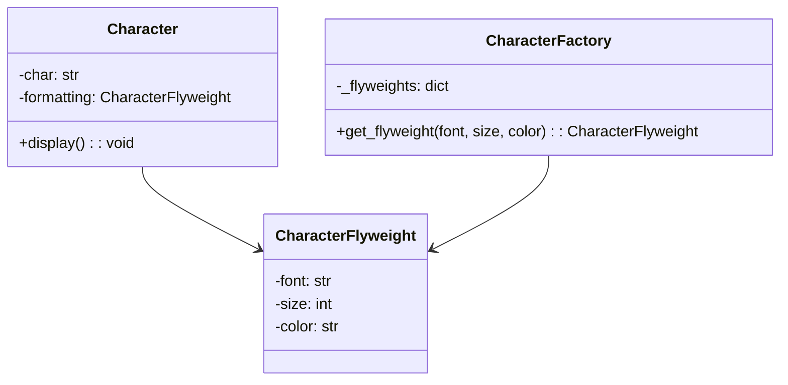

## 4.6.3 Use Cases and Examples

The Flyweight Pattern is a structural design pattern that allows programs to support a large number of fine-grained objects efficiently by sharing common parts of their state. This pattern is particularly useful in scenarios where memory usage is a concern, such as text editors and gaming applications. In this section, we'll delve into specific examples of how the Flyweight Pattern can be applied in these contexts, provide code snippets, and discuss the performance improvements observed.

### Understanding the Flyweight Pattern

Before we dive into examples, let's briefly recap what the Flyweight Pattern entails. The core idea is to minimize memory usage by sharing as much data as possible with similar objects. This is achieved by storing shared data externally and passing it to the objects that need it. The Flyweight Pattern is particularly effective when:

- A large number of objects are needed.
- The majority of the object's state can be made extrinsic (i.e., external to the object).
- The objects can be grouped based on shared intrinsic states.

### Use Case 1: Text Editors

Text editors are a prime example of where the Flyweight Pattern can be applied effectively. In a text editor, each character on the screen can be considered an object. If each character object stored its own formatting (font, size, color), the memory usage would be enormous. Instead, the Flyweight Pattern allows us to share formatting data among characters.

#### Implementing Flyweight in a Text Editor

Let's consider a simple text editor that uses the Flyweight Pattern to manage character formatting. We'll create a `Character` class that represents each character in the text, and a `CharacterFactory` that ensures characters with the same formatting share the same `Flyweight` object.

```python
class Character:
    def __init__(self, char, font, size, color):
        self.char = char
        self.formatting = CharacterFactory.get_flyweight(font, size, color)

    def display(self):
        print(f"Character: {self.char}, Font: {self.formatting.font}, Size: {self.formatting.size}, Color: {self.formatting.color}")

class CharacterFlyweight:
    def __init__(self, font, size, color):
        self.font = font
        self.size = size
        self.color = color

class CharacterFactory:
    _flyweights = {}

    @staticmethod
    def get_flyweight(font, size, color):
        key = (font, size, color)
        if key not in CharacterFactory._flyweights:
            CharacterFactory._flyweights[key] = CharacterFlyweight(font, size, color)
        return CharacterFactory._flyweights[key]

text = "Hello, World!"
characters = [Character(char, "Arial", 12, "black") for char in text]

for character in characters:
    character.display()
```

In this example, the `CharacterFactory` class ensures that characters with the same formatting share a single `CharacterFlyweight` instance. This reduces the memory footprint significantly, especially in large documents.

#### Results Observed

By applying the Flyweight Pattern, we achieve substantial memory savings. Instead of each character object storing its own formatting, they share a common `Flyweight` object. This is particularly beneficial in large documents where many characters share the same formatting.

### Use Case 2: Gaming

In gaming, the Flyweight Pattern is often used to manage game assets like character sprites. Games typically have many instances of the same object (e.g., enemies, trees, rocks), and creating a separate object for each instance can be inefficient.

#### Implementing Flyweight in Gaming

Let's explore how the Flyweight Pattern can be applied to manage sprites in a game. We'll create a `Sprite` class to represent game characters, and a `SpriteFactory` to manage shared sprite data.

```python
class Sprite:
    def __init__(self, name, image, position):
        self.name = name
        self.sprite_data = SpriteFactory.get_flyweight(image)
        self.position = position

    def render(self):
        print(f"Rendering {self.name} at {self.position} with image {self.sprite_data.image}")

class SpriteFlyweight:
    def __init__(self, image):
        self.image = image

class SpriteFactory:
    _flyweights = {}

    @staticmethod
    def get_flyweight(image):
        if image not in SpriteFactory._flyweights:
            SpriteFactory._flyweights[image] = SpriteFlyweight(image)
        return SpriteFactory._flyweights[image]

sprites = [
    Sprite("Enemy1", "enemy.png", (10, 20)),
    Sprite("Enemy2", "enemy.png", (30, 40)),
    Sprite("Tree", "tree.png", (50, 60))
]

for sprite in sprites:
    sprite.render()
```

In this example, the `SpriteFactory` class ensures that sprites with the same image share a single `SpriteFlyweight` instance. This reduces the memory usage associated with storing identical images for each sprite.

#### Results Observed

The Flyweight Pattern allows us to manage game assets more efficiently by sharing common data among multiple instances. This results in reduced memory usage and improved performance, especially in games with a large number of identical objects.

### Visualizing the Flyweight Pattern

To better understand how the Flyweight Pattern works, let's visualize the relationship between the objects using a class diagram.



In this diagram, we see that `Character` objects reference a shared `CharacterFlyweight` object for their formatting. The `CharacterFactory` manages the creation and reuse of these `Flyweight` objects.

### Applying the Flyweight Pattern to Your Projects

Consider applying the Flyweight Pattern in your projects where you have a large number of similar objects. Here are some scenarios where the Flyweight Pattern can be beneficial:

- **User Interface Elements**: In applications with complex UIs, similar widgets can share common styling data.
- **Data Visualization**: Charts with many identical data points can share rendering data.
- **Document Processing**: Large documents with repeated elements can benefit from shared formatting.

### Try It Yourself

Experiment with the Flyweight Pattern by modifying the code examples provided. Try changing the attributes of the `Flyweight` objects or adding new types of shared data. Observe how these changes affect memory usage and performance.

### Knowledge Check

- **Question**: What is the primary benefit of using the Flyweight Pattern?
  - **Answer**: The primary benefit is reduced memory usage by sharing common data among similar objects.

- **Question**: How does the Flyweight Pattern improve performance in gaming applications?
  - **Answer**: It reduces memory usage by sharing common sprite data among identical game objects.

### Summary

The Flyweight Pattern is a powerful tool for optimizing memory usage and improving performance in applications with a large number of similar objects. By sharing common data among objects, we can reduce the memory footprint and enhance the efficiency of our programs. Whether you're working on a text editor, a game, or any other application with repeated elements, consider leveraging the Flyweight Pattern to achieve better resource utilization.

## Quiz Time!



### What is the primary advantage of using the Flyweight Pattern?

- [x] Reduced memory usage
- [ ] Increased processing speed
- [ ] Simplified code structure
- [ ] Enhanced security

> **Explanation:** The Flyweight Pattern reduces memory usage by sharing common data among similar objects.

### In a text editor, what does the Flyweight Pattern help optimize?

- [x] Character formatting
- [ ] Text input speed
- [ ] Spell checking
- [ ] File saving

> **Explanation:** The Flyweight Pattern optimizes character formatting by sharing common formatting data among characters.

### How does the Flyweight Pattern benefit gaming applications?

- [x] By sharing sprite data among identical game objects
- [ ] By improving graphics rendering speed
- [ ] By enhancing game logic
- [ ] By simplifying game controls

> **Explanation:** The Flyweight Pattern benefits gaming applications by sharing sprite data among identical game objects, reducing memory usage.

### What is a key characteristic of Flyweight objects?

- [x] They have shared intrinsic state
- [ ] They are immutable
- [ ] They are always thread-safe
- [ ] They require no external dependencies

> **Explanation:** Flyweight objects have shared intrinsic state, which allows them to be reused among similar objects.

### Which of the following is NOT a typical use case for the Flyweight Pattern?

- [ ] Text editors
- [ ] Gaming
- [ ] User interface elements
- [x] Network protocols

> **Explanation:** The Flyweight Pattern is typically used in scenarios with many similar objects, such as text editors and gaming, but not specifically for network protocols.

### What role does the CharacterFactory play in the Flyweight Pattern?

- [x] It manages the creation and reuse of Flyweight objects
- [ ] It renders characters on the screen
- [ ] It stores character positions
- [ ] It processes user input

> **Explanation:** The CharacterFactory manages the creation and reuse of Flyweight objects, ensuring shared data is used efficiently.

### How can the Flyweight Pattern be applied to data visualization?

- [x] By sharing rendering data among identical data points
- [ ] By enhancing data processing speed
- [ ] By simplifying data input
- [ ] By improving data accuracy

> **Explanation:** The Flyweight Pattern can be applied to data visualization by sharing rendering data among identical data points, reducing memory usage.

### What is the relationship between a Character and a CharacterFlyweight in the Flyweight Pattern?

- [x] A Character references a shared CharacterFlyweight for formatting
- [ ] A CharacterFlyweight stores the position of a Character
- [ ] A CharacterFlyweight processes user input for a Character
- [ ] A Character manages the lifecycle of a CharacterFlyweight

> **Explanation:** In the Flyweight Pattern, a Character references a shared CharacterFlyweight for formatting, reducing memory usage.

### What is the main goal of the Flyweight Pattern?

- [x] To optimize memory usage by sharing common data
- [ ] To increase processing speed by parallelizing tasks
- [ ] To simplify code by reducing dependencies
- [ ] To enhance security by encrypting data

> **Explanation:** The main goal of the Flyweight Pattern is to optimize memory usage by sharing common data among similar objects.

### True or False: The Flyweight Pattern is only applicable to graphical applications.

- [ ] True
- [x] False

> **Explanation:** False. The Flyweight Pattern is applicable to any scenario where many similar objects can share common data, not just graphical applications.



Remember, this is just the beginning. As you progress, you'll build more complex and efficient applications. Keep experimenting, stay curious, and enjoy the journey!
