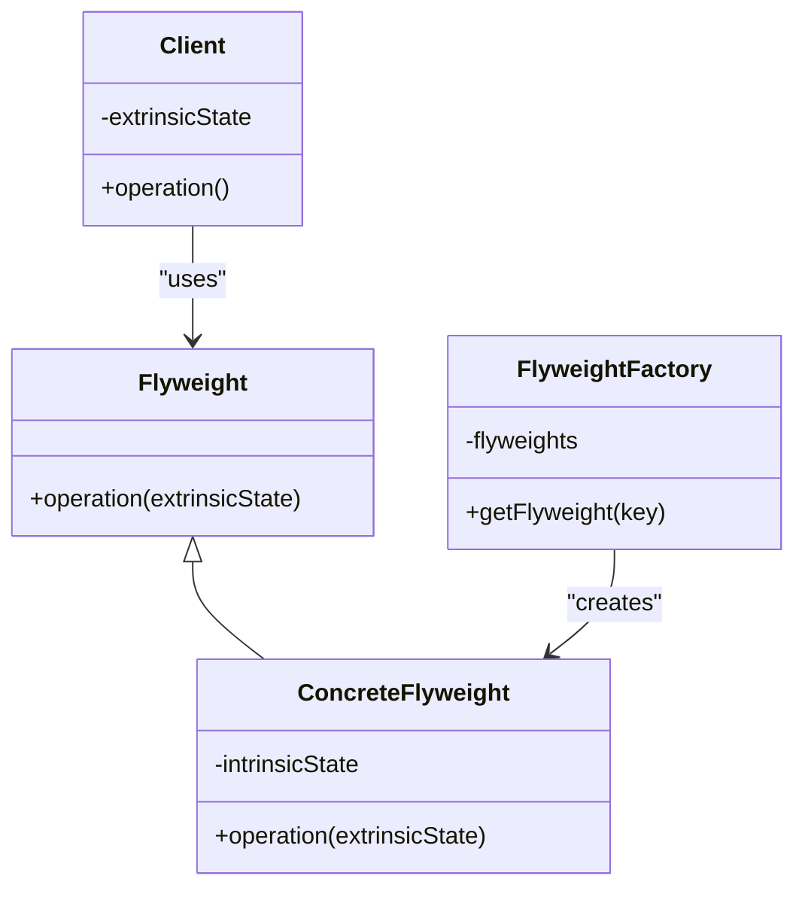
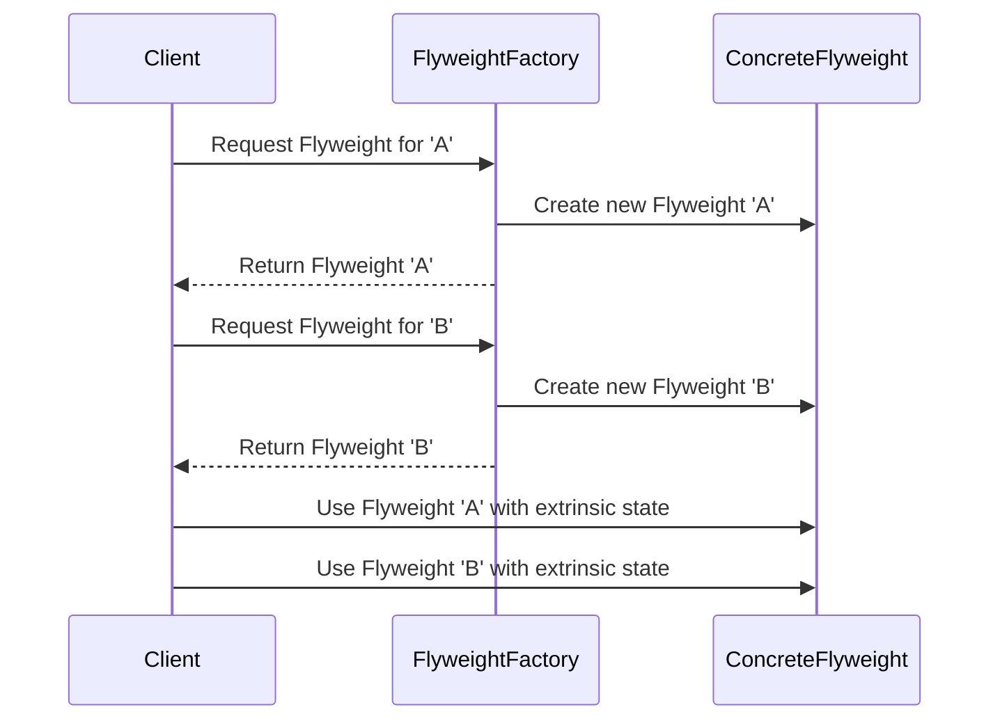

## 4.6 Flyweight Pattern

The Flyweight Pattern is a structural design pattern that focuses on minimizing memory usage by sharing as much data as possible with similar objects. This pattern is particularly useful when dealing with a large number of objects that share common data, such as characters in a text editor or graphical elements in a graphics application.

### The Problem: Excessive Memory Usage

In many applications, you may encounter scenarios where you need to create a large number of similar objects. For example, consider a text editor that needs to display thousands of characters on the screen. Each character could be represented as an object with properties like font, size, color, and position. If each character object stores all these properties, the memory usage can become excessive, especially for large documents.

The Flyweight Pattern addresses this problem by sharing common data among multiple objects, thus reducing memory consumption. It achieves this by separating the object's state into intrinsic and extrinsic states.

### Intrinsic and Extrinsic State

- **Intrinsic State**: This is the shared state that is stored in the Flyweight object. It is invariant and does not change across different contexts. For example, in a text editor, the font and color of the text could be considered intrinsic states if they are the same for multiple characters.

- **Extrinsic State**: This is the state that depends on the context and is supplied by the client. It is not stored in the Flyweight object but is passed to it when needed. In the text editor example, the position of each character on the screen would be an extrinsic state, as it varies for each character.

By distinguishing between intrinsic and extrinsic states, the Flyweight Pattern allows multiple objects to share the intrinsic state, while the extrinsic state is handled externally.

### Structure of the Flyweight Pattern

The Flyweight Pattern involves several key components:

1. **Flyweight Interface**: This defines the methods that Flyweight objects must implement. These methods typically include operations that can be performed on the intrinsic state.

2. **Concrete Flyweight**: This is the class that implements the Flyweight interface and stores the intrinsic state. Concrete Flyweights are shared among clients.

3. **Flyweight Factory**: This is responsible for creating and managing Flyweight objects. It ensures that Flyweights are shared and reused, rather than creating new instances for every request.

4. **Client**: The client interacts with Flyweight objects and provides the extrinsic state when invoking operations on them.

Here is a class diagram illustrating the Flyweight Pattern:



### Implementing the Flyweight Pattern in Python

Let's implement the Flyweight Pattern in Python with a simple example of a text editor that manages characters.

```python
class Flyweight:
    def operation(self, extrinsic_state):
        raise NotImplementedError("Subclasses must implement this method.")

class ConcreteFlyweight(Flyweight):
    def __init__(self, intrinsic_state):
        self.intrinsic_state = intrinsic_state

    def operation(self, extrinsic_state):
        print(f"Intrinsic State: {self.intrinsic_state}, Extrinsic State: {extrinsic_state}")

class FlyweightFactory:
    def __init__(self):
        self._flyweights = {}

    def get_flyweight(self, key):
        if key not in self._flyweights:
            self._flyweights[key] = ConcreteFlyweight(key)
        return self._flyweights[key]

factory = FlyweightFactory()

flyweight_a = factory.get_flyweight('A')
flyweight_b = factory.get_flyweight('B')

flyweight_a.operation("Position 1")
flyweight_a.operation("Position 2")
flyweight_b.operation("Position 3")
```

In this example, the `ConcreteFlyweight` class represents characters with intrinsic state (e.g., the character itself), while the extrinsic state (e.g., position) is provided by the client.

### Real-World Examples

The Flyweight Pattern is commonly used in scenarios where a large number of similar objects are needed:

- **Text Editors**: Characters in a document can be represented as Flyweights, sharing common properties like font and color, while position and style are extrinsic.

- **Graphics Applications**: Graphical elements such as shapes or icons can be shared among different parts of the application, with their positions and transformations handled externally.

- **Game Development**: In games, objects like trees, rocks, or enemies that appear multiple times can be implemented as Flyweights to save memory.

### Trade-offs and Considerations

While the Flyweight Pattern offers significant memory savings, it comes with certain trade-offs:

- **Complexity**: Separating intrinsic and extrinsic states can increase the complexity of the code. Developers need to carefully manage the shared and non-shared states.

- **Overhead**: Managing shared objects and ensuring they are reused can introduce overhead, especially if the Flyweight Factory is not implemented efficiently.

- **Suitability**: The Flyweight Pattern is most effective when there are many objects with a significant amount of shared state. If the shared state is minimal, the benefits may not justify the added complexity.

### Visualizing the Flyweight Pattern

To better understand how the Flyweight Pattern works, let's visualize the relationship between the Flyweight Factory, Flyweight objects, and the client:



This sequence diagram illustrates how the Flyweight Factory creates and manages Flyweight objects, ensuring they are shared among clients.

### Try It Yourself

To deepen your understanding of the Flyweight Pattern, try modifying the code example above:

- **Add More Characters**: Extend the example to include more characters and observe how the Flyweight Factory manages them.

- **Change Intrinsic State**: Experiment with different intrinsic states, such as font styles or sizes, and see how they affect the Flyweight objects.

- **Measure Memory Usage**: Use Python's memory profiling tools to measure the memory savings achieved by using the Flyweight Pattern.

### Knowledge Check

Before moving on, let's review some key concepts:

- **What is the primary goal of the Flyweight Pattern?**
  - To reduce memory usage by sharing common data among similar objects.

- **What are intrinsic and extrinsic states?**
  - Intrinsic state is shared and stored in the Flyweight object, while extrinsic state is context-dependent and supplied by the client.

- **What are some common use cases for the Flyweight Pattern?**
  - Text editors, graphics applications, and game development.

### Conclusion

The Flyweight Pattern is a powerful tool for optimizing memory usage in applications that require a large number of similar objects. By sharing common data and separating intrinsic and extrinsic states, developers can significantly reduce memory consumption and improve application performance. However, it's important to weigh the benefits against the added complexity and ensure that the pattern is suitable for the specific use case.

Remember, this is just the beginning. As you progress, you'll build more complex and interactive applications using the Flyweight Pattern. Keep experimenting, stay curious, and enjoy the journey!

## Quiz Time!



### What is the primary goal of the Flyweight Pattern?

- [x] To reduce memory usage by sharing common data among similar objects.
- [ ] To increase the speed of object creation.
- [ ] To simplify the interface of complex subsystems.
- [ ] To ensure a class has only one instance.

> **Explanation:** The Flyweight Pattern is designed to minimize memory usage by sharing as much data as possible with similar objects.

### What is intrinsic state in the context of the Flyweight Pattern?

- [x] Shared state stored in the Flyweight object.
- [ ] State dependent on the context, supplied by the client.
- [ ] The state that changes frequently.
- [ ] The state that is unique to each object.

> **Explanation:** Intrinsic state is the shared, invariant state that is stored in the Flyweight object and does not change across different contexts.

### Which of the following is an example of extrinsic state?

- [ ] Font style in a text editor.
- [ ] Color of a graphical element.
- [x] Position of a character in a document.
- [ ] The shape of a graphical element.

> **Explanation:** Extrinsic state is context-dependent and supplied by the client, such as the position of a character in a document.

### What role does the Flyweight Factory play in the Flyweight Pattern?

- [x] It creates and manages Flyweight objects, ensuring they are shared.
- [ ] It provides an interface for creating families of related objects.
- [ ] It defines the skeleton of an algorithm.
- [ ] It encapsulates a request as an object.

> **Explanation:** The Flyweight Factory is responsible for creating and managing Flyweight objects, ensuring they are shared and reused.

### What is a potential trade-off when using the Flyweight Pattern?

- [x] Increased complexity in separating states.
- [ ] Reduced flexibility in object creation.
- [ ] Increased memory usage.
- [ ] Slower object creation.

> **Explanation:** The Flyweight Pattern can increase complexity by requiring developers to separate intrinsic and extrinsic states.

### In which scenario is the Flyweight Pattern most effective?

- [x] When there are many objects with a significant amount of shared state.
- [ ] When objects need to be created quickly.
- [ ] When objects need to be accessed concurrently.
- [ ] When objects need to be modified frequently.

> **Explanation:** The Flyweight Pattern is most effective when there are many objects with a significant amount of shared state, allowing for memory optimization.

### What is the main benefit of separating intrinsic and extrinsic states?

- [x] It allows for memory optimization by sharing common data.
- [ ] It simplifies the interface of complex subsystems.
- [ ] It ensures a class has only one instance.
- [ ] It allows for faster object creation.

> **Explanation:** By separating intrinsic and extrinsic states, the Flyweight Pattern allows for memory optimization by sharing common data among objects.

### How does the Flyweight Pattern help in game development?

- [x] By allowing objects like trees or enemies to be shared, saving memory.
- [ ] By increasing the speed of rendering graphics.
- [ ] By simplifying the game's user interface.
- [ ] By ensuring the game runs on multiple platforms.

> **Explanation:** In game development, the Flyweight Pattern allows objects like trees or enemies to be shared, saving memory and improving performance.

### True or False: The Flyweight Pattern is suitable for scenarios with minimal shared state.

- [ ] True
- [x] False

> **Explanation:** The Flyweight Pattern is not suitable for scenarios with minimal shared state, as the benefits may not justify the added complexity.

### Which of the following is NOT a component of the Flyweight Pattern?

- [ ] Flyweight Interface
- [ ] Concrete Flyweight
- [ ] Flyweight Factory
- [x] Singleton Factory

> **Explanation:** The Flyweight Pattern consists of the Flyweight Interface, Concrete Flyweight, and Flyweight Factory, but not a Singleton Factory.


