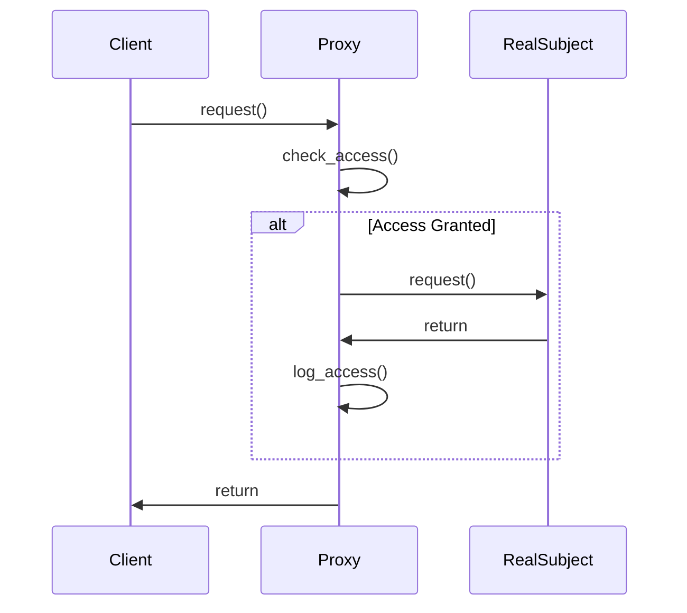

## 4.7.1 Implementing Proxy in Python

In the realm of software design patterns, the Proxy Pattern stands out as a powerful tool for controlling access to objects. By introducing an intermediary, or "proxy," we can manage how and when clients interact with a real object. This pattern is particularly useful in scenarios where direct access to an object is either costly or requires additional control, such as logging, access control, or lazy initialization.

### Understanding the Proxy Pattern

The Proxy Pattern involves three main components:

1. **Subject Interface**: An interface that defines the common methods for both the RealSubject and the Proxy.
2. **RealSubject**: The actual object that performs the core functionalities.
3. **Proxy**: The intermediary that controls access to the RealSubject, potentially adding additional behavior.

The Proxy acts as a stand-in for the RealSubject, providing a layer of abstraction that can be used to introduce additional logic before or after the RealSubject's methods are invoked.

### Implementing a Basic Proxy in Python

Let's start by implementing a simple Proxy pattern in Python. We'll create a scenario where a Proxy controls access to a RealSubject.

#### Step 1: Define the Subject Interface

First, we define an interface that both the RealSubject and the Proxy will implement. In Python, we can use an abstract base class for this purpose.

```python
from abc import ABC, abstractmethod

class Subject(ABC):
    @abstractmethod
    def request(self):
        pass
```

#### Step 2: Implement the RealSubject

Next, we implement the RealSubject, which contains the core functionality.

```python
class RealSubject(Subject):
    def request(self):
        print("RealSubject: Handling request.")
```

#### Step 3: Implement the Proxy

The Proxy class will control access to the RealSubject. It will implement the same interface and delegate calls to the RealSubject.

```python
class Proxy(Subject):
    def __init__(self, real_subject: RealSubject):
        self._real_subject = real_subject

    def request(self):
        if self.check_access():
            self._real_subject.request()
            self.log_access()

    def check_access(self) -> bool:
        print("Proxy: Checking access prior to firing a real request.")
        return True

    def log_access(self):
        print("Proxy: Logging the time of request.")
```

#### Step 4: Client Code

Finally, we can demonstrate how a client would interact with the Proxy instead of the RealSubject directly.

```python
def client_code(subject: Subject):
    subject.request()

if __name__ == "__main__":
    print("Client: Executing the client code with a real subject:")
    real_subject = RealSubject()
    client_code(real_subject)

    print("\nClient: Executing the same client code with a proxy:")
    proxy = Proxy(real_subject)
    client_code(proxy)
```

### Delegating Method Calls with `__getattr__`

In Python, we can use the `__getattr__` method to delegate method calls to the RealSubject dynamically. This is particularly useful when the RealSubject has a large number of methods, and we want to avoid manually forwarding each one.

#### Enhanced Proxy with `__getattr__`

```python
class DynamicProxy(Subject):
    def __init__(self, real_subject: RealSubject):
        self._real_subject = real_subject

    def __getattr__(self, name):
        return getattr(self._real_subject, name)

    def request(self):
        if self.check_access():
            self._real_subject.request()
            self.log_access()

    def check_access(self) -> bool:
        print("DynamicProxy: Checking access prior to firing a real request.")
        return True

    def log_access(self):
        print("DynamicProxy: Logging the time of request.")
```

### Adding Additional Behavior

One of the key advantages of the Proxy Pattern is the ability to add additional behavior to method calls. Common use cases include logging, access control, and lazy initialization.

#### Example: Logging Access

In the Proxy implementation above, we added logging to the `request` method. This can be extended to log additional details, such as the method name and parameters.

```python
def log_access(self, method_name: str):
    print(f"Proxy: Logging access to method {method_name}.")
```

#### Example: Access Control

Access control can be implemented by checking permissions before delegating the call to the RealSubject.

```python
def check_access(self) -> bool:
    # Here we can add logic to check user permissions
    print("Proxy: Checking access permissions.")
    return True
```

### Best Practices for Implementing Proxies

When implementing the Proxy Pattern, consider the following best practices:

1. **Adhere to the Interface**: Ensure that the Proxy implements the same interface as the RealSubject. This allows clients to interact with the Proxy as if it were the RealSubject.

2. **Use `__getattr__` for Dynamic Delegation**: Leverage Python's `__getattr__` to dynamically delegate method calls, reducing boilerplate code.

3. **Add Clear and Useful Additional Behavior**: Ensure that any additional behavior added by the Proxy is clear and provides value, such as logging or access control.

4. **Consider Performance Implications**: Be mindful of the performance implications of adding a Proxy, especially if it introduces additional overhead.

5. **Maintain Transparency**: The Proxy should be as transparent as possible, meaning that it should not alter the expected behavior of the RealSubject.

### Pythonic Ways to Implement Proxies

Python offers several idiomatic ways to implement proxies, leveraging its dynamic nature and built-in features.

#### Using Decorators

Decorators can be used to wrap methods with additional behavior, similar to a Proxy.

```python
def logging_decorator(func):
    def wrapper(*args, **kwargs):
        print(f"Logging: Calling {func.__name__}")
        return func(*args, **kwargs)
    return wrapper

class DecoratedSubject(RealSubject):
    @logging_decorator
    def request(self):
        super().request()
```

#### Using Context Managers

Context managers can be used to manage resources or setup/teardown logic around method calls.

```python
from contextlib import contextmanager

@contextmanager
def log_context():
    print("Entering context")
    yield
    print("Exiting context")

class ContextProxy(Subject):
    def __init__(self, real_subject: RealSubject):
        self._real_subject = real_subject

    def request(self):
        with log_context():
            self._real_subject.request()
```

### Visualizing the Proxy Pattern

To better understand the flow of the Proxy Pattern, let's visualize the interaction between the client, Proxy, and RealSubject.



### Try It Yourself

Now that we've covered the basics of implementing a Proxy in Python, try modifying the code examples to experiment with different behaviors:

- **Add a caching mechanism** to the Proxy to store results of expensive operations.
- **Implement a virtual proxy** that initializes the RealSubject only when it's needed.
- **Create a protective proxy** that restricts access based on user roles.

### Knowledge Check

Before we wrap up, let's reinforce what we've learned:

- **What is the primary role of a Proxy in the Proxy Pattern?**
- **How can `__getattr__` be used to simplify Proxy implementations in Python?**
- **What are some common use cases for adding additional behavior in a Proxy?**

### Conclusion

The Proxy Pattern is a versatile tool in the software developer's toolkit, providing a way to control access to objects and add additional behavior. By implementing a Proxy, we can introduce logging, access control, and other functionalities without modifying the RealSubject. Remember to adhere to best practices and leverage Python's dynamic features to create efficient and effective proxies.

### Further Reading

For more information on design patterns and their applications, consider exploring the following resources:

- [Design Patterns: Elements of Reusable Object-Oriented Software](https://en.wikipedia.org/wiki/Design_Patterns) by Erich Gamma et al.
- [Python's `abc` Module](https://docs.python.org/3/library/abc.html) for creating abstract base classes.
- [Python's `contextlib` Module](https://docs.python.org/3/library/contextlib.html) for context managers.

## Quiz Time!



### What is the primary role of a Proxy in the Proxy Pattern?

- [x] Control access to the RealSubject
- [ ] Implement the core functionality
- [ ] Act as a client
- [ ] Replace the RealSubject

> **Explanation:** The Proxy controls access to the RealSubject, potentially adding additional behavior like logging or access control.


### How can `__getattr__` be used in a Proxy?

- [x] To dynamically delegate method calls to the RealSubject
- [ ] To implement the core functionality of the RealSubject
- [ ] To replace the RealSubject
- [ ] To act as a client

> **Explanation:** `__getattr__` is used to dynamically forward method calls to the RealSubject, reducing boilerplate code.


### What is a common use case for adding additional behavior in a Proxy?

- [x] Logging access to methods
- [ ] Replacing the RealSubject
- [ ] Acting as a client
- [ ] Implementing the core functionality

> **Explanation:** Proxies often add logging, access control, or caching as additional behaviors.


### Which Python feature can be used to wrap methods with additional behavior?

- [x] Decorators
- [ ] Generators
- [ ] List comprehensions
- [ ] Context managers

> **Explanation:** Decorators in Python are used to wrap methods with additional behavior, similar to a Proxy.


### What is a best practice when implementing a Proxy?

- [x] Ensure the Proxy adheres to the interface of the RealSubject
- [ ] Replace the RealSubject with the Proxy
- [ ] Ignore performance implications
- [ ] Alter the expected behavior of the RealSubject

> **Explanation:** The Proxy should adhere to the same interface as the RealSubject to ensure transparency.


### What is the purpose of a virtual proxy?

- [x] To initialize the RealSubject only when needed
- [ ] To replace the RealSubject
- [ ] To act as a client
- [ ] To implement the core functionality

> **Explanation:** A virtual proxy delays the initialization of the RealSubject until it is actually needed.


### Which method in Python can be used to manage resources around method calls?

- [x] Context managers
- [ ] Decorators
- [ ] Generators
- [ ] List comprehensions

> **Explanation:** Context managers manage resources or setup/teardown logic around method calls.


### What is a protective proxy?

- [x] A proxy that restricts access based on user roles
- [ ] A proxy that replaces the RealSubject
- [ ] A proxy that acts as a client
- [ ] A proxy that implements the core functionality

> **Explanation:** Protective proxies restrict access to the RealSubject based on user roles or permissions.


### How can a Proxy be made transparent to clients?

- [x] By ensuring it implements the same interface as the RealSubject
- [ ] By replacing the RealSubject
- [ ] By acting as a client
- [ ] By altering the expected behavior of the RealSubject

> **Explanation:** Transparency is achieved by implementing the same interface as the RealSubject.


### True or False: Proxies can introduce additional overhead.

- [x] True
- [ ] False

> **Explanation:** Proxies can introduce additional overhead due to the extra layer of abstraction and any additional behavior they implement.


