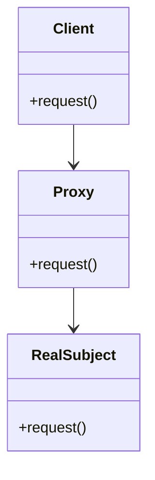

## 4.7.2 Types of Proxies

In software design, the Proxy Pattern is a structural pattern that provides a surrogate or placeholder for another object to control access to it. In Python, this pattern is particularly useful due to the language's dynamic nature and support for object-oriented programming. In this section, we will delve into three main types of proxies: Virtual Proxies, Remote Proxies, and Protection Proxies. We will explore their concepts, provide code examples, and discuss their appropriate use cases.

### Virtual Proxy

#### Concept

A Virtual Proxy is used to delay the creation and initialization of an expensive object until it is actually needed. This can be particularly useful in scenarios where the object is resource-intensive and may not be used immediately, or at all, during the program's execution.

#### Implementation

Let's consider a scenario where we have a large image that needs to be loaded and displayed. Loading the image is resource-intensive, so we use a Virtual Proxy to delay this operation until the image is actually needed.

```python
class Image:
    def __init__(self, filename):
        self.filename = filename
        self.load_image_from_disk()

    def load_image_from_disk(self):
        print(f"Loading {self.filename} from disk...")

    def display(self):
        print(f"Displaying {self.filename}")

class ImageProxy:
    def __init__(self, filename):
        self.filename = filename
        self.image = None

    def display(self):
        if self.image is None:
            self.image = Image(self.filename)
        self.image.display()

image_proxy = ImageProxy("large_image.png")
image_proxy.display()  # Image is loaded and displayed now
```

#### Use Cases

- **Lazy Initialization**: Virtual Proxies are ideal for lazy initialization, where you want to defer the creation of an object until it is needed.
- **Resource Management**: They help manage resources efficiently by avoiding unnecessary object creation.
- **Performance Optimization**: In applications where performance is critical, Virtual Proxies can help by reducing the initial load time.

### Remote Proxy

#### Concept

A Remote Proxy provides a local representative for an object that resides in a different address space. This is commonly used in distributed systems where objects need to communicate across network boundaries.

#### Implementation

Consider a scenario where we have a remote service that provides weather data. The Remote Proxy will act as a local representative for this remote service.

```python
class WeatherService:
    def get_weather(self, location):
        # Simulate a network call to a remote service
        print(f"Fetching weather data for {location} from remote service...")
        return "Sunny"

class WeatherServiceProxy:
    def __init__(self):
        self.weather_service = WeatherService()

    def get_weather(self, location):
        print("Using proxy to access remote weather service...")
        return self.weather_service.get_weather(location)

weather_proxy = WeatherServiceProxy()
print(weather_proxy.get_weather("New York"))
```

#### Use Cases

- **Network Communication**: Remote Proxies are essential in network communication, allowing local objects to interact with remote services seamlessly.
- **Distributed Systems**: They are widely used in distributed systems to manage communication between different components.
- **Service Abstraction**: Remote Proxies abstract the complexities of network communication, providing a simple interface to the client.

### Protection Proxy

#### Concept

A Protection Proxy controls access to an object based on access rights or credentials. It acts as a gatekeeper, ensuring that only authorized users can access certain functionalities.

#### Implementation

Let's consider a scenario where we have a sensitive document that should only be accessible to users with the correct credentials.

```python
class Document:
    def __init__(self, content):
        self.content = content

    def display(self):
        print(f"Document content: {self.content}")

class DocumentProtectionProxy:
    def __init__(self, document, user_role):
        self.document = document
        self.user_role = user_role

    def display(self):
        if self.user_role == "admin":
            self.document.display()
        else:
            print("Access denied: insufficient permissions")

document = Document("Confidential Information")
proxy = DocumentProtectionProxy(document, "user")
proxy.display()  # Access denied

admin_proxy = DocumentProtectionProxy(document, "admin")
admin_proxy.display()  # Document content displayed
```

#### Use Cases

- **Access Control**: Protection Proxies are used to enforce access control policies, ensuring that only authorized users can access certain resources.
- **Security**: They enhance security by preventing unauthorized access to sensitive data or operations.
- **Role-Based Access**: In systems with role-based access control, Protection Proxies can manage access based on user roles.

### Differences and Similarities

#### Differences

- **Purpose**: Each type of proxy serves a different purpose. Virtual Proxies focus on resource management, Remote Proxies handle network communication, and Protection Proxies enforce access control.
- **Implementation**: The implementation details vary based on the proxy's purpose. Virtual Proxies delay object creation, Remote Proxies manage network interactions, and Protection Proxies check credentials.
- **Use Cases**: The use cases for each proxy type differ based on their intended function, as discussed in their respective sections.

#### Similarities

- **Structure**: All proxies share a similar structure, acting as intermediaries between the client and the real object.
- **Encapsulation**: Proxies encapsulate the complexities of interacting with the real object, providing a simplified interface to the client.
- **Design Pattern**: They all follow the Proxy Pattern, which is a structural design pattern aimed at controlling access to an object.

### Visualizing Proxy Types

To better understand the relationships and interactions between the different types of proxies and their real objects, let's visualize them using a class diagram.



In this diagram, the `Client` interacts with the `Proxy`, which in turn interacts with the `RealSubject`. This structure is common to all types of proxies, with variations in the implementation details based on the proxy type.

### Try It Yourself

Now that we've explored the different types of proxies, try implementing your own proxy classes. Consider the following challenges:

- **Modify the Virtual Proxy** example to handle multiple images and implement caching to avoid reloading images.
- **Extend the Remote Proxy** to simulate a network failure and implement a retry mechanism.
- **Enhance the Protection Proxy** to support multiple roles with different access levels.

By experimenting with these challenges, you'll gain a deeper understanding of how proxies work and how they can be applied in various scenarios.

### Conclusion

The Proxy Pattern is a powerful tool in software design, providing a way to manage access to objects and control interactions. By understanding the different types of proxies—Virtual, Remote, and Protection—you can apply the right proxy type to solve specific problems in your applications. Whether you're optimizing resource usage, managing network communication, or enforcing access control, proxies offer a flexible and effective solution.

Remember, this is just the beginning. As you progress, you'll discover more complex and nuanced applications of proxies. Keep experimenting, stay curious, and enjoy the journey!

## Quiz Time!



### What is the primary purpose of a Virtual Proxy?

- [x] To delay the creation and initialization of an expensive object until it is needed.
- [ ] To provide a local representative for a remote object.
- [ ] To control access to an object based on credentials.
- [ ] To manage network communication between objects.

> **Explanation:** A Virtual Proxy is used to delay the creation and initialization of an expensive object until it is actually needed, optimizing resource usage.

### Which type of proxy is commonly used in distributed systems?

- [ ] Virtual Proxy
- [x] Remote Proxy
- [ ] Protection Proxy
- [ ] None of the above

> **Explanation:** Remote Proxies are commonly used in distributed systems to provide a local representative for objects in different address spaces.

### How does a Protection Proxy enhance security?

- [ ] By delaying object creation until necessary.
- [ ] By providing a local interface for remote objects.
- [x] By controlling access to an object based on access rights or credentials.
- [ ] By managing network communication.

> **Explanation:** A Protection Proxy enhances security by acting as a gatekeeper, ensuring that only authorized users can access certain functionalities.

### What is a common use case for a Virtual Proxy?

- [x] Lazy initialization
- [ ] Network communication
- [ ] Access control
- [ ] Service abstraction

> **Explanation:** Virtual Proxies are ideal for lazy initialization, where the creation of an object is deferred until it is needed.

### Which proxy type abstracts the complexities of network communication?

- [ ] Virtual Proxy
- [x] Remote Proxy
- [ ] Protection Proxy
- [ ] None of the above

> **Explanation:** Remote Proxies abstract the complexities of network communication, providing a simple interface to the client.

### What is the main role of a Protection Proxy?

- [ ] To delay object creation
- [ ] To manage network interactions
- [x] To enforce access control policies
- [ ] To provide service abstraction

> **Explanation:** The main role of a Protection Proxy is to enforce access control policies, ensuring that only authorized users can access certain resources.

### Which proxy type is best suited for managing resource-intensive objects?

- [x] Virtual Proxy
- [ ] Remote Proxy
- [ ] Protection Proxy
- [ ] None of the above

> **Explanation:** Virtual Proxies are best suited for managing resource-intensive objects by delaying their creation until necessary.

### What is a key similarity among all types of proxies?

- [x] They all act as intermediaries between the client and the real object.
- [ ] They all manage network communication.
- [ ] They all enforce access control.
- [ ] They all delay object creation.

> **Explanation:** All proxies share a similar structure, acting as intermediaries between the client and the real object, regardless of their specific purpose.

### In a class diagram, how is the relationship between a Proxy and a RealSubject typically represented?

- [x] The Proxy interacts with the RealSubject.
- [ ] The Proxy inherits from the RealSubject.
- [ ] The Proxy is independent of the RealSubject.
- [ ] The Proxy controls the RealSubject.

> **Explanation:** In a class diagram, the Proxy interacts with the RealSubject, acting as an intermediary.

### True or False: A Remote Proxy can be used to enforce access control.

- [ ] True
- [x] False

> **Explanation:** A Remote Proxy is primarily used for managing network communication and providing a local interface for remote objects, not for enforcing access control.


