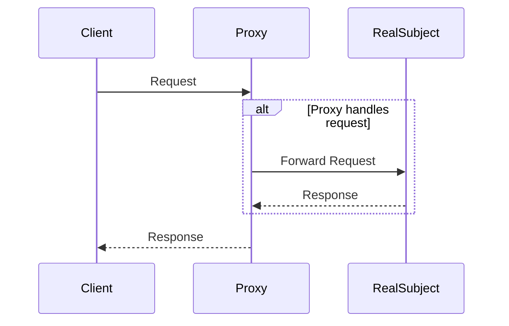

## 4.7.3 Use Cases and Examples

In this section, we delve into the practical applications of the Proxy Pattern in Python. The Proxy Pattern is a structural design pattern that provides an object representing another object. This pattern is particularly useful for controlling access to the original object, adding a layer of security, or managing resource-intensive operations through lazy initialization. Let's explore these concepts through detailed examples and code implementations.

### Understanding the Proxy Pattern

Before diving into the examples, let's briefly revisit the Proxy Pattern's core concept. A proxy acts as an intermediary for another object, controlling access to it. There are several types of proxies, including:

- **Virtual Proxy**: Manages the creation and initialization of resource-intensive objects.
- **Protection Proxy**: Controls access to sensitive objects, enforcing security policies.
- **Remote Proxy**: Represents an object in a different address space.
- **Smart Proxy**: Provides additional functionality, such as reference counting or logging.

In this section, we'll focus on the Virtual Proxy and Protection Proxy, exploring how they can be implemented in Python.

### Implementing a Virtual Proxy for Lazy Initialization

Lazy initialization is a technique where the creation of an object is deferred until it is needed. This is particularly useful for objects that are expensive to create or consume significant resources. A Virtual Proxy can handle lazy initialization, ensuring that the object is only created when required.

#### Example: Lazy-Loading a Heavy Resource

Consider a scenario where we have a `LargeImage` class that loads a high-resolution image from disk. Loading this image is resource-intensive, so we want to defer this operation until the image is actually needed.

```python
class LargeImage:
    def __init__(self, filename):
        self.filename = filename
        self.image_data = None
        self.load_image()

    def load_image(self):
        print(f"Loading image from {self.filename}")
        # Simulate a time-consuming operation
        self.image_data = f"Image data of {self.filename}"

    def display(self):
        print(f"Displaying {self.image_data}")

class ImageProxy:
    def __init__(self, filename):
        self.filename = filename
        self._large_image = None

    def display(self):
        if self._large_image is None:
            self._large_image = LargeImage(self.filename)
        self._large_image.display()

proxy_image = ImageProxy("high_res_image.png")
proxy_image.display()  # Image is loaded and displayed
```

**Explanation**: In this example, the `ImageProxy` class acts as a stand-in for the `LargeImage` class. The actual image is only loaded when the `display()` method is called, optimizing resource usage.

#### Benefits of Lazy Initialization

- **Performance Improvement**: By deferring the creation of resource-intensive objects, we reduce the initial load time and memory usage.
- **Resource Management**: Lazy initialization ensures that resources are only consumed when necessary, which is crucial in environments with limited resources.

### Creating a Protection Proxy for Access Control

A Protection Proxy is used to control access to an object, enforcing security policies or permissions. This is particularly useful in scenarios where sensitive data needs to be protected from unauthorized access.

#### Example: Securing Access to Sensitive Data

Let's implement a Protection Proxy to secure access to a `SensitiveDocument` class. Only users with the appropriate permissions should be able to view the document.

```python
class SensitiveDocument:
    def __init__(self, content):
        self.content = content

    def view(self):
        print(f"Viewing document: {self.content}")

class DocumentProxy:
    def __init__(self, document, user_permissions):
        self._document = document
        self._user_permissions = user_permissions

    def view(self):
        if self._user_permissions.get("can_view", False):
            self._document.view()
        else:
            print("Access denied: You do not have permission to view this document.")

document = SensitiveDocument("Top Secret Content")
user_permissions = {"can_view": True}
proxy_document = DocumentProxy(document, user_permissions)
proxy_document.view()  # Access granted

user_permissions = {"can_view": False}
proxy_document = DocumentProxy(document, user_permissions)
proxy_document.view()  # Access denied
```

**Explanation**: In this example, the `DocumentProxy` class checks the user's permissions before allowing access to the `SensitiveDocument`. This ensures that only authorized users can view the document's content.

#### Benefits of Access Control

- **Enhanced Security**: By controlling access to sensitive data, we protect against unauthorized access and potential data breaches.
- **Centralized Permission Management**: The proxy provides a centralized point for managing access permissions, simplifying security management.

### Visualizing the Proxy Pattern

To better understand how the Proxy Pattern works, let's visualize the interaction between the client, proxy, and real subject using a sequence diagram.



**Diagram Explanation**: In this sequence diagram, the client sends a request to the proxy. The proxy decides whether to handle the request itself or forward it to the real subject. The real subject processes the request and returns a response to the proxy, which then forwards it to the client.

### Practical Applications of the Proxy Pattern

The Proxy Pattern is widely used in various applications, including:

- **Remote Method Invocation (RMI)**: Proxies are used to represent remote objects in distributed systems, facilitating communication between different address spaces.
- **Virtual Proxies in UI Frameworks**: Lazy-loading images or other resources in graphical user interfaces to improve performance.
- **Security Proxies in Enterprise Applications**: Controlling access to sensitive data or operations based on user roles and permissions.
- **Smart Proxies for Caching**: Proxies can cache results of expensive operations to improve performance.

### Encouraging Critical Thinking

As developers, it's essential to think critically about where proxies can optimize our applications. Consider the following questions:

- **Resource Management**: Are there resource-intensive operations in your application that could benefit from lazy initialization?
- **Access Control**: Do you have sensitive data or operations that require controlled access?
- **Performance Optimization**: Can caching or other smart proxy techniques improve your application's performance?

### Try It Yourself

To deepen your understanding of the Proxy Pattern, try modifying the examples provided:

- **Experiment with Lazy Initialization**: Implement a proxy for a different resource-intensive operation, such as loading data from a database.
- **Enhance Access Control**: Extend the protection proxy example to include different levels of permissions or roles.
- **Implement a Smart Proxy**: Create a proxy that logs access to the real subject or caches results for repeated requests.

### Conclusion

The Proxy Pattern is a powerful tool for managing access and resource usage in software applications. By implementing virtual and protection proxies, we can optimize performance, enhance security, and improve resource management. As you continue your journey in software development, consider how the Proxy Pattern can be applied to solve challenges in your projects.

## Quiz Time!



### What is the primary purpose of a Virtual Proxy?

- [x] To defer the creation of a resource-intensive object until it is needed
- [ ] To control access to sensitive data
- [ ] To represent an object in a different address space
- [ ] To provide additional functionality like logging

> **Explanation:** A Virtual Proxy is used to manage the creation and initialization of resource-intensive objects, deferring their creation until they are needed.

### How does a Protection Proxy enhance security?

- [x] By controlling access to sensitive objects based on permissions
- [ ] By caching results of expensive operations
- [ ] By representing remote objects in distributed systems
- [ ] By logging access to the real subject

> **Explanation:** A Protection Proxy controls access to sensitive objects, enforcing security policies based on user permissions.

### Which of the following is NOT a type of proxy?

- [ ] Virtual Proxy
- [ ] Protection Proxy
- [ ] Remote Proxy
- [x] Static Proxy

> **Explanation:** Static Proxy is not a recognized type of proxy. The common types include Virtual, Protection, Remote, and Smart Proxies.

### What benefit does lazy initialization provide?

- [x] Reduces initial load time and memory usage
- [ ] Increases security by controlling access
- [ ] Simplifies permission management
- [ ] Enhances logging capabilities

> **Explanation:** Lazy initialization reduces initial load time and memory usage by deferring the creation of resource-intensive objects until they are needed.

### In the provided example, what does the `ImageProxy` class do?

- [x] It defers the loading of the image until the `display()` method is called
- [ ] It controls access to the image based on permissions
- [ ] It logs every access to the image
- [ ] It represents the image in a different address space

> **Explanation:** The `ImageProxy` class defers the loading of the image until the `display()` method is called, implementing lazy initialization.

### What is a common use case for a Remote Proxy?

- [x] Facilitating communication between different address spaces in distributed systems
- [ ] Controlling access to sensitive data
- [ ] Caching results of expensive operations
- [ ] Logging access to the real subject

> **Explanation:** A Remote Proxy is used to represent remote objects in distributed systems, facilitating communication between different address spaces.

### How can a Smart Proxy improve performance?

- [x] By caching results of expensive operations
- [ ] By controlling access to sensitive data
- [ ] By deferring the creation of resource-intensive objects
- [ ] By representing remote objects in distributed systems

> **Explanation:** A Smart Proxy can improve performance by caching results of expensive operations, reducing the need to recompute them.

### What is the role of the `DocumentProxy` class in the protection proxy example?

- [x] It checks user permissions before allowing access to the document
- [ ] It defers the loading of the document until it is needed
- [ ] It logs every access to the document
- [ ] It represents the document in a different address space

> **Explanation:** The `DocumentProxy` class checks user permissions before allowing access to the document, implementing access control.

### Which pattern is used to manage resource-intensive operations through lazy initialization?

- [x] Virtual Proxy
- [ ] Protection Proxy
- [ ] Remote Proxy
- [ ] Smart Proxy

> **Explanation:** The Virtual Proxy pattern is used to manage resource-intensive operations through lazy initialization.

### True or False: A Protection Proxy can only be used for controlling access to sensitive data.

- [ ] True
- [x] False

> **Explanation:** While a Protection Proxy is commonly used for controlling access to sensitive data, it can also enforce other security policies or permissions.



Remember, this is just the beginning. As you progress, you'll build more complex and interactive applications using the Proxy Pattern. Keep experimenting, stay curious, and enjoy the journey!
