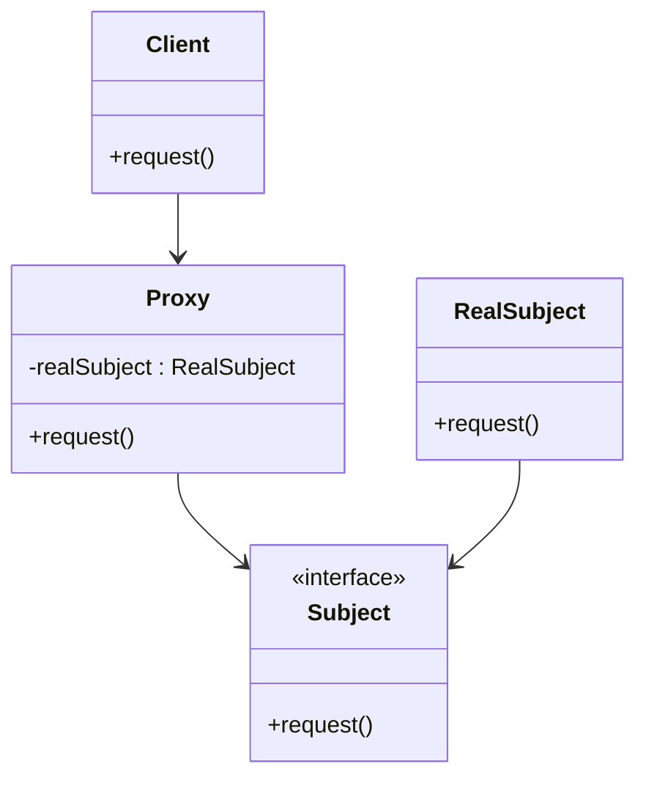

## 4.7 Proxy Pattern

In the realm of software design patterns, the Proxy Pattern stands out as a structural pattern that provides a surrogate or placeholder for another object to control access to it. This pattern is particularly useful when you need to add an additional layer of control over the access to an object, whether for performance optimization, access control, or other reasons.

### Understanding the Proxy Pattern

The Proxy Pattern is essentially about creating an intermediary that acts as a stand-in for another object. This intermediary, or proxy, controls access to the real object, which is often referred to as the subject. The primary intent of the Proxy Pattern is to manage access to the subject, which can involve lazy initialization, access control, logging, or even remote method invocation.

#### Key Concepts

- **Proxy**: The intermediary that controls access to the real subject. It can perform additional actions before or after forwarding requests to the subject.
- **Subject**: The real object that the proxy represents and controls access to.
- **Client**: The entity that interacts with the proxy instead of directly interacting with the subject.

### Types of Proxies

The Proxy Pattern can be implemented in various forms, each serving a different purpose. Let's explore the different types of proxies:

1. **Virtual Proxy**: This type of proxy is used to manage the creation and initialization of resource-intensive objects. It defers the creation of the real object until it is actually needed, thus optimizing resource usage.

2. **Remote Proxy**: This proxy is used to represent an object that exists in a different address space, such as on a different machine or network. It handles the communication between the client and the remote object.

3. **Protection Proxy**: This proxy controls access to the real object by implementing access control checks. It ensures that only authorized clients can access certain functionalities of the subject.

4. **Smart Reference Proxy**: This proxy adds additional behavior when an object is accessed. For example, it can keep track of the number of times an object is accessed or log access details.

### Proxy Pattern vs. Decorator Pattern

While both the Proxy and Decorator patterns involve wrapping an object, their intents differ significantly:

- **Proxy Pattern**: Focuses on controlling access to an object. It acts as a substitute for the real object and can add additional control mechanisms like lazy loading or access control.

- **Decorator Pattern**: Focuses on adding new behavior or responsibilities to an object dynamically. It enhances the functionality of the object without altering its structure.

### Class Diagram of the Proxy Pattern

To better understand the structure of the Proxy Pattern, let's visualize it with a class diagram:



**Diagram Description**: In this diagram, the `Client` interacts with the `Proxy`, which implements the `Subject` interface. The `Proxy` holds a reference to the `RealSubject` and forwards requests to it, potentially adding additional behavior.

### Common Use Cases for the Proxy Pattern

The Proxy Pattern is versatile and can be applied in various scenarios:

- **Lazy Initialization**: Use a virtual proxy to delay the creation of a resource-intensive object until it is actually needed, thus saving resources.

- **Access Control**: Implement a protection proxy to restrict access to certain functionalities of an object based on user permissions or roles.

- **Logging and Auditing**: Use a smart reference proxy to log access details or track usage statistics of an object.

- **Remote Proxies**: Facilitate communication with objects located in different address spaces, such as in distributed systems or networked applications.

### Implementing the Proxy Pattern in Python

Let's dive into some practical examples to see how the Proxy Pattern can be implemented in Python.

#### Example 1: Virtual Proxy for Lazy Initialization

```python
class Image:
    def __init__(self, filename):
        self.filename = filename
        self.load_image()

    def load_image(self):
        print(f"Loading image from {self.filename}")

    def display(self):
        print(f"Displaying {self.filename}")

class ImageProxy:
    def __init__(self, filename):
        self.filename = filename
        self._image = None

    def display(self):
        if self._image is None:
            self._image = Image(self.filename)
        self._image.display()

proxy_image = ImageProxy("large_photo.jpg")
proxy_image.display()  # Image is loaded and displayed now
```

**Code Explanation**: In this example, the `ImageProxy` class acts as a virtual proxy for the `Image` class. It defers the loading of the image until the `display` method is called, optimizing resource usage.

#### Example 2: Protection Proxy for Access Control

```python
class BankAccount:
    def __init__(self, owner, balance):
        self.owner = owner
        self.balance = balance

    def withdraw(self, amount):
        if amount <= self.balance:
            self.balance -= amount
            print(f"Withdrew {amount}, new balance is {self.balance}")
        else:
            print("Insufficient funds")

class BankAccountProxy:
    def __init__(self, bank_account, user):
        self._bank_account = bank_account
        self._user = user

    def withdraw(self, amount):
        if self._user == self._bank_account.owner:
            self._bank_account.withdraw(amount)
        else:
            print("Access denied: Unauthorized user")

account = BankAccount("Alice", 1000)
proxy_account = BankAccountProxy(account, "Alice")
proxy_account.withdraw(100)  # Authorized access
proxy_account.withdraw(200)  # Authorized access

unauthorized_proxy = BankAccountProxy(account, "Bob")
unauthorized_proxy.withdraw(50)  # Unauthorized access
```

**Code Explanation**: Here, the `BankAccountProxy` class acts as a protection proxy, ensuring that only the owner of the bank account can perform withdrawals.

### Potential Downsides of the Proxy Pattern

While the Proxy Pattern offers numerous benefits, it also introduces some potential downsides:

- **Added Complexity**: The introduction of a proxy adds an additional layer of indirection, which can complicate the design and make the system harder to understand.

- **Performance Overhead**: Depending on the implementation, proxies can introduce performance overhead, especially if they perform additional operations like logging or access control.

### Try It Yourself

To deepen your understanding of the Proxy Pattern, try modifying the examples above. For instance, you could:

- Implement a smart reference proxy that logs every access to the `Image` or `BankAccount` objects.
- Create a remote proxy that simulates communication with a remote server.
- Experiment with different access control mechanisms in the protection proxy example.

### Conclusion

The Proxy Pattern is a powerful tool in the software developer's toolkit, providing a flexible way to control access to objects. By understanding and applying this pattern, you can optimize resource usage, enhance security, and improve the maintainability of your code. Remember, this is just the beginning. As you progress, you'll discover more ways to leverage the Proxy Pattern in your projects. Keep experimenting, stay curious, and enjoy the journey!

## Quiz Time!



### What is the primary intent of the Proxy Pattern?

- [x] To control access to an object
- [ ] To add new behavior to an object
- [ ] To create a new object from a prototype
- [ ] To separate the construction of a complex object from its representation

> **Explanation:** The Proxy Pattern is primarily used to control access to an object by providing a surrogate or placeholder.

### Which type of proxy is used to defer the creation of an object until it is needed?

- [x] Virtual Proxy
- [ ] Remote Proxy
- [ ] Protection Proxy
- [ ] Smart Reference Proxy

> **Explanation:** A Virtual Proxy is used to delay the creation and initialization of a resource-intensive object until it is actually needed.

### How does the Proxy Pattern differ from the Decorator Pattern?

- [x] The Proxy Pattern controls access to an object, while the Decorator Pattern adds new behavior.
- [ ] The Proxy Pattern adds new behavior, while the Decorator Pattern controls access.
- [ ] Both patterns serve the same purpose.
- [ ] The Proxy Pattern is a type of Decorator Pattern.

> **Explanation:** The Proxy Pattern focuses on controlling access, whereas the Decorator Pattern is used to add new behavior to an object.

### What is a common use case for a Protection Proxy?

- [x] Access control
- [ ] Lazy initialization
- [ ] Logging
- [ ] Remote method invocation

> **Explanation:** A Protection Proxy is commonly used to implement access control, ensuring only authorized users can access certain functionalities.

### Which of the following is a potential downside of using the Proxy Pattern?

- [x] Added complexity
- [ ] Improved performance
- [ ] Simplified design
- [ ] Direct access to the subject

> **Explanation:** The Proxy Pattern can add complexity to the design due to the additional layer of indirection.

### In the Proxy Pattern, what role does the Client play?

- [x] It interacts with the Proxy instead of the real subject.
- [ ] It directly interacts with the real subject.
- [ ] It creates the real subject.
- [ ] It implements the Proxy interface.

> **Explanation:** The Client interacts with the Proxy, which controls access to the real subject.

### What type of proxy would you use to represent an object located on a different machine?

- [x] Remote Proxy
- [ ] Virtual Proxy
- [ ] Protection Proxy
- [ ] Smart Reference Proxy

> **Explanation:** A Remote Proxy is used to represent an object that exists in a different address space, such as on a different machine.

### Which proxy type can log access details or track usage statistics?

- [x] Smart Reference Proxy
- [ ] Virtual Proxy
- [ ] Remote Proxy
- [ ] Protection Proxy

> **Explanation:** A Smart Reference Proxy adds additional behavior when an object is accessed, such as logging or tracking usage.

### What is the role of the RealSubject in the Proxy Pattern?

- [x] It is the actual object that the Proxy represents and controls access to.
- [ ] It is the interface implemented by the Proxy.
- [ ] It is the client that interacts with the Proxy.
- [ ] It is the class that creates the Proxy.

> **Explanation:** The RealSubject is the actual object that the Proxy represents and controls access to.

### True or False: The Proxy Pattern can be used to facilitate communication with remote objects.

- [x] True
- [ ] False

> **Explanation:** True. The Remote Proxy is a type of Proxy Pattern used to facilitate communication with objects located in different address spaces.


