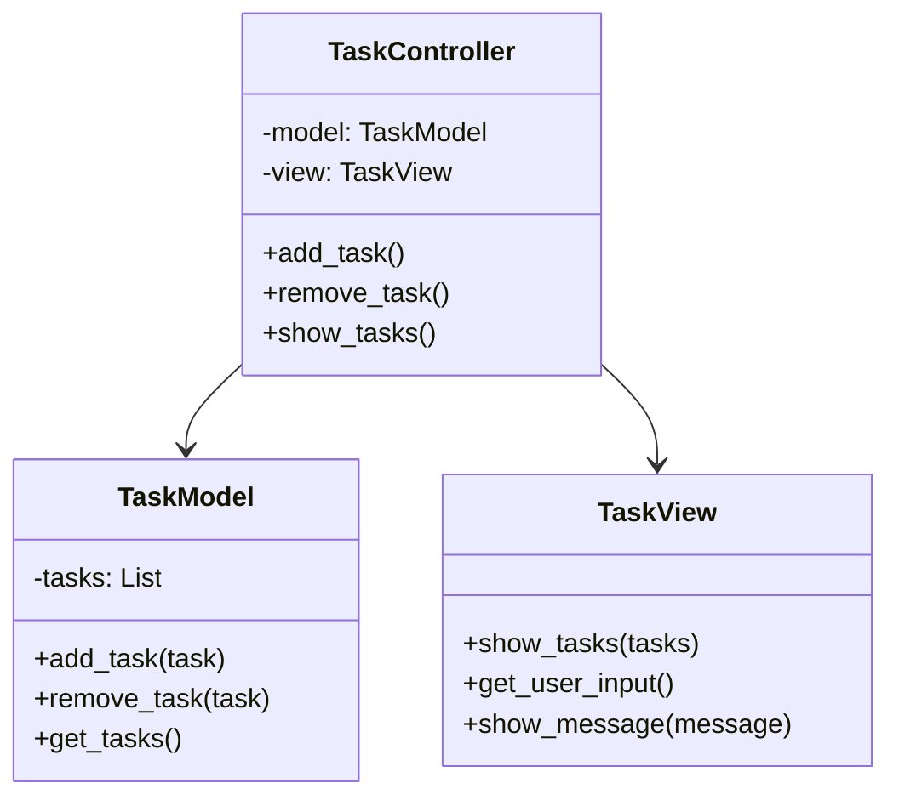

## 4.8.1 Implementing MVC in Python

The Model-View-Controller (MVC) pattern is a software architectural pattern that separates an application into three interconnected components. This separation helps manage complex applications by organizing code into logical sections, making it easier to manage, extend, and test. In this guide, we will explore how to implement the MVC pattern in Python, providing a step-by-step approach to building a simple application.

### Understanding the MVC Pattern

Before diving into the implementation, let's briefly understand the roles of each component in the MVC pattern:

- **Model**: Represents the data and the business logic of the application. It directly manages the data, logic, and rules of the application.
- **View**: Displays the data to the user and sends user commands to the controller. It is responsible for rendering the data from the model in a user-friendly format.
- **Controller**: Acts as an intermediary between the Model and the View. It processes user input, interacts with the model, and decides which view to render.

### Step-by-Step Guide to Implementing MVC in Python

Let's create a simple application to demonstrate the MVC pattern. Our application will manage a list of tasks, allowing users to add, remove, and view tasks.

#### Step 1: Define the Model

The Model is responsible for managing the data. In our application, the model will handle the task list.

```python
class TaskModel:
    def __init__(self):
        self.tasks = []

    def add_task(self, task):
        """Add a new task to the list."""
        self.tasks.append(task)

    def remove_task(self, task):
        """Remove a task from the list."""
        if task in self.tasks:
            self.tasks.remove(task)

    def get_tasks(self):
        """Return the list of tasks."""
        return self.tasks
```

In this code snippet, the `TaskModel` class manages a list of tasks. It provides methods to add, remove, and retrieve tasks.

#### Step 2: Create the View

The View is responsible for displaying the data to the user. It interacts with the user and sends commands to the controller.

```python
class TaskView:
    def show_tasks(self, tasks):
        """Display the list of tasks."""
        print("Tasks:")
        for task in tasks:
            print(f"- {task}")

    def get_user_input(self):
        """Get input from the user."""
        return input("Enter a task: ")

    def show_message(self, message):
        """Display a message to the user."""
        print(message)
```

The `TaskView` class provides methods to display tasks, get user input, and show messages.

#### Step 3: Develop the Controller

The Controller processes user input, interacts with the model, and updates the view accordingly.

```python
class TaskController:
    def __init__(self, model, view):
        self.model = model
        self.view = view

    def add_task(self):
        """Add a task through user input."""
        task = self.view.get_user_input()
        self.model.add_task(task)
        self.view.show_message(f"Task '{task}' added.")

    def remove_task(self):
        """Remove a task through user input."""
        task = self.view.get_user_input()
        self.model.remove_task(task)
        self.view.show_message(f"Task '{task}' removed.")

    def show_tasks(self):
        """Display the current list of tasks."""
        tasks = self.model.get_tasks()
        self.view.show_tasks(tasks)
```

The `TaskController` class connects the model and the view. It provides methods to add, remove, and display tasks.

#### Step 4: Integrate the MVC Components

Now that we have our Model, View, and Controller, let's integrate them into a working application.

```python
def main():
    model = TaskModel()
    view = TaskView()
    controller = TaskController(model, view)

    while True:
        print("\nOptions:")
        print("1. Add Task")
        print("2. Remove Task")
        print("3. Show Tasks")
        print("4. Exit")

        choice = input("Choose an option: ")

        if choice == '1':
            controller.add_task()
        elif choice == '2':
            controller.remove_task()
        elif choice == '3':
            controller.show_tasks()
        elif choice == '4':
            break
        else:
            print("Invalid choice. Please try again.")

if __name__ == "__main__":
    main()
```

In the `main` function, we create instances of the model, view, and controller. We then enter a loop that allows the user to interact with the application by choosing options to add, remove, or view tasks.

### Data Flow in MVC

In the MVC pattern, data flows in a specific manner:

1. **User Interaction**: The user interacts with the View.
2. **Controller Processing**: The View sends user input to the Controller.
3. **Model Update**: The Controller processes the input, updates the Model, and retrieves any necessary data.
4. **View Update**: The Controller updates the View with the new data from the Model.

This flow ensures a clear separation of concerns, making the application easier to manage and extend.

### Event Handling and Updates

In a more complex application, you might need to implement event handling to update the View automatically when the Model changes. One way to achieve this in Python is by using the Observer pattern, where the View subscribes to changes in the Model.

Here's a simple implementation using Python's built-in `Observer` pattern:

```python
class Observable:
    def __init__(self):
        self._observers = []

    def add_observer(self, observer):
        self._observers.append(observer)

    def notify_observers(self, *args, **kwargs):
        for observer in self._observers:
            observer.update(*args, **kwargs)

class TaskModel(Observable):
    def __init__(self):
        super().__init__()
        self.tasks = []

    def add_task(self, task):
        self.tasks.append(task)
        self.notify_observers(self.tasks)

    def remove_task(self, task):
        if task in self.tasks:
            self.tasks.remove(task)
            self.notify_observers(self.tasks)
```

In this example, the `TaskModel` class inherits from `Observable`, allowing it to notify observers (such as the View) whenever the task list changes.

### Python-Specific Considerations

Python's dynamic features can simplify the implementation of the MVC pattern. For instance, Python's duck typing allows you to create flexible and reusable components without strict type constraints. Additionally, Python's rich set of libraries and frameworks, such as Flask and Django, provide built-in support for MVC-like architectures, which can further streamline development.

### Try It Yourself

Experiment with the code examples by adding new features, such as:

- Implementing a search function to find tasks by name.
- Adding a feature to edit existing tasks.
- Creating a graphical user interface (GUI) using a library like Tkinter or PyQt.

### Visualizing MVC Architecture

To better understand the MVC architecture, let's visualize the interaction between the components using a class diagram.



This diagram illustrates the relationships between the `TaskModel`, `TaskView`, and `TaskController` classes, highlighting how the controller acts as a bridge between the model and the view.

### Key Takeaways

- The MVC pattern separates an application into three components: Model, View, and Controller, each with distinct responsibilities.
- The Model manages the data and business logic, the View handles the presentation, and the Controller processes user input and updates the Model and View.
- Python's dynamic features and rich libraries can simplify the implementation of the MVC pattern.
- Experimenting with the code examples and extending the application can deepen your understanding of the MVC pattern.

### References and Links

- [Python Documentation](https://docs.python.org/3/)
- [Flask Documentation](https://flask.palletsprojects.com/)
- [Django Documentation](https://docs.djangoproject.com/)

## Quiz Time!



### What is the primary role of the Model in the MVC pattern?

- [x] To manage the data and business logic of the application
- [ ] To display data to the user
- [ ] To process user input
- [ ] To handle user interface rendering

> **Explanation:** The Model is responsible for managing the data and business logic of the application.

### Which component of the MVC pattern is responsible for displaying data to the user?

- [ ] Model
- [x] View
- [ ] Controller
- [ ] Observer

> **Explanation:** The View is responsible for displaying data to the user and sending user commands to the controller.

### How does the Controller interact with the Model and View in the MVC pattern?

- [x] It processes user input, updates the Model, and updates the View
- [ ] It manages the data and business logic
- [ ] It only displays data to the user
- [ ] It acts as a passive intermediary

> **Explanation:** The Controller processes user input, updates the Model, and updates the View accordingly.

### In the provided code example, what method in the TaskModel class is used to add a new task?

- [x] add_task(task)
- [ ] remove_task(task)
- [ ] get_tasks()
- [ ] notify_observers()

> **Explanation:** The `add_task(task)` method is used to add a new task to the list in the TaskModel class.

### What Python feature can simplify the implementation of the MVC pattern?

- [x] Dynamic typing
- [ ] Static typing
- [ ] Strong typing
- [ ] Weak typing

> **Explanation:** Python's dynamic typing allows for flexible and reusable components without strict type constraints.

### Which pattern can be used to update the View automatically when the Model changes?

- [x] Observer pattern
- [ ] Singleton pattern
- [ ] Factory pattern
- [ ] Adapter pattern

> **Explanation:** The Observer pattern allows the View to subscribe to changes in the Model and update automatically.

### What is the purpose of the `notify_observers` method in the Observable class?

- [x] To notify all registered observers of changes
- [ ] To add a new observer
- [ ] To remove an observer
- [ ] To update the Model

> **Explanation:** The `notify_observers` method is used to notify all registered observers of changes in the Observable class.

### Which Python libraries provide built-in support for MVC-like architectures?

- [x] Flask and Django
- [ ] NumPy and Pandas
- [ ] Matplotlib and Seaborn
- [ ] Scikit-learn and TensorFlow

> **Explanation:** Flask and Django are Python libraries that provide built-in support for MVC-like architectures.

### True or False: The Controller in MVC acts as an intermediary between the Model and the View.

- [x] True
- [ ] False

> **Explanation:** True. The Controller acts as an intermediary between the Model and the View, processing user input and updating both components.

### Which method in the TaskView class is used to get input from the user?

- [x] get_user_input()
- [ ] show_tasks()
- [ ] show_message()
- [ ] add_task()

> **Explanation:** The `get_user_input()` method in the TaskView class is used to get input from the user.


