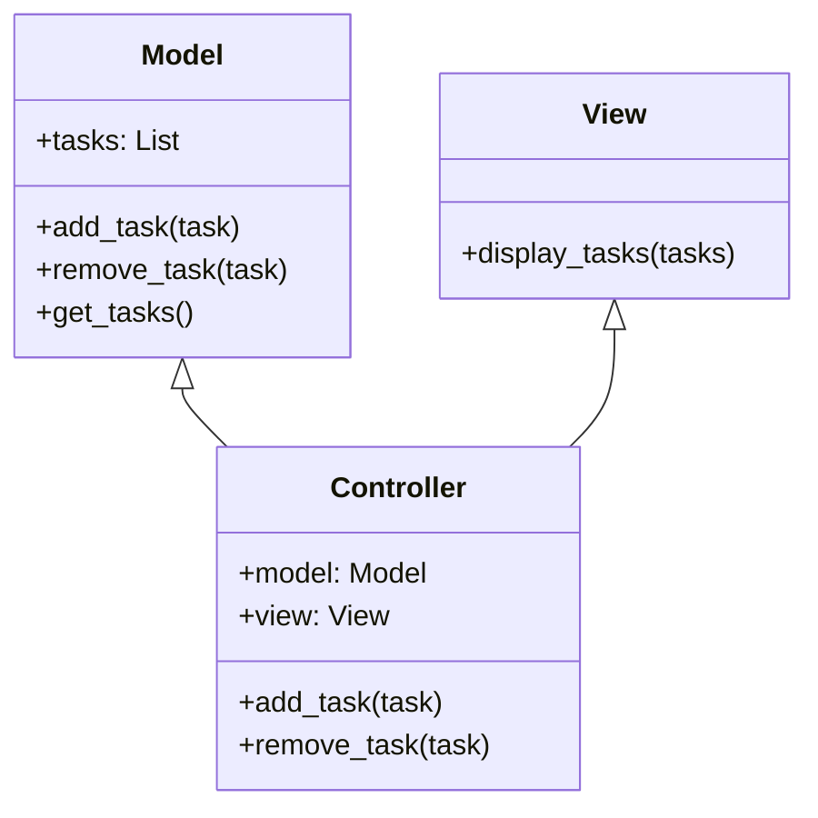

## 4.8.2 Separating Concerns

In software architecture, the principle of separation of concerns is a fundamental concept that underpins the design of robust, maintainable, and scalable applications. This principle advocates for dividing a program into distinct sections, each responsible for a specific aspect of the application's functionality. The Model-View-Controller (MVC) pattern is a quintessential embodiment of this principle, providing a framework for organizing code in a way that enhances modularity and facilitates collaborative development.

### Understanding the Principle of Separation of Concerns

Separation of concerns (SoC) is about breaking down a complex system into smaller, more manageable parts, each addressing a separate concern. A "concern" in this context refers to a specific aspect of the software's functionality or behavior. By isolating these concerns, developers can focus on one aspect of the system at a time, leading to cleaner, more understandable code.

#### How MVC Embodies Separation of Concerns

The MVC pattern divides an application into three interconnected components:

- **Model**: Represents the application's data and business logic. It is responsible for managing the data, rules, and logic of the application.
- **View**: Handles the presentation layer, displaying data to the user and capturing user input.
- **Controller**: Acts as an intermediary between the Model and the View, processing user input, and updating the Model and View accordingly.

By separating these components, MVC ensures that changes in one part of the application do not necessitate changes in others, thus adhering to the principle of separation of concerns.

### Advantages of Separation of Concerns in MVC

The separation of concerns in MVC offers several advantages:

1. **Easier Testing**: With distinct components, testing becomes more straightforward. Each component can be tested in isolation, ensuring that changes in one do not affect others.
   
2. **Independent Updates**: The user interface can be updated independently of the business logic. For instance, swapping out a View from a command-line interface (CLI) to a graphical user interface (GUI) does not require altering the Model.

3. **Enhanced Modularity**: Each component can be developed and maintained independently, facilitating collaborative development and reducing the complexity of the codebase.

4. **Improved Maintainability**: By isolating concerns, the code becomes easier to read and maintain, as each component has a well-defined responsibility.

### Practical Examples of Separation of Concerns

Let's delve into some practical examples to illustrate how separation of concerns operates within the MVC pattern.

#### Example 1: Changes in the Model Without Affecting the View

Consider a simple Python application that manages a list of tasks. The Model might look like this:

```python
class TaskModel:
    def __init__(self):
        self.tasks = []

    def add_task(self, task):
        self.tasks.append(task)

    def remove_task(self, task):
        self.tasks.remove(task)

    def get_tasks(self):
        return self.tasks
```

The View, responsible for displaying tasks, might be implemented as follows:

```python
class TaskView:
    def display_tasks(self, tasks):
        for task in tasks:
            print(f"- {task}")
```

The Controller connects these components:

```python
class TaskController:
    def __init__(self, model, view):
        self.model = model
        self.view = view

    def add_task(self, task):
        self.model.add_task(task)
        self.view.display_tasks(self.model.get_tasks())

    def remove_task(self, task):
        self.model.remove_task(task)
        self.view.display_tasks(self.model.get_tasks())
```

In this setup, changes to the `TaskModel` (e.g., adding a new method to sort tasks) do not require any changes to the `TaskView`, demonstrating separation of concerns.

#### Example 2: Swapping Out Views Without Altering the Model

Suppose we want to change the user interface from a CLI to a GUI. We can create a new View component without altering the Model:

```python
from tkinter import Tk, Listbox

class TaskGUIView:
    def __init__(self):
        self.root = Tk()
        self.task_listbox = Listbox(self.root)
        self.task_listbox.pack()

    def display_tasks(self, tasks):
        self.task_listbox.delete(0, 'end')
        for task in tasks:
            self.task_listbox.insert('end', task)

    def start(self):
        self.root.mainloop()
```

The Controller remains unchanged, as it interacts with the View through a consistent interface:

```python
```

This flexibility is a direct result of separating concerns, allowing us to swap out Views without impacting the Model or Controller.

### Potential Pitfalls of Separation of Concerns

While the separation of concerns is a powerful principle, it is not without potential pitfalls:

1. **Overcomplicating Simple Applications**: For small applications, the overhead of implementing MVC might outweigh the benefits. It's essential to assess whether the complexity introduced by MVC is justified.

2. **Tight Coupling**: If components are not properly isolated, tight coupling can occur, defeating the purpose of separation. For instance, if the View directly accesses the Model's data, changes in the Model might necessitate changes in the View.

### Tips for Maintaining Clear Boundaries

To effectively maintain separation of concerns, consider the following tips:

- **Use Interfaces or Abstract Base Classes**: Define clear interfaces for each component to ensure they interact in a consistent manner. This approach enhances modularity and reduces coupling.

- **Avoid Direct References Across Components**: Components should communicate through well-defined interfaces or events, rather than directly accessing each other's data or methods.

- **Adopt a Consistent Naming Convention**: Use a consistent naming convention to differentiate between components, making the architecture more understandable.

- **Regularly Review and Refactor**: Periodically review the codebase to ensure that components remain isolated and refactor as necessary to maintain clear boundaries.

### Visualizing Separation of Concerns in MVC

To better understand the separation of concerns within the MVC pattern, let's visualize the relationships between the components using a class diagram.



**Diagram Description**: This class diagram illustrates the separation of concerns within the MVC pattern. The `Model` class manages the application's data, the `View` class handles the presentation, and the `Controller` class acts as an intermediary, coordinating interactions between the Model and the View.

### Try It Yourself

To deepen your understanding, try modifying the code examples:

- **Experiment with Different Views**: Implement a new View, such as a web-based interface, and integrate it with the existing Model and Controller.
- **Enhance the Model**: Add new methods to the Model, such as sorting or filtering tasks, and observe how these changes do not affect the View.
- **Refactor the Controller**: Introduce additional functionality in the Controller, such as task prioritization, and test how it interacts with the Model and View.

### Knowledge Check

- **Question**: What are the three components of the MVC pattern, and what are their responsibilities?
- **Exercise**: Implement a simple MVC application in Python that manages a list of contacts, allowing users to add, remove, and display contacts.

### Embrace the Journey

Remember, mastering the separation of concerns is a journey. As you continue to explore and apply this principle, you'll discover new ways to enhance the modularity and maintainability of your applications. Keep experimenting, stay curious, and enjoy the process of building better software.

## Quiz Time!



### What is the primary goal of the separation of concerns in software design?

- [x] To divide a program into distinct sections, each handling a specific aspect of the application's functionality.
- [ ] To increase the complexity of the codebase.
- [ ] To ensure all components are tightly coupled.
- [ ] To make testing more difficult.

> **Explanation:** The primary goal of separation of concerns is to divide a program into distinct sections, each handling a specific aspect of the application's functionality, thereby improving modularity and maintainability.

### Which component of the MVC pattern is responsible for managing the application's data and business logic?

- [x] Model
- [ ] View
- [ ] Controller
- [ ] Router

> **Explanation:** The Model component is responsible for managing the application's data and business logic in the MVC pattern.

### What advantage does the separation of concerns provide in terms of testing?

- [x] Easier testing of individual components.
- [ ] More complex testing procedures.
- [ ] Increased dependency between components.
- [ ] Less modular testing.

> **Explanation:** Separation of concerns allows for easier testing of individual components, as each can be tested in isolation without affecting others.

### How does the MVC pattern facilitate independent updates to the user interface?

- [x] By separating the View from the Model, allowing changes to the UI without affecting the business logic.
- [ ] By tightly coupling the View and Model.
- [ ] By integrating the Controller into the Model.
- [ ] By merging the View and Controller.

> **Explanation:** The MVC pattern facilitates independent updates to the user interface by separating the View from the Model, allowing changes to the UI without affecting the business logic.

### What is a potential pitfall of implementing separation of concerns in small applications?

- [x] Overcomplicating the application.
- [ ] Simplifying the application too much.
- [ ] Reducing modularity.
- [ ] Increasing code duplication.

> **Explanation:** A potential pitfall of implementing separation of concerns in small applications is overcomplicating the application, where the overhead may outweigh the benefits.

### What is a recommended practice for maintaining clear boundaries between components in MVC?

- [x] Use interfaces or abstract base classes.
- [ ] Allow direct references across components.
- [ ] Merge the Model and View.
- [ ] Avoid using any interfaces.

> **Explanation:** Using interfaces or abstract base classes is a recommended practice for maintaining clear boundaries between components in MVC, enhancing modularity and reducing coupling.

### In the provided code example, what change can be made to the Model without affecting the View?

- [x] Adding a method to sort tasks.
- [ ] Changing the display format of tasks.
- [ ] Removing the task list.
- [ ] Directly accessing the View's methods.

> **Explanation:** Adding a method to sort tasks can be done in the Model without affecting the View, demonstrating separation of concerns.

### What is the role of the Controller in the MVC pattern?

- [x] Acts as an intermediary between the Model and the View, processing user input and updating both.
- [ ] Manages the application's data and business logic.
- [ ] Handles the presentation layer.
- [ ] Directly modifies the Model's data.

> **Explanation:** The Controller acts as an intermediary between the Model and the View, processing user input and updating both, facilitating communication and coordination.

### How can you swap out Views in an MVC application without altering the Model?

- [x] By ensuring the View interacts with the Model through a consistent interface.
- [ ] By tightly coupling the View and Model.
- [ ] By merging the View and Controller.
- [ ] By directly accessing the Model's data from the View.

> **Explanation:** You can swap out Views in an MVC application without altering the Model by ensuring the View interacts with the Model through a consistent interface, maintaining separation of concerns.

### True or False: Separation of concerns can lead to tighter coupling between components if not properly implemented.

- [x] True
- [ ] False

> **Explanation:** True. If components are not properly isolated, separation of concerns can inadvertently lead to tighter coupling, defeating its purpose.


