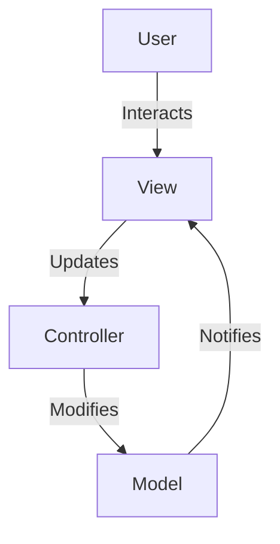

## 4.8.3 Use Cases and Examples

The Model-View-Controller (MVC) pattern is a cornerstone of software architecture, particularly in applications requiring a clear separation of concerns. This section delves into the real-world applications of MVC, providing examples from both graphical user interfaces (GUIs) and web applications. We'll also explore a comprehensive case study, discuss frameworks that enforce MVC, and explain why MVC is suitable for these use cases.

### Real-World Examples of MVC Applications

#### Desktop Applications with a Graphical User Interface

Desktop applications often benefit from the MVC pattern due to the need for a clean separation between the user interface and the underlying data logic. Consider a simple note-taking application:

- **Model**: Represents the data structure, such as notes and their attributes (title, content, timestamp).
- **View**: The graphical interface that displays the notes to the user.
- **Controller**: Manages user input, such as adding or deleting notes, and updates the model accordingly.

In this setup, changes in the model (e.g., a new note added) automatically reflect in the view, while user actions in the view trigger updates in the model through the controller.

#### Web Applications Separating HTML Templates from Business Logic

Web applications are another domain where MVC shines. By separating HTML templates from business logic, developers can maintain and scale applications more effectively. For instance, a blogging platform might use MVC as follows:

- **Model**: Handles data operations, such as fetching blog posts from a database.
- **View**: Renders HTML templates to display blog posts.
- **Controller**: Processes user requests, such as creating or editing a post, and coordinates between the model and view.

This separation allows for independent development and testing of each component, enhancing the application's scalability and maintainability.

### Comprehensive Case Study: Building a Simple Calculator Application

Let's walk through the implementation of a simple calculator application using the MVC pattern. This case study will highlight the responsibilities of each component and demonstrate the benefits of using MVC.

#### Step 1: Define the Model

The model represents the data and logic of the calculator. It handles operations like addition, subtraction, multiplication, and division.

```python
class CalculatorModel:
    def __init__(self):
        self.result = 0

    def add(self, value):
        self.result += value

    def subtract(self, value):
        self.result -= value

    def multiply(self, value):
        self.result *= value

    def divide(self, value):
        if value != 0:
            self.result /= value
        else:
            raise ValueError("Cannot divide by zero")

    def reset(self):
        self.result = 0
```

#### Step 2: Create the View

The view is responsible for displaying the user interface. In this case, it might be a simple command-line interface or a GUI using a library like Tkinter.

```python
class CalculatorView:
    def display_result(self, result):
        print(f"Current result: {result}")

    def get_user_input(self):
        return input("Enter operation and number (e.g., + 5): ")
```

#### Step 3: Implement the Controller

The controller manages user input and updates the model and view accordingly.

```python
class CalculatorController:
    def __init__(self, model, view):
        self.model = model
        self.view = view

    def run(self):
        while True:
            self.view.display_result(self.model.result)
            user_input = self.view.get_user_input()
            if user_input.lower() == 'exit':
                break
            try:
                operation, value = user_input.split()
                value = float(value)
                if operation == '+':
                    self.model.add(value)
                elif operation == '-':
                    self.model.subtract(value)
                elif operation == '*':
                    self.model.multiply(value)
                elif operation == '/':
                    self.model.divide(value)
                else:
                    print("Invalid operation")
            except Exception as e:
                print(f"Error: {e}")
```

#### Step 4: Integrate Components

Finally, integrate the model, view, and controller to create the application.

```python
if __name__ == "__main__":
    model = CalculatorModel()
    view = CalculatorView()
    controller = CalculatorController(model, view)
    controller.run()
```

#### Try It Yourself

Experiment with the calculator application by adding new operations or improving the user interface. For instance, you could implement a graphical interface using Tkinter or PyQt.

### Frameworks That Enforce MVC

Several frameworks enforce the MVC pattern, making it easier to develop structured applications.

#### Django (MTV)

Django is a popular web framework that follows the Model-Template-View (MTV) pattern, a variant of MVC. In Django:

- **Model**: Defines the data structure using Django's ORM.
- **Template**: Handles the presentation layer, rendering HTML.
- **View**: Acts as the controller, processing requests and returning responses.

Django's MTV pattern ensures a clean separation of concerns, facilitating scalable and maintainable web applications.

#### Flask with Blueprints

Flask is a micro web framework that can be structured to follow MVC using Blueprints. Blueprints allow you to organize your application into modules, each with its own models, views, and controllers.

- **Blueprints**: Group related views and controllers.
- **Jinja2 Templates**: Serve as the view layer.
- **SQLAlchemy**: Often used for the model layer.

Flask's flexibility allows developers to implement MVC in a way that suits their application's needs.

### Why MVC is Suitable for These Use Cases

The MVC pattern is particularly suitable for applications that require scalability and maintainability. Here's why:

- **Separation of Concerns**: MVC divides an application into three interconnected components, allowing developers to focus on one aspect without affecting others.
- **Scalability**: By separating the model, view, and controller, applications can scale more easily. Developers can add new features or modify existing ones without disrupting the entire system.
- **Maintainability**: The clear division of responsibilities makes it easier to maintain and update the application. Bugs can be isolated and fixed within a specific component.
- **Testability**: Each component can be tested independently, improving the overall reliability of the application.

### Encouraging MVC in Projects

We encourage you to apply the MVC pattern in your projects where appropriate. Whether you're developing a desktop application, a web application, or any interactive system, MVC can help you create a structured, scalable, and maintainable solution.

### Visualizing MVC Architecture

To better understand the MVC pattern, let's visualize the architecture using a diagram.



**Caption**: This diagram illustrates the flow of interactions in an MVC architecture. The user interacts with the view, which updates the controller. The controller modifies the model, and the model notifies the view of changes.

### Knowledge Check

Before we conclude, let's reinforce what we've learned:

- **What are the main components of the MVC pattern?**
- **How does MVC improve scalability and maintainability?**
- **Can you identify a real-world application that uses MVC?**

### Conclusion

The MVC pattern is a powerful tool for structuring applications, particularly those with complex user interfaces or business logic. By separating concerns, MVC enhances scalability, maintainability, and testability. As you continue your journey in software development, consider applying MVC to your projects to reap these benefits.

## Quiz Time!



### What are the three main components of the MVC pattern?

- [x] Model, View, Controller
- [ ] Model, View, Component
- [ ] Module, View, Controller
- [ ] Model, Viewer, Controller

> **Explanation:** The MVC pattern consists of the Model, View, and Controller components.

### Which framework follows the Model-Template-View (MTV) pattern?

- [x] Django
- [ ] Flask
- [ ] Pyramid
- [ ] Tornado

> **Explanation:** Django follows the Model-Template-View (MTV) pattern, which is a variant of MVC.

### In MVC, which component is responsible for handling user input?

- [ ] Model
- [x] Controller
- [ ] View
- [ ] Template

> **Explanation:** The Controller is responsible for handling user input and updating the Model.

### What is a key benefit of using MVC in web applications?

- [x] Scalability
- [ ] Reduced code complexity
- [ ] Faster development
- [ ] Increased security

> **Explanation:** MVC enhances scalability by separating concerns, allowing for easier maintenance and expansion.

### Which Python library is commonly used for the model layer in Flask applications?

- [x] SQLAlchemy
- [ ] Jinja2
- [ ] WTForms
- [ ] Flask-RESTful

> **Explanation:** SQLAlchemy is commonly used for the model layer in Flask applications.

### What does the View component in MVC do?

- [x] Displays data to the user
- [ ] Handles business logic
- [ ] Manages user input
- [ ] Stores application data

> **Explanation:** The View component is responsible for displaying data to the user.

### How does MVC improve testability?

- [x] By allowing independent testing of components
- [ ] By reducing the amount of code
- [ ] By simplifying the user interface
- [ ] By increasing code complexity

> **Explanation:** MVC improves testability by allowing each component to be tested independently.

### Which component in MVC is responsible for data operations?

- [x] Model
- [ ] View
- [ ] Controller
- [ ] Template

> **Explanation:** The Model is responsible for data operations and business logic.

### What is a common use case for MVC in desktop applications?

- [x] Note-taking applications
- [ ] File management systems
- [ ] Operating systems
- [ ] Database management

> **Explanation:** Note-taking applications are a common use case for MVC in desktop applications.

### True or False: MVC can be applied to both web and desktop applications.

- [x] True
- [ ] False

> **Explanation:** MVC can be applied to both web and desktop applications, providing a structured approach to software design.



Remember, this is just the beginning. As you progress, you'll build more complex and interactive applications using MVC. Keep experimenting, stay curious, and enjoy the journey!
