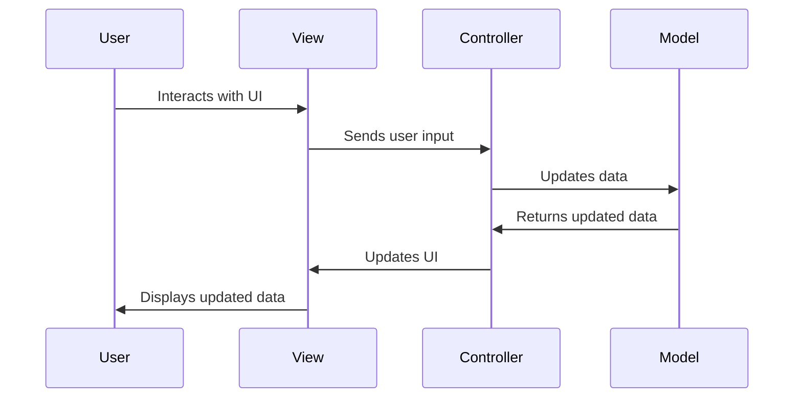

## 4.8 Model-View-Controller (MVC) Pattern

The Model-View-Controller (MVC) pattern is a powerful architectural design pattern that separates an application into three interconnected components: the Model, the View, and the Controller. This separation helps manage complex applications by dividing responsibilities and facilitating a clear flow of data and control. Let's delve into each component and understand how they interact to create a cohesive application.

### Understanding MVC Components

#### Model

The **Model** represents the data and the business logic of the application. It is responsible for managing the data, responding to requests for information about its state, and responding to instructions to change state. The Model is independent of the user interface and is designed to be reusable and testable.

- **Responsibilities**:
  - Maintain the state of the application.
  - Handle data storage and retrieval.
  - Implement business logic and rules.

#### View

The **View** is the presentation layer of the application. It is responsible for displaying the data provided by the Model in a format that is understandable to the user. The View listens for changes in the Model and updates the display accordingly.

- **Responsibilities**:
  - Render data from the Model to the user interface.
  - Provide a way for users to interact with the application.
  - Reflect changes in the Model to the user.

#### Controller

The **Controller** acts as an intermediary between the Model and the View. It listens to user input from the View, processes it (often involving changes to the Model), and updates the View accordingly.

- **Responsibilities**:
  - Interpret user inputs from the View.
  - Update the Model based on user actions.
  - Refresh the View to reflect changes in the Model.

### Separation of Concerns

The MVC pattern facilitates the separation of concerns by dividing the application into three distinct components, each with its own responsibilities. This separation allows developers to work on different components simultaneously without interfering with each other, making the application more maintainable and scalable.

### Data and Control Flow in MVC

To understand how MVC works, let's visualize the flow of data and control between the components.



**Description**: This diagram illustrates the interaction between the User, View, Controller, and Model in an MVC architecture. The User interacts with the View, which sends input to the Controller. The Controller updates the Model, retrieves the updated data, and refreshes the View, which then displays the updated data to the User.

### Implementing MVC in Python

Let's implement a simple MVC application in Python. We'll create a basic todo list application to demonstrate how the components interact.

#### Model

We'll start by defining the Model, which will manage the todo items.

```python
class TodoModel:
    def __init__(self):
        self.todos = []

    def add_todo(self, todo):
        self.todos.append(todo)

    def remove_todo(self, index):
        if 0 <= index < len(self.todos):
            del self.todos[index]

    def get_todos(self):
        return self.todos
```

**Explanation**: The `TodoModel` class manages a list of todo items. It provides methods to add, remove, and retrieve todos.

#### View

Next, we'll create the View, which will display the todo list to the user.

```python
class TodoView:
    def display_todos(self, todos):
        print("Todo List:")
        for index, todo in enumerate(todos):
            print(f"{index + 1}. {todo}")

    def prompt_for_todo(self):
        return input("Enter a new todo: ")

    def prompt_for_removal(self):
        return int(input("Enter the number of the todo to remove: ")) - 1
```

**Explanation**: The `TodoView` class provides methods to display the list of todos and prompt the user for input.

#### Controller

Finally, we'll implement the Controller, which will handle user input and update the Model and View.

```python
class TodoController:
    def __init__(self, model, view):
        self.model = model
        self.view = view

    def add_todo_item(self):
        todo = self.view.prompt_for_todo()
        self.model.add_todo(todo)
        self.view.display_todos(self.model.get_todos())

    def remove_todo_item(self):
        index = self.view.prompt_for_removal()
        self.model.remove_todo(index)
        self.view.display_todos(self.model.get_todos())
```

**Explanation**: The `TodoController` class interacts with both the Model and the View. It processes user input to add or remove todo items and updates the View to reflect changes in the Model.

#### Running the Application

Let's put it all together and run the application.

```python
def main():
    model = TodoModel()
    view = TodoView()
    controller = TodoController(model, view)

    while True:
        print("\n1. Add Todo\n2. Remove Todo\n3. Exit")
        choice = input("Choose an option: ")

        if choice == '1':
            controller.add_todo_item()
        elif choice == '2':
            controller.remove_todo_item()
        elif choice == '3':
            break
        else:
            print("Invalid choice. Please try again.")

if __name__ == "__main__":
    main()
```

**Explanation**: The `main` function initializes the Model, View, and Controller, and provides a simple menu for the user to interact with the todo list.

### Benefits of Using MVC

- **Improved Maintainability**: By separating the application into distinct components, changes to one part (e.g., the user interface) do not affect the others (e.g., business logic).
- **Scalability**: MVC allows for easy scaling of applications by adding new features or components.
- **Collaboration**: Developers can work on different components simultaneously, improving productivity and reducing conflicts.

### Common Challenges

- **Synchronization**: Keeping the Model and View in sync can be challenging, especially in complex applications.
- **Overhead**: For small applications, the MVC pattern might introduce unnecessary complexity.

### MVC Frameworks

Several frameworks utilize the MVC pattern or its variations. In Python, Django is a popular framework that employs the Model-Template-View (MTV) pattern, which is similar to MVC but with some differences in terminology and structure.

### Best Practices

- **Keep Controllers Thin**: Controllers should only handle user input and delegate business logic to the Model.
- **Make Models Rich**: Encapsulate business logic within the Model to keep it independent of the user interface.
- **Avoid Direct Communication Between View and Model**: Ensure that all interactions between the View and Model go through the Controller to maintain separation of concerns.

### Try It Yourself

Experiment with the todo list application by adding new features, such as editing todo items or saving the list to a file. Consider how these changes affect the Model, View, and Controller, and ensure that the separation of concerns is maintained.

### Conclusion

The MVC pattern is a powerful tool for organizing code in a way that promotes maintainability, scalability, and collaboration. By understanding and implementing MVC in Python, you can create applications that are easier to manage and extend. Remember, this is just the beginning. As you progress, you'll build more complex and interactive applications. Keep experimenting, stay curious, and enjoy the journey!

## Quiz Time!



### What is the primary responsibility of the Model in the MVC pattern?

- [x] Manage the data and business logic
- [ ] Display data to the user
- [ ] Handle user input
- [ ] Update the user interface

> **Explanation:** The Model is responsible for managing the application's data and business logic, independent of the user interface.

### In the MVC pattern, which component is responsible for interpreting user inputs?

- [ ] Model
- [ ] View
- [x] Controller
- [ ] Router

> **Explanation:** The Controller interprets user inputs from the View and updates the Model accordingly.

### Which of the following is a benefit of using the MVC pattern?

- [x] Improved maintainability
- [ ] Increased code duplication
- [ ] Direct communication between View and Model
- [ ] Reduced application complexity

> **Explanation:** MVC improves maintainability by separating concerns, allowing changes to one component without affecting others.

### What is a common challenge when using the MVC pattern?

- [ ] Increased code duplication
- [x] Synchronization between Model and View
- [ ] Direct communication between View and Model
- [ ] Reduced application complexity

> **Explanation:** Synchronization between the Model and View can be challenging, especially in complex applications.

### Which Python framework utilizes a variation of the MVC pattern known as MTV?

- [x] Django
- [ ] Flask
- [ ] Pyramid
- [ ] Tornado

> **Explanation:** Django uses the Model-Template-View (MTV) pattern, a variation of MVC.

### What is a best practice when implementing the MVC pattern?

- [x] Keep Controllers thin and Models rich
- [ ] Allow direct communication between View and Model
- [ ] Make Views handle business logic
- [ ] Use Controllers for data storage

> **Explanation:** Keeping Controllers thin and Models rich ensures a clear separation of concerns and maintainable code.

### In the MVC pattern, what is the role of the View?

- [ ] Manage data and business logic
- [x] Render data to the user interface
- [ ] Handle user input
- [ ] Update the Model

> **Explanation:** The View is responsible for rendering data from the Model to the user interface.

### Which component in MVC should handle business logic?

- [x] Model
- [ ] View
- [ ] Controller
- [ ] Router

> **Explanation:** Business logic should be encapsulated within the Model to keep it independent of the user interface.

### What is the primary role of the Controller in the MVC pattern?

- [ ] Manage data and business logic
- [ ] Render data to the user interface
- [x] Handle user input and update the Model
- [ ] Display data to the user

> **Explanation:** The Controller handles user input and updates the Model, ensuring the View reflects changes.

### True or False: In MVC, the View should directly update the Model.

- [ ] True
- [x] False

> **Explanation:** In MVC, the View should not directly update the Model. All interactions should go through the Controller to maintain separation of concerns.


