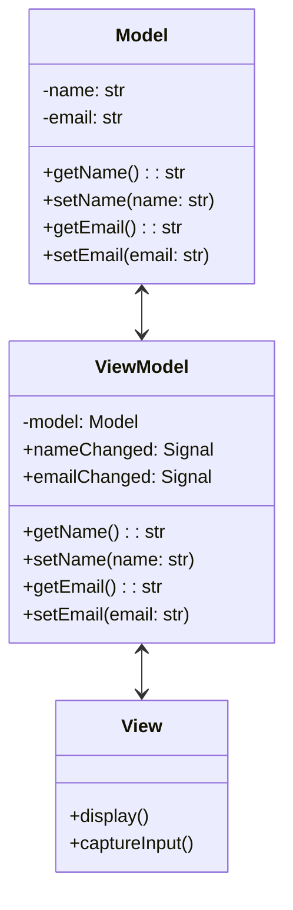

## 4.9.1 Implementing MVVM in Python

The Model-View-ViewModel (MVVM) pattern is a powerful architectural pattern that facilitates the separation of concerns in software applications, particularly those with graphical user interfaces (GUIs). By decoupling the user interface (UI) from the business logic and data, MVVM makes applications easier to manage, test, and scale. In this guide, we will explore how to implement the MVVM pattern in Python, using practical examples and code snippets to illustrate each step.

### Understanding the MVVM Pattern

Before diving into implementation, let's briefly recap the components of the MVVM pattern:

- **Model**: Represents the application's data and business logic. It is responsible for managing the data, including retrieving, storing, and processing it.
- **View**: The UI layer that displays the data to the user. It is responsible for rendering the user interface and capturing user input.
- **ViewModel**: Acts as an intermediary between the Model and the View. It handles the presentation logic, commands, and data binding, ensuring that changes in the Model are reflected in the View and vice versa.

### Step-by-Step Guide to Implementing MVVM in Python

#### Step 1: Define the Model

The Model is the backbone of your application, holding the data and business logic. In Python, you can define the Model using classes that encapsulate the data and provide methods for data manipulation.

```python
class Contact:
    def __init__(self, name, email):
        self._name = name
        self._email = email

    @property
    def name(self):
        return self._name

    @name.setter
    def name(self, value):
        self._name = value

    @property
    def email(self):
        return self._email

    @email.setter
    def email(self, value):
        self._email = value
```

In this example, the `Contact` class represents a simple data model with properties for `name` and `email`. The use of properties allows for encapsulation and validation of data.

#### Step 2: Create the View

The View is responsible for displaying the data and capturing user interactions. In Python, you can use GUI frameworks like PyQt or Tkinter to create the View. Here, we'll use PyQt to demonstrate how to create a simple UI.

```python
from PyQt5.QtWidgets import QApplication, QWidget, QVBoxLayout, QLabel, QLineEdit, QPushButton

class ContactView(QWidget):
    def __init__(self):
        super().__init__()
        self.initUI()

    def initUI(self):
        layout = QVBoxLayout()

        self.nameLabel = QLabel('Name:')
        self.nameEdit = QLineEdit()
        layout.addWidget(self.nameLabel)
        layout.addWidget(self.nameEdit)

        self.emailLabel = QLabel('Email:')
        self.emailEdit = QLineEdit()
        layout.addWidget(self.emailLabel)
        layout.addWidget(self.emailEdit)

        self.saveButton = QPushButton('Save')
        layout.addWidget(self.saveButton)

        self.setLayout(layout)
        self.setWindowTitle('Contact Manager')
```

This PyQt-based View consists of labels, text fields, and a button, providing a simple interface for managing contact information.

#### Step 3: Develop the ViewModel

The ViewModel connects the Model and the View, managing data presentation and user commands. It listens for changes in the Model and updates the View accordingly.

```python
from PyQt5.QtCore import QObject, pyqtSignal

class ContactViewModel(QObject):
    nameChanged = pyqtSignal(str)
    emailChanged = pyqtSignal(str)

    def __init__(self, model):
        super().__init__()
        self._model = model

    @property
    def name(self):
        return self._model.name

    @name.setter
    def name(self, value):
        if self._model.name != value:
            self._model.name = value
            self.nameChanged.emit(value)

    @property
    def email(self):
        return self._model.email

    @email.setter
    def email(self, value):
        if self._model.email != value:
            self._model.email = value
            self.emailChanged.emit(value)
```

In this ViewModel, we use PyQt's `pyqtSignal` to notify the View of changes in the Model. The ViewModel exposes properties for `name` and `email`, allowing the View to bind to these properties.

#### Step 4: Implement Data Binding

Data binding is a key feature of MVVM, allowing automatic synchronization between the Model and the View. In Python, you can implement data binding manually using signals and slots.

```python
class ContactView(QWidget):
    def __init__(self, viewModel):
        super().__init__()
        self._viewModel = viewModel
        self.initUI()
        self.bindUI()

    def bindUI(self):
        self.nameEdit.textChanged.connect(self._viewModel.nameChanged)
        self._viewModel.nameChanged.connect(self.nameEdit.setText)

        self.emailEdit.textChanged.connect(self._viewModel.emailChanged)
        self._viewModel.emailChanged.connect(self.emailEdit.setText)

        self.saveButton.clicked.connect(self.saveContact)

    def saveContact(self):
        self._viewModel.name = self.nameEdit.text()
        self._viewModel.email = self.emailEdit.text()
```

In this example, we bind the text fields in the View to the properties in the ViewModel using PyQt's signal-slot mechanism. This ensures that changes in the text fields are reflected in the Model and vice versa.

### Tools and Libraries Supporting MVVM in Python

Several tools and libraries can help you implement the MVVM pattern in Python:

- **PyQt/PySide**: These are popular libraries for creating cross-platform GUIs in Python. They provide robust support for signals and slots, making them ideal for implementing MVVM.
- **Kivy**: A Python framework for developing multitouch applications. It supports the MVVM pattern through its event-driven architecture and property binding.
- **Tkinter**: The standard GUI toolkit for Python, which can be used to create simple MVVM applications, although it requires more manual work for data binding.

### Testing Strategies for MVVM

One of the key benefits of the MVVM pattern is the separation of concerns, which facilitates unit testing. By isolating the ViewModel from the View, you can test the business logic and data manipulation without relying on the UI.

```python
import unittest

class TestContactViewModel(unittest.TestCase):
    def setUp(self):
        self.model = Contact('John Doe', 'john@example.com')
        self.viewModel = ContactViewModel(self.model)

    def test_name_change(self):
        self.viewModel.name = 'Jane Doe'
        self.assertEqual(self.model.name, 'Jane Doe')

    def test_email_change(self):
        self.viewModel.email = 'jane@example.com'
        self.assertEqual(self.model.email, 'jane@example.com')

if __name__ == '__main__':
    unittest.main()
```

In this example, we use Python's `unittest` framework to test the ViewModel. We verify that changes to the ViewModel's properties are correctly reflected in the Model.

### Visualizing the MVVM Architecture

To better understand the MVVM pattern, let's visualize the relationships between the Model, View, and ViewModel.



This diagram illustrates how the Model is connected to the ViewModel, which in turn communicates with the View. The ViewModel acts as a bridge, ensuring that changes in the Model are reflected in the View and vice versa.

### Try It Yourself

To deepen your understanding of MVVM in Python, try modifying the code examples provided:

- **Add a new property** to the `Contact` model, such as a phone number, and update the ViewModel and View to handle this new property.
- **Implement validation logic** in the ViewModel to ensure that the email address is in a valid format before updating the Model.
- **Create a list of contacts** in the Model and update the View to display this list using a PyQt `QListView` or `QTableView`.

### Conclusion

Implementing the MVVM pattern in Python can greatly enhance the maintainability and scalability of your applications. By separating the UI from the business logic and data, you can create applications that are easier to test and extend. Whether you're building a simple desktop application or a complex enterprise system, MVVM provides a robust framework for organizing your code.

Remember, this is just the beginning. As you progress, you'll build more complex and interactive applications. Keep experimenting, stay curious, and enjoy the journey!

## Quiz Time!



### What is the primary role of the ViewModel in the MVVM pattern?

- [x] To act as an intermediary between the Model and the View
- [ ] To directly handle user input and render the UI
- [ ] To store and manage application data
- [ ] To define the structure of the application's database

> **Explanation:** The ViewModel acts as an intermediary between the Model and the View, managing data presentation and user commands.

### Which Python library is commonly used for creating GUIs that support the MVVM pattern?

- [x] PyQt
- [ ] NumPy
- [ ] Flask
- [ ] Pandas

> **Explanation:** PyQt is a popular library for creating cross-platform GUIs in Python, supporting the MVVM pattern through its signal-slot mechanism.

### How does the ViewModel notify the View of changes in the Model?

- [x] By using signals and slots
- [ ] By directly modifying the View's properties
- [ ] By updating the database
- [ ] By sending HTTP requests

> **Explanation:** The ViewModel uses signals and slots to notify the View of changes in the Model, allowing for automatic synchronization.

### What is the benefit of using properties in the Model class?

- [x] To encapsulate and validate data
- [ ] To directly bind data to the View
- [ ] To simplify database queries
- [ ] To enhance performance

> **Explanation:** Properties in the Model class allow for encapsulation and validation of data, ensuring data integrity.

### Which of the following is NOT a component of the MVVM pattern?

- [x] Controller
- [ ] Model
- [ ] View
- [ ] ViewModel

> **Explanation:** The Controller is not a component of the MVVM pattern; it is part of the MVC pattern.

### What testing strategy is facilitated by the separation of concerns in MVVM?

- [x] Unit testing
- [ ] Integration testing
- [ ] Load testing
- [ ] Security testing

> **Explanation:** The separation of concerns in MVVM facilitates unit testing by isolating the ViewModel from the View.

### How can you implement data binding manually in Python?

- [x] By using signals and slots
- [ ] By writing SQL queries
- [ ] By using REST APIs
- [ ] By creating XML files

> **Explanation:** Data binding can be implemented manually in Python using signals and slots, particularly with frameworks like PyQt.

### What is the purpose of the `pyqtSignal` in the ViewModel?

- [x] To notify the View of changes in the Model
- [ ] To store application data
- [ ] To render the UI
- [ ] To handle HTTP requests

> **Explanation:** The `pyqtSignal` is used in the ViewModel to notify the View of changes in the Model, enabling data binding.

### Which framework is NOT typically used for implementing MVVM in Python?

- [x] Django
- [ ] PyQt
- [ ] Kivy
- [ ] Tkinter

> **Explanation:** Django is a web framework and is not typically used for implementing MVVM, which is more suited to GUI applications.

### True or False: The MVVM pattern is only applicable to desktop applications.

- [ ] True
- [x] False

> **Explanation:** The MVVM pattern is not limited to desktop applications; it can be applied to any application with a user interface, including web and mobile applications.


