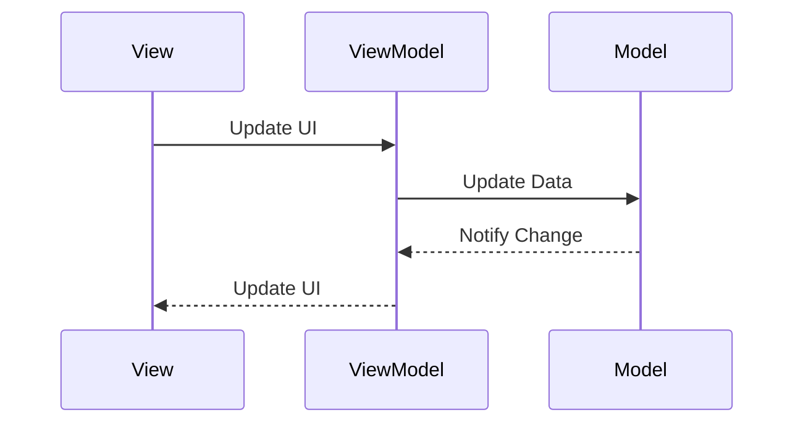

## 4.9.2 Data Binding Techniques

Data binding is a core concept in the Model-View-ViewModel (MVVM) pattern, facilitating seamless synchronization between the View and the ViewModel. This synchronization ensures that any changes in the data model are immediately reflected in the user interface, and vice versa. In this section, we will delve into the intricacies of data binding, explore its implementation in Python, and discuss the challenges and solutions associated with it.

### Understanding Data Binding

Data binding is a process that establishes a connection between the application's UI and the business logic. It allows for automatic updates of the UI when the data model changes, and optionally, updates the data model when the UI changes.

#### One-Way Data Binding

One-way data binding is a unidirectional flow of data from the ViewModel to the View. This means that when the data in the ViewModel changes, the View is automatically updated to reflect these changes. However, any changes made in the View do not affect the ViewModel.

**Example**: Displaying a user's name in a label that updates when the user's name changes in the ViewModel.

#### Two-Way Data Binding

Two-way data binding is a bidirectional flow of data between the ViewModel and the View. Changes in the ViewModel are reflected in the View, and changes in the View are propagated back to the ViewModel.

**Example**: A text input field where the user can update their name, and any changes are reflected in the ViewModel.

### Implementing Data Binding in Python

Python, unlike some other languages, does not have built-in support for data binding in its standard GUI frameworks. However, we can achieve data binding using various techniques and patterns.

#### Using Property Decorators

Python's property decorators can be used to create getter and setter methods, which can help in implementing data binding.

```python
class UserViewModel:
    def __init__(self):
        self._name = ""
        self._observers = []

    @property
    def name(self):
        return self._name

    @name.setter
    def name(self, value):
        self._name = value
        self._notify_observers()

    def bind_to(self, observer):
        self._observers.append(observer)

    def _notify_observers(self):
        for observer in self._observers:
            observer()

def update_view():
    print(f"View updated with new name: {user_vm.name}")

user_vm = UserViewModel()
user_vm.bind_to(update_view)
user_vm.name = "Alice"
```

In this example, the `UserViewModel` class uses a property decorator for the `name` attribute. When the name is set, it notifies all bound observers, which could be functions that update the UI.

#### Observer Pattern

The Observer pattern is a behavioral design pattern that allows an object, known as the subject, to maintain a list of its dependents, called observers, and notify them of any state changes.

```python
class Observable:
    def __init__(self):
        self._observers = []

    def add_observer(self, observer):
        self._observers.append(observer)

    def notify_observers(self, *args, **kwargs):
        for observer in self._observers:
            observer(*args, **kwargs)

class UserViewModel(Observable):
    def __init__(self):
        super().__init__()
        self._name = ""

    @property
    def name(self):
        return self._name

    @name.setter
    def name(self, value):
        self._name = value
        self.notify_observers(self._name)

def view_update(name):
    print(f"View updated with new name: {name}")

user_vm = UserViewModel()
user_vm.add_observer(view_update)
user_vm.name = "Bob"
```

In this example, the `UserViewModel` inherits from an `Observable` class, which manages a list of observers. When the `name` property changes, it notifies all observers with the new value.

### Challenges in Python GUI Frameworks

Python GUI frameworks like Tkinter, PyQt, and Kivy do not natively support data binding, unlike frameworks in other languages such as WPF in C#. This lack of built-in support presents several challenges:

- **Manual Updates**: Developers must manually update the UI when the data model changes.
- **Complexity**: Implementing data binding can increase the complexity of the codebase.
- **Performance**: Frequent updates can lead to performance issues if not handled efficiently.

### Solutions and Patterns for Data Binding

To overcome these challenges, developers can use several patterns and techniques:

#### Using Third-Party Libraries

Libraries like `PyQt` and `Kivy` offer mechanisms to facilitate data binding. For instance, PyQt's `pyqtProperty` and Kivy's `@property` and `@bind` decorators can be used to create reactive properties.

#### Custom Binding Solutions

Developers can create custom solutions using Python's dynamic features, such as decorators and metaclasses, to implement data binding.

```python
class BindableProperty:
    def __init__(self, initial_value=None):
        self.value = initial_value
        self.callbacks = []

    def set(self, new_value):
        self.value = new_value
        for callback in self.callbacks:
            callback(self.value)

    def bind(self, callback):
        self.callbacks.append(callback)

class UserViewModel:
    def __init__(self):
        self.name = BindableProperty("")

user_vm = UserViewModel()
user_vm.name.bind(lambda value: print(f"View updated with new name: {value}"))
user_vm.name.set("Charlie")
```

In this example, `BindableProperty` is a custom class that manages a value and a list of callbacks. When the value changes, it notifies all bound callbacks.

### Importance of Notifications

Notifications are crucial in data binding, as they ensure that the View is updated whenever the ViewModel changes. This is typically achieved through observer patterns or callback functions.

#### Implementing Notifications

```python
class Notifier:
    def __init__(self):
        self._listeners = []

    def add_listener(self, listener):
        self._listeners.append(listener)

    def notify_listeners(self, *args, **kwargs):
        for listener in self._listeners:
            listener(*args, **kwargs)

class UserViewModel(Notifier):
    def __init__(self):
        super().__init__()
        self._name = ""

    @property
    def name(self):
        return self._name

    @name.setter
    def name(self, value):
        self._name = value
        self.notify_listeners(self._name)

def view_update(name):
    print(f"View updated with new name: {name}")

user_vm = UserViewModel()
user_vm.add_listener(view_update)
user_vm.name = "David"
```

In this example, the `Notifier` class manages a list of listeners, which are notified whenever the `name` property changes.

### Performance Considerations

Efficient handling of updates is crucial in data binding, especially in applications with frequent changes. Here are some strategies to improve performance:

- **Batch Updates**: Group multiple updates into a single notification to reduce the number of UI updates.
- **Throttling**: Limit the frequency of updates to prevent performance degradation.
- **Lazy Updates**: Delay updates until they are necessary, reducing unnecessary computations.

### Try It Yourself

Experiment with the code examples provided by making the following modifications:

1. **Add More Properties**: Extend the `UserViewModel` class to include additional properties like `email` and `age`, and bind them to UI components.
2. **Implement Two-Way Binding**: Modify the examples to support two-way data binding, where changes in the View are propagated back to the ViewModel.
3. **Optimize Performance**: Implement throttling or batch updates to improve performance in applications with frequent data changes.

### Visualizing Data Binding

To better understand the flow of data binding, let's visualize the process using a sequence diagram.



**Diagram Description**: This sequence diagram illustrates the flow of data in a two-way data binding scenario. The View updates the UI, which triggers an update in the ViewModel. The ViewModel then updates the Model, which notifies the ViewModel of any changes. Finally, the ViewModel updates the View to reflect the changes.

### References and Links

- [Python's Property Decorators](https://docs.python.org/3/library/functions.html#property)
- [Observer Pattern](https://refactoring.guru/design-patterns/observer)
- [PyQt Documentation](https://www.riverbankcomputing.com/static/Docs/PyQt5/)
- [Kivy Documentation](https://kivy.org/doc/stable/)

### Knowledge Check

- **Question**: What is the difference between one-way and two-way data binding?
- **Exercise**: Implement a simple GUI application using Tkinter that demonstrates data binding between a text entry widget and a label.

### Embrace the Journey

Remember, mastering data binding techniques is a journey. As you explore these concepts, you'll gain a deeper understanding of how to create responsive and efficient applications. Keep experimenting, stay curious, and enjoy the process!

## Quiz Time!



### What is one-way data binding?

- [x] Data flows from ViewModel to View only
- [ ] Data flows from View to ViewModel only
- [ ] Data flows both ways between ViewModel and View
- [ ] Data does not flow between ViewModel and View

> **Explanation:** One-way data binding means that changes in the ViewModel are reflected in the View, but not vice versa.

### What is two-way data binding?

- [x] Data flows both ways between ViewModel and View
- [ ] Data flows from ViewModel to View only
- [ ] Data flows from View to ViewModel only
- [ ] Data does not flow between ViewModel and View

> **Explanation:** Two-way data binding allows changes in the ViewModel to update the View and changes in the View to update the ViewModel.

### Which Python feature can be used to implement data binding?

- [x] Property decorators
- [ ] Lambda functions
- [ ] List comprehensions
- [ ] Context managers

> **Explanation:** Property decorators in Python can be used to create getter and setter methods, which are useful for implementing data binding.

### What is a challenge of implementing data binding in Python GUI frameworks?

- [x] Lack of built-in support for data binding
- [ ] Too many built-in data binding options
- [ ] Incompatibility with Python's syntax
- [ ] Data binding is not needed in GUI applications

> **Explanation:** Many Python GUI frameworks do not have built-in support for data binding, requiring developers to implement it manually.

### How can performance be optimized in data binding?

- [x] Batch updates
- [ ] Frequent updates
- [ ] Ignoring updates
- [ ] Random updates

> **Explanation:** Batch updates can reduce the number of UI updates, improving performance.

### What pattern is commonly used to notify changes in data binding?

- [x] Observer pattern
- [ ] Singleton pattern
- [ ] Factory pattern
- [ ] Strategy pattern

> **Explanation:** The Observer pattern is commonly used to notify observers of changes in data binding.

### What does the `notify_observers` method do in the Observer pattern?

- [x] It notifies all registered observers of a change
- [ ] It registers a new observer
- [ ] It removes an observer
- [ ] It does nothing

> **Explanation:** The `notify_observers` method is responsible for notifying all registered observers of a change.

### Which of the following is a benefit of two-way data binding?

- [x] Synchronization between View and ViewModel
- [ ] Only View updates are reflected
- [ ] Only ViewModel updates are reflected
- [ ] No synchronization needed

> **Explanation:** Two-way data binding ensures synchronization between the View and the ViewModel.

### What is the role of the ViewModel in MVVM?

- [x] It acts as an intermediary between the View and the Model
- [ ] It directly updates the database
- [ ] It handles user input directly
- [ ] It is not used in MVVM

> **Explanation:** The ViewModel acts as an intermediary, managing the data and logic and updating the View accordingly.

### True or False: Python's standard library has built-in support for data binding in GUI applications.

- [ ] True
- [x] False

> **Explanation:** Python's standard library does not have built-in support for data binding in GUI applications; developers must implement it themselves or use third-party libraries.


