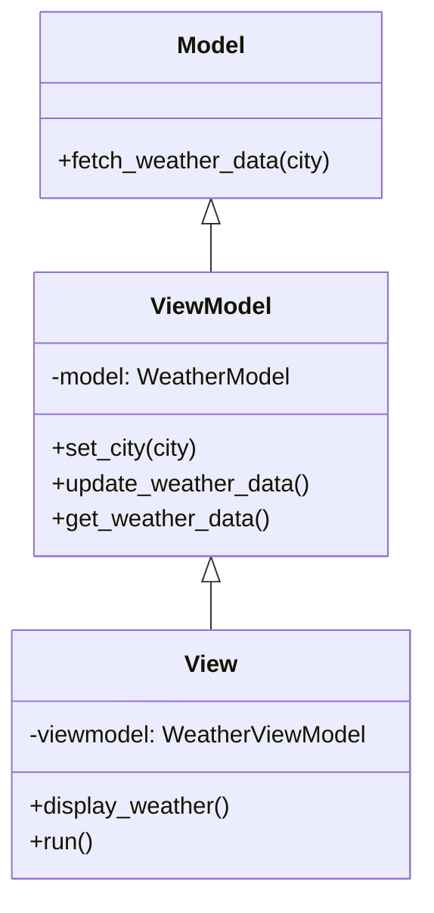

## 4.9.3 Use Cases and Examples

The Model-View-ViewModel (MVVM) pattern is a powerful architectural pattern that facilitates the separation of concerns in software design, particularly in applications with complex user interfaces and dynamic data interaction. In this section, we will explore practical use cases where MVVM shines, walk through a complete example application, discuss the benefits and limitations of using MVVM, and encourage readers to experiment with this pattern.

### Understanding MVVM

Before diving into use cases and examples, let's briefly recap the components of the MVVM pattern:

- **Model**: Represents the data and business logic of the application. It is responsible for managing the data and ensuring its integrity.
- **View**: The user interface that displays the data to the user. It is responsible for rendering the UI elements and capturing user input.
- **ViewModel**: Acts as an intermediary between the Model and the View. It exposes data from the Model to the View and handles user interactions by updating the Model.

The MVVM pattern is particularly well-suited for applications that require real-time data updates, such as dashboards and monitoring tools. It allows for a clean separation of concerns, making the codebase more maintainable and testable.

### Practical Use Cases for MVVM

#### Real-Time Data Dashboards

One of the most common use cases for the MVVM pattern is in applications that require real-time data updates. Dashboards, for example, need to display live data from various sources, such as financial markets, IoT devices, or server monitoring tools. The MVVM pattern allows developers to update the UI automatically when the underlying data changes, providing a seamless user experience.

#### Monitoring Tools

Monitoring tools, such as network monitoring or application performance monitoring, benefit greatly from the MVVM pattern. These tools need to display data in real-time and allow users to interact with the data, such as filtering or sorting. The MVVM pattern enables developers to build responsive and interactive UIs that can handle large volumes of data efficiently.

#### Complex User Interfaces

Applications with complex user interfaces, such as graphic design software or IDEs, can also benefit from the MVVM pattern. These applications often require dynamic data interaction, where changes in one part of the UI affect other parts. The MVVM pattern provides a structured way to manage these interactions, ensuring that the UI remains responsive and consistent.

### Building a Sample Application: Weather Dashboard

To illustrate the MVVM pattern in action, let's build a simple weather dashboard application. This application will display real-time weather data for a selected city and allow users to switch between different cities.

#### Setting Up the Project

First, let's set up the project structure. We'll create a Python project with the following files:

```
weather_dashboard/
    ├── model.py
    ├── view.py
    ├── viewmodel.py
    ├── main.py
```

#### Implementing the Model

The `model.py` file will contain the logic for fetching weather data. We'll use a mock API to simulate real-time data updates.

```python
import random
import time

class WeatherModel:
    def __init__(self):
        self.data = {}

    def fetch_weather_data(self, city):
        # Simulate a delay in fetching data
        time.sleep(1)
        # Generate random weather data
        self.data[city] = {
            'temperature': random.randint(-10, 40),
            'humidity': random.randint(20, 100),
            'condition': random.choice(['Sunny', 'Cloudy', 'Rainy', 'Snowy'])
        }
        return self.data[city]
```

#### Implementing the ViewModel

The `viewmodel.py` file will contain the logic for interacting with the Model and exposing data to the View.

```python
from model import WeatherModel

class WeatherViewModel:
    def __init__(self):
        self.model = WeatherModel()
        self.current_city = None
        self.weather_data = {}

    def set_city(self, city):
        self.current_city = city
        self.update_weather_data()

    def update_weather_data(self):
        if self.current_city:
            self.weather_data = self.model.fetch_weather_data(self.current_city)

    def get_weather_data(self):
        return self.weather_data
```

#### Implementing the View

The `view.py` file will contain the logic for rendering the UI and capturing user input. We'll use a simple command-line interface for this example.

```python
from viewmodel import WeatherViewModel

class WeatherView:
    def __init__(self):
        self.viewmodel = WeatherViewModel()

    def display_weather(self):
        data = self.viewmodel.get_weather_data()
        if data:
            print(f"Weather in {self.viewmodel.current_city}:")
            print(f"Temperature: {data['temperature']}°C")
            print(f"Humidity: {data['humidity']}%")
            print(f"Condition: {data['condition']}")
        else:
            print("No data available.")

    def run(self):
        while True:
            city = input("Enter city name (or 'exit' to quit): ")
            if city.lower() == 'exit':
                break
            self.viewmodel.set_city(city)
            self.display_weather()
```

#### Running the Application

Finally, we'll create a `main.py` file to run the application.

```python
from view import WeatherView

if __name__ == "__main__":
    view = WeatherView()
    view.run()
```

### Benefits of Using MVVM

The MVVM pattern offers several benefits that make it an attractive choice for building applications with complex user interfaces:

- **Improved Code Organization**: By separating concerns into distinct components, the MVVM pattern makes the codebase more organized and easier to navigate.
- **Easier Maintenance**: Changes to one component (e.g., the View) can be made independently of other components (e.g., the Model), reducing the risk of introducing bugs.
- **Testability**: The ViewModel can be tested independently of the View, making it easier to write unit tests and ensure the correctness of the application logic.
- **Reusability**: Components can be reused across different parts of the application or even in different projects, reducing duplication and improving consistency.

### Limitations and Considerations

While the MVVM pattern offers many benefits, it is not without its limitations:

- **Complexity**: For simple applications, the overhead of implementing the MVVM pattern may not be justified. The pattern introduces additional layers of abstraction, which can make the codebase more complex.
- **Learning Curve**: Developers who are new to the MVVM pattern may find it challenging to understand and implement. It requires a shift in mindset from traditional MVC or MVP patterns.

### Encouraging Experimentation

To truly understand the power of the MVVM pattern, we encourage you to experiment with it in your own projects. Here are a few ideas to get you started:

- **Build a Stock Ticker**: Create an application that displays real-time stock prices and allows users to track their favorite stocks.
- **Develop a Chat Application**: Implement a chat application that updates messages in real-time and allows users to switch between different chat rooms.
- **Create a Task Manager**: Build a task manager application that allows users to create, update, and delete tasks, with real-time updates across multiple devices.

### Try It Yourself

To get hands-on experience with the MVVM pattern, try modifying the weather dashboard application we built earlier. Here are a few ideas:

- **Add More Weather Data**: Extend the Model to include additional weather data, such as wind speed or precipitation.
- **Implement a GUI**: Replace the command-line interface with a graphical user interface using a library like Tkinter or PyQt.
- **Add Data Persistence**: Store the weather data in a database or file, allowing users to view historical data.

### Visualizing the MVVM Pattern

To better understand the relationships between the components of the MVVM pattern, let's visualize it using a class diagram.



**Diagram Description**: This class diagram illustrates the relationships between the Model, ViewModel, and View components in the MVVM pattern. The ViewModel interacts with the Model to fetch data and exposes it to the View, which renders the data to the user.

### Conclusion

The MVVM pattern is a powerful tool for building applications with complex user interfaces and dynamic data interaction. By separating concerns into distinct components, it improves code organization, maintainability, and testability. While it may introduce some complexity, the benefits it offers make it a valuable pattern to learn and apply in your projects.

Remember, this is just the beginning. As you progress, you'll build more complex and interactive applications. Keep experimenting, stay curious, and enjoy the journey!

## Quiz Time!



### What is the primary role of the ViewModel in the MVVM pattern?

- [x] To act as an intermediary between the Model and the View
- [ ] To manage the user interface layout
- [ ] To store data permanently
- [ ] To handle user authentication

> **Explanation:** The ViewModel acts as an intermediary between the Model and the View, exposing data from the Model to the View and handling user interactions.

### Which component in the MVVM pattern is responsible for rendering the user interface?

- [ ] Model
- [ ] ViewModel
- [x] View
- [ ] Controller

> **Explanation:** The View is responsible for rendering the user interface and capturing user input in the MVVM pattern.

### What is a common use case for the MVVM pattern?

- [ ] Simple command-line applications
- [x] Real-time data dashboards
- [ ] Static web pages
- [ ] Database management systems

> **Explanation:** The MVVM pattern is commonly used in applications that require real-time data updates, such as dashboards.

### What is one benefit of using the MVVM pattern?

- [x] Improved code organization
- [ ] Increased application size
- [ ] Slower performance
- [ ] Reduced testability

> **Explanation:** The MVVM pattern improves code organization by separating concerns into distinct components.

### What is a potential limitation of the MVVM pattern?

- [x] Complexity in simple applications
- [ ] Lack of reusability
- [ ] Poor code organization
- [ ] Difficulty in testing

> **Explanation:** The MVVM pattern can introduce complexity in simple applications due to additional layers of abstraction.

### In the MVVM pattern, which component handles business logic?

- [x] Model
- [ ] View
- [ ] ViewModel
- [ ] Controller

> **Explanation:** The Model component handles business logic and manages data in the MVVM pattern.

### How does the ViewModel interact with the Model in the MVVM pattern?

- [x] By fetching data from the Model and exposing it to the View
- [ ] By directly modifying the user interface
- [ ] By storing user input
- [ ] By handling network requests

> **Explanation:** The ViewModel interacts with the Model by fetching data and exposing it to the View.

### What is the purpose of the `fetch_weather_data` method in the example Model?

- [x] To simulate fetching weather data for a city
- [ ] To render the user interface
- [ ] To handle user input
- [ ] To store data in a database

> **Explanation:** The `fetch_weather_data` method simulates fetching weather data for a city in the example Model.

### Which Python library can be used to implement a GUI for the weather dashboard application?

- [x] Tkinter
- [ ] NumPy
- [ ] Pandas
- [ ] Flask

> **Explanation:** Tkinter is a Python library that can be used to implement a graphical user interface for the weather dashboard application.

### True or False: The MVVM pattern is only suitable for desktop applications.

- [ ] True
- [x] False

> **Explanation:** False. The MVVM pattern can be used in various types of applications, including web and mobile applications, not just desktop applications.


