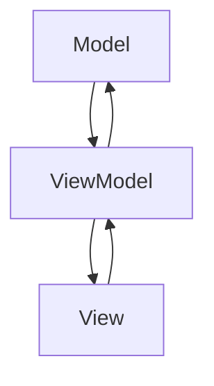

## 4.9 Model-View-ViewModel (MVVM) Pattern

The Model-View-ViewModel (MVVM) pattern is a powerful architectural pattern that facilitates the separation of concerns in software development, particularly in applications with graphical user interfaces (GUIs). It builds upon the Model-View-Controller (MVC) pattern by introducing an additional component, the ViewModel, which acts as an intermediary between the View and the Model. This pattern is particularly useful in applications where data binding and event-driven programming are essential.

### Understanding MVVM: Roles and Responsibilities

#### Model

The **Model** represents the core business logic and data of the application. It is responsible for managing the data, performing operations on it, and notifying the ViewModel of any changes. In a Python application, the Model could be a class that interfaces with a database or an API, encapsulating the data and the logic to manipulate it.

#### View

The **View** is the user interface of the application. It displays the data to the user and captures user interactions. In Python, this could be implemented using GUI frameworks like Tkinter, PyQt, or Kivy. The View is responsible for rendering the UI elements and binding them to the data exposed by the ViewModel.

#### ViewModel

The **ViewModel** acts as a bridge between the View and the Model. It exposes data and commands to the View and handles user input by updating the Model. The ViewModel is responsible for maintaining the state of the View and providing the necessary data transformations. It facilitates two-way data binding, allowing changes in the View to be reflected in the Model and vice versa.

### How MVVM Extends MVC

While MVC separates the application into three components—Model, View, and Controller—MVVM introduces the ViewModel to handle the presentation logic. The ViewModel abstracts the View from the Model, allowing for a more decoupled and testable architecture. This separation is particularly beneficial in applications with complex user interfaces, where the ViewModel can manage the state and behavior of the View independently of the Model.

### Data Binding in MVVM

Data binding is a key feature of the MVVM pattern, enabling automatic synchronization between the View and the ViewModel. This is typically achieved through two-way binding, where changes in the View are propagated to the ViewModel, and updates in the ViewModel are reflected in the View.

#### Two-Way Data Binding

Two-way data binding allows for seamless interaction between the View and the ViewModel. When a user interacts with the UI, such as entering text or selecting an option, the ViewModel is automatically updated. Conversely, when the ViewModel changes, the View is updated to reflect these changes.

```python

import tkinter as tk

class ViewModel:
    def __init__(self):
        self._text = tk.StringVar()

    @property
    def text(self):
        return self._text.get()

    @text.setter
    def text(self, value):
        self._text.set(value)

class View:
    def __init__(self, root, view_model):
        self.view_model = view_model
        self.entry = tk.Entry(root, textvariable=self.view_model._text)
        self.entry.pack()

        self.label = tk.Label(root, textvariable=self.view_model._text)
        self.label.pack()

def main():
    root = tk.Tk()
    view_model = ViewModel()
    view = View(root, view_model)
    root.mainloop()

if __name__ == "__main__":
    main()
```

In this example, we use Tkinter's `StringVar` to bind the entry widget and the label to the ViewModel's text property. This allows changes in the entry to update the label automatically and vice versa.

### Implementing MVVM in Python

To demonstrate the MVVM pattern in Python, let's build a simple application using the Tkinter framework. We'll create a basic calculator application that allows users to perform arithmetic operations.

#### Step 1: Define the Model

The Model will handle the arithmetic operations and manage the data.

```python
class CalculatorModel:
    def __init__(self):
        self.result = 0

    def add(self, value):
        self.result += value

    def subtract(self, value):
        self.result -= value

    def multiply(self, value):
        self.result *= value

    def divide(self, value):
        if value != 0:
            self.result /= value
        else:
            raise ValueError("Cannot divide by zero")
```

#### Step 2: Create the ViewModel

The ViewModel will expose the data and commands to the View.

```python
class CalculatorViewModel:
    def __init__(self, model):
        self.model = model
        self._input = tk.StringVar()
        self._result = tk.StringVar(value="0")

    @property
    def input(self):
        return self._input.get()

    @input.setter
    def input(self, value):
        self._input.set(value)

    @property
    def result(self):
        return self._result.get()

    @result.setter
    def result(self, value):
        self._result.set(value)

    def calculate(self, operation):
        try:
            value = float(self.input)
            if operation == "add":
                self.model.add(value)
            elif operation == "subtract":
                self.model.subtract(value)
            elif operation == "multiply":
                self.model.multiply(value)
            elif operation == "divide":
                self.model.divide(value)
            self.result = str(self.model.result)
        except ValueError as e:
            self.result = str(e)
```

#### Step 3: Build the View

The View will provide the user interface and bind to the ViewModel.

```python
class CalculatorView:
    def __init__(self, root, view_model):
        self.view_model = view_model

        self.entry = tk.Entry(root, textvariable=self.view_model._input)
        self.entry.pack()

        self.result_label = tk.Label(root, textvariable=self.view_model._result)
        self.result_label.pack()

        self.add_button = tk.Button(root, text="Add", command=lambda: self.view_model.calculate("add"))
        self.add_button.pack()

        self.subtract_button = tk.Button(root, text="Subtract", command=lambda: self.view_model.calculate("subtract"))
        self.subtract_button.pack()

        self.multiply_button = tk.Button(root, text="Multiply", command=lambda: self.view_model.calculate("multiply"))
        self.multiply_button.pack()

        self.divide_button = tk.Button(root, text="Divide", command=lambda: self.view_model.calculate("divide"))
        self.divide_button.pack()

def main():
    root = tk.Tk()
    model = CalculatorModel()
    view_model = CalculatorViewModel(model)
    view = CalculatorView(root, view_model)
    root.mainloop()

if __name__ == "__main__":
    main()
```

In this example, we have a simple calculator application with buttons for arithmetic operations. The ViewModel handles the logic and updates the Model, while the View provides the UI and binds to the ViewModel's properties.

### Benefits of MVVM

The MVVM pattern offers several advantages, particularly in applications with complex user interfaces:

- **Improved Testability**: By separating the UI logic from the business logic, the ViewModel can be tested independently of the View. This makes it easier to write unit tests and ensures that the application behaves as expected.

- **Enhanced Separation of Concerns**: The MVVM pattern clearly separates the responsibilities of the Model, View, and ViewModel, making the codebase more modular and maintainable.

- **Facilitated Data Binding**: MVVM supports two-way data binding, allowing for automatic synchronization between the View and the ViewModel. This reduces the amount of boilerplate code and simplifies the development process.

### Comparing MVVM with MVC

While both MVVM and MVC aim to separate concerns, MVVM provides a more decoupled architecture by introducing the ViewModel. This makes MVVM more suitable for applications with complex data binding requirements and dynamic user interfaces.

#### Scenarios Where MVVM is More Advantageous

- **Rich User Interfaces**: Applications with complex UI elements and interactions benefit from the ViewModel's ability to manage state and behavior independently of the View.

- **Data-Driven Applications**: MVVM is ideal for applications that require frequent updates to the UI based on data changes, as it facilitates two-way data binding.

- **Test-Driven Development**: The separation of UI logic from business logic makes it easier to write and maintain unit tests, supporting a test-driven development approach.

### Challenges in Python

While MVVM offers many benefits, implementing it in Python can present challenges due to the lack of native data binding support. However, there are several solutions and workarounds available:

- **Use of Tkinter's StringVar**: As demonstrated in the examples, Tkinter's `StringVar` can be used to achieve basic data binding between the View and the ViewModel.

- **Third-Party Libraries**: Libraries like PyQt and Kivy offer more advanced data binding capabilities, making them suitable for implementing MVVM in Python applications.

- **Custom Binding Solutions**: Developers can implement custom data binding mechanisms using observer patterns or event-driven programming to achieve the desired functionality.

### Visualizing the MVVM Pattern

To better understand the relationships between the components in the MVVM pattern, let's visualize it using a diagram.



**Diagram Description**: This diagram illustrates the MVVM pattern, showing the bidirectional relationship between the View and the ViewModel, and the unidirectional relationship between the ViewModel and the Model. The ViewModel acts as an intermediary, facilitating communication and data binding between the View and the Model.

### Try It Yourself

To deepen your understanding of the MVVM pattern, try modifying the calculator application:

- **Add New Operations**: Extend the application to support additional arithmetic operations, such as exponentiation or modulus.
- **Enhance the UI**: Use a different GUI framework, such as PyQt or Kivy, to implement a more sophisticated user interface.
- **Implement Error Handling**: Improve the error handling in the ViewModel to provide more informative feedback to the user.

### Key Takeaways

- The MVVM pattern separates the development of GUIs from business logic, enhancing modularity and testability.
- Data binding is a core feature of MVVM, enabling automatic synchronization between the View and the ViewModel.
- While Python lacks native data binding support, frameworks like Tkinter, PyQt, and Kivy provide solutions for implementing MVVM.
- MVVM is particularly beneficial in applications with complex user interfaces and data-driven requirements.

### Embrace the Journey

Remember, mastering design patterns like MVVM is a journey. As you continue to explore and experiment with different patterns, you'll gain a deeper understanding of how to structure your applications for maintainability and scalability. Keep experimenting, stay curious, and enjoy the journey!

## Quiz Time!



### What is the primary role of the ViewModel in the MVVM pattern?

- [x] To act as an intermediary between the View and the Model
- [ ] To directly manage the user interface
- [ ] To store application data
- [ ] To handle user authentication

> **Explanation:** The ViewModel acts as an intermediary between the View and the Model, exposing data and commands to the View.

### Which component in the MVVM pattern is responsible for managing the application's data?

- [ ] View
- [x] Model
- [ ] ViewModel
- [ ] Controller

> **Explanation:** The Model is responsible for managing the application's data and business logic.

### What is a key benefit of using the MVVM pattern?

- [x] Improved testability of the user interface logic
- [ ] Simplified user interface design
- [ ] Reduced code complexity
- [ ] Enhanced graphics rendering

> **Explanation:** MVVM improves testability by separating UI logic from business logic, allowing the ViewModel to be tested independently.

### In the MVVM pattern, what does two-way data binding enable?

- [x] Automatic synchronization between the View and the ViewModel
- [ ] Direct communication between the Model and the View
- [ ] Manual updates of the ViewModel
- [ ] Static data representation

> **Explanation:** Two-way data binding enables automatic synchronization between the View and the ViewModel.

### Which Python GUI framework is mentioned as suitable for implementing MVVM?

- [x] Tkinter
- [x] PyQt
- [x] Kivy
- [ ] Flask

> **Explanation:** Tkinter, PyQt, and Kivy are suitable GUI frameworks for implementing MVVM in Python.

### What is a challenge of implementing MVVM in Python?

- [x] Lack of native data binding support
- [ ] Limited GUI framework options
- [ ] Inability to separate concerns
- [ ] Poor performance

> **Explanation:** A challenge of implementing MVVM in Python is the lack of native data binding support.

### How does MVVM extend the MVC pattern?

- [x] By introducing the ViewModel to handle presentation logic
- [ ] By merging the Model and View components
- [ ] By eliminating the Controller
- [ ] By adding more views

> **Explanation:** MVVM extends MVC by introducing the ViewModel to handle presentation logic and data binding.

### What is the role of the View in the MVVM pattern?

- [x] To display data and capture user interactions
- [ ] To manage business logic
- [ ] To store application state
- [ ] To process user inputs

> **Explanation:** The View is responsible for displaying data and capturing user interactions.

### Which scenario is MVVM particularly advantageous for?

- [x] Rich user interfaces with complex data binding requirements
- [ ] Simple command-line applications
- [ ] Static web pages
- [ ] Low-level system programming

> **Explanation:** MVVM is advantageous for rich user interfaces with complex data binding requirements.

### True or False: MVVM is only beneficial for desktop applications.

- [ ] True
- [x] False

> **Explanation:** MVVM is beneficial for any application with a graphical user interface, not just desktop applications.


