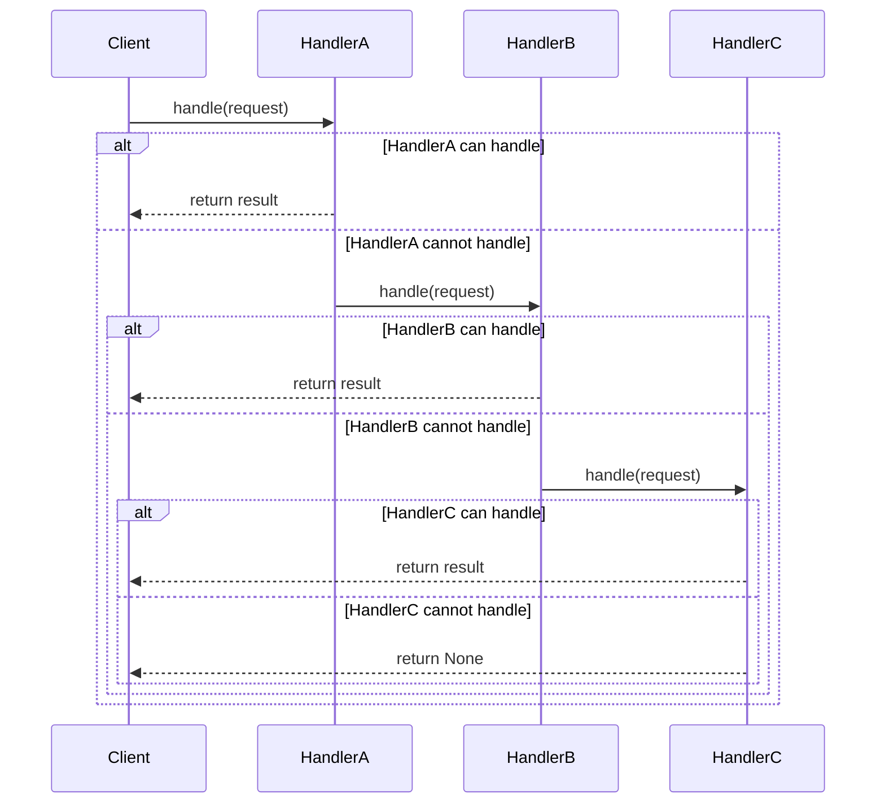

## 5.1.1 Implementing Chain of Responsibility in Python

The Chain of Responsibility pattern is a behavioral design pattern that allows an object to pass a request along a chain of potential handlers until one of them handles the request. This pattern is particularly useful for scenarios where multiple objects can handle a request, but the handler isn't known until runtime. By decoupling the sender of a request from its receiver, the Chain of Responsibility pattern promotes loose coupling and enhances flexibility in code design.

### Understanding the Chain of Responsibility Pattern

Before diving into the implementation, let's explore the core components of the Chain of Responsibility pattern:

1. **Handler**: An interface or abstract class defining a method for handling requests and a method for setting the next handler in the chain.
2. **ConcreteHandler**: Classes that implement the Handler interface. Each ConcreteHandler decides whether to process the request or pass it to the next handler.
3. **Client**: The client initiates the request and sends it to the first handler in the chain.

### Step-by-Step Implementation Guide

Let's implement the Chain of Responsibility pattern in Python step by step.

#### Step 1: Create an Abstract Handler Class

The abstract handler class defines the interface for handling requests and setting the next handler in the chain.

```python
class Handler:
    def __init__(self):
        self._next_handler = None

    def set_next(self, handler):
        self._next_handler = handler
        return handler

    def handle(self, request):
        if self._next_handler:
            return self._next_handler.handle(request)
        return None
```

- **`set_next` Method**: This method sets the next handler in the chain and returns the handler to allow chaining.
- **`handle` Method**: This method checks if there is a next handler and passes the request to it if the current handler cannot process it.

#### Step 2: Implement ConcreteHandler Classes

Concrete handlers extend the abstract handler class and implement the logic to process specific requests.

```python
class ConcreteHandlerA(Handler):
    def handle(self, request):
        if request == "A":
            return f"ConcreteHandlerA handled request {request}"
        else:
            return super().handle(request)

class ConcreteHandlerB(Handler):
    def handle(self, request):
        if request == "B":
            return f"ConcreteHandlerB handled request {request}"
        else:
            return super().handle(request)
```

- **ConcreteHandlerA**: Handles requests of type "A".
- **ConcreteHandlerB**: Handles requests of type "B".
- **`super().handle(request)`**: Calls the base class's handle method to pass the request to the next handler if the current handler cannot process it.

#### Step 3: Build and Link Handlers to Form a Chain

Now, let's create instances of the handlers and link them to form a chain.

```python
handler_a = ConcreteHandlerA()
handler_b = ConcreteHandlerB()

handler_a.set_next(handler_b)
```

- **Linking Handlers**: `handler_a` is linked to `handler_b`, forming a chain where `handler_a` is the first handler.

#### Step 4: Client Initiates the Request Processing

The client sends a request to the first handler in the chain.

```python
def client_code(handler):
    requests = ["A", "B", "C"]
    for request in requests:
        result = handler.handle(request)
        if result:
            print(result)
        else:
            print(f"Request {request} was not handled.")

client_code(handler_a)
```

- **Client Code**: The client code iterates over a list of requests and sends each request to the first handler in the chain.
- **Handling Requests**: Each request is processed by the chain, and the result is printed. If no handler can process a request, a message is printed indicating that the request was not handled.

### Extending the Chain

One of the key benefits of the Chain of Responsibility pattern is its extensibility. You can add new handler classes without modifying existing ones. Let's add a new handler to the chain.

```python
class ConcreteHandlerC(Handler):
    def handle(self, request):
        if request == "C":
            return f"ConcreteHandlerC handled request {request}"
        else:
            return super().handle(request)

handler_c = ConcreteHandlerC()
handler_b.set_next(handler_c)
```

- **ConcreteHandlerC**: A new handler that processes requests of type "C".
- **Adding to the Chain**: `handler_c` is added to the chain after `handler_b`.

### Role of the Client

The client plays a crucial role in the Chain of Responsibility pattern. It initiates the request processing by sending the request to the first handler in the chain. The client is unaware of which handler will ultimately process the request, promoting loose coupling between the client and the handlers.

### Python-Specific Considerations

Python offers several features that can enhance the implementation of the Chain of Responsibility pattern:

- **Exceptions**: You can use exceptions to manage control flow if a handler cannot process a request. This approach can simplify error handling.
- **Generators**: Python's generators can be used to create a more flexible chain where handlers yield control back to the client, allowing for more complex processing logic.

### Visualizing the Chain of Responsibility

To better understand the flow of requests through the chain, let's visualize the process using a sequence diagram.



- **Sequence Diagram**: This diagram illustrates the flow of a request through the chain of handlers. Each handler decides whether to process the request or pass it to the next handler.

### Try It Yourself

Experiment with the Chain of Responsibility pattern by modifying the code examples:

- **Add New Handlers**: Create additional handler classes to process different types of requests.
- **Change the Order**: Rearrange the order of handlers in the chain and observe how it affects request processing.
- **Use Exceptions**: Implement exception handling in the handlers to manage errors gracefully.

### Knowledge Check

Let's reinforce your understanding of the Chain of Responsibility pattern with a few questions:

1. What is the primary purpose of the Chain of Responsibility pattern?
2. How does the Chain of Responsibility pattern promote loose coupling?
3. What role does the client play in the Chain of Responsibility pattern?
4. How can you extend the chain without modifying existing handlers?

### Summary

The Chain of Responsibility pattern is a powerful tool for handling requests in a flexible and decoupled manner. By setting up a chain of handler objects, each responsible for processing specific types of requests, you can create a system that is easy to extend and maintain. Python's features, such as exceptions and generators, can further enhance the implementation of this pattern.

Remember, this is just the beginning. As you progress, you'll build more complex and interactive systems using the Chain of Responsibility pattern. Keep experimenting, stay curious, and enjoy the journey!

## Quiz Time!



### What is the primary purpose of the Chain of Responsibility pattern?

- [x] To allow a request to be passed along a chain of handlers until one handles it
- [ ] To ensure only one handler processes all requests
- [ ] To directly couple the sender and receiver of a request
- [ ] To handle requests in parallel

> **Explanation:** The Chain of Responsibility pattern allows a request to be passed along a chain of handlers until one of them handles it, promoting loose coupling between the sender and receiver.

### How does the Chain of Responsibility pattern promote loose coupling?

- [x] By decoupling the sender of a request from its receiver
- [ ] By ensuring all handlers are aware of each other
- [ ] By using a single handler to process all requests
- [ ] By tightly coupling the client with the handlers

> **Explanation:** The Chain of Responsibility pattern promotes loose coupling by decoupling the sender of a request from its receiver, allowing handlers to be added or removed without affecting the client.

### What role does the client play in the Chain of Responsibility pattern?

- [x] Initiates the request processing by sending the request to the first handler
- [ ] Processes the request directly
- [ ] Determines which handler will process the request
- [ ] Handles errors in the request processing

> **Explanation:** The client initiates the request processing by sending the request to the first handler in the chain, without knowing which handler will ultimately process it.

### How can you extend the chain without modifying existing handlers?

- [x] By adding new handler classes
- [ ] By modifying the existing handlers
- [ ] By changing the client code
- [ ] By removing handlers from the chain

> **Explanation:** You can extend the chain by adding new handler classes, allowing the system to handle new types of requests without modifying existing handlers.

### Which Python feature can be used to manage control flow in the Chain of Responsibility pattern?

- [x] Exceptions
- [ ] Lists
- [ ] Dictionaries
- [ ] Tuples

> **Explanation:** Exceptions can be used to manage control flow in the Chain of Responsibility pattern, allowing handlers to gracefully handle errors.

### What method is used to set the next handler in the chain?

- [x] `set_next`
- [ ] `handle`
- [ ] `process`
- [ ] `next_handler`

> **Explanation:** The `set_next` method is used to set the next handler in the chain, allowing handlers to be linked together.

### What happens if no handler in the chain can process a request?

- [x] The request is not handled, and a message is printed
- [ ] The request is processed by the client
- [ ] The request is discarded
- [ ] The request is sent back to the client

> **Explanation:** If no handler in the chain can process a request, the request is not handled, and a message is printed indicating that it was not handled.

### Which handler in the chain processes a request first?

- [x] The first handler in the chain
- [ ] The last handler in the chain
- [ ] The client
- [ ] The handler with the highest priority

> **Explanation:** The first handler in the chain processes a request first, and if it cannot handle it, the request is passed to the next handler.

### Can the order of handlers in the chain affect request processing?

- [x] True
- [ ] False

> **Explanation:** The order of handlers in the chain can affect request processing, as each handler processes the request in sequence.

### Is it possible to use Python generators in the Chain of Responsibility pattern?

- [x] True
- [ ] False

> **Explanation:** It is possible to use Python generators in the Chain of Responsibility pattern to create a more flexible chain with complex processing logic.


