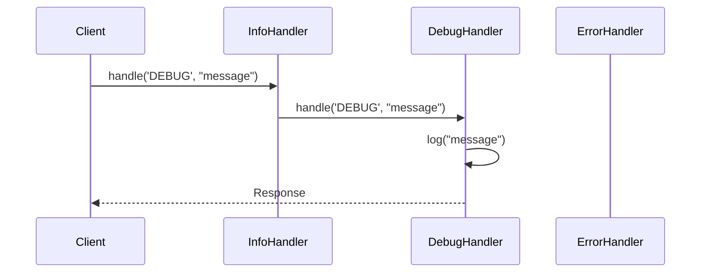

## 5.1.2 Handling Requests Dynamically

In the realm of software design, the ability to handle requests dynamically is crucial for building flexible and adaptive systems. The Chain of Responsibility pattern is a behavioral design pattern that allows you to pass requests along a chain of handlers. This pattern is particularly useful when you want to decouple the sender of a request from its receiver, allowing multiple objects the opportunity to handle the request. In this section, we will delve into the importance of runtime flexibility, provide examples of dynamic handling, demonstrate dynamic chain creation, and discuss design considerations.

### Importance of Runtime Flexibility

In modern software systems, the need for runtime flexibility is paramount. Applications often operate in environments where conditions change rapidly, and the software must adapt to these changes without requiring a complete overhaul. Consider scenarios such as:

- **User-Driven Customization**: Applications that allow users to customize their experience need to dynamically adjust which components handle specific requests based on user preferences.
- **Configuration-Based Behavior**: Systems that rely on configuration files or databases to determine behavior can benefit from dynamically altering the request handling chain based on configuration changes.
- **Scalable Systems**: In distributed systems, the ability to dynamically adjust which server or service handles a request can lead to more efficient load balancing and resource utilization.

By implementing dynamic request handling, developers can create systems that are not only more flexible but also more resilient to change.

### Examples of Dynamic Handling

Dynamic handling in the Chain of Responsibility pattern can be achieved through several methods. Let's explore a few examples:

#### Conditional Processing Based on Request Attributes

One common approach is to process requests based on their attributes. For instance, consider a logging system where different log levels (INFO, DEBUG, ERROR) require different handling:

```python
class LogHandler:
    def __init__(self, level, next_handler=None):
        self.level = level
        self.next_handler = next_handler

    def handle(self, log_level, message):
        if log_level == self.level:
            self.log(message)
        elif self.next_handler:
            self.next_handler.handle(log_level, message)

    def log(self, message):
        raise NotImplementedError("Subclasses must implement this method.")

class InfoHandler(LogHandler):
    def log(self, message):
        print(f"INFO: {message}")

class DebugHandler(LogHandler):
    def log(self, message):
        print(f"DEBUG: {message}")

class ErrorHandler(LogHandler):
    def log(self, message):
        print(f"ERROR: {message}")

error_handler = ErrorHandler('ERROR')
debug_handler = DebugHandler('DEBUG', error_handler)
info_handler = InfoHandler('INFO', debug_handler)

info_handler.handle('INFO', "This is an info message.")
info_handler.handle('DEBUG', "This is a debug message.")
info_handler.handle('ERROR', "This is an error message.")
```

In this example, the chain of handlers processes log messages based on their level. The request is passed along the chain until a handler capable of processing it is found.

#### Modifying the Chain Based on Configuration or User Input

Another approach is to modify the chain dynamically based on external input, such as configuration files or user preferences:

```python
import json

class ConfigurableHandler:
    def __init__(self, config):
        self.config = config
        self.chain = self.build_chain()

    def build_chain(self):
        handlers = []
        for handler_config in self.config['handlers']:
            if handler_config['type'] == 'info':
                handlers.append(InfoHandler('INFO'))
            elif handler_config['type'] == 'debug':
                handlers.append(DebugHandler('DEBUG'))
            elif handler_config['type'] == 'error':
                handlers.append(ErrorHandler('ERROR'))
        
        for i in range(len(handlers) - 1):
            handlers[i].next_handler = handlers[i + 1]

        return handlers[0] if handlers else None

    def handle(self, log_level, message):
        if self.chain:
            self.chain.handle(log_level, message)

config_json = '''
{
    "handlers": [
        {"type": "info"},
        {"type": "debug"},
        {"type": "error"}
    ]
}
'''

config = json.loads(config_json)
configurable_handler = ConfigurableHandler(config)
configurable_handler.handle('DEBUG', "This is a debug message.")
```

In this example, the chain of handlers is built based on a configuration file, allowing for easy modification without changing the codebase.

### Demonstrating Dynamic Chain Creation

Creating a dynamic chain programmatically involves assembling handlers based on runtime conditions. This can be particularly useful in systems that need to adapt to varying workloads or user demands.

#### Programmatic Chain Assembly

Consider a scenario where we need to assemble a chain of handlers based on user input:

```python
class UserInputHandler:
    def __init__(self, user_input):
        self.user_input = user_input
        self.chain = self.build_chain()

    def build_chain(self):
        handlers = []
        if 'info' in self.user_input:
            handlers.append(InfoHandler('INFO'))
        if 'debug' in self.user_input:
            handlers.append(DebugHandler('DEBUG'))
        if 'error' in self.user_input:
            handlers.append(ErrorHandler('ERROR'))

        for i in range(len(handlers) - 1):
            handlers[i].next_handler = handlers[i + 1]

        return handlers[0] if handlers else None

    def handle(self, log_level, message):
        if self.chain:
            self.chain.handle(log_level, message)

user_input = ['info', 'error']
user_input_handler = UserInputHandler(user_input)
user_input_handler.handle('INFO', "This is an info message.")
user_input_handler.handle('ERROR', "This is an error message.")
```

This example demonstrates how to build a chain of handlers based on user input, providing flexibility in how requests are processed.

### Design Considerations

When implementing dynamic request handling, it's essential to balance flexibility with complexity. Here are some key considerations:

- **Maintainability**: As handlers are frequently added or removed, ensure that the system remains easy to maintain. Consider using configuration files or databases to manage handler configurations.
- **Performance**: Dynamic handling can introduce overhead, especially if the chain is long or frequently modified. Optimize the chain by minimizing unnecessary handlers and ensuring efficient request passing.
- **Testing**: Dynamic systems can be challenging to test. Implement comprehensive test cases that cover various configurations and user inputs to ensure robustness.

### Visualizing the Chain of Responsibility

To better understand the flow of requests through the chain, let's visualize the process using a sequence diagram:



This diagram illustrates how a request flows through the chain, with each handler deciding whether to process the request or pass it to the next handler.

### Try It Yourself

Experiment with the code examples provided. Try modifying the configuration or user input to see how the chain adapts. Consider adding new handler types or changing the order of handlers in the chain. This hands-on approach will deepen your understanding of dynamic request handling.

### Knowledge Check

- What are some scenarios where dynamic request handling is beneficial?
- How can you modify the chain of handlers based on configuration?
- What are the design considerations when implementing dynamic request handling?

### Embrace the Journey

Remember, mastering dynamic request handling is a journey. As you progress, you'll build more adaptive and resilient systems. Keep experimenting, stay curious, and enjoy the process!

## Quiz Time!



### Which design pattern allows requests to be passed along a chain of handlers?

- [x] Chain of Responsibility
- [ ] Observer
- [ ] Strategy
- [ ] Singleton

> **Explanation:** The Chain of Responsibility pattern allows requests to be passed along a chain of handlers.

### What is a key benefit of handling requests dynamically?

- [x] Runtime flexibility
- [ ] Increased complexity
- [ ] Reduced performance
- [ ] Hardcoding behavior

> **Explanation:** Handling requests dynamically provides runtime flexibility, allowing systems to adapt to changing conditions.

### How can you modify the chain of handlers based on configuration?

- [x] By using configuration files or databases
- [ ] By hardcoding changes
- [ ] By recompiling the application
- [ ] By ignoring user input

> **Explanation:** Configuration files or databases can be used to modify the chain of handlers dynamically.

### What is a potential drawback of dynamic request handling?

- [x] Increased complexity
- [ ] Reduced flexibility
- [ ] Hardcoding behavior
- [ ] Improved performance

> **Explanation:** Dynamic request handling can increase complexity, making the system harder to maintain.

### Which method is used to handle requests based on their attributes?

- [x] Conditional processing
- [ ] Hardcoding
- [ ] Static analysis
- [ ] Compilation

> **Explanation:** Conditional processing allows requests to be handled based on their attributes.

### What is an important consideration when adding or removing handlers frequently?

- [x] Maintainability
- [ ] Hardcoding
- [ ] Ignoring user input
- [ ] Reducing flexibility

> **Explanation:** Maintainability is crucial when handlers are frequently added or removed to ensure the system remains easy to manage.

### How can you optimize the performance of a dynamic request handling system?

- [x] Minimize unnecessary handlers
- [ ] Increase the chain length
- [ ] Ignore configuration changes
- [ ] Hardcode behavior

> **Explanation:** Minimizing unnecessary handlers can optimize performance in a dynamic request handling system.

### What is a common challenge when testing dynamic systems?

- [x] Ensuring comprehensive test coverage
- [ ] Ignoring user input
- [ ] Hardcoding behavior
- [ ] Reducing flexibility

> **Explanation:** Ensuring comprehensive test coverage is a common challenge when testing dynamic systems.

### Which diagram type is useful for visualizing the flow of requests through a chain?

- [x] Sequence diagram
- [ ] Class diagram
- [ ] State diagram
- [ ] Use case diagram

> **Explanation:** Sequence diagrams are useful for visualizing the flow of requests through a chain.

### Dynamic request handling is beneficial for user-driven customization.

- [x] True
- [ ] False

> **Explanation:** Dynamic request handling is beneficial for user-driven customization, allowing systems to adapt to user preferences.


