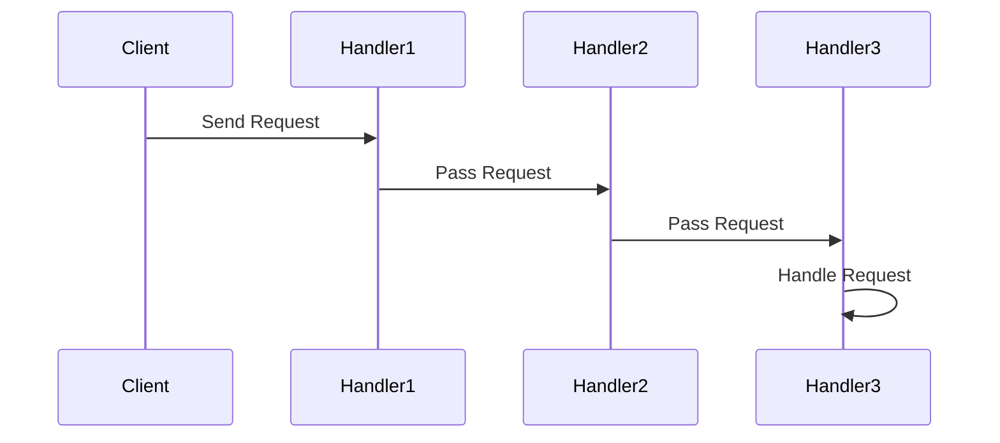

## 5.1.3 Use Cases and Examples

The Chain of Responsibility pattern is a behavioral design pattern that allows an object to pass a request along a chain of potential handlers until one of them handles the request. This pattern promotes loose coupling by allowing multiple objects to handle a request without the sender needing to know which object will handle it. Let's delve into practical scenarios where this pattern can be effectively applied, such as in logging frameworks and technical support systems.

### Logging Framework

A logging framework is a classic example where the Chain of Responsibility pattern shines. In a logging system, different log levels such as INFO, WARNING, and ERROR need to be handled differently. By implementing the Chain of Responsibility pattern, we can create a flexible logging system where each handler is responsible for a specific log level.

#### Code Example: Logging Framework

Let's implement a simple logging framework using the Chain of Responsibility pattern in Python.

```python
class LogHandler:
    def __init__(self, level, next_handler=None):
        self.level = level
        self.next_handler = next_handler

    def handle(self, log_level, message):
        if log_level == self.level:
            self.write_message(message)
        elif self.next_handler:
            self.next_handler.handle(log_level, message)

    def write_message(self, message):
        raise NotImplementedError("Must implement write_message method")

class InfoHandler(LogHandler):
    def write_message(self, message):
        print(f"INFO: {message}")

class WarningHandler(LogHandler):
    def write_message(self, message):
        print(f"WARNING: {message}")

class ErrorHandler(LogHandler):
    def write_message(self, message):
        print(f"ERROR: {message}")

error_handler = ErrorHandler('ERROR')
warning_handler = WarningHandler('WARNING', error_handler)
info_handler = InfoHandler('INFO', warning_handler)

info_handler.handle('INFO', 'This is an informational message.')
info_handler.handle('WARNING', 'This is a warning message.')
info_handler.handle('ERROR', 'This is an error message.')
```

In this example, each handler checks if it can handle the log level. If it can't, it passes the request to the next handler in the chain. This setup allows for easy extension and modification of the logging system without altering existing code.

#### Benefits Observed

- **Improved Code Organization**: Each log level is handled by a dedicated class, making the codebase organized and easy to navigate.
- **Separation of Concerns**: Each handler is responsible for a specific task, promoting single responsibility.
- **Flexibility and Extensibility**: New log levels can be added by creating new handler classes without modifying existing ones.

### Technical Support System

In a technical support system, customer issues need to be routed to the appropriate support tier based on the complexity of the issue. The Chain of Responsibility pattern can be used to implement this routing mechanism, where each support tier acts as a handler in the chain.

#### Code Example: Technical Support System

Let's create a simple technical support system using the Chain of Responsibility pattern.

```python
class SupportHandler:
    def __init__(self, level, next_handler=None):
        self.level = level
        self.next_handler = next_handler

    def handle(self, issue_level, issue):
        if issue_level == self.level:
            self.resolve_issue(issue)
        elif self.next_handler:
            self.next_handler.handle(issue_level, issue)

    def resolve_issue(self, issue):
        raise NotImplementedError("Must implement resolve_issue method")

class Tier1Support(SupportHandler):
    def resolve_issue(self, issue):
        print(f"Tier 1 resolving issue: {issue}")

class Tier2Support(SupportHandler):
    def resolve_issue(self, issue):
        print(f"Tier 2 resolving issue: {issue}")

class Tier3Support(SupportHandler):
    def resolve_issue(self, issue):
        print(f"Tier 3 resolving issue: {issue}")

tier3_support = Tier3Support('high')
tier2_support = Tier2Support('medium', tier3_support)
tier1_support = Tier1Support('low', tier2_support)

tier1_support.handle('low', 'Password reset request.')
tier1_support.handle('medium', 'Software installation issue.')
tier1_support.handle('high', 'Server outage.')
```

In this example, each support tier checks if it can handle the issue based on its level. If it can't, it passes the issue to the next tier in the chain. This approach ensures that issues are handled by the most appropriate support tier.

#### Benefits Observed

- **Efficient Issue Resolution**: Issues are routed to the appropriate support tier, ensuring efficient resolution.
- **Scalability**: New support tiers can be added without affecting existing tiers.
- **Decoupled System**: The support system is decoupled, allowing for independent development and maintenance of each tier.

### Identifying Use Cases in Your Projects

The Chain of Responsibility pattern is particularly useful in scenarios where multiple objects can handle a request, and the exact handler isn't known beforehand. Here are some tips to identify potential use cases in your projects:

- **Sequential Decision Steps**: Look for processes that involve a series of decisions or checks. The pattern can streamline these processes by organizing them into a chain of handlers.
- **Dynamic Request Handling**: If your application needs to handle requests dynamically based on certain conditions, the Chain of Responsibility pattern can provide a flexible solution.
- **Decoupling Request Senders and Receivers**: If you want to decouple the sender of a request from its receiver, this pattern can help achieve that by allowing multiple potential receivers.

### Try It Yourself

To deepen your understanding of the Chain of Responsibility pattern, try modifying the code examples above:

- **Add a new log level** to the logging framework, such as DEBUG, and create a corresponding handler.
- **Introduce a new support tier** in the technical support system, such as Tier 4, and define its responsibilities.
- **Experiment with different request types** and see how the chain handles them.

### Visualizing the Chain of Responsibility

To better understand how the Chain of Responsibility pattern works, let's visualize it using a sequence diagram.



In this diagram, the client sends a request to the first handler. If the first handler cannot process the request, it passes it to the next handler in the chain. This process continues until a handler processes the request.

### Summary

The Chain of Responsibility pattern is a powerful tool for creating flexible and decoupled systems. By allowing multiple objects to handle a request, it promotes loose coupling and enhances system scalability. Whether you're building a logging framework, a technical support system, or any application with sequential decision steps, this pattern can help organize your code and improve maintainability.

### References and Further Reading

- [Chain of Responsibility Pattern on Wikipedia](https://en.wikipedia.org/wiki/Chain-of-responsibility_pattern)
- [Python Design Patterns on Real Python](https://realpython.com/tutorials/design-patterns/)
- [Design Patterns: Elements of Reusable Object-Oriented Software](https://www.amazon.com/Design-Patterns-Elements-Reusable-Object-Oriented/dp/0201633612) by Erich Gamma et al.

## Quiz Time!



### What is the primary benefit of using the Chain of Responsibility pattern?

- [x] It promotes loose coupling between request senders and receivers.
- [ ] It ensures all requests are handled by a single object.
- [ ] It simplifies the code by using a single handler for all requests.
- [ ] It guarantees that all handlers will process the request.

> **Explanation:** The Chain of Responsibility pattern promotes loose coupling by allowing multiple objects to handle a request without the sender needing to know which object will handle it.

### In the logging framework example, what is the role of the `next_handler` attribute?

- [x] It links handlers together to form a chain.
- [ ] It stores the log message.
- [ ] It determines the log level.
- [ ] It writes the log message to a file.

> **Explanation:** The `next_handler` attribute links handlers together, allowing the request to be passed along the chain until it is handled.

### How can you extend the logging framework to handle a new log level?

- [x] Create a new handler class for the new log level and add it to the chain.
- [ ] Modify the existing handlers to handle the new log level.
- [ ] Change the `handle` method to include the new log level.
- [ ] Remove the existing handlers and start over.

> **Explanation:** To handle a new log level, you can create a new handler class for that level and add it to the existing chain.

### What is a key advantage of using the Chain of Responsibility pattern in a technical support system?

- [x] It efficiently routes issues to the appropriate support tier.
- [ ] It ensures all issues are resolved by the first tier.
- [ ] It allows customers to choose their support tier.
- [ ] It requires only one support tier to handle all issues.

> **Explanation:** The Chain of Responsibility pattern efficiently routes issues to the appropriate support tier based on the issue's complexity.

### What happens if none of the handlers in the chain can handle a request?

- [x] The request remains unhandled.
- [ ] The request is automatically handled by the first handler.
- [ ] The request is discarded.
- [ ] The request is sent back to the client.

> **Explanation:** If none of the handlers in the chain can handle a request, it remains unhandled unless additional logic is implemented to handle such cases.

### Which of the following is NOT a benefit of the Chain of Responsibility pattern?

- [ ] Improved code organization
- [ ] Separation of concerns
- [x] Guaranteed request handling
- [ ] Flexibility and extensibility

> **Explanation:** The Chain of Responsibility pattern does not guarantee that a request will be handled; it only provides a mechanism for passing the request along a chain of handlers.

### In the technical support system example, what determines which handler resolves an issue?

- [x] The issue level
- [ ] The order of handlers in the chain
- [ ] The type of issue
- [ ] The client's preference

> **Explanation:** The issue level determines which handler resolves an issue, as each handler is responsible for a specific level of issues.

### How does the Chain of Responsibility pattern promote scalability?

- [x] By allowing new handlers to be added without affecting existing ones.
- [ ] By requiring fewer handlers in the chain.
- [ ] By ensuring all requests are handled by a single handler.
- [ ] By reducing the number of requests that need handling.

> **Explanation:** The Chain of Responsibility pattern promotes scalability by allowing new handlers to be added to the chain without affecting existing handlers.

### What is the purpose of the `handle` method in the Chain of Responsibility pattern?

- [x] To process the request or pass it to the next handler.
- [ ] To initialize the handler.
- [ ] To store the request.
- [ ] To terminate the chain.

> **Explanation:** The `handle` method processes the request if the handler can handle it; otherwise, it passes the request to the next handler in the chain.

### True or False: The Chain of Responsibility pattern requires that all requests be handled by at least one handler.

- [ ] True
- [x] False

> **Explanation:** False. The Chain of Responsibility pattern does not require that all requests be handled; it allows for the possibility that a request may not be handled if no handler is capable.



Remember, this is just the beginning. As you progress, you'll discover more ways to apply the Chain of Responsibility pattern in your projects. Keep experimenting, stay curious, and enjoy the journey!
