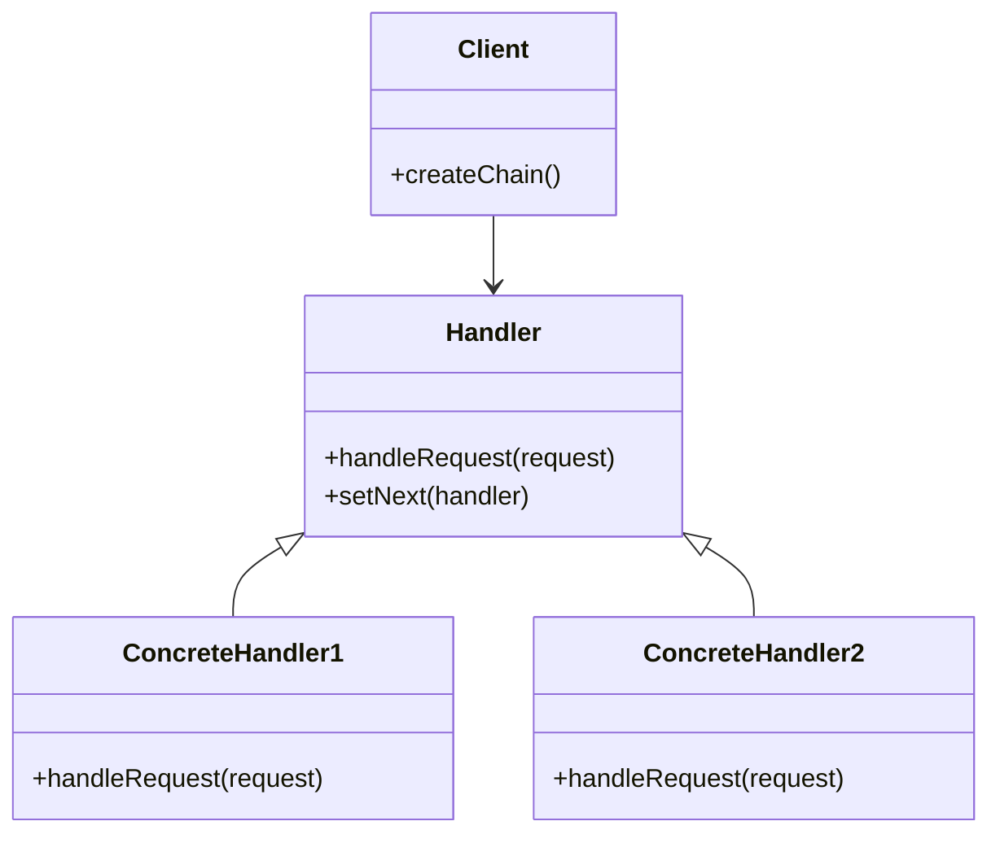

## 5.1 Chain of Responsibility Pattern

The Chain of Responsibility pattern is a behavioral design pattern that allows a request to be passed along a chain of handlers. Each handler in the chain can either process the request or pass it to the next handler. This pattern is particularly useful in scenarios where multiple objects might handle a request, and the handler is not known in advance. By decoupling the sender of a request from its receivers, the Chain of Responsibility pattern promotes flexibility in assigning responsibilities to objects.

### Intent and Motivation

The primary intent of the Chain of Responsibility pattern is to avoid coupling the sender of a request to its receiver by giving more than one object a chance to handle the request. This pattern allows the request to be passed along a chain of potential handlers until one of them handles it. The motivation behind this pattern is to promote loose coupling in a system, making it easier to add or remove handlers dynamically without affecting the client code.

#### Decoupling Sender and Receiver

In traditional request handling, the sender of a request needs to know the receiver, which can lead to tight coupling. The Chain of Responsibility pattern eliminates this dependency by allowing the request to be handled by any handler in the chain. This decoupling enhances the flexibility and maintainability of the code.

#### Flexibility in Assigning Responsibilities

The Chain of Responsibility pattern provides a flexible approach to assigning responsibilities to objects. Each handler in the chain can decide whether to process the request or pass it to the next handler. This decision-making capability allows for dynamic handling of requests based on runtime conditions.

### Structure of the Chain of Responsibility Pattern

The Chain of Responsibility pattern consists of several key components:

- **Handler**: An interface or abstract class defining a method for handling requests and a reference to the next handler in the chain.
- **ConcreteHandler**: A class that implements the handler interface and processes requests it is responsible for. If it cannot handle a request, it passes it to the next handler.
- **Client**: The client creates and configures the chain of handlers and passes requests to the first handler in the chain.

#### UML Diagram

Below is a UML diagram illustrating the structure of the Chain of Responsibility pattern:



### Python Code Examples

Let's implement a basic chain of handlers in Python to demonstrate the Chain of Responsibility pattern.

#### Basic Implementation

```python
class Handler:
    def __init__(self):
        self._next_handler = None

    def set_next(self, handler):
        self._next_handler = handler
        return handler

    def handle(self, request):
        if self._next_handler:
            return self._next_handler.handle(request)
        return None


class ConcreteHandler1(Handler):
    def handle(self, request):
        if request == "Task1":
            return f"ConcreteHandler1 handled {request}"
        else:
            return super().handle(request)


class ConcreteHandler2(Handler):
    def handle(self, request):
        if request == "Task2":
            return f"ConcreteHandler2 handled {request}"
        else:
            return super().handle(request)


def client_code(handler):
    for request in ["Task1", "Task2", "Task3"]:
        result = handler.handle(request)
        if result:
            print(result)
        else:
            print(f"No handler could process {request}")


if __name__ == "__main__":
    handler1 = ConcreteHandler1()
    handler2 = ConcreteHandler2()

    handler1.set_next(handler2)

    print("Chain: ConcreteHandler1 > ConcreteHandler2")
    client_code(handler1)
```

In this example, we define a `Handler` class with a method `handle` and a method `set_next` to set the next handler in the chain. `ConcreteHandler1` and `ConcreteHandler2` are concrete implementations that handle specific requests. The client code creates a chain of handlers and processes a series of requests.

#### Dynamic Handler Linking

One of the strengths of the Chain of Responsibility pattern is the ability to dynamically add or remove handlers in the chain. Let's see how we can achieve this in Python.

```python
class DynamicHandler(Handler):
    def handle(self, request):
        if request == "DynamicTask":
            return f"DynamicHandler handled {request}"
        else:
            return super().handle(request)


handler3 = DynamicHandler()
handler1.set_next(handler3).set_next(handler2)

print("Chain: ConcreteHandler1 > DynamicHandler > ConcreteHandler2")
client_code(handler1)
```

In this example, we introduce a `DynamicHandler` that can be added to the chain at runtime. This flexibility allows us to modify the chain without altering existing code.

### Handling Requests Dynamically

The Chain of Responsibility pattern allows for dynamic handling of requests. Each handler in the chain can decide whether to process the request or pass it to the next handler. This decision-making process can be based on various factors, such as the type of request or the current state of the handler.

#### Adding or Removing Handlers at Runtime

Adding or removing handlers at runtime is a powerful feature of the Chain of Responsibility pattern. This capability allows for dynamic configuration of the chain based on runtime conditions.

```python
def add_handler(chain, new_handler):
    current = chain
    while current._next_handler:
        current = current._next_handler
    current.set_next(new_handler)


def remove_handler(chain, handler_to_remove):
    current = chain
    previous = None
    while current:
        if current == handler_to_remove:
            if previous:
                previous.set_next(current._next_handler)
            else:
                chain = current._next_handler
            break
        previous = current
        current = current._next_handler
    return chain


add_handler(handler1, DynamicHandler())
print("Chain after adding DynamicHandler:")
client_code(handler1)

handler1 = remove_handler(handler1, handler2)
print("Chain after removing ConcreteHandler2:")
client_code(handler1)
```

In this code, we define functions `add_handler` and `remove_handler` to dynamically modify the chain of handlers. This flexibility is particularly useful in systems where the handling logic needs to adapt to changing conditions.

### Use Cases and Practical Examples

The Chain of Responsibility pattern is widely used in various domains. Let's explore some practical examples where this pattern is beneficial.

#### Logging Systems

In logging systems, different log levels (e.g., DEBUG, INFO, WARN, ERROR) can be handled by different handlers. Each handler can decide whether to log a message based on its level and pass it to the next handler if necessary.

```python
class LogHandler(Handler):
    def __init__(self, level):
        super().__init__()
        self.level = level

    def handle(self, request):
        if request.level >= self.level:
            print(f"Logging {request.message} at level {self.level}")
        if self._next_handler:
            self._next_handler.handle(request)


class LogRequest:
    def __init__(self, level, message):
        self.level = level
        self.message = message


log_handler1 = LogHandler(1)
log_handler2 = LogHandler(2)
log_handler3 = LogHandler(3)

log_handler1.set_next(log_handler2).set_next(log_handler3)

log_requests = [
    LogRequest(1, "Debug message"),
    LogRequest(2, "Info message"),
    LogRequest(3, "Error message"),
]

for request in log_requests:
    log_handler1.handle(request)
```

In this example, we define a `LogHandler` class that handles log requests based on their level. The chain of log handlers processes each log request according to its level.

#### Event Handling in GUI Frameworks

In GUI frameworks, events such as mouse clicks or keyboard inputs can be handled by different components in a chain. Each component can decide whether to process the event or pass it to the next component.

```python
class EventHandler(Handler):
    def handle(self, event):
        if event == "click":
            return "EventHandler processed click event"
        else:
            return super().handle(event)


class KeyboardHandler(Handler):
    def handle(self, event):
        if event == "keypress":
            return "KeyboardHandler processed keypress event"
        else:
            return super().handle(event)


event_handler = EventHandler()
keyboard_handler = KeyboardHandler()

event_handler.set_next(keyboard_handler)

events = ["click", "keypress", "scroll"]

for event in events:
    result = event_handler.handle(event)
    if result:
        print(result)
    else:
        print(f"No handler could process {event}")
```

In this example, we define `EventHandler` and `KeyboardHandler` classes to handle specific events. The chain processes each event based on its type.

#### Permission Checks in Access Control Systems

In access control systems, permission checks can be handled by different handlers based on the user's role or access level. Each handler can decide whether to grant access or pass the request to the next handler.

```python
class PermissionHandler(Handler):
    def __init__(self, role):
        super().__init__()
        self.role = role

    def handle(self, request):
        if request.role == self.role:
            return f"Permission granted for {request.role}"
        else:
            return super().handle(request)


class AccessRequest:
    def __init__(self, role):
        self.role = role


admin_handler = PermissionHandler("admin")
user_handler = PermissionHandler("user")

admin_handler.set_next(user_handler)

access_requests = [
    AccessRequest("admin"),
    AccessRequest("user"),
    AccessRequest("guest"),
]

for request in access_requests:
    result = admin_handler.handle(request)
    if result:
        print(result)
    else:
        print(f"Access denied for {request.role}")
```

In this example, we define a `PermissionHandler` class that handles access requests based on the user's role. The chain processes each request according to the role specified.

### Best Practices

When implementing the Chain of Responsibility pattern, consider the following best practices:

- **Avoid Overly Long Chains**: Long chains can impact performance and make debugging difficult. Ensure that the chain is as short as possible while still meeting the requirements.
- **Clear Termination Conditions**: Ensure that the chain has clear termination conditions to prevent infinite loops. Each handler should have a well-defined condition for passing the request to the next handler.
- **Use Descriptive Handler Names**: Use descriptive names for handlers to make the code more readable and maintainable. This practice helps in understanding the purpose of each handler in the chain.

### Encouraging Reader Engagement

To reinforce your understanding of the Chain of Responsibility pattern, consider implementing custom chains for specific scenarios. Here are some exercises to try:

1. **Implement a Chain for Form Validation**: Create a chain of handlers that validate different fields in a form. Each handler should validate a specific field and pass the request to the next handler if the field is valid.

2. **Create a Chain for Command Processing**: Implement a chain of handlers that process different commands in a command-line application. Each handler should process a specific command and pass the request to the next handler if the command is not recognized.

3. **Develop a Chain for Notification Handling**: Create a chain of handlers that handle different types of notifications (e.g., email, SMS, push notifications). Each handler should handle a specific type of notification and pass the request to the next handler if the notification type is not supported.

By experimenting with these exercises, you'll gain a deeper understanding of how the Chain of Responsibility pattern can improve code flexibility and maintainability.

### Conclusion

The Chain of Responsibility pattern is a powerful tool for decoupling request senders from receivers, promoting flexibility in assigning responsibilities to objects. By allowing requests to be passed along a chain of handlers, this pattern enhances the maintainability and scalability of a system. Whether you're implementing logging systems, event handling in GUI frameworks, or permission checks in access control systems, the Chain of Responsibility pattern provides a robust solution for dynamic request handling.

Remember, this is just the beginning. As you progress, you'll discover more ways to apply the Chain of Responsibility pattern in your projects. Keep experimenting, stay curious, and enjoy the journey!

## Quiz Time!



### What is the primary intent of the Chain of Responsibility pattern?

- [x] To decouple the sender of a request from its receivers.
- [ ] To tightly couple the sender and receiver of a request.
- [ ] To ensure only one object can handle a request.
- [ ] To simplify the request handling process.

> **Explanation:** The Chain of Responsibility pattern aims to decouple the sender of a request from its receivers, allowing multiple objects to handle the request.

### Which component in the Chain of Responsibility pattern decides whether to process a request or pass it to the next handler?

- [x] Handler
- [ ] Client
- [ ] Request
- [ ] Receiver

> **Explanation:** The Handler component in the Chain of Responsibility pattern decides whether to process a request or pass it to the next handler.

### How can you dynamically add a handler to the chain in Python?

- [x] By using the `set_next` method to link the new handler.
- [ ] By modifying the client code directly.
- [ ] By creating a new handler class.
- [ ] By removing existing handlers.

> **Explanation:** You can dynamically add a handler to the chain in Python by using the `set_next` method to link the new handler to the existing chain.

### What is a potential drawback of having an overly long chain of handlers?

- [x] It can impact performance and make debugging difficult.
- [ ] It simplifies the request handling process.
- [ ] It ensures all requests are handled efficiently.
- [ ] It reduces the flexibility of the system.

> **Explanation:** An overly long chain of handlers can impact performance and make debugging difficult, as the request may pass through many handlers before being processed.

### In a logging system using the Chain of Responsibility pattern, what determines whether a log message is processed by a handler?

- [x] The log level of the message.
- [ ] The size of the message.
- [ ] The format of the message.
- [ ] The source of the message.

> **Explanation:** In a logging system using the Chain of Responsibility pattern, the log level of the message determines whether it is processed by a handler.

### What is a key benefit of using the Chain of Responsibility pattern in access control systems?

- [x] It allows for dynamic permission checks based on user roles.
- [ ] It simplifies the user authentication process.
- [ ] It ensures all users have the same permissions.
- [ ] It reduces the number of access requests.

> **Explanation:** A key benefit of using the Chain of Responsibility pattern in access control systems is that it allows for dynamic permission checks based on user roles.

### Which of the following is NOT a component of the Chain of Responsibility pattern?

- [ ] Handler
- [ ] ConcreteHandler
- [ ] Client
- [x] Server

> **Explanation:** The Server is not a component of the Chain of Responsibility pattern. The pattern consists of Handler, ConcreteHandler, and Client components.

### What should you ensure to prevent infinite loops in the Chain of Responsibility pattern?

- [x] Clear termination conditions for the chain.
- [ ] A single handler in the chain.
- [ ] A fixed number of handlers.
- [ ] A predefined request type.

> **Explanation:** To prevent infinite loops in the Chain of Responsibility pattern, ensure clear termination conditions for the chain.

### How does the Chain of Responsibility pattern enhance code maintainability?

- [x] By decoupling the sender from the receiver and allowing dynamic handler configuration.
- [ ] By tightly coupling the sender and receiver.
- [ ] By reducing the number of handlers.
- [ ] By simplifying the request processing logic.

> **Explanation:** The Chain of Responsibility pattern enhances code maintainability by decoupling the sender from the receiver and allowing dynamic handler configuration.

### True or False: The Chain of Responsibility pattern can only be used for handling requests in logging systems.

- [ ] True
- [x] False

> **Explanation:** False. The Chain of Responsibility pattern can be used in various scenarios, including logging systems, event handling in GUI frameworks, and permission checks in access control systems.


