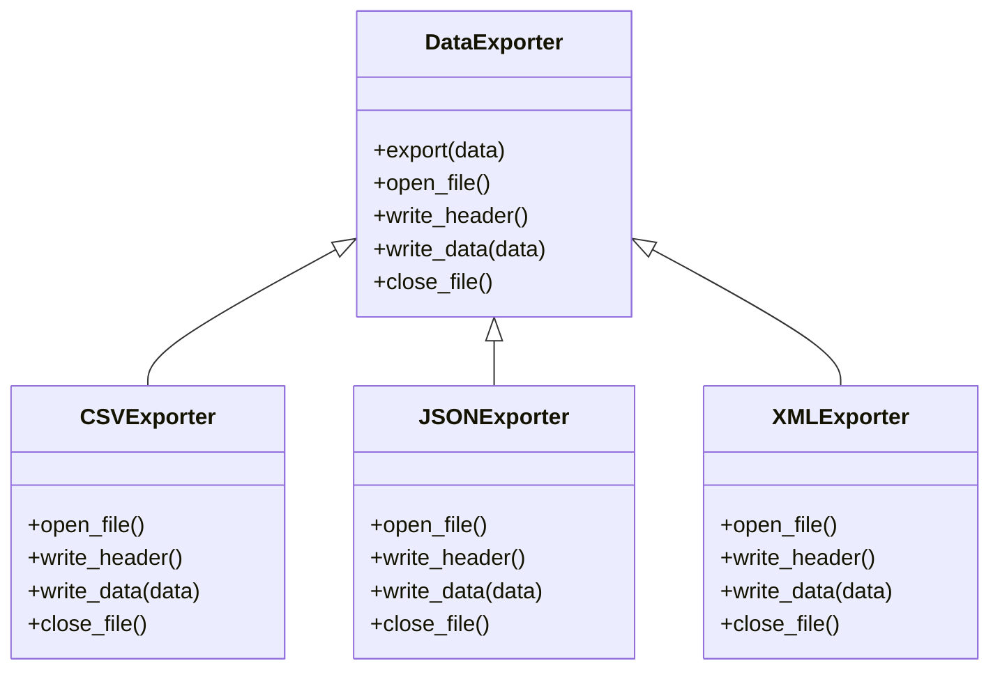

## 5.10.1 Implementing Template Method in Python

The Template Method pattern is a behavioral design pattern that defines the skeleton of an algorithm in a base class, allowing subclasses to override specific steps without changing the algorithm's structure. This pattern is particularly useful when you want to provide a consistent algorithmic framework while allowing flexibility in certain steps.

### Understanding the Template Method Pattern

The Template Method pattern involves the following key components:

- **Abstract Base Class**: This class contains the template method, which outlines the algorithm's structure. It may also include abstract methods or hooks that subclasses must implement or can optionally override.
- **Template Method**: A method in the base class that defines the algorithm's skeleton. It calls other methods, some of which may be abstract or have default implementations.
- **Concrete Subclasses**: These classes inherit from the abstract base class and provide specific implementations for the abstract methods or hooks.

### Implementation Guide

Let's walk through the process of implementing the Template Method pattern in Python, using a data exporter example that can export data in different formats such as CSV, JSON, and XML.

#### Step 1: Define the Abstract Base Class

First, we create an abstract base class that defines the template method and any abstract methods or hooks. In Python, we can use the `abc` module to define abstract base classes and methods.

```python
from abc import ABC, abstractmethod

class DataExporter(ABC):
    def export(self, data):
        """Template method defining the steps to export data."""
        self.open_file()
        self.write_header()
        self.write_data(data)
        self.close_file()

    @abstractmethod
    def open_file(self):
        """Abstract method to open a file."""
        pass

    @abstractmethod
    def write_header(self):
        """Abstract method to write a header."""
        pass

    @abstractmethod
    def write_data(self, data):
        """Abstract method to write data."""
        pass

    @abstractmethod
    def close_file(self):
        """Abstract method to close a file."""
        pass
```

In this example, the `DataExporter` class defines a template method `export` that outlines the steps for exporting data. The methods `open_file`, `write_header`, `write_data`, and `close_file` are abstract methods that subclasses must implement.

#### Step 2: Implement Concrete Subclasses

Next, we implement concrete subclasses that provide specific implementations for the abstract methods. Let's create subclasses for exporting data in CSV, JSON, and XML formats.

```python
import csv
import json
import xml.etree.ElementTree as ET

class CSVExporter(DataExporter):
    def open_file(self):
        self.file = open('data.csv', 'w', newline='')
        self.writer = csv.writer(self.file)

    def write_header(self):
        self.writer.writerow(['Name', 'Age', 'City'])

    def write_data(self, data):
        for row in data:
            self.writer.writerow(row)

    def close_file(self):
        self.file.close()

class JSONExporter(DataExporter):
    def open_file(self):
        self.file = open('data.json', 'w')

    def write_header(self):
        pass  # JSON doesn't require a header

    def write_data(self, data):
        json.dump(data, self.file, indent=4)

    def close_file(self):
        self.file.close()

class XMLExporter(DataExporter):
    def open_file(self):
        self.root = ET.Element('Data')

    def write_header(self):
        pass  # XML structure doesn't require a separate header

    def write_data(self, data):
        for item in data:
            entry = ET.SubElement(self.root, 'Entry')
            ET.SubElement(entry, 'Name').text = item[0]
            ET.SubElement(entry, 'Age').text = str(item[1])
            ET.SubElement(entry, 'City').text = item[2]

    def close_file(self):
        tree = ET.ElementTree(self.root)
        tree.write('data.xml')
```

Each subclass implements the abstract methods to handle file operations specific to the format. For example, `CSVExporter` uses the `csv` module to write data, while `JSONExporter` uses the `json` module.

#### Step 3: Using the Template Method

Now that we have our concrete subclasses, we can use them to export data in different formats.

```python
data = [
    ['Alice', 30, 'New York'],
    ['Bob', 25, 'Los Angeles'],
    ['Charlie', 35, 'Chicago']
]

csv_exporter = CSVExporter()
csv_exporter.export(data)

json_exporter = JSONExporter()
json_exporter.export(data)

xml_exporter = XMLExporter()
xml_exporter.export(data)
```

Each exporter will follow the same algorithm defined in the `DataExporter` class, but the specific implementation details will vary based on the format.

### Advantages of the Template Method Pattern

The Template Method pattern offers several benefits:

- **Consistency**: By defining the algorithm's structure in a single place, you ensure that all subclasses follow the same process.
- **Code Reuse**: Common steps are implemented once in the base class, reducing code duplication.
- **Flexibility**: Subclasses can customize specific steps of the algorithm without altering the overall structure.

### Best Practices

- **Keep the Template Method High-Level**: The template method should focus on the sequence of steps, leaving the details to the subclasses.
- **Use Hooks for Optional Overriding**: Provide default implementations for methods that subclasses can optionally override if needed.
- **Minimize Dependencies**: Ensure that the base class does not depend on specific implementations in the subclasses.

### Visualizing the Template Method Pattern

To better understand the Template Method pattern, let's visualize the relationship between the abstract base class and the concrete subclasses.



This diagram illustrates how the `DataExporter` class serves as the base class for the `CSVExporter`, `JSONExporter`, and `XMLExporter` subclasses, each implementing the abstract methods.

### Try It Yourself

To deepen your understanding of the Template Method pattern, try modifying the code examples:

- **Add a New Export Format**: Implement a new subclass for exporting data to a different format, such as YAML.
- **Enhance Error Handling**: Add error handling to the file operations in each subclass.
- **Implement Hooks**: Introduce hooks in the base class that subclasses can optionally override to add custom behavior.

### References and Further Reading

- [Python's `abc` module](https://docs.python.org/3/library/abc.html): Learn more about abstract base classes in Python.
- [Design Patterns: Elements of Reusable Object-Oriented Software](https://en.wikipedia.org/wiki/Design_Patterns): The seminal book on design patterns by Erich Gamma, Richard Helm, Ralph Johnson, and John Vlissides.

### Knowledge Check

To reinforce your understanding, consider these questions:

- What is the primary purpose of the Template Method pattern?
- How does the Template Method pattern promote code reuse?
- Why is it important to keep the template method high-level?

### Embrace the Journey

Remember, mastering design patterns is a journey. As you continue to explore and implement patterns, you'll gain a deeper understanding of how to create flexible, maintainable, and scalable software. Keep experimenting, stay curious, and enjoy the process!

## Quiz Time!



### What is the main purpose of the Template Method pattern?

- [x] To define the skeleton of an algorithm in a base class and allow subclasses to override specific steps.
- [ ] To encapsulate a request as an object, allowing parameterization and queuing.
- [ ] To provide a way to access elements of a collection sequentially without exposing the underlying representation.
- [ ] To define a one-to-many dependency between objects.

> **Explanation:** The Template Method pattern defines the skeleton of an algorithm in a base class, allowing subclasses to override specific steps.

### Which module in Python is used to define abstract base classes?

- [x] abc
- [ ] functools
- [ ] itertools
- [ ] collections

> **Explanation:** The `abc` module in Python is used to define abstract base classes and methods.

### What is a key advantage of the Template Method pattern?

- [x] It ensures consistency in algorithm execution.
- [ ] It allows multiple inheritance in Python.
- [ ] It provides a way to implement lazy initialization.
- [ ] It enables dynamic method dispatch.

> **Explanation:** The Template Method pattern ensures consistency in algorithm execution by defining a common structure in the base class.

### In the provided example, which method is responsible for writing data in the CSVExporter class?

- [x] write_data
- [ ] open_file
- [ ] write_header
- [ ] close_file

> **Explanation:** The `write_data` method in the `CSVExporter` class is responsible for writing data to the CSV file.

### What should the template method focus on?

- [x] The sequence of steps in the algorithm.
- [ ] The specific implementation details of each step.
- [ ] The creation of new objects.
- [ ] The management of system resources.

> **Explanation:** The template method should focus on the sequence of steps in the algorithm, leaving the details to the subclasses.

### How can subclasses customize specific steps of the algorithm?

- [x] By overriding abstract methods in the base class.
- [ ] By modifying the template method directly.
- [ ] By using multiple inheritance.
- [ ] By implementing private methods.

> **Explanation:** Subclasses can customize specific steps of the algorithm by overriding abstract methods in the base class.

### What is a best practice when implementing the Template Method pattern?

- [x] Use hooks to allow optional overriding.
- [ ] Keep all methods private.
- [ ] Avoid using inheritance.
- [ ] Implement all methods in the base class.

> **Explanation:** A best practice is to use hooks to allow optional overriding, providing flexibility for subclasses.

### Which of the following is NOT a component of the Template Method pattern?

- [x] Singleton class
- [ ] Abstract base class
- [ ] Template method
- [ ] Concrete subclass

> **Explanation:** A Singleton class is not a component of the Template Method pattern. The pattern involves an abstract base class, a template method, and concrete subclasses.

### What is the role of the `export` method in the `DataExporter` class?

- [x] It defines the skeleton of the data exporting algorithm.
- [ ] It opens the file for writing.
- [ ] It writes the data to the file.
- [ ] It closes the file after writing.

> **Explanation:** The `export` method in the `DataExporter` class defines the skeleton of the data exporting algorithm, outlining the sequence of steps.

### True or False: The Template Method pattern allows subclasses to change the algorithm's structure.

- [x] False
- [ ] True

> **Explanation:** False. The Template Method pattern allows subclasses to change specific steps of the algorithm, but not the overall structure.


